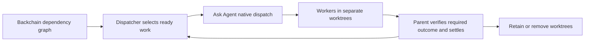

# Ask Agent and Backchain: current-harness implementation plan

Date: 2026-09-19. Status: implementation proposal, reconciled with the active
Backchain/ShipLoop candidate after counterpart acknowledgment. Existing candidate
implementation is distinguished below from remaining work. This document does
not claim native campaign completion, Backchain planning convergence, or release.

## Decision

Use Ask Agent inside the existing Plan Dispatcher launch-and-collection path.
Keep one initiating conversation and one graph/attempt authority. Ask Agent
remains a reusable prompt-only skill for standalone delegation too.

The boxes describe responsibilities, not additional processes. The main
conversation performs the dispatcher and Ask Agent roles. The native harness
owns worker execution and notification delivery.

This direction is already present in
[Plan Dispatcher SKILL.md — Execute: launch authorization and Ask Agent call](/Users/dadleet/src/backchain/skills/plan-dispatcher/SKILL.md:53)
and the accepted
[coordination charter — Shared boundary: dispatcher authority](/Users/dadleet/src/skill-craft/docs/ask-agent-backchain-coordination-2026-09-18.md:63).
Complete and qualify that seam; do not build a parallel orchestrator.

The executable seam is already in
[dispatch.js — start operation: launch invokes Ask Agent and replay reconciles](/Users/dadleet/src/backchain/skills/plan-dispatcher/scripts/dispatch.js:150).
No new adapter process or launch script is proposed. Any small binding change
belongs in these existing packet instructions and their reference contract.

### Reconciliation with the active consumer candidate

Backchain acknowledged the initial proposal digest
`fc12e067a0f465917fac434e6aa58c4ad7406ca96688ad888ddf59cd3909b765`.
Inspection of the active ShipLoop checkout at
`/Users/dadleet/src/.work-trees/skill-craft/integrate-chain-20260918` confirmed HEAD
`a3b8a111e22e4eb5870eaddec3c51f9077d6f085` and the already-implemented per-step
adapter below. This supersedes the original proposal to build that output and
integration binding. The generic dispatcher and this consumer adapter are
different layers; leave the generic reporting contract intact.
The corresponding Backchain candidate was independently inspected at
`/Users/dadleet/src/.work-trees/backchain/integrate-serial-20260918`, HEAD
`ea25f7335c2b1cc6e7edd6bb3c256a771ad1dec0`; it contains the state-path selection
described below. The original `/Users/dadleet/src/backchain` mapping checkout
remains at `6ce94efb809ebd82d87aa32df8dd5545eb0bca60` and predates that change.

- The worker packet removes dispatcher output/report commands and provides the
  worker-local handoff path and inline assignment.
  [shiploop_chain.py — _per_step_worker_packet(): replaces direct dispatcher publication](/Users/dadleet/src/.work-trees/skill-craft/integrate-chain-20260918/skills/shiploop/scripts/shiploop_chain.py:1381)
- The parent archives the handoff, publishes with the existing report API and
  records the disposition before removing declared handoff files.
  [shiploop_chain.py — _import_handoff(): archive precedes parent report](/Users/dadleet/src/.work-trees/skill-craft/integrate-chain-20260918/skills/shiploop/scripts/shiploop_chain.py:2304)
- Successful per-step completion integrates the independently verified candidate
  before settling the child attempt. Successor acceptance therefore incorporates
  this integration boundary; a second merge node would duplicate it unless that
  node establishes an additional substantive outcome.
  [shiploop_chain.py — _per_step_done(): integrates before settlement](/Users/dadleet/src/.work-trees/skill-craft/integrate-chain-20260918/skills/shiploop/scripts/shiploop_chain.py:2808)

The consumer's broader audit and its remaining native boundaries are retained in
[shiploop-chain-interaction-audit — Coverage map: existing interaction and recovery controls](/Users/dadleet/src/.work-trees/skill-craft/integrate-chain-20260918/docs/shiploop-chain-interaction-audit-2026-09-19.md:57).
Its CI/release status and new native execution are not inferred from these source
checks. No generic Ask Agent skill/reference bytes changed in this reconciliation.

## Existing behavior to retain

| Owner | Existing responsibility | Planned treatment |
| --- | --- | --- |
| Backchain planner | Dependency graph and required outcomes | No new plan-schema fields for delegation. |
| Plan Dispatcher | Ready-node selection, claims, attempts, native-handle recording, durable reports, verification and successor release | Reuse existing identities and state; add only demonstrated missing checks. |
| Ask Agent | Current native capability selection, fresh contexts, background launch, parent continuation, collection, compact handoff and generic workspace lifecycle | Small prompt clarification where current tools or duplicate returns need it. |
| Native harness | Child session lifecycle, tool availability, notification/collection and supported recovery | Inspect actual exposed tools; never emulate a missing facility with a model subprocess. |
| Parent/consumer integration owner | Worktree allocation, target updates, combined checks, durable output preservation and cleanup | Reuse existing workspace/integration facilities after checking their contract. |

Ask Agent's existing pending record already keeps handle, label, workspace,
baseline, results and next action separately per invocation. Under Plan
Dispatcher it should be a conversational view of that attempt, not another
persisted queue. One parent emits combined status updates.
[SKILL.md — Pending jobs: existing per-invocation record](/Users/dadleet/src/skill-craft/skills/ask-agent/SKILL.md:141)

Completion is not acceptance. The dispatcher already refreshes readiness after
settlement and does not require a whole wave to finish. A raw generic dispatcher
graph must represent any required merge-and-verify precondition. ShipLoop's
per-step adapter already performs integration before acceptance, so its dependent
steps need no extra merge node solely to repeat that boundary. In either mode,
the consumer must start with the accepted supplier revision actually available.
[Plan Dispatcher SKILL.md — completion-driven dispatch: successor release and code availability](/Users/dadleet/src/backchain/skills/plan-dispatcher/SKILL.md:106)

The helper already enforces direct-edge acceptance, stale-attempt rejection,
launch-intent replay and idempotent settlement. In particular, repeating the
same verification returns the existing settlement, while a conflicting one is
rejected. Reuse these branches rather than implementing deduplication again:
[state.js — dependenciesAccepted(): accepted direct suppliers gate readiness](/Users/dadleet/src/backchain/skills/plan-dispatcher/scripts/state.js:745),
[state.js — currentAttempt(): stale attempts are rejected](/Users/dadleet/src/backchain/skills/plan-dispatcher/scripts/state.js:400),
[state.js — start(): replay returns reconcile instead of launch](/Users/dadleet/src/backchain/skills/plan-dispatcher/scripts/state.js:1235),
[state.js — settle(): matching settlement is idempotent](/Users/dadleet/src/backchain/skills/plan-dispatcher/scripts/state.js:1349).
This is not a guarantee of exactly-once external side effects; an uncertain Git
mutation still needs reconciliation against the actual target before retry.

The generic dispatcher persists a replaceable state snapshot and immutable
inbox receipts. ShipLoop also has timestamped append-only bridge audit/integration
history. That history does not reconstruct the child dispatcher snapshot and
does not constitute another scheduler. Preserve these separate authorities and
do not add an Ask Agent ledger. The newer candidate names the sole snapshot
`plan-dispatcher-state.json` for new runs, retains `state.json` for legacy runs
in place, and refuses dual candidate files; the older generic checkout cited
elsewhere predates that filename change.
[state.js — statePath(): current candidate chooses one state authority or rejects ambiguity](/Users/dadleet/src/.work-trees/backchain/integrate-serial-20260918/skills/plan-dispatcher/scripts/state.js:152)
[protocol.md — Run state authority: canonical and legacy state stay separate](/Users/dadleet/src/.work-trees/backchain/integrate-serial-20260918/skills/plan-dispatcher/references/protocol.md:18)
[shiploop-chain-interaction-audit — State authority: snapshot naming and audit boundaries](/Users/dadleet/src/.work-trees/skill-craft/integrate-chain-20260918/docs/shiploop-chain-interaction-audit-2026-09-19.md:95)

## Bind to current releases and current tool schemas

Default target: newest vendor stable release at campaign start. Freeze the
exact executable version and selected skill bytes for each trial. Recheck the
vendor release before a new campaign; a mid-campaign update creates a new
evidence row, not a silent replacement. Preview builds are separate experiments
only when a required capability warrants them. A stable executable with an
experimental feature enabled must record that feature explicitly.

Read-only checks on 2026-09-19 found these installed versions equal to the
current vendor stable release/channel:

| Harness | Installed and stable version | Primary release evidence |
| --- | --- | --- |
| Claude Code | 2.1.278 | [Claude release v2.1.278](https://github.com/anthropics/claude-code/releases/tag/v2.1.278) |
| Grok Build | 1.0.34, build 3736acbc8658 | Vendor `https://x.ai/cli/stable` returned `1.0.34`; the [official installer](https://x.ai/cli/install.sh) documents that channel endpoint. |
| Codex CLI | 0.155.1 | [Codex release 0.155.1](https://github.com/openai/codex/releases/tag/rust-v0.155.1) |
| OpenCode | 1.18.31 | [OpenCode release v1.18.31](https://github.com/anomalyco/opencode/releases/tag/v1.18.31) |

These are CLI observations. They do not qualify a desktop application's
embedded runtime, interactive input path, or another installation on PATH.
Record actual surface, executable path/version, requested and observed model,
effort, relevant feature flags/hooks, exposed native launch/collection schema,
source checkout/baseline, and skill/reference digests in existing experiment
metadata. No new runtime capability registry is needed.

Version-sensitive finding: Claude 2.1.277 removed `TaskOutput`; completed
background output is read with native `Read`. The same release changed result
framing and fixed untracked project-skill loading in worktree sessions.
[Claude release v2.1.277](https://github.com/anthropics/claude-code/releases/tag/v2.1.277)
Therefore the historical timed-TaskOutput monitoring result remains historical.
Qualify notification, output retrieval, and periodic status separately on the
current schema. A single read of the native result after notification is valid
collection; repeated reads to discover completion are prohibited file polling.
Use a supported native status/wakeup facility if available; otherwise disclose
the status-cadence limitation. Do not add an old-TaskOutput compatibility shim.

OpenCode 1.18.31 source still marks `task_id` as resume input and gates native
background launch behind `OPENCODE_EXPERIMENTAL_BACKGROUND_SUBAGENTS`. Its
source-confirmed properties are relevant now; historical lifecycle issues are
test leads, not proof that every reported failure persists in this version.
[task.ts — Parameters and execute: resume and background contract](https://github.com/anomalyco/opencode/blob/v1.18.31/packages/opencode/src/tool/task.ts)

Evidence precedence for a specific claim: observed current tool schema and run;
matching release source/notes; current documentation; historical reports.
Source inspection explains a branch but does not substitute for its live test.

## Smallest implementation slices

### 1. Baseline and freeze the actual consumer

- Run the existing focused mechanical suites before changing code.
- Resolve the Ask Agent package actually selected by the dispatcher; retain
  its main/reference digests. A source checkout or generated view is not proof
  that the installed consumer loaded it.
- Re-run the small native launch/continue/return/worktree case on current stable
  harnesses, prioritizing Claude Sonnet and native Grok; include Codex Luna/xhigh
  and OpenCode/Grok before claiming all four lanes.
- Reuse retained evidence when the exact candidate, harness surface/version,
  configuration and tested predicate still match. A missing or failed predicate
  needs its own run; do not repeat a whole campaign simply to rename a result.
- Preserve separate notification and explicit-collection verdicts and interactive
  versus headless verdicts. Keep unsuccessful and unobserved cases.
- Classify old findings as reproduced, resolved, or still unobserved before
  adding any harness-specific workaround.

### 2. Tighten the existing Ask Agent instructions

Target `skills/ask-agent/SKILL.md`, with the Git reference changed only where
workspace ownership needs clarification. Keep generated plugin views derived.

- Reuse caller-provided run/step/attempt identity when a dispatcher is present;
  retain the actual native handle. Never manufacture a resume identifier.
- Treat repeated collection or a repeated completion as the same attempt.
  Re-read/reconcile as needed; do not relaunch, re-integrate or repeat cleanup
  merely because a notice was repeated. Unknown/conflicting identity stays
  unresolved until reconciled.
- Explicitly honor current native result retrieval, including a harness-owned
  output-file reference read after a terminal notice. Preserve direct in-memory
  assignment delivery and worker-contained detailed result files.
- Under an orchestrator, defer graph state, retries, acceptance and durable
  dispositions to its existing records. Standalone calls use existing parent
  task state without acquiring a database, inbox service or scheduler.

Keep the existing broad general-purpose capability preference and no invented
runtime/time/depth/output limits. Host-enforced limits remain disclosed facts.

### 3. Qualify the existing adapter and address dirty callers

Bind the selected Ask Agent contract at the existing `start` -> native launch ->
`launched` seam. Keep assignment/context in the native prompt. Preserve existing
run/step/attempt and receipt fields rather than introducing a parallel envelope.

The U18 interface notice recorded both a dirty-caller gap and worker-contained
result/index obligations. The active per-step adapter now implements the latter;
do not repeat that implementation in the generic dispatcher. Dirty-caller
compatibility remains a separate increment.
[U18 handoff — Consumer response: pending compatibility obligations](/Users/dadleet/src/skill-craft/docs/ask-agent-worktree-handoff-2026-09-18.md:82)
The current Backchain chain contract still explicitly requires a clean
initiating checkout and defers dirty snapshot/patch return:
[chain-worktree-contract.md — first implementation: dirty callers remain unsupported](/Users/dadleet/src/backchain/docs/plans/2026-09-18-chain-worktree-contract.md:93).

First evaluate reuse: ShipLoop already captures a dirty working-tree baseline
and creates an isolated worktree, and its dirty-return path applies the reviewed
delta without staging it. These are existing building blocks, not proof of U18
consumer compatibility.
[shiploop_workspace.py — prepare: captured baseline and worktree creation](/Users/dadleet/src/skill-craft/skills/shiploop/scripts/shiploop_workspace.py:659)
[shiploop_workspace.py — dirty return: source-index preservation](/Users/dadleet/src/skill-craft/skills/shiploop/scripts/shiploop_workspace.py:1186)

Check staged/unstaged layer fidelity, required untracked inputs, actual caller
identity, worktree placement and private-baseline exclusion before reuse. Its
current untracked-file branch requires regular files, so do not assume all U18
input types are supported. Reuse compatible operations at their existing owner;
do not pull a ShipLoop runtime dependency into generic Ask Agent.

For each graph attempt: prepare its exclusively assigned worktree; identify its
input baseline; keep result files/index there; preserve durable dispatcher
receipts and needed deliverables before cleanup. If an accepted predecessor
supplies integrated code, create or validate the successor workspace against
that accepted revision. A ready graph node with a stale filesystem is not ready
to execute.

Put worker result details and the compact index in the worker worktree; keep the
dispatcher control directory, published immutable receipt and preserved output
references durable outside removable worktrees. Reconcile the packet's existing
`outputs` contract with that split. Do not move durable inbox state into a
directory cleanup will delete, or mistake a durable receipt for the only copy of
the actual deliverable.

Already implemented in the per-step adapter: preserve the existing durable
report interface, give the worker its worktree-local handoff, and have the parent
archive files and publish the evidence with the existing `report` operation.
Keep this binding at the consumer layer. The raw generic dispatcher retains its
worker-publication packet; do not modify it merely to reproduce the consumer
adapter. The remaining task is qualification against the exact selected Ask
Agent candidate and current native surface, plus any dirty-caller changes.
[dispatch.js — outputPaths(): current durable artifact locations](/Users/dadleet/src/backchain/skills/plan-dispatcher/scripts/dispatch.js:30)
[dispatch.js — packet instructions: current worker-owned publication](/Users/dadleet/src/backchain/skills/plan-dispatcher/scripts/dispatch.js:89)
Keep original and archived references distinguishable, and ensure any archive
index resolves after worker-worktree removal. Preserve multiple files when the
next consumer needs them; only the compact receipt enters the parent context.

### 4. Extend existing tests at the owning layer

Archive/report/delete crash recovery is already represented in the consumer's
tests. Reuse it instead of adding another equivalent suite.
[shiploop-chain-lifecycle.test.py — test_import_handoff_recovers_after_report_and_delete_receipt_crashes(): composed recovery regression](/Users/dadleet/src/.work-trees/skill-craft/integrate-chain-20260918/test/shiploop-chain-lifecycle.test.py:917)

| Case | Owner and location | Required observation |
| --- | --- | --- |
| Current native tools | Ask Agent existing `test/experiments/portable_delegation/usability/` cases and operator metadata | Current-schema fresh launch, parent work, actual return, supported status route, accurate model/cwd evidence. |
| Duplicate/late receipt and fresh retry | Existing dispatcher attempt/inbox tests; a small standalone Ask Agent prompt control | Same result accepted at most once; stale attempt cannot replace a current attempt; collection retry does not create another worker. |
| Completion during compaction | Native Ask Agent experiment, then one dispatcher consumer case | Existing attempt/handle and unread result recovered, parent handles it without unnecessary relaunch. Unsupported native recovery is stated. |
| Cancellation near completion | Native lifecycle experiment plus dispatcher resource test | Stop is confirmed or explicitly unknown; resources/worktree are not released while any user remains active. |
| Dirty workspace and hooks | Existing W1 fixture and consumer workspace tests | Original index and unrelated state preserved; actual writes use assigned worktree; required artifacts survive cleanup. |
| DAG partial completion | Existing dispatcher scheduler/settlement tests and one live consumer graph | Only accepted suppliers release dependents; unrelated slow work does not impose a whole-wave barrier; shared write ownership remains respected. |

Extend `verify-w1.py` and `test/ask-agent-worktree-harness.test.py` only for
reusable evidence checks that current cases cannot express. Keep their scope
test-only. Synthetic traces validate adjudication; only native runs establish
native delivery. Do not turn the W1 verifier into a second dispatcher.

Start with existing tests, then add only missing assertions:

- skill-craft: `python3 -B test/ask-agent-worktree-harness.test.py`;
  `test/shiploop-workspace.test.py` only if the workspace binding/helper changes.
- Backchain: `make test-dispatcher`, with focused regressions in
  `test/dispatcher-state.test.js`, `test/dispatcher-cli.test.js` and
  `test/dispatcher-compound.test.js`; the existing live consumer fixture belongs
  under `harness/dispatcher-live/`.
- During this planning pass, the mapping agent ran the three focused dispatcher
  tests: 29 state groups, 19 CLI groups, and 2 compound groups passed. Their
  workers are deterministic/fake; no native harness was launched by these checks.

Do not add a second broad test runner. Keep test setup/teardown and operator
evidence outside the participant's input context; preserve blocked worktrees and
unresolved evidence rather than forcing cleanup to make a test green.

## Concrete graph example and acceptance boundary

Illustrative per-step consumer graph: A implements a pricing function; B
independently updates documentation; C tests the integrated pricing flow.
The edge is A -> C. B is independent. Each dispatch also checks resource/write
ownership, regardless of missing graph edges. No extra M node is needed because
this adapter integrates and verifies A before accepting it.

The dispatcher can claim A and B together. A's native return identifies its
attempt, actual worktree, contribution and report index. The parent archives,
prepares and independently verifies A's combined candidate, integrates it, and
only then settles A. C becomes eligible even if B is still running and receives
the accepted integrated revision and supplier archive references. A duplicate A
completion must not cause another integration or C launch. Existing mechanical
replay guards support this target; live duplicate-delivery qualification remains
separate. A stale earlier attempt is retained/rejected rather than merged.

If A's integration encounters a semantic conflict, C remains blocked despite its
worker having finished.
The parent can delegate conflict repair within the existing attempt/repair policy.
Keep the relevant worktrees and reports until the consumer and recovery needs
are resolved. A raw generic dispatcher graph still needs its integrated-code
precondition represented explicitly, potentially as A -> M -> C. Distinguish
that route from the per-step consumer instead of adding M to both.

## YAGNI decisions and completion criteria

Adopt: current-schema binding, explicit per-attempt reconciliation, the existing
dispatcher launch seam, and the current consumer worktree contract.

Pilot after baseline: compaction delivery and cancellation races. A prompt cannot
implement guaranteed transport delivery. Require no repeated integration for a
settled attempt, not an unsupported exactly-once notification promise.

Defer: generic restart daemon, durable Ask Agent inbox/database, host adapter
framework, independent timers, automatic stale-worker expiry, another ID system,
whole-framework imports, legacy-version shims, and global harness configuration
changes. Session restart recovery becomes an implementation requirement only
when the current host contract and a concrete consumer need justify it.

Defer the full inline-report versus artifact token benchmark until correctness
and consumer integration pass. Then compare equal tasks and decision quality;
use actual usage counters when available and label estimates. Add no output cap.

Done means the selected current package is exercised by the actual dispatcher;
the live lanes support only the claims they prove; the graph test establishes
accepted-evidence release and correct filesystem inputs; the original caller
and durable outputs are preserved; and replay does not cause duplicate work or
integration. Reuse the existing predeclared repeat policy rather than adding
an arbitrary runtime limit. Unsupported capabilities remain explicit boundaries.

This reconciliation changes only the planning document. Current-harness native
qualification, generic prompt deltas justified by it, and the dirty-caller
consumer increment remain pending. Existing per-step consumer handoff and
integration machinery should be reused, not reimplemented.
