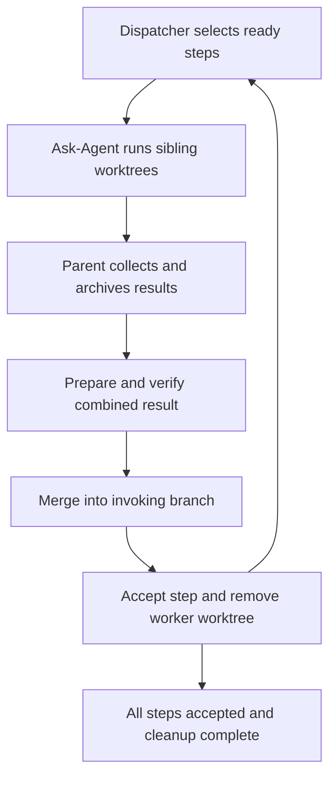

# Ask-Agent integration: merge each result, then remove its worktree

Status: implemented candidate; offline qualification passed, native qualification
incomplete; not deployed. This supersedes the
Ask-Agent adapter plan in [the incorporation assessment](shiploop-chain-incorporation-2026-09-18.md).
The existing native evidence proves the older final-return lifecycle with
Ask-Agent 0.3.1; it does not prove this candidate's per-step behavior.

## Decision and ownership

Adopt per-step integration into the **invoking checkout and branch**. Native
workers may execute concurrently; the main context serializes target updates.
After a contribution is integrated and validated, preserve its required results
and remove its worker worktree. A dependent becomes runnable only after its
suppliers are accepted, meaning their code is already present in that target.

Keep the existing separation of duties:

- Create Chain produces the forward plan; Backchain audits dependencies,
  definitions of ready/done, independent paths and shared resource constraints.
  Initial or materially revised steps still require their actual Improve loop.
- Plan Dispatcher owns claims, attempts, readiness and the single accepted/not-done
  authority. A native completion notification is input to verification, not acceptance.
- Ask-Agent owns worker worktree creation and the portable native execution and
  handoff contract: fresh context, exclusive worktree, inline assignment,
  worker-local results and native completion. The orchestration bridge adopts
  that existing workspace; it does not create a second worker checkout.
- ShipLoop's chain bridge owns target identity, parent imports, integration,
  cleanup and recovery. Serial mode performs the same lifecycle in the main
  context without launching agents. Improve remains a separate review cycle.

This is an adapter and lifecycle change, not another scheduler or message bus.
Use native notifications and collection; retain timestamped append-only audit
events. Do not make workers update the parent ledger or merge completion messages
through Git.

## Evidence and the current gap

The inspected working Ask-Agent 0.4 card already requires inline native prompts,
worktree-local results, the caller's actual checkout baseline and parent-owned
integration/removal. Its source is being developed in a separate contribution;
consume a reviewed, explicitly selected package rather than copying unrelated
working changes. The exact inspected hashes are recorded in the incorporation
assessment, under “Ask-Agent 0.4 adapter plan.”

The baseline at `2c64388` implemented a different lifecycle. The candidate keeps
that path for existing v1/v2 bindings and explicit `--lifecycle final-return`:

| Baseline source | Baseline behavior | Per-step candidate change |
| --- | --- | --- |
| `shiploop_chain.py:_start`, `_require_base`, `_enrich_packet` | Target HEAD stays frozen; dependency commits can be supplied through a separate worker base; worker packets publish external results | Preserve target identity but advance expected HEAD after each recorded integration; start workers at that current HEAD; worker-local handoff |
| `shiploop_chain.py:_prepared_contribution`, `_settle` | Inspect a clean worker and accept its result without merging the target | Verify original contribution, reconcile/test against current target, merge, then accept |
| `shiploop_chain.py:_finish` | One combined candidate returns to the target at the end | Final audit of accepted contributions, combined checks and completed cleanup |
| `shiploop_chain_git.py:inspect_contribution`, `fast_forward` | Exact live worker inspection and guarded target fast-forward exist; no worktree removal helper | Reuse the guards; add separate prepared-candidate proof, advancing-target receipts and owned cleanup |

The upstream Git interfaces support the intended boundary: prepare conflicts in
the worker checkout, then use `merge --ff-only` for the checked-out target, which
refuses a divergent update. Use `git worktree remove` for registered-worktree
cleanup; its default refusal of dirty worktrees is useful, not an error to bypass.
See [Git merge](https://git-scm.com/docs/git-merge) and
[Git worktree](https://git-scm.com/docs/git-worktree). A ref-only update is not a
substitute for updating a checked-out index and working tree.

## Required lifecycle

1. **Bind identity; select a supported contract.** Record canonical target path,
   private Git directory, common directory, symbolic branch and initial HEAD.
   “Current branch” means this invoking branch, even when it is already a linked
   worktree. Never substitute the primary checkout or follow a later branch switch.
   Introduce a versioned per-step lifecycle binding; existing bound runs retain
   their old semantics. Reject unsupported Ask-Agent/adapter combinations before
   allocating or dispatching; package hashes alone do not establish compatibility.

2. **Claim and ask Ask-Agent to prepare its worktree.** Derive expected target
   HEAD from immutable integration receipts, validate it against the actual clean
   target and check accepted dependency commits are present. Ask-Agent creates
   its exclusive worker at exactly that HEAD. Orchestration validates and records
   that workspace, branch, registration and baseline before launch. Use the existing external
   `.work-trees/<repository>/<attempt>` container, outside every registered checkout;
   all allocations, including nested delegation, must be non-nested siblings.
   Recheck target stability before issuing the launch assignment. Retain the
   current clean-target prerequisite for this first version; stop on dirty target
   state rather than stash/reset it or claim support for dirty caller snapshots.
   This is narrower than generic Ask-Agent's dirty-snapshot capability.

3. **Launch through Ask-Agent.** Put the objective, direct dependencies, readiness
   evidence, write ownership, shared resources, exact base, target identity,
   absolute workspace and required output directly in the native launch prompt.
   Use the worktree Ask-Agent prepared and orchestration registered; do not
   allocate a second one. Workers may reference existing input files, but no
   generated prompt file is the assignment transport. Results and scratch stay
   inside declared paths in the worker checkout. Workers leave them intact.

4. **Collect, stop and import.** The parent collects native completion and confirms
   the worker, its commands, delegated workers and other worktree users have stopped.
   Validate the exact attempt, baseline, original worker commit `W`, changed scope
   and handoff manifest. Archive required result files into immutable,
   dispatcher-owned storage before any removal. Rewrite downstream result links to
   those archives. Reject links, path escapes, unknown output files and digest or
   attempt mismatches without deletion. Remove only explicitly declared disposable
   handoff files after successful preservation so the existing clean-HEAD
   contribution inspection can run. Commit code deliverables; preserve result
   evidence in the parent archive. No required untracked result may be discarded.

5. **Prepare the combination away from the target.** Preserve original `W` and
   its verification, then use the stopped worker checkout under parent ownership
   to reconcile against the target's latest expected HEAD `T`. Produce candidate
   `I` containing both `T` and `W`; check contribution scope and rerun affected
   combined-behavior tests. Record `W`, `T`, `I` and exact verification digests
   separately. An existing merge is sufficient when appropriate; do not create
   a gratuitous commit. The first implementation preserves commit ancestry;
   squash/rebase policies need an explicit equivalent proof before support.
   If preparation needs agent repair, retain ownership and use native follow-up;
   recollect completion and reconfirm stopped execution before integration.

6. **Integrate, then accept.** Append an integration intent before mutation. Under
   the existing per-target lock, revalidate target identity, clean state and exact
   `T`, then fast-forward the invoking checkout to `I`. Confirm actual checkout
   identity, HEAD and resulting state; append the integration receipt, then call
   the existing dispatcher settlement once. Only successful integration and
   verification allow acceptance and dependent release. Target movement requires
   new preparation/checks, not reuse of stale evidence. An unresolved integration
   intent prevents another target update or new launch from an uncertain baseline.
   The lock coordinates cooperating writers; it does not exclude manual Git writers.

7. **Remove the accepted worker checkout.** Preserve original and integration
   commits through retained refs, archive all needed results, confirm no consumers
   remain and recheck actual ownership, dirty/untracked/ignored files and worktree
   registration. Append cleanup intent, use non-forced `git worktree remove`, verify
   path and registration removal, then append cleanup result. Do not use recursive
   deletion or automatic force. Classify and preserve unexpected leftovers first.
   Retain worker branches initially; branch deletion is a separate policy.

8. **Continue or finish.** Recompute ready steps after acceptance and dispatch each
   eligible independent path from the latest integrated target. Results and
   successor inputs must remain readable after worker removal. A cleanup failure
   appears as a separate `cleanup_pending` lifecycle fact; the step stays accepted
   and is never executed again because removal failed. Dependents may use its
   archived results and integrated code. Chain completion requires all steps
   accepted, final combined verification and all owned worker worktrees removed.
   A retained worktree needs a named blocker; it is not silently called complete.

The same merge/archive/removal rule applies in serial mode. Failed or uncertain
attempts retain evidence and worktrees until their effects and consumers are
resolved; retries allocate fresh sibling worktrees, and final cleanup accounts
for superseded attempts too. Report-only tasks need an explicit no-integration
outcome if supported later; do not invent a code commit merely to satisfy a gate.

## Minimal API and durable facts

These APIs are implemented in the candidate's ShipLoop chain bridge. They are
not yet released or installed; generic dispatcher settlement remains unchanged.

| Operation | Contract |
| --- | --- |
| Existing `start` / `packet` | Return the recorded current baseline, inline assignment fields, local handoff destination, dependency archives and integration/removal policy; a replay is not permission to launch again |
| Parallel `start` without `workspace` | Return `prepare-workspace` facts without allocation or a launch grant; Ask-Agent creates the workspace, then the parent resubmits `start` with its absolute `workspace` for verified adoption |
| New `import-handoff` | Inputs identify attempt, owned handoff path/digest and stopped execution; validate/preserve exact files, author the existing external result/envelope as parent, then call the existing report API; same bytes replay, conflicting bytes reject |
| New `prepare` | After import and confirmed stopped execution, preserve original source proof and reconcile the worker with current target; return the exact candidate for the parent's independent combined checks |
| Existing `done` / `settle` | Add a versioned integration proof naming `W`, expected `T`, candidate `I` and parent verification; journal and execute guarded target integration before existing acceptance, then attempt cleanup; failed verification never merges |
| New `cleanup` | Retry only a recorded, eligible attempt's removal; do not merge, settle, launch or execute its task again |
| Existing `next`, `pending`, `history`, `recover` | Expose execution, awaiting import/verification/integration and cleanup work to the main context; use accepted as the sole step-completion authority; return a specific recovery action |
| Existing `finish` | Require accepted graph, current target containing all accepted commits, final verification and no unresolved owned worktree cleanup; no first aggregate merge |

Each receipt carries run/action/step/attempt identity, timestamp, immutable input
digests and operation ID. Integration facts record expected and observed target
identity/HEAD, `W`, `I` and verification. Cleanup facts record allocation identity,
removed path, surviving recovery refs and archived outputs. Preserve prior ledger
lines exactly. Derive advancing HEAD and outstanding cleanup from these events;
do not rewrite the original binding or introduce a second stored step-done flag.
Worker outputs remain untrusted data, not authority to run arbitrary commands.

Keep live worker inspection strict before integration. Do not weaken it to accept
a missing checkout. After integration, replay and dependency queries use archived
evidence and durable integration facts, checked against the current target as
needed. This distinction lets cleanup actually remove the worker checkout without
breaking settlement replay, graph hydration or successor packets.

## Recovery boundaries

Git integration, dispatcher acceptance and filesystem removal are separate
operations, not one atomic transaction. Use write-ahead intents and reconcile
observed effects before doing anything again.

| Interruption or failure | Recovery and observable result |
| --- | --- |
| Archive persisted; report absent | Verify archived bytes and finish parent publication; do not rerun the worker |
| Target changed before fast-forward | Leave the target intact; reprepare and reverify against its new recorded revision; unrecognized external movement blocks for reconciliation |
| Target fast-forwarded; integration receipt or settlement missing | If durable intent and exact clean target match `I`, append missing evidence and settle once; block other target updates until resolved |
| Post-update inspection fails | Leave acceptance pending, preserve target and worker evidence; diagnose/repair the actual integrated state without automatic rollback or another task launch |
| Accepted; removal failed or not attempted | Keep acceptance; expose and retry cleanup only, with no duplicate merge or execution |
| Worktree removed; cleanup receipt absent | Reconcile exact recorded allocation and absent path/registration; append missing receipt; a reused path or changed registration is a blocker |
| Worker still running, conflicts unresolved or unexpected files remain | Retain its checkout with the reason and responsible next action; never force removal to make completion green |
| Old binding resumes | Use its original lifecycle; no implicit migration of active runs or old evidence |

These guarantees are idempotent recovery of identified operations, not exactly-once
arbitrary external side effects. Resource declarations still serialize conflicting
MCP/server/deployment activity even when workers have separate Git checkouts.

## Concrete fan-out trace

Hypothetical input: invoking checkout `feature/payments@H0`; roots A and B;
C depends on A; J depends on B and C. The primary checkout is a separate target.

1. A and B start concurrently at `H0` in separate sibling worktrees.
2. A returns `WA`. The parent archives, verifies and integrates it as `HA`, accepts
   A and removes A's worktree. C can now start at `HA` while B continues.
3. B returns `WB`, based on `H0`. The parent combines it with the current target,
   verifies `IB`, advances the invoking branch to `HB`, accepts B and removes B.
   A's code remains present. C may still be executing from its recorded `HA` base.
4. C is similarly reconciled and accepted. J starts only after B and C are
   accepted, from the target containing both. Each successful worker is removed.
5. Final checks pass on the invoking branch; no owned worker checkout remains.
   The primary branch/checkout was never the integration destination.

Git gathering alone no longer requires an extra graph node. Keep explicit join
nodes when they perform meaningful cross-component integration or system testing.

## Implementation plan and verification

| Step / ownership | Depends on | Definition of ready | Definition of done |
| --- | --- | --- | --- |
| P1: lifecycle contract and binding (`shiploop_chain.py`, reference) | none | Reviewed current Ask-Agent package and this plan | Versioned binding/API schemas, clean-target boundary, ordering and compatibility rejection specified; old-run behavior fixed |
| P2: parent handoff importer (dedicated bridge helper and tests) | P1 | Handoff schema and archive ownership fixed | Worker-local results become immutable parent artifacts; malicious inputs and crash/replay controls pass |
| P3: Git adoption/integration/removal (`shiploop_chain_git.py` and its tests) | P1 | Target/contribution/candidate identities fixed | Ask-Agent workspace adoption, guarded per-step return, exact allocation cleanup and recovery work on a linked invoking checkout |
| P4: bridge wiring (`shiploop_chain.py`, chain/ledger tests) | P2,P3 | Import and Git APIs passing in isolation | Merge precedes acceptance; advancing starts, archived dependencies, cleanup retry and recovery views work in both execution modes |
| P5: portable skills, reference, README and harness | P4 | Observable runtime API stable | Inline launch guidance and examples match; old one-final-return guidance replaced; generated plugin views synchronized; compound suites registered |
| P6: qualification and incorporation | P4,P5 | Reviewed package identities and disposable repository fixtures | Focused, full and native gates pass with per-step target evidence and zero remaining owned workers; scoped source merge then separate installation/activation verification |

P2 and P3 can run in parallel after P1 with distinct file ownership. P4 joins
them. P5 and P6 cannot claim implementation or evidence before their dependencies.
Apply the planning Improve review before P1; material plan changes reset its
two-consecutive-trivial-only review streak. Do not fold Improve into per-task
dispatcher traversal.

Required tests and evaluation criteria:

- **Baseline and topology:** invoking checkout is already a linked worktree;
  primary remains unchanged; allocations are exclusive external siblings; exact
  current target HEAD and dependency ancestry appear in worker receipts.
- **Compound parallel graph:** the A/B/C/J trace above, plus shared-resource
  serialization and out-of-order native completion. Prove worker overlap and that
  C starts before B finishes, but J waits. Assert actual commits and file behavior,
  not just model statements or “complete” text.
- **Advancing target:** B reconciles after A; checks bind the exact combined
  candidate; target movement invalidates stale proof. Cover conflict, branch
  switch, dirty target and a second cooperating writer without overwriting work.
- **Handoff safety:** worker-local result paths, import duplication, wrong
  attempt/base, changed digest, symlink/path escape, unexpected ignored/untracked
  files and failed archive. Failed preservation never deletes the source.
- **Crash matrix:** interrupts after archive, after target update, after
  acceptance and after removal. Each resumes the unfinished operation without
  another worker, duplicate acceptance, unintended merge or lost evidence.
- **Removal and lifetime:** all worktree users stopped; required artifacts
  readable after removal; `next`, `pending`, history and settlement replay still
  work with deleted worker directories. Cleanup failure leaves the step accepted,
  blocks final completion and retries safely. Include superseded attempts and
  attempted path reuse.
- **Compatibility:** old bound runs retain their behavior; unsupported package
  combinations fail before dispatch; serial mode follows the same transitions
  with no agent launch. No runtime shell invocation of a model.
- **Native Ask-Agent 0.4 pilot:** use the selected current package, real native
  fresh contexts, observed cwd/Git roots, overlapping workers, parent status
  observations, integration into an invoking feature worktree and successful
  removal of every owned worker. Keep archived evidence after the pilot. Report
  each host's actual coverage separately; one host does not prove all hosts.

Exact identities, acceptance counts, ancestry, preserved artifacts and removal
are hard assertions. Evaluate task prose semantically against definitions of
ready/done rather than requiring exact wording. Use controlled scheduling in the
hermetic concurrency test; native timing evidence must demonstrate actual overlap.

Readiness remains **candidate under native qualification**. The current complete
offline gate passes, including action-walk. The prior timestamp failure and its
unknown original cause remain recorded; the newer pass does not explain it.
A new 0.4 native lifecycle pilot and prompt-driven worktree-creation check are
still required. Preserve the original failed evidence and the older 0.3.1
pilot's narrower claims.

The first implementation review found two recovery gaps: a superseded rejected
attempt could prevent final cleanup, and `packet` recovery still returned legacy
reporting instructions. The candidate adds explicit superseded retirement and
restores the worker-only assignment on recovery. Regressions also interrupt the
parent after target integration, child acceptance, and worktree removal. These
checks distinguish accepted graph state from unfinished cleanup, without rerunning
an accepted task or merging rejected code.

The repeatable offline command is `python3 -B test/shiploop-chain-lifecycle.test.py`.
The separate native-host command is
`python3 -B test/experiments/shiploop_chain/run_native.py --output NEW_ABSOLUTE_DIRECTORY`.
The latter retains its raw host trace, generated code, Git topology, original
contributions, parent archives and final audit. Native execution and overlap must
be established from that trace; deterministic subprocesses are not native-agent
evidence. The pilot itself prepares worktrees with ordinary Git to emulate the
Ask-Agent caller contract. It can qualify bridge adoption and native execution,
but cannot prove a host followed Ask-Agent's own worktree-creation instructions;
that still needs a separate live workflow check. The selected Ask-Agent 0.4
package is a frozen fixture of the separate
unpublished contribution, not a claim that the source or installed 0.3 package
has been upgraded.

## September 19 baseline qualification record

This record describes commit `f8d9c0d`. Later compound-case repairs and their
focused validation are recorded in the
[compound coverage matrix](shiploop-chain-compound-coverage-2026-09-19.md).
The 93-suite result below applies to the baseline, not automatically to those
later changes.

The baseline's focused checks passed: 10 composed lifecycle cases, 33 legacy
chain cases, 14 real-Git cases, 16 archive cases, 23 synthetic native-trace
controls, and 23 core packaging/installation groups. The lifecycle cases write
and execute actual Python code in disposable sibling worktrees, prove A/B
process overlap and eager C release, verify the B+C join, and remove workers
after merging into an invoking linked checkout. They also cover packet recovery,
stale candidates, rejected retries, archive corruption and interrupted parent
transitions. These are deterministic process tests, not live model qualification.

The first Grok attempt is retained at
`/private/tmp/shiploop-chain-018-native-20260919-a`. Its raw host trace ends with
`stopReason: cancelled` after the first worker's preparation tool reported
`User cancelled the execution for tool run_terminal_command`. No native worker
was launched. Grok exited zero, but the wrapper correctly failed because there
was no completed chain receipt. The strengthened wrapper now explicitly checks
the typed host terminal reason as well. This attempt used a frozen source
snapshot predating the packet-recovery, superseded-retirement and archive-recheck
repairs; it qualifies none of those behaviors and is not a passing native pilot.
The user was asked whether that cancellation was intentional before retrying.

The full **93-suite inventory passed** in three external sibling checkouts under
`/private/tmp/shiploop-chain-018-qualification-20260919`: each shard ran 31 suites
and exited zero (1699.47, 1684.60 and 1832.18 seconds). All 13 action-walk cases
passed. The separate 23-group core gate exited zero in 80.62 seconds. The trace
observer received review corrections after the snapshot:
the baseline's 23-case focused result supersedes the snapshot's 11-case trace suite.
The evaluator now requires successful exact command receipts and full lifecycle
ordering for every worker; it rejects no-op commands and a tool-level completion
that contains a failed shell result. Independent review reran the four originally
passing invalid traces and confirmed all now fail. No production source changed
between those snapshots. Final fixture-emulation labels were then clarified;
the 23 trace controls passed again. `final-trace-result.json` identifies their
final bytes, and `production-and-focused-tests-match.json` confirms all four
qualification checkouts used the same production and focused-test files.
The prior action-walk timestamp failure remains recorded in the incorporation
assessment; a current passing run would not establish its original cause.

The first Improve iteration found material issues and repaired them: worker
packet recovery, superseded-attempt cleanup, archive revalidation after import,
and false-positive native trace cases. Independent repair reviews also corrected
the native fixture's worktree-creation claims and the historical/current document
boundary. These repair reviews are part of that iteration, not two subsequent
qualifying reviews. Native qualification and the pending host-cancellation
clarification keep Improve incomplete; no convergence or deployment is claimed.
