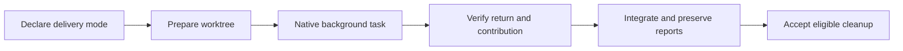

# Ask Agent delivery contracts and OpenCode qualification

Status: implemented and tested. Prior experiment verdicts remain immutable.
The [results](ask-agent-delivery-opencode-results-2026-09-20.md) record all 30
passing core suites, live host verdicts, and the Claude/OpenCode qualification limits.

Baseline before implementation: 18 workspace-helper tests and 34 previous
worktree-harness tests passed. The installer owner separately ran passing
installation baselines before edits.

## Outcome

Every fresh native worker receives an explicit delivery mode (`patch`, `commits`, or
`report-only`) and an inherited-state baseline. The parent accepts a contribution
only after matching its native worker, prepared workspace, terminal outcome, and
delivery evidence. OpenCode uses the same skill and Git helper, with a qualified
native background route rather than a custom launcher.

## Independent implementation slices

1. Delivery: extend the native launch contract and Git reference; enforce any
   necessary mechanical checks through the existing helper; test actual patch,
   commit, omitted-deliverable, and report-only behavior with real Git fixtures.
   Commit delivery initially requires a clean inherited baseline; dirty callers
   use an explicitly selected patch workflow. Never hide inherited edits in a
   contribution commit or silently change a requested delivery mode.
2. Evidence: version the managed-workspace event schema; bind attempts to native
   worker IDs and actual helper receipts; reject unsuccessful outcomes, incorrect
   roots, replayed IDs, invalid chronology, unverifiable reports, and unsafe cleanup.
   Preserve failed attempts when a fresh retry succeeds. Add adversarial hermetic tests.
3. OpenCode installation: add an explicit host target at the documented XDG config
   skill location, retaining existing ownership/copy/symlink/status/uninstall rules.
   Verify with isolated homes and installed-package execution.
4. Qualification: add OpenCode to the managed-workspace apparatus and host matrix;
   freeze final package bytes before live runs and record exact executable versions.
   Regenerate shared plugin views, run focused checks and the core aggregate, and
   obtain independent review.

## Test membership and evidence rules

- Core/smoke: real-Git delivery and preservation cases, event-verifier adversarial
  cases, installation ownership and host isolation, copied-package invocation,
  generated-package parity. No providers, credentials, or global settings required.
- Live: current-package two-worker overlap/return/integration/archival/close across
  Grok Build, Codex, Claude Code, Cursor, and OpenCode where the host permits it.
  Exercise native cancellation or report a missing native capability; retain work
  until stop is confirmed. Provider errors remain failed attempts, not skipped passes.
- OpenCode controls: persistent TUI with a process-local experimental background
  flag; actual new user input during a pending worker; disabled-background and
  one-shot lifetime boundaries; denied external-workspace permission. Existing
  OpenCode 1.18.31/U10 evidence is historical, not current-helper qualification.
- Preserve Claude normal-profile hygiene evidence. A controlled profile can
  diagnose host hooks but cannot replace the normal-profile verdict.
- Distinguish native automatic callbacks, explicit native collection, same-parent
  resume, and fresh retries. No shell supervisor or polling service enters the skill.

Each live fixture owns its repository, external receipts, reports, and event logs.
Use one frozen package across concurrent independent host cases. Bound each live
case, preserve unsuccessful outcomes, and allow only a recorded fresh retry for
transient provider failures. Cleanup follows actual acceptance; unresolved work
stays retained. Tests must not mutate the user's global hooks, permissions, or
experimental feature settings.

## Definition of done

- Explicit delivery mode in every fresh-worker assignment with documented defaults.
- Mechanical tests demonstrate preservation and reject false successful handoffs.
- OpenCode installation works from an isolated XDG config root with ownership guards.
- Current native-host observations and limitations are recorded separately from
  hermetic passes; unsupported lifecycle modes are disclosed rather than simulated.
- Generated package matches source, focused/core checks pass, and independent
  findings are fixed or documented with concrete evidence.

## Completion

All implementation slices and planned test categories were executed. Failed and
unproven host behaviors remain explicit outcomes: Claude's actual command cwd,
OpenCode's disabled-feature fallback and one-shot lifetime, and the unsuccessful
OpenCode pending-input controls. These are not counted as passing qualification.
Current package bytes match the generated plugin and every live managed fixture;
no source-repository commit, publication, global install, or host-setting migration was performed.
