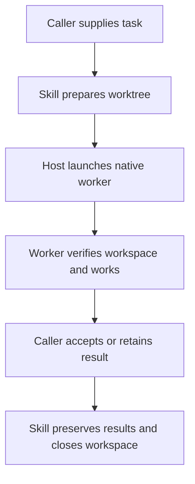

# Ask Agent: skill-owned worktree lifecycle

Status at drafting: proposed design; no runtime, skill, host configuration, or packaging changes made.
Date: 2026-09-19.

Implemented on 2026-09-20. The original proposal remains below; see
[implementation and experimental results](ask-agent-managed-worktrees-results-2026-09-20.md)
for delivered behavior and qualification limits.

## Decision and user outcome

Adopt a small packaged Git helper inside Ask Agent, with native agent launch and
collection retained on each host. The caller asks for a task; the skill handles
workspace preparation, verification, result preservation and eligible cleanup.
The caller retains task ownership and acceptance of the returned contribution.

A skill is instructions executed by the current agent, not an independently
running service. The practical reduction is to one preparation-helper call and
one eligible cleanup-helper call, plus native launch/collection. The caller no
longer invents branch names, reconstructs dirty snapshots, copies files, or
manually reasons through removal commands on every delegation.

This design aims to remove setup burden on each qualified host surface; no new
route is implemented or qualified yet. Starting the child process in that
directory remains a separate native-host capability. Explicit per-tool directory
use is a disclosed, constrained fallback, with no claim of host-enforced binding.

## Starting evidence and preserved contracts

- The skill currently declares `prompt-only` and broadly forbids scripts and
  subprocess launchers. A Git-only packaged helper is an intentional contract
  change; narrow the prohibition to model launchers, invented runtime scripts,
  schedulers and replacement agent harnesses. See
  [SKILL.md - package and delegation contract: current prompt-only boundary](/Users/dadleet/src/skill-craft/skills/ask-agent/SKILL.md:9).
- Preparation already belongs inside Ask Agent's dispatch procedure, including
  when the caller itself is a linked worktree. Preserve that requirement. See
  [SKILL.md - launch step one: exact caller state and pre-dispatch worktree](/Users/dadleet/src/skill-craft/skills/ask-agent/SKILL.md:66).
- Preserve staged and unstaged layers, relevant untracked inputs, source
  stability, native binding when supported, worker-only contribution tracking,
  parent acceptance and retention. See
  [git-integration.md - preparation: snapshot and binding contract](/Users/dadleet/src/skill-craft/skills/ask-agent/references/git-integration.md:22)
  and [git-integration.md - removal: acceptance and preservation gates](/Users/dadleet/src/skill-craft/skills/ask-agent/references/git-integration.md:163).
- The architecture permits a shared CLI family while keeping policy in
  Markdown. See [ARCHITECTURE.md - Layer 2: script boundary](/Users/dadleet/src/skill-craft/docs/ARCHITECTURE.md:55).
- Fresh baseline run: `python3 -B test/ask-agent-worktree-harness.test.py` passed
  34 tests in 24.453 seconds during this planning turn. These are offline
  apparatus checks, not five-host runtime qualification.

## Caller contract and ownership

Ordinary input is the task and any task-specific write ownership or integration
constraints. Infer the source checkout from the caller's actual cwd, preserving
its linked-worktree identity; allow an explicit source override. Infer the
integration target from the existing task context when unambiguous. An explicit
no-write request still overrides automatic preparation.

| Responsibility | Owner |
| --- | --- |
| Objective, allowed contribution and acceptance | Caller |
| Unique path/branch, snapshot copying, fidelity checks | Packaged workspace helper |
| Fresh native worker, directory binding, background collection | Host tools invoked by Ask Agent |
| Task execution, own changes, result index | Worker |
| Integration decision and combined validation | Caller, with execution delegable |
| Archiving verified results and safe worktree removal | Helper after caller establishes eligibility |

No Git expertise or separate preparatory instructions should be required in a
normal call such as: “Ask an agent to review the pricing change.”

## Minimal package design

Change `metadata.skill_craft.kind` to `mixed`. Keep one common skill body and add:

- `skills/ask-agent/scripts/ask_agent_workspace.py`: Git/filesystem mechanics.
- `skills/ask-agent/references/host-capabilities.md`: verified launch routes and
  qualification status, with the live tool schema taking precedence.
- `test/ask-agent-workspace.test.py`: direct real-Git helper tests.

Update `SKILL.md` and `references/git-integration.md` to call the helper and
retain their lifecycle policy. Bind the helper from the selected installed skill
root; never import a sibling ShipLoop package or a developer checkout at runtime.
Use Git and Python's standard library; no service or package installation during
delegation. Required missing tools produce an actionable prerequisite failure.

Proposed operations, names subject to implementation review:

1. **prepare**: accept the actual source checkout and optional descriptive label;
   create a unique worktree, copy and verify its baseline, return compact JSON
   with source root, worktree path, branch, source HEAD, inherited-state receipt
   and preparation result. Attempt identity, path and branch selection are
   internal defaults. An explicit same-attempt retry uses its existing receipt;
   a fresh delegation always gets a new identity and workspace.
2. **inspect**: inspect an existing owned worktree. Distinguish pre-dispatch
   baseline verification from post-work contribution inspection; legitimate
   worker changes must not fail the latter as “baseline drift.”
3. **close**: preserve identified results and remove only an eligible owned
   worktree. Otherwise retain it and return the reason and next owner/action.
   This operation never decides semantic acceptance or merges code.

The helper returns filesystem/Git facts. It does not spawn agents, poll native
handles, interpret reports as acceptance, create a new scheduler, or maintain a
second pending-job system. The skill retains native handles in its existing
pending-job record. Use an immutable preparation receipt and separate outcome
receipt; no new workflow ledger is needed.

## Preparation semantics

- Capture the exact source HEAD, index/staged state, working/unstaged state and
  non-ignored untracked inputs required by the current contract. Do not stash,
  reset, commit, switch, or refresh the caller's index as a side effect.
- Create a uniquely owned linked worktree from the source HEAD. Replay staged
  binary diff into the child index and worktree, then unstaged binary diff into
  the child worktree, and copy untracked entries with kind/mode/content checks.
  This is a candidate algorithm to qualify against real Git, not a tested new
  implementation. Preserve deletions, symlinks and executable bits.
- Verify the child index entries and staged binary diff separately from its
  unstaged binary diff and working-file bytes. Include staged-add then unstaged
  edit/delete, staged-delete then unstaged recreate, and staged modification
  followed by a different unstaged modification at the same path.
- Keep baseline evidence sufficient to separate worker changes from inherited
  changes. Do not integrate a whole branch diff that repeats the caller's work.
  Retain the baseline content/tree and original staging evidence; inspection
  produces the contribution against that content, including when worker commits
  contain inherited edits. Exclude identified scratch/results. A private
  baseline commit is not required for the first implementation.
- Establish a quiescent capture window with the caller and other active task
  writers before preparation; do not begin independent parent writes until
  preparation returns. If required writers cannot be coordinated, retain/block
  rather than claim an exact snapshot. External writers require an explicit
  coordination boundary; before/after checks cannot detect every change-and-
  restore race and do not provide a filesystem-wide atomic snapshot.
- Check source identity, HEAD, index and captured files before/after capture;
  recheck the child against the captured baseline. A moving source returns
  blocked/retry guidance and retains any partial owned workspace. Do not claim
  these checks freeze unrelated writers. Parent work resumes after preparation.
- A caller already inside a linked worktree is a required first-release case.
  Nested agent delegation uses the same procedure against that worker's current
  checkout; deeper lifecycle qualification is a separate explicit test.
- Keep owned workspace storage outside the source working tree, with a writable
  host-local location chosen by the helper. Store durable preparation/outcome
  receipts outside the removable worker worktree. Task scratch and in-progress
  reports remain inside the assigned worker worktree, per the existing contract.
- Coordinate Git-owned metadata changes narrowly; an attempt lock does not lock
  unrelated editors. Validate ownership and canonical paths before retry/removal.
- Unsupported conflicts, dirty submodules, special index states, required
  ignored dependencies, Git filters, or external inputs must be reported with
  their actual scope. Do not silently claim a faithful copy. Defer support for
  an edge case only if it is explicitly excluded and tested as a refusal.

ShipLoop provides useful prior art but is not the runtime dependency: its
`prepare` creates a clean private snapshot baseline and has ShipLoop-specific
branches, excluded paths and run directories. See
[shiploop_workspace.py - prepare: existing capture and worktree mechanics](/Users/dadleet/src/skill-craft/skills/shiploop/scripts/shiploop_workspace.py:827).

## Host strategy and qualification matrix

The user's five labels are retained. Provisionally, “Grok” may mean Grok Bot/app
and “Grok Code” may mean Grok Build/CLI; clarification is pending. Do not conflate
a Grok model running in Cursor or OpenCode with a separate host implementation.
“Claude” below means Claude Code or a Claude surface exposing coding tools.

Record four separate support statuses for each concrete surface: helper runnable,
worker operation paths observed, native startup cwd bound, and full tested
lifecycle/cleanup. An operation-scoped fallback may be qualified as that limited
mode; it must not be labeled native-bound or host-enforced isolation.

| Target | Planned route | Evidence and remaining qualification |
| --- | --- | --- |
| Grok | Run the same helper on the actual machine holding its repository; use its live native delegation API. | Exact surface is pending. If Bot/cloud, local Mac paths and CLI behavior do not establish access or native fresh-worker parity. Test both separately. |
| Grok Code / Build | Helper prepares; native `spawn_subagent` receives the verified `cwd`, fresh context and background mode. | W1b retained launch arguments and child metadata prove this route in that tested CLI. Current docs also offer native worktree creation with dirty changes; treat replacement of helper preparation as a later qualified optimization. |
| Codex | Helper prepares; native fresh asynchronous spawn; explicit shell `workdir` and absolute file paths where no launch cwd field exists. | Current session schema lacks native cwd/isolation. Existing W1 demonstrated command-scoped worktree use. A helper cannot change that schema. Do not substitute a user-visible task or shell-launched Codex process. |
| Cursor | Helper prepares; native fresh background subagent on the actual IDE or CLI surface; bind cwd if the live schema exposes it, otherwise validate explicit operation paths. | Docs describe background subagents and optional isolation, but not a selector for an existing dirty worktree. IDE and CLI require separate live tests. Cloud clone/branch handoff cannot substitute for the caller's local uncommitted state. |
| Claude | Baseline route: helper prepares, native fresh worker uses verified absolute paths and per-command directory. Pilot a scoped `WorktreeCreate` bridge for native launch binding. | Native isolation creates worktrees and its creation hook can return the helper-created path. Verify source identity, dirty snapshot fidelity, pre-task timing, hook scope and retention before enabling the bridge. |

Current primary documentation:

- [Grok Build worktrees: current HEAD, uncommitted state and subagent isolation](https://docs.x.ai/build/features/worktrees).
- [Grok Build subagents: native independent child sessions](https://docs.x.ai/build/features/subagents).
- [Grok Bot overview: persistent cloud computer boundary](https://docs.x.ai/grok-bot/overview).
- [Claude WorktreeCreate: hook returns the isolated session directory](https://code.claude.com/docs/en/hooks#worktreecreate).
- [Claude worktree base: default branch versus local HEAD](https://code.claude.com/docs/en/worktrees#choose-the-base-branch).
- [Cursor subagents: background execution and optional worktree isolation](https://prod.cursor.com/docs/subagents).
- [Cursor worktrees: creation, setup and automatic cleanup](https://cursor.com/docs/configuration/worktrees).
- [Cursor CLI: whole-session workspace and worktree flags](https://prod.cursor.com/docs/cli/using).

Cursor can discover and automatically clean up externally created worktrees in
its managed worktree root. Qualification must establish a safe helper storage
location and retention behavior; an external Git-created path alone is not proof
that the host will preserve it. Do not change global cleanup settings silently.

Recorded local trace: W1b prepared `fixture/code-worker`, passed that exact path
as `spawn_subagent.cwd`, recorded the same native child cwd, and integrated only
the worker's pricing change. See
[native-dispatch.json - code worker: explicit launch cwd](/Users/dadleet/Documents/Codex/experiments/ask-agent-worktree-20260918T230504Z/grok/W1b/evidence/native-dispatch.json:4),
[native-sessions.json - code worker: observed native cwd](/Users/dadleet/Documents/Codex/experiments/ask-agent-worktree-20260918T230504Z/grok/W1b/evidence/native-sessions.json:12),
and [RESULTS.md - W1b: contribution, integration and preservation](/Users/dadleet/Documents/Codex/experiments/ask-agent-worktree-20260918T230504Z/grok/W1b/RESULTS.md:10).
This proves the previous manual preparation route; the proposed helper has not run.

## Binding, acceptance and cleanup boundaries

Each worker checks actual command cwd, Git root and assigned baseline before
task operations. Where native startup metadata exists, compare it too. In the
fallback, read target-worktree project instructions and scope every tool operation;
a single shell `cd` is not assumed to change the native session or later calls.
If the worker cannot access/write the assigned worktree under host permissions,
stop that delegation with a concrete capability failure; do not use shared writes.

Native completion means the worker returned, not that code is accepted. The
caller accepts the report or integrates and validates only the contribution,
rechecking a moved integration target. Default close behavior retains work until
that decision, every native worker/delegate is confirmed stopped, and required
consumer use has ended. The helper cannot infer those facts from a PID, elapsed
time or files; the skill supplies the observed native completion and acceptance
references and remains accountable for those assertions.

For v1, the caller approves an explicit artifact manifest of worker-relative
paths and purposes after reading the worker's handoff. The helper does not infer
which files are required or disposable. Archive only those entries into a
helper-owned per-attempt durable results root outside the removable worktree,
with normalized paths, no symlink traversal, collision checks and byte
verification. An existing project archive outside that root remains a separate
parent-controlled preservation step; do not add arbitrary copy destinations to v1.

The close operation verifies repo/path ownership, checks current changes against
the accepted contribution, preserves the approved artifact list, verifies archived
bytes, and then uses Git worktree removal. Unknown
edits, missing reports, conflicting files, unaccepted changes, stale acceptance
or unverifiable ownership retain the workspace. It never deletes a caller source
checkout. Branch deletion remains separate; no age-based or session-end cleanup.
For report-only work, report consumption replaces code integration as the gate.

## Alternatives and decision

| Option | Decision | Reason |
| --- | --- | --- |
| Longer prompt telling parent how to copy worktrees | Defer | Does not remove repeated mechanical work or model reasoning. |
| Worker creates its own workspace after starting | Defer | Loses pre-dispatch snapshot ordering; parent can change inputs before capture and startup still uses the inherited environment. |
| Separate workspace-manager agent for every request | Defer | Extra agent latency and coordination for deterministic Git operations. Useful only if zero parent helper calls becomes a hard requirement. |
| One packaged Git helper with native delegation | Adopt as implementation direction | Centralizes risky mechanics, reduces caller burden, preserves native completion and one portable contract. |
| Host-specific hooks everywhere | Pilot only where useful | Can remove explicit preparation calls but introduces host configuration and cleanup behavior. Claude is a concrete first candidate. |
| New cross-host launcher/SDK/MCP service | Reject for this scope | Replaces working native delegation and adds a separate execution system. |

## Delivery sequence and definition of done

1. Freeze the caller/helper/native-host boundaries and settle the Grok label
   mapping. Record live host versions and schemas for the qualification run.
2. Implement preparation and stage-aware inspection with direct real-Git tests.
   Update the prompt-only/script prohibition and installed-package binding.
3. Implement close as a conservative preservation/removal operation. Test all
   refusal paths before exercising deletion. Keep integration policy in Markdown.
4. Wire the shared skill and host capability reference. Qualify Grok CLI and
   Codex first against the existing W1 scenario, then Claude and Cursor, then
   the separately identified Grok environment. Freeze each tested artifact.
5. Pilot Claude native hook binding separately; retain baseline fallback until
   the hook passes the same snapshot and lifecycle tests. Preserve existing
   hooks; avoid a global override for unrelated worktree sessions.
6. Regenerate packages through the repository's packaging scripts and validate
   installation from the packaged skill, with no sibling source dependency.

Use the plan-test approach: executable boundaries and adversarial fixtures,
separate setup/teardown and explicit offline versus live claims.

| Test group | Setup and cases | Passing evidence / teardown |
| --- | --- | --- |
| Focused helper | Disposable Git repos; clean/dirty primary and linked caller; same-path staged/unstaged modifications; staged-add then edit/delete; staged-delete then recreate; binary, executable, symlink and untracked inputs. | Exact source HEAD/index/content preserved; independently compare child index entries, cached binary diff, working binary diff and file bytes; retry behavior and unique ownership verified. Git removes only owned fixtures. |
| Adversarial helper | Coordinated writer pause; uncoordinated writer refusal; mutation during staged/unstaged/untracked capture including restore races; bad receipt, wrong Git identity, path replacement, missing report, unsafe artifact manifest, unknown child edits, active/unknown native users, incomplete acceptance and partial cleanup. | Safe failure with retained recovery reference; source and unaccepted artifacts survive. Race detection coverage is stated explicitly and not called universal. |
| Native smoke per surface | Frozen installed package; one small reviewer in a dirty linked caller, then one bounded editing worker. Parent performs useful independent work after dispatch. | Actual native return; observed cwd/root or explicitly scoped operation evidence; correct snapshot; only worker contribution integrated; retained results readable after cleanup. |
| Native lifecycle | Two workers; same-worker follow-up; fresh retry; nested delegation; cancellation; moved integration target; restart/recovery where supported. | No path reuse across fresh attempts; no removal while consumers run; recovery and limits reported honestly. |
| Package/core | Existing core suite plus generated-view and isolated installed-package checks. | Shared packaged implementation resolves on each claimed host; discovery is reported separately from live execution. |

Do not label all five hosts supported from shared helper tests. Record per surface:
package discovery, helper execution, native launch, background continuation,
directory mode, returned results and lifecycle outcome independently. The user
experience passes when a normal Ask Agent request creates and manages its own
worktree without the caller supplying Git setup instructions, and retains work
with a clear reason whenever acceptance or cleanup is incomplete.
