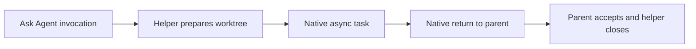

# Ask Agent managed worktrees: implementation and experiments

This is a historical qualification record for frozen Ask Agent 0.5.0 candidates.
It does not describe the current release or reclassify those experimental outcomes.
See [the later routing results](ask-agent-routing-results-2026-09-20.md) for 0.6.0;
source links below point to the corresponding current functions and tests.

Ask Agent 0.5.0 owns workspace preparation through one packaged Python/Git
helper. The parent supplies its source checkout and task; it does not choose a
worker branch or perform the dirty-state copying recipe. Native `Task`, `Agent`
or spawn tools continue to own asynchronous execution and return delivery.
The helper never starts a model, polls a worker, merges code or decides semantic
acceptance. The user clarified that the Grok target is **Grok Build**, not Grok
Bot.

## Implementation

- `prepare` creates a unique worktree from the caller's actual HEAD, including
  a linked caller checkout. It preserves separate staged/unstaged layers,
  tracked bytes/modes and non-ignored untracked inputs, and checks that the
  source did not change during capture. The caller must coordinate writers.
- `inspect` distinguishes the inherited state from the worker contribution.
  Prepared inspection rejects drift; returned inspection permits changes and
  binds state plus artifact/discard classification into an acceptance
  fingerprint.
- `close` retains by default. After explicit parent acceptance it archives only
  approved reports, verifies preservation, rechecks state, removes the owned
  worktree through Git and retains its branch. Post-removal record-write failure
  has a narrowly validated recovery path.

The default data store is `XDG_STATE_HOME` or `~/.local/state`, outside removable
worktrees and OS temporary directories. Stopped-worker and integration
assertions remain the parent's responsibility. Worktree placement does not
constitute an operating-system sandbox. Submodules, special/conflicted index
states, active content filters and unrepresentable index-only returned changes
fail closed.

For example, the fixture has `dual.txt` staged with one value and then edited
again without staging. `prepare` replays the staged patch into the worker index
and the unstaged patch into its working files, verifies both independently, then
returns a receipt and absolute worktree path. A worker adds only
`discount_rate: 0.10` to `pricing.json`. The parent integrates that contribution,
preserving its original index and unrelated changes, then authorizes report
archival and removal.

Sources: [ask_agent_workspace.py - prepare: workspace creation and reuse](/Users/dadleet/src/skill-craft/skills/ask-agent/scripts/ask_agent_workspace.py:1406),
[ask_agent_workspace.py - inspect: prepared and returned evidence](/Users/dadleet/src/skill-craft/skills/ask-agent/scripts/ask_agent_workspace.py:1438),
[ask_agent_workspace.py - close: acceptance and preservation gates](/Users/dadleet/src/skill-craft/skills/ask-agent/scripts/ask_agent_workspace.py:1706).

## Mechanical validation

- Baseline before implementation: 34 existing worktree-harness tests passed.
- Final helper: **18 real-Git tests passed**, including copied-package execution,
  exact source-index preservation, staged-add/delete/recreate cases, binaries,
  modes and symlinks, acceptance refusal, late archive-time writes, index-only
  contribution refusal, classification binding and removal-record recovery.
- Core aggregate: 26 of 28 suites passed in the initial run; the only failures
  were generated-package parity while the helper was still changing. After
  regeneration, both affected suites passed independently. All 28 core suites
  therefore have passing evidence; the original aggregate exit-1 log is retained.
- Complete Ask Agent marketplace payload validation passed. Generated plugin
  bodies and catalogs are derived from the source package, not hand-maintained.
- Independent cleanup review found no remaining actionable findings after the
  regression-backed fixes.

Tests: [ask-agent-workspace.test.py - dirty linked caller: Git-layer preservation](/Users/dadleet/src/skill-craft/test/ask-agent-workspace.test.py:708),
[ask-agent-workspace.test.py - archive race: late writes retain work](/Users/dadleet/src/skill-craft/test/ask-agent-workspace.test.py:1229),
[ask-agent-workspace.test.py - copied package: no source-checkout dependency](/Users/dadleet/src/skill-craft/test/ask-agent-workspace.test.py:1287).

## Live experiments

Each full case uses a frozen package, a dirty linked caller ahead of `main`, two
distinct helper worktrees, native background workers, useful parent work,
actual native returns, pricing integration, four retained reports and helper
cleanup. The oracle checks branch/HEAD, raw index bytes, both dirty layers,
nonpricing paths and contents, exact pricing JSON and native-event chronology.
No runtime model launcher or polling service was added.

Evidence root:
`/Users/dadleet/Documents/Codex/experiments/ask-agent-managed-20260920T050515Z/`.

| Run | Native task and return | Directory evidence | Strict outcome |
| --- | --- | --- | --- |
| Grok Build 1.0.34 | `spawn_subagent`, native task-output collection | Native `cwd` request bound to helper root; actual operation cwd/root match | COMPLETE |
| Codex 0.155.1 | Fresh `spawn_agent`, native completion collection | No spawn cwd parameter; actual operations in assigned root | COMPLETE |
| Claude Code 2.1.278, normal profile | `Agent`, task notifications | Explicit command paths; operation cwd/root match | FAILED only for extra caller-side feedback-collector artifact; other gates passed |
| Cursor, initial unpinned run | Background `Task` launches; process exited before return | Prepared roots only; no completed worker evidence | FAILED; same-parent resume could not recover child conversations; worktrees retained |
| Cursor 2026.09.18, pinned | `Task`, automatic `system/task_notification` in same process | Explicit paths; operation cwd/root match | PARTIAL only on strict ordering: first callback preceded public parent calculation; all Git/lifecycle gates passed |
| Cursor 2026.09.18, delayed control | Native success and provider-error callbacks; parent shell calculation before initial returns | Editing worker operation cwd/root match; failed report workers unobserved | FAILED full case: editing completed/integrated/closed, but report worker and fresh retry hit provider-connection errors and were retained |
| Claude Code 2.1.278, controlled hook profile | `Agent`, automatic task notifications; parent shell calculation before both returns | Explicit command paths; operation cwd/root match | COMPLETE, including clean caller hygiene; hooks disabled for this test session only |

Machine verdicts (original failed/partial verdicts remain beside regrades):

- [verification-summary.json - Grok checks: complete native binding and lifecycle](/Users/dadleet/Documents/Codex/experiments/ask-agent-managed-20260920T050515Z/grok/operator/verification-summary.json:1).
- [verification-summary-v2.json - Codex checks: complete lifecycle with explicit paths](/Users/dadleet/Documents/Codex/experiments/ask-agent-managed-20260920T050515Z/codex/operator/verification-summary-v2.json:1).
- [verification-summary-v3.json - Claude normal profile: caller artifact failure](/Users/dadleet/Documents/Codex/experiments/ask-agent-managed-20260920T050515Z/claude/operator/verification-summary-v3.json:1).
- [verification-summary.json - Claude controlled profile: complete lifecycle and caller hygiene](/Users/dadleet/Documents/Codex/experiments/ask-agent-managed-20260920T050515Z/claude-controlled/operator/verification-summary.json:1).
- [verification-summary.json - Cursor pinned: callback and lifecycle evidence with strict-ordering limitation](/Users/dadleet/Documents/Codex/experiments/ask-agent-managed-20260920T050515Z/cursor-pinned/operator/verification-summary.json:1).
- [verification-summary.json - Cursor timing control: provider-failure retention](/Users/dadleet/Documents/Codex/experiments/ask-agent-managed-20260920T050515Z/cursor-overlap/operator/verification-summary.json:1).

The initial Cursor version probe reported 2026.05.04; the launcher later resolved
to 2026.09.18. The exact executable used by the first run was not captured, so
that failure is not attributed to a specific version. Later controls use an
absolute versioned executable and record its version immediately before launch.
The delayed Cursor case independently proves parent work before the initial
terminal notifications (`141/142` launch results, `161` parent calculation,
`185/244` initial returns in its public JSONL). Its fresh retry adds a third
launch, so the strict two-worker oracle also rejects its event cardinality. No
completion, operation path or report was invented for the failed report workers.

The Claude normal-profile run retained an unexpected
`tasks/in-progress/prompt-improvements-backlog.md` in the caller. Its content
identifies a feedback-collector plugin, but no public tool event establishes
which component wrote it. The failure is retained rather than silently ignored.
The controlled run uses one-session `--settings '{"disableAllHooks":true}'` to
isolate ordinary hooks; no global configuration was changed. This is a test
profile, never default skill behavior.
In that controlled run, the native parent calculation completed at public
JSONL lines 91–92, before report and editing task notifications at 189 and 221.
All caller/index, integration, report-preservation and cleanup checks passed.

The first four frozen packages preceded the last cleanup hardening. The pinned
Cursor and controlled follow-up cases use the finalized helper. Its SHA-256 is
`cea1513c1050408f19c0d8702e8af86d52599901666e6f28fa97be0fa7d29c96`.
Every run retains its own full package digest, raw public host records, normalized
event locators and original verdicts; corrected extraction produces new verdict
files rather than overwriting earlier results.

## Delivery scope

At the end of this historical experiment, source, tests, documentation and generated
marketplace payload were updated in the working checkout. No commit, publication,
global skill install or global hook change had been performed in that experiment. The initial failed Cursor worktrees remain retained
because no worker completion or acceptance justified removal.
