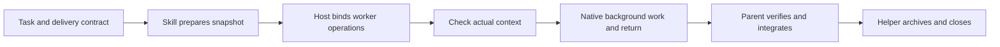

# Ask Agent routing research and implementation

Status: research, implementation, core checks and bounded experiments completed.
Qualification limits are recorded below. The prior 0.5.1 campaign is immutable
and remains in `ask-agent-delivery-opencode-results-2026-09-20.md`.

## Architecture decision

Keep native subagents as the task transport. Keep one packaged Git helper for
workspace preparation, context checks, contribution evidence and conservative
cleanup. Organize the skill around these separate responsibilities rather than
pretending that each host's Task tool has the same API.

The API research establishes a distinction between **client session APIs** and
**native subagents returning to an existing parent**. The former can solve
directory selection but need a client to handle permissions, events,
cancellation, session lifetime and reinjection into the current conversation.
That is a separate orchestration product, not a small portable-skill fix.

| Candidate | Evidence | Decision and reason |
| --- | --- | --- |
| Grok Build native subagent cwd | Earlier 1.0.34 live managed fixture and [official subagent guide](https://docs.x.ai/build/features/subagents) | Adopt the observed cwd field where exposed; native join keeps headless collection honest |
| Claude existing-worktree entry | Two new 2.1.278 probes, below | Reject as the general helper binding route for the tested primary/external-linked layouts |
| Claude explicit command directories | Dirty-input native probe and complete managed hooks control | Adopt the operation-binding route; local normal-profile caller preservation remains affected by its separate session-end hook |
| Claude WorktreeCreate bridge | [Official hook contract](https://code.claude.com/docs/en/hooks#worktreecreate), [skill hook lifetime](https://code.claude.com/docs/en/skills), new dirty and two-worker clean probes | Pilot: native startup binding and concurrent distinct receipts work in 2.1.278; removal-hook behavior remains unobserved and the skill installs no hooks |
| Codex App Server | [thread/start cwd and event APIs](https://developers.openai.com/codex/app-server); locally generated 0.155.1 `ThreadStartParams.json` | Defer: explicit session cwd exists but is not an exposed native spawn cwd or automatic callback bridge |
| Cursor ACP / SDK | [ACP session/new cwd](https://cursor.com/docs/cli/acp), [SDK local cwd and run cancellation](https://cursor.com/docs/sdk/typescript) | Defer: useful for an explicitly requested external client, unnecessary for the already working native Task route |
| OpenCode server / SDK | [server prompt_async](https://opencode.ai/docs/server/), [SDK events and session abort](https://opencode.ai/docs/sdk/) | Defer: the server can own long-lived sessions but does not transparently repair a one-shot native parent that exits |

Historical issue reports are contrary evidence for targeted checks, not proof
that the installed version still has the same bug. No new SDK dependency,
service, credential, global hook or persistent feature flag was installed.

## Current implementation

- `SKILL.md` is a short common router; detailed status/cancellation and result
  handling moved to linked `native-lifecycle.md` and `result-handoff.md`.
- `host-capabilities.md` separates native startup binding from explicit operation
  binding, then gives version-bounded launch/return recipes for the five hosts.
- The helper adds `check-context --receipt`, deriving cwd and Git root from the
  executing process, rather than trusting agent-supplied directory fields.
- The parent records `inspect --phase prepared` immediately before dispatch;
  this verifies the inherited snapshot separately from later context rechecks,
  which correctly allow the worker's task edits.
- Git context environment overrides are rejected before preparation, using
  the same variable policy as the helper's subprocess environment and context
  check, so a misleading environment cannot create a doomed workspace first.
- The managed verifier reports separate lifecycle layers without relaxing the
  existing strict aggregate verdict.
- The three existing delivery modes and conservative acceptance/cleanup remain.

## Automatic dirty-state inheritance

Every `prepare --source CALLER` captures CALLER's exact HEAD, staged binary Git
patch, unstaged binary Git patch and non-ignored untracked inputs. It creates a
new worktree at that HEAD, applies the staged patch with `git apply --index`,
applies the unstaged patch without `--index`, then copies untracked inputs.
It compares both resulting Git layers and file/index manifests with the capture,
and checks that the caller did not drift. Preparation fails rather than
launching against an incomplete copy. No caller commit, stash or reset is used.

The same rule applies when CALLER is a linked worktree or an earlier helper-created
worktree. Inheritance is separate from return delivery: the worker's returned
patch is relative to its inherited baseline, so pre-existing caller changes are
not reapplied as a new worker contribution.

The new two-generation regression starts with a dirty linked caller, prepares
W1, adds staged and unstaged `app.py` layers plus an untracked binary input in
W1, then prepares W2 from W1. It compares HEAD, both binary patch layers,
untracked inputs, ancestor file bytes and raw index state. W2 then appends a
contribution to that same dirty `app.py`; its returned patch adds only the W2
line and applies successfully against the inherited baseline. Both ancestors
remain unchanged. This tests nested delegation rather than only a clean main
branch or disjoint new-file contribution.

## Experiment evidence

Evidence root:
`/Users/dadleet/Documents/Codex/experiments/ask-agent-routing-20260920T141216Z/`.
Installed executables/versions are recorded in `operator/versions.json`.
The pre-change core baseline passed all 30 suites (`operator/baseline-core.json`).

The small probes are test-only external invocations in disposable repositories;
none are part of the skill runtime. Their source, exact prompts, native events,
exit records and retained worktrees are available beneath the evidence root.

| Probe | Observation | Limit |
| --- | --- | --- |
| `claude-enter-existing` | Child exposed EnterWorktree, but rejected switching from a primary checkout; native result returned | No sentinel written; not workspace qualification |
| `claude-enter-linked` | External linked caller was rejected as not inside the repository path; native result returned | Git links it to the same repository; the model's claim that it was a different repository is not adopted |
| `claude-explicit-directory` | Actual child Bash commands began with cd; pwd/Git root and relative sentinel matched the helper worktree; dirty inputs were visible; parent computed 323 before native notification | Narrow binding/return probe, not full integration or cleanup qualification |
| `claude-hook-probe` | Session-scoped WorktreeCreate hook called the helper; native child startup cwd and unprefixed Bash cwd/root matched the helper worktree; dirty inputs and a relative sentinel were correct; parent continued and received native return | No global changes; WorktreeRemove did not fire; helper worktree retained |
| `claude-hook-clean-control` | Two concurrent native background Agents received distinct helper receipts/branches/paths; both unprefixed Bash cwd/root matched their own workspace; parent computed 667 before two native notifications | Clean no-change control; both worktrees remained registered; zero WorktreeRemove records through process end plus five seconds, so removal-hook semantics remain unqualified |

The first entry probe attempted an unnecessary native wakeup that was rejected;
the corrected later probes prohibit that instrumentation. TaskOutput was not
exposed in these sessions; actual completion arrived through native task
notifications. Process exit alone is not scored as success.

## Managed live qualification

These verdicts use the v2 verifier with independent lifecycle layers. A failed
evidence layer is not automatically an observed execution defect: missing raw
Cursor child-tool output leaves binding unproven, while the extra Claude caller
file is an observed preservation violation.

| Host / profile | Verdict | What the evidence establishes |
| --- | --- | --- |
| Grok Build 1.0.34 | COMPLETE | Native cwd, real helper-root checks, two background workers, parent continuation, native joins, caller preservation, patch integration, archived reports and eligible close all pass |
| Claude Code 2.1.278, normal | FAILED | Launch, continuation, automatic returns, raw child operation binding, delivery and cleanup pass; caller preservation fails on the feedback collector's extra file |
| Claude Code 2.1.278, hooks control | COMPLETE | Same frozen routing package with process-scoped hooks disabled; raw child checks, native callbacks, continuation, caller preservation, patch/report-only acceptance, four archived reports and both closures pass |
| Cursor 2026.09.18 CLI | PARTIAL | Launch, continuation, automatic return, caller preservation, delivery and cleanup pass; cwd/root verification is only worker-reported, so the strict operation-binding layer fails for lack of raw child evidence |
| Codex 0.155.1, full fixture | FAILED full lifecycle gate; interrupted | Native launches, both actual cwd/root checks, parent continuation and caller preservation pass; only editing's native return was observed before the outer 900-second timeout; acceptance and cleanup remain incomplete, with both worktrees retained |
| Codex 0.155.1, final-package narrow probe | PARTIAL | Native launch, real workdir/cwd/root, dirty inheritance, parent continuation and same-session return transport pass; worker reports FAILED on an invalid test inspection flag; corrected operator inspection passes after return; acceptance/close were not requested |
| OpenCode 1.18.31 persistent TUI | COMPLETE task lifecycle; parent final-response limit | Two fresh background tasks without invented resume IDs, actual child cwd/root checks, parent continuation, both automatic callbacks, caller preservation, integration, acceptance, report retention and both closes pass; parent was stopped after remaining in its final-response spinner |

Normalized trace, immutable helper outcome, acceptance and report-hash evidence
are under each case's `operator/` directory. Grok uses
`verification-summary.json`; normal Claude and Cursor use
`verification-v2-normalized.json`; the matched Claude control uses
`verification-v2-strict.json`. Both normal Claude and Cursor verifiers
correctly exit nonzero for their non-COMPLETE verdicts.
OpenCode uses `verification-v2-normalized.json`, backed by the current parent
and two child sessions' structured public tool records. Its process-local
background-subagent flag and narrow session-only external-directory approvals
are test setup, not global configuration or an installation performed by this
skill. An incomplete session export was retained as a limitation; it was not
used as complete evidence. After both accepted helper closures, the parent
remained in a final-response spinner and the bounded test was stopped. The
verified Task lifecycle does not imply that the parent produced a normal final
prose response; the cause of the spinner was not established.
The interrupted Codex case uses `verification-summary.partial.json` and
`interruption-summary.json`. The report worker wrote its artifacts about nine
seconds before the deadline; no permission, authentication or schema block was
observed. The operator timeout does not establish that workers stopped, so the
record says `worker_stop_confirmed: false` and does not call them cancelled.

The final-package Codex probe is
`codex-binding-return-probe-20260920T145845Z/operator/scoped-verdict.json`.
Its frozen tree matches `operator/final-package.json`. It completed in about
375 seconds and preserved all caller layers and raw index bytes. The test
prompt mistakenly used `inspect --report`; the actual helper argument is
`--artifact`. The failed worker response and original prompt are retained.
`post-return-operator-recovery.json` records the corrected command and successful
returned inspection/delivery evidence as operator recovery, never worker
success. No second worker/model retry was used to overwrite that result.

The normal Claude managed parent also attempted ScheduleWakeup without its
required prompt; the host rejected it. The parent then used native completion
notifications. This is preserved in `normalization-provenance-v2.json` as a
tool-contract failure, independently of the passing native-return layer. The
skill already requires a real wakeup prompt; this observed noncompliance is not
silently relabeled a successful status mechanism.

## Local verification

- Before edits: all 30 core suites passed.
- After edits: all 30 core suites passed, including 24 workspace tests and 16
  managed-harness tests. See `operator/final-core.log` and `final-core.json`.
- Full generated plugin/catalog synchronization and `--check` passed. The final
  source and generated Ask Agent package digests match.
- Markdown package links and whitespace checks passed.

## Claude profile side effect

The current normal-profile run fixed worker operation binding but again left
`tasks/in-progress/prompt-improvements-backlog.md` in the caller. This is a real
caller-preservation failure, even though native worker return and file delivery
work. The installed `async-suite` 0.2.0 plugin registers
`handlers/harvest-feedback.sh` on every `SessionEnd`. The handler resolves the
hook cwd's Git root, creates the directory, and writes the exact observed
backlog header before scanning for valid feedback markers. Current participant
tool inputs contain no request to create that path. This identifies a separate
host-profile side effect; disabling native Task support would not fix it.
The attribution is based on configuration and the exact target/header match;
the public stream does not expose that individual SessionEnd handler execution.
Source paths, line references and hashes are recorded in
`claude-managed/operator/host-hook-attribution.json`.

The matched `claude-hooks-control` uses the same frozen routing package and
fixture with only the process-scoped `disableAllHooks` override. Its outcome is
recorded with the live matrix below. No user plugin was edited or globally
disabled. A durable fix to the collector would create a backlog only after
finding valid feedback, or store it outside the caller checkout; that is outside
this Ask Agent implementation.

## Frozen packages and final review

The four CLI managed runs froze the same 0.6.0 routing candidate, tree digest
`e7da9935b36054060f578cd3607d530e6b732eb521277d6d893dc1dfd9d7fa7f`.
The final package is separately recorded in `operator/final-package.json`.
Later review added fail-fast Git-environment preparation checks, the mandatory
pre-dispatch prepared inspection, a clarification that an existing caller
worktree remains a source for fresh preparation, and the hook-probe findings.
The final aggregate suite tests those changes; the earlier live runs do not
claim to have loaded later bytes. OpenCode's separately frozen manifest records
its exact intermediate package. No old evidence was overwritten to imply
qualification of a different package.

Independent review identified and closed the environment-policy mismatch,
initial-baseline versus current-context distinction, and missing same-file
two-generation patch assertion. These findings changed implementation/tests,
not merely the report wording.

## Activation boundary

This implementation is in `/Users/dadleet/src/skill-craft`. Existing Codex,
Claude, Grok and Cursor skill links resolve to
`/Users/dadleet/src/skill-craft-latest/skills/ask-agent`, version 0.3.1 at the time of this experiment.
No OpenCode skill exists at `~/.config/opencode/skills/ask-agent` in this check.
The experiments explicitly freeze and load this checkout's package; their
results do not claim activation of the updated skill through those installed
links. No links or global settings were changed.
