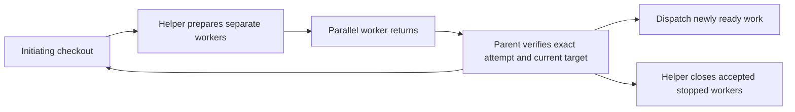

# Asynchronous orchestrator integration test plan

The target is the exact checkout from which the run started. A linked feature
checkout is not interchangeable with the repository's primary checkout. Worker
completion supplies evidence; parent acceptance performs the guarded return and
releases successors. Cleanup follows acceptance and native stoppage, per receipt.

## Existing evidence and remaining gaps

The lifecycle suite already uses concurrent deterministic worker processes,
real helper-owned worktrees and actual generated code. A-first, B-first and burst
returns exercise eager successor dispatch and final dependency joins. Git tests
cover target identity and competing returns; helper tests cover receipt-bound
close, drift retention and crash recovery. These remain useful and should not be
duplicated as additional serial happy paths.

The missing compound boundary is simultaneous **public bridge callers** around
import, integration, child acceptance, append-only events and deferred close.
Hermetic fixtures also cannot prove that a native host actually launches workers
and delivers their completion into the ongoing parent context.

## New durable regression cases

| Case | Trigger | Required observations |
|---|---|---|
| Competing completions | A and B prepare against T0, then separate CLI processes submit `done` together | Exactly one accepts; the stale candidate fails without a second target update; reprepare/reverify accepts the other at T1; both sources reach the initiating target; cleanup removes only their owned worktrees |
| Duplicate callbacks | Concurrent identical import, `done`, and cleanup requests for one attempt | One durable import/integration/acceptance/cleanup; equivalent replay succeeds without rewriting prior events or creating another workspace |
| Origin and sibling isolation | One worker returns while its sibling remains alive; callbacks run from an unrelated cwd; a handoff is submitted under the wrong attempt | Wrong correlation and premature/unstopped cleanup fail without effects; accepted work returns to the bound checkout; the active sibling survives; fresh-process recovery preserves the sibling attempt/handle/reservation; final accepted worktrees disappear from disk and Git registration |

Each case starts a fresh disposable repository and linked initiating checkout.
The actual Ask-Agent helper creates worker worktrees. Pipe barriers control worker
completion and callback contention; no timing sleeps establish concurrency.
Every subprocess has a deadline and is stopped during teardown on failures.
Assertions independently check generated behavior, exact source ancestry, target
identity, primary checkout preservation, event cardinality and cleanup receipts.
Fixtures are not shared across cases.

The focused entrypoint is `python3 -B test/shiploop-chain-async.test.py`.
The same suite is in `test/shiploop.test.sh`'s single canonical inventory and its
smoke subset. Selection tests must prove smoke membership, full/shard coverage
without duplicates, and failure propagation.

## Live native qualification

Use the existing opt-in `test/experiments/shiploop_chain/run_native.py` with the
selected managed Ask-Agent package, a fresh external output directory, and a
bounded deadline. Its native B worker waits after producing code until C starts,
making eager refill observable without depending on model timing.

Success requires real native A/B/C/J launches and completed collection, attributed
root-session evidence, strict A/B and B/C task-lifetime overlap, all source
contributions in the initiating checkout, the primary checkout unchanged,
helper-owned cleanup, readable archived results, and a fresh-process final audit.
A successful fixture run qualifies that host/run only. No native startup binding,
cross-host delivery, or simultaneous CPU work follows from receipt ordering.
Grok background-task notifications are passive status data. They cannot replace
typed collection receipts, child-session bindings or a root terminal event;
unknown event types remain rejected. A background command requires its exact
launch ticket and a later requested task-ID/command-matched terminal collection.
Only an explicit host pre-execution denial is excluded from launch accounting;
an unexplained failure with no handle remains ambiguous. Interleaved spawn
bindings use exact child identities, never event adjacency. Adapter regressions
test these boundaries.
Missing telemetry is incomplete evidence, not a skipped pass. Preserve failed
attempts before repairing and rerunning.

## Deliberate safety boundaries

`confirmed_stopped` remains an explicit parent attestation. Hermetic tests prove
that it is required; the native host trace provides separate completion evidence.
When native lookup returns `TaskNotFound`, keep the original attempt, handle,
reservation and workspace and record the error in the existing parent pending
record. Missing lookup data does not attest stoppage or authorize replacement or
cleanup. Safe independent work may continue within remaining capacity. The
hermetic recovery case checks this projection without pretending to exercise a
real host lookup.

Unaccepted, failed, superseded or drifted workspaces are retained. Tests must not
reinterpret successful replacement work as authority to discard rejected code.
The documented lack of managed superseded retirement remains a separate contract
extension; these cleanup claims cover accepted, stopped workers.

## Completion criteria

Run the pre-change baseline before edits, execute the new regressions and affected
selection/pilot suites, inspect actual exits and unchanged source fingerprints,
and fix demonstrated defects. Record native qualification separately. Finish the
Improve cycle only after two distinct consecutive substantive reviews find no
material remaining improvement with current applicable checks.
