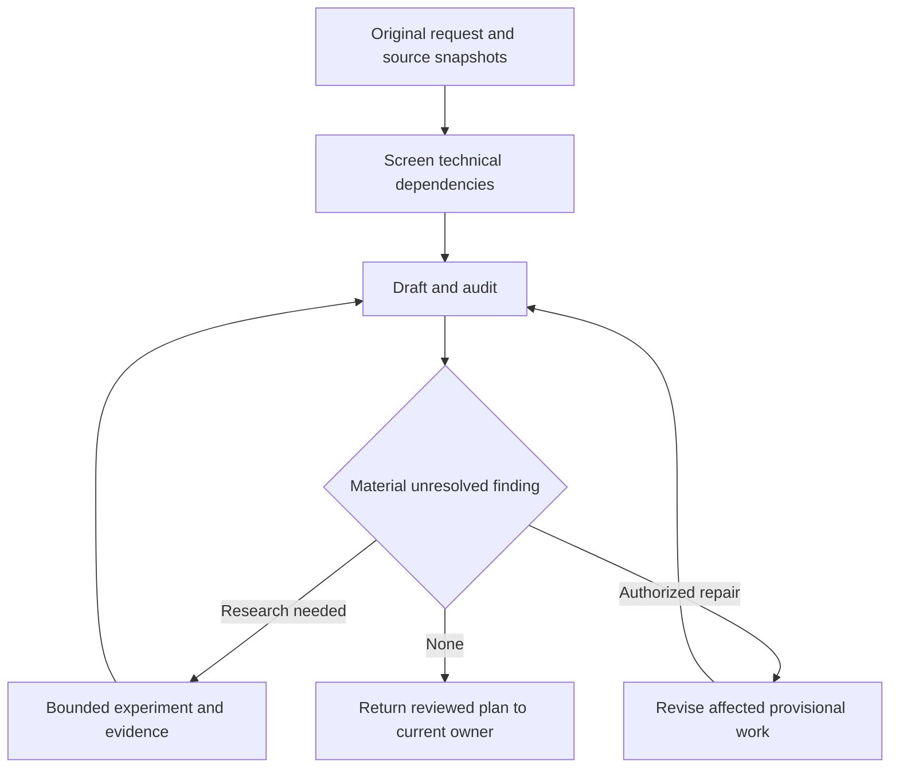

# Backchain source-aware planning and ShipLoop integration

> Historical design, superseded on 2026-09-18 for recurrence ownership and stopping: Backchain now owns internal repetition until two consecutive distinct passes find only trivial/no changes. See [the correction and implementation record](backchain-convergence-2026-09-18.md). Earlier audit experiment results remain scoped to their original one-pass comparison.

Status: implementation completed locally and validation finished. Native ShipLoop use remains an explicitly selected pilot. This records the approved plan, measured adoption decision, and verification results; no commit or publication was performed.

## Baseline and authorization

The user authorized remaining experiments, an implementation plan, and implementation on September 17, 2026. This authorizes the proposed prompt/reference changes and their necessary tests, not a release or commit. Backchain started clean at `fb2ed170d459d0453d831c9e99bb6c1f753f6105`; the new graph-navigator experiment at that revision does not change production planner behavior. Skill-craft started at `004447f` with substantial existing uncommitted changes. Initial patches and relevant file copies were saved under `/tmp/backchain-implementation-20260917-195917`; unrelated work must be preserved.

## Experiments before adoption

1. Freeze the existing package and a source-aware candidate under Backchain's ignored `results/source-aware-pilot/` directory. Keep source-owned oracles outside subject prompts.
2. Run six audit scenarios, two arms and two fresh repetitions: an obligation missing from the supplied requirement map; applied migration/configuration and exact release evidence; negative and inconclusive provider experiments; a clean independent-work control; a false edge with a required-edge near twin; and a changed source with protected completed work. These test audit behavior, not full application delivery or all 42 lens categories.
3. Run real native package calls through two available hosts, then resume in a fresh context to revise within bounds. Record source/resource reads, missing-source behavior, candidate identity, and protected work. Candidate side-load trials are distinct from installed-package verification.
4. Exercise source transport with deterministic tests: stable bytes/hashes across generation and elaboration, source changes between stages, literal template-like text, missing/oversized/invalid inputs, and compatibility modes. These prove transport, not semantic planning quality.
5. Harden concrete interface defects found by review or trials, and run focused held-out native cases against the final package. Do not transfer a candidate's measured result to materially different final prompts without disclosure and follow-up checks.

Adoption requires source-grounded useful findings with no material false-positive or protected-boundary regression. Compare costs only after correctness. Failed or incomplete trials are not ties. A small pilot does not establish universal completeness or justify repeating every audit unconditionally.

## Implementation slices

### Backchain portable contract and reasoning

- Add `backchain-caller/v1` native draft, read-only audit, and authorized revise operations. Keep sources, coverage, identity, findings, experiment dispositions, and changes in a companion assessment; preserve the existing plan schema.
- Preserve original request and selected source excerpts through generation, dependency review, elaboration, and independent source audit. Derive omitted obligations from sources even when the caller's requirement index forgot them. An unavailable applicable normative source prevents complete coverage.
- Add the 42-category technical index with selectively loaded question cards, 20 interaction scenarios, and eight specialist extensions. Classify prerequisite edges separately from invariants, resource conflicts, decisions, and research gaps.
- Keep existing elaboration preservation rules. A separate revise operation may change only explicitly provisional work, with source-linked old-to-new mappings. Running/completed work remains protected. New nodes and edges require declared edit scope.
- Bind each experiment to its condition, affected consumers, target/version/configuration, criterion, and actual observations. A completed experiment is not a satisfied condition. Negative, inconclusive, invalid, or inapplicable evidence leaves the dependent condition unresolved or requires redesign.
- Bind input and output candidate identities separately. Changed graphs cannot retain stale parallel groups or claim structural validity without an actual validation result. The caller owns recurrence and any existing Improve loop; standalone revision has a bounded default.

### Checkout-only source transport

- Add repeatable `--source <file>` for supplied UTF-8 specs/references, and `--original-request <file>` for `--from-draft`.
- Capture bounded source bytes once, retain selected/resolved locators and SHA-256, and pass the captured content to generation/elaboration. Report source review as not performed by this transport-only harness.
- Keep package-only structural, legacy no-source from-draft honest about unavailable original request, and existing model/NBQ modes compatible. No new model runtime or npm dependency.

### ShipLoop call and recovery

- Use explicit recorded selection of `source-aware-native` (interface `backchain-caller/v1`) or `embedded`; distinguish actual native calls from embedded reasoning. Verify the observed selected card and required resources, never guess a sibling package. Missing/incompatible explicitly selected native mode stays incomplete.
- Use native draft at planning, scoped audit at step planning, and material-finding-driven revise within the active Improve executor's authorized scope. Other stages call only for a relevant source/contract change or unresolved planning question.
- Carry real action/stage/owner, absolute or explicitly based locators, original sources, candidate identity, provisional/protected bounds, and prior findings through existing notes, `evidence_refs`, and work-item `context`.
- The active Improve executor owns helper calls after the parent parks. ShipLoop does not launch another loop, apply asynchronous helper results, or advance on material unresolved findings. Read-only Backchain assessments are not a second canonical plan.
- Preserve existing protocol/state/result schemas. Regenerate the ShipLoop plugin view from canonical files.

## Validation and completion

- Backchain: focused source transport/CLI controls, package resource and prompt parity, existing schema/seed/goal/template tests, full deterministic suite, and the required local-change test-harness gate with `PASS_CLEAN` or `PASS_CLEAN_SCOPED`.
- ShipLoop: existing and extended navigator-v3 planning/Improve routing, Backchain guidance and reference/cold-context tests, relevant protocol regressions, full ShipLoop suite where feasible, and generated package parity.
- Independent final review of the actual diffs, prompt/harness alignment, missing-source handling, and experiment result gates.
- Report live trials separately from deterministic tests, and installed-package calls separately from discovery. Do not claim commits, publication, deployment, or application delivery.

## Results and final decisions

The 24-call frozen audit comparison completed without substantive call failures or retries. Semantic review found the decisive condition in 12/12 source-aware outputs and 11/12 current dependency-review outputs; the baseline missed one false documentation edge. A separate review agent confirmed the eight false-edge and clean-control grades. This measures the audit stage, not generation, elaboration, implementation, or all 42 technical lenses. The candidate loaded all interaction questions and took a median 178.3 seconds versus 64.1 seconds; mean input tokens were 33,034 versus 26,615 and mean output tokens 5,689 versus 1,819. The served model identity was unavailable. See the [recorded audit pilot](../../backchain/docs/experiments/source-aware-pilot-2026-09-17.md) for hashes, fixed oracles, individual results, costs, and limitations.

Decision: adopt bounded source transport and the portable source-aware interface; pilot native ShipLoop calls through explicit selection. Retain the embedded compatibility default. The measured benefit is explicit source/obligation/experiment accounting and tested edge boundaries, with a modest discovery difference and greater cost. Do not introduce unconditional repeated audits, another Until Loop, or a new scheduler. Load detailed technical cards only for applicable questions.

Production changes implement the original-source audit, 42-card technical catalog, bounded source capture, explicit draft/audit/revise operations, protected revisions, scoped experiment dispositions, durable locator/action identity, and stage/Improve ownership. Final independent review identified and resolved two wording defects: the older embedded-only description now identifies the native exception, and source-aware draft explicitly retains generation, dependency review, evidence resolution, and elaboration. Prompt/harness alignment review found no further actionable mismatch and confirmed that native selection/adequacy checks are host reasoning rather than navigator enforcement.

Four early side-loaded native calls ran through Codex and Claude. Three subsequent installed-package calls exercised cold source audit, cross-host cold revision, and unavailable normative source with an empty requirements index. They kept material gaps incomplete and preserved protected work. The Claude revision lacked an output serialization/digest receipt and remained incomplete; later independent structural validation is a separate receipt. These calls used their recorded pre-clarification card digest and do not prove final-card byte equivalence. See [installed resume receipts](../../backchain/results/source-aware-pilot/native-smoke/final-resume/RESULT.md).

The first stable-card draft trial read the installed resources and recovered the omitted staging-smoke obligations, but did not return final JSON within its five-minute bound. Its expanded four-key experiment output requested both intermediates and final output, unlike the production two-key contract. It remains an incomplete trial, not a pass; the [draft receipt](../../backchain/results/source-aware-pilot/native-smoke/final-draft/RESULT.md) preserves observed intermediate evidence.

The final compact control returned the ordinary `{plan, review}` output, independently recovered an omitted privacy-link obligation, and retained independent edit/readback branches. The root host reproduced the model's insertion-order serialization digest exactly, then ran the documented `--package-only` path on those bytes. Packaging changed only `parallel_groups`, and the packaged output passed structural validation; source coverage remained incomplete because the target repository and exact content values were genuinely unspecified. The [compact control receipt](../../backchain/results/source-aware-pilot/native-smoke/compact-draft/RESULT.md) preserves output, hashes, explicit serialization, initial native-wave validation failure, and the successful later packaging receipt. Of the five installed-package operations, four returned result artifacts and one timed out; this is not a claim that four plans were execution-ready or that the full delivery workflow was exercised.

### Final verification

- Backchain required local-change gate: `PASS_CLEAN_SCOPED`, suite exit 0, 86 reported passes / 0 failures / 0 skipped cases, with no product-path changes during the frozen run. Receipt: `/Users/dadleet/.grok/runs/test-harness/backchain/20260918T033852Z-03e9de/report.json`. The filesystem audit covers Git-visible paths. Its remaining notes are retained temporary fixtures and stderr volume; inspection confirmed expected negative-control diagnostics, installer help, and normal reporting output. These are not application-delivery evidence.
- Earlier verification runs are retained: a concurrent full-suite invocation hit an existing temporary-filename collision; another suite passed but its hygiene gate rejected this task's still-in-progress card/report writes. Serial frozen verification above passed without discarding or relabeling those failures.
- Final ShipLoop focused checks passed after the guidance edits: navigator v3 has 21 tests; the dedicated Backchain guide has four; v3 guidance and reference routing each have eight, for 41 tests. The owned implementation/test hashes were unchanged across this final verification. The new routing test inspects emitted operations across actual producer/Improve packets; prose assertions are not treated as semantic enforcement evidence.
- Generated ShipLoop package was regenerated from canonical sources and its final scoped parity check passed. All three supported ShipLoop shards exited 0 and covered the full 83-suite inventory. Their logs report 901 unittest cases, plus the JavaScript suite's separate output. The durable [verification receipt](../../backchain/results/source-aware-pilot/verification/receipt.json) records the inventory, log digests, per-shard counts, final focused checks, and unchanged owned-file hashes; adjacent logs preserve the complete outputs and earlier unsuccessful runs.
- The skill-craft working tree had substantial prior edits and received additional edits outside this task during execution (navigator/state/packet and unrelated experiment documentation). Those were preserved. Its broad suite is therefore shared-workspace regression evidence, not an immutable candidate attestation. Backchain's scoped gate separately records its stable baseline.

The implementation is complete within the approved scope. Remaining research is optional: broader generated-application evaluation, all-domain semantic coverage, and a controlled selective-loading cost ablation. The implementation does not claim those outcomes, automatic runtime enforcement of native metadata, or a guarantee that repeated planning becomes exhaustive.
