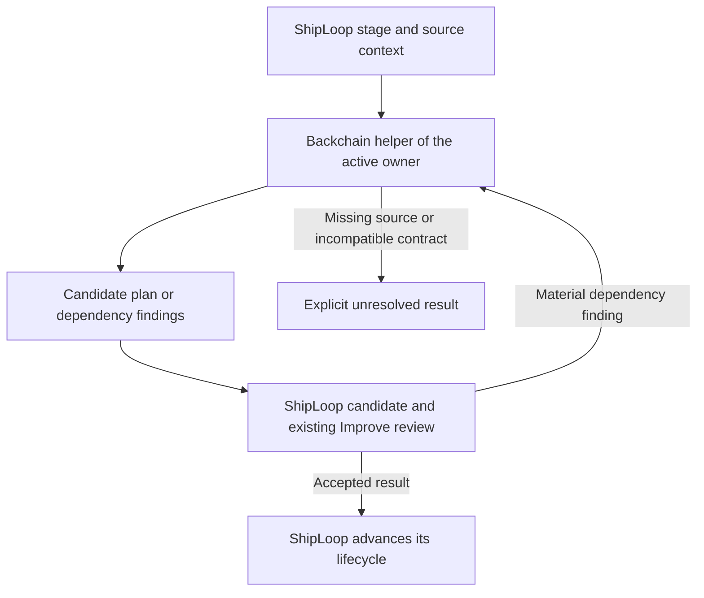

**Backchain improvement and ShipLoop call proposal — September 17, 2026**

Recommendation: pilot a source-grounded, caller-controlled Backchain contract, then use it through ShipLoop's existing planning and Improve boundaries. Backchain supplies dependency reasoning. ShipLoop owns its canonical plan and lifecycle. Improve owns the review cycle already assigned to that lifecycle. A Backchain assessment must not create another scheduler or an additional Until Loop runtime inside Improve.

The dependency reasoning now has a detailed proposed basis: [backchain-technical-dependency-catalog-2026-09-17.md - Technical catalog: 42 lenses, cross-lens review, and closure rules](/Users/dadleet/src/skill-craft/docs/backchain-technical-dependency-catalog-2026-09-17.md:13). The call should carry the actual technology/environment profile and applicable or unresolved lens findings alongside source requirements. Screen breadth from original outcomes before narrowing to affected flows; classify causal prerequisites separately from ongoing invariants, verification needs, and resource conflicts.

This is a design proposal, not an implemented interface. Inspection used Backchain `39fce43` with a clean worktree and skill-craft `004447f` with substantial pre-existing uncommitted ShipLoop work. Findings about that ShipLoop candidate are not release claims. The proposal and technical catalog do not change production skill behavior.

**What the current implementation establishes**

- Backchain's native procedure loads a generator, a dependency-question review, and an elaborator. It supports evidence resolution between review and elaboration. It does not expose the proposed `draft`, `audit`, and `revise` operations. [SKILL.md - Native procedure: current three-template interface](/Users/dadleet/src/backchain/skills/backchain/SKILL.md:46)
- The elaborator already repeats its internal worklist, then runs a coverage audit and a forward check once. Its fixed point means its examined needs were processed; it does not prove that the original request contained no overlooked requirement. [elaborator.v1.md - worklist and audits: existing convergence boundary](/Users/dadleet/src/backchain/prompts/elaborator.v1.md:377)
- The generator explicitly identifies the lack of independent request coverage as a known gap. An omitted requirement can also be absent from `goal_needs`. [generator.v1.md - verification sinks: acknowledged coverage gap](/Users/dadleet/src/backchain/prompts/generator.v1.md:73)
- The harness renders the elaborator from the draft's goal, draft JSON, and dependency context. The original prompt is not independently supplied again at this boundary. [run-prompt.sh - elaborator rendering: available inputs](/Users/dadleet/src/backchain/harness/run-prompt.sh:580)
- ShipLoop currently incorporates Backchain reasoning in its own guide. Its v3 prompt explicitly distinguishes that adaptation from an actual standalone invocation. [shiploop_navigator_v3_prompts.py - BACKCHAIN_GUIDANCE: current integration mode](/Users/dadleet/src/skill-craft/skills/shiploop/scripts/shiploop_navigator_v3_prompts.py:733)
- ShipLoop already has an actual selected-skill handoff for Improve. Its import bridge deliberately does not launch or control the child runtime. Reuse the host-mediated ownership pattern, not the Improve-specific runtime protocol. [shiploop_standalone_improve.py - module contract: host invocation and parent import](/Users/dadleet/src/skill-craft/skills/shiploop/scripts/shiploop_standalone_improve.py:1)

The installed Codex Backchain path resolves to the complete package at `/Users/dadleet/src/backchain/skills/backchain`; the three prompt templates and dependency-context reference exist. The package does not contain `harness/run-prompt.sh`. Its full harness is a checkout feature with runner assumptions, whereas native reasoning is the portable default. [SKILL.md - Mode selection and automated packaging: native versus checkout requirements](/Users/dadleet/src/backchain/skills/backchain/SKILL.md:37)

**Fresh deterministic probes**

These checks ran against the current Backchain library without model generation or product edits. They establish validator boundaries, not how often a model produces these defects.

| Input | Structure | Declared completion | Forward audit | Implication |
| --- | --- | --- | --- | --- |
| Existing production fixture missing a same-build smoke supplier | Valid | Complete | Fails | Structural success does not establish all prerequisites. |
| Same fixture with an unsupported `match` claiming deployment implies passing smoke | Valid | Complete | Passes | A nonempty explanation can suppress the vocabulary warning. |
| Two independent branches sharing an initial specification | Valid | Complete | Passes | The declared graph exposes a parallel pair. |
| Same branches with an unnecessary exact-matching ordering edge | Valid | Complete | Passes | The validator cannot infer that a plausible edge is unnecessary. |

The probes used `validateStructure`, `completionStatus`, `forwardFidelityAudit`, `edgeSemanticWarnings`, and `computeParallelGroups`. The smoke input is the existing fixture; the unsupported-match and independent/serialized pairs were constructed in memory. [prod-deploy-hidden-precond.draft.json - S2 and S3: required smoke lacks a supplier](/Users/dadleet/src/backchain/fixtures/prod-deploy-hidden-precond.draft.json:18) [lib.js - edgeSemanticWarnings: nonempty match bypass](/Users/dadleet/src/backchain/harness/lib.js:383) [lib.js - completionStatus: declared closure semantics](/Users/dadleet/src/backchain/harness/lib.js:1275)

**Prioritized Backchain improvements**

| Priority and decision | Change | Why it matters | Smallest useful acceptance check |
| --- | --- | --- | --- |
| 1 — Pilot | Carry original request, source clauses, authority, revision, evidence, and open questions through every planning stage. | Requirements lost by the generator must remain visible to later reviewers. | Omit a source clause from both the draft and `goal_needs`; the reviewer still detects it. |
| 1 — Pilot | Review source coverage independently of the candidate's self-declared goals. | A plan cannot define the entire rubric used to judge itself. | Map every supplied source obligation to work and a planned observation, an explicit conflict, or an unresolved disposition. |
| 2 — Pilot | Permit reasoned repair of provisional generated nodes and edges before acceptance. | Current monotonic preservation prevents removal of false ordering and clean splitting of bundled work. | Remove a planted false sibling dependency, preserve a mandatory near-twin dependency, and reject edits across a frozen boundary. |
| 2 — Pilot | Add caller-controlled `draft`, `audit`, and `revise` operations. | Standalone users and ShipLoop can use the same reasoning without rerunning the whole generation pipeline for every question. | A no-change audit returns findings only; a revision consumes material findings and preserves unaffected work. |
| 3 — Pilot | Review the meaning and identity of material supplier edges. | A deployed artifact, applied state, populated record, and verifying receipt are different things. | Reject “deployment implies smoke”; accept a real planned same-build, same-target verification producer. |
| 3 — Adopt clearer reporting in the next candidate | Separate structural validity, reviewed source coverage, verification planned, and execution evidence. | `complete` is currently a planning status, not proof of semantic coverage or execution. | A one-node assertion cannot imply verification or execution occurred. Preserve existing machine-status compatibility. |
| 4 — Pilot after correctness controls | Extract a concise common reasoning contract and load detailed examples only when needed. | Reduces repeated context and keeps standalone and embedded callers aligned. | Compare against held-out cases for omission, false-edge, and unresolved-risk regressions before adopting token savings. |

A source coverage map is a trace of planning obligations. It does not prove that behavior is correct, and the map itself needs review against the source. In ShipLoop, reuse the existing acceptance/case rows and maintained-requirement locators. Standalone Backchain may return a companion coverage report; do not create a second editable specification. A supplied spec establishes what must hold, while inspection or execution evidence establishes what already holds.

Repair must distinguish provisional generated material from protected material. The caller states which nodes, edges, requirements, and receipts may change. User-supplied plans default to preservation unless the task authorizes revisions. Completed or running ShipLoop definitions and receipts remain protected by the existing lifecycle rules. Every proposed deletion, split, or supplier replacement needs a source-linked reason and an old-to-new mapping. [elaborator.v1.md - Never remove an existing edge: current repair restriction](/Users/dadleet/src/backchain/prompts/elaborator.v1.md:486) [backchain-planning.md - Replanning: protected running and completed work](/Users/dadleet/src/skill-craft/skills/shiploop/references/backchain-planning.md:183)

Repeated identical answers are insufficient evidence of completeness. A successful planning result requires an independent source comparison finding no material omissions, checked affected relationships, no unresolved required obligations, and passing available structural checks. A structurally valid but incomplete plan remains a legitimate incomplete result. An exhausted budget or inaccessible required source is an incomplete stop. The standalone caller can repeat the operations; inside ShipLoop, its existing Improve cycle supplies that repetition. Backchain must not silently start its own nested improvement runtime.

The recent compact-report change already reduces presentation size and should be retained. It did not change planning prompts or semantic checks. Earlier local experiments found 24.4% fewer reported tokens for a compact two-pass candidate, while a direct planner saved more but missed runtime readiness. These are historical measurements on five scenario families, not a current production guarantee or evidence to replace the planner wholesale. [2026-09-17-compact-dependencies.md - Observed results: presentation-only improvement](/Users/dadleet/src/backchain/docs/experiments/2026-09-17-compact-dependencies.md:30) [2026-09-13-backchain-review.md - Experimental evidence: savings and omissions](/Users/dadleet/src/backchain/docs/experiments/2026-09-13-backchain-review.md:26)

**How ShipLoop should call it**

The preferred pilot is a packet-level native skill handoff within the current stage. The host reads and applies the selected Backchain package. ShipLoop does not shell out to a model runner by default. The result is an assessment or proposed candidate, linked from ordinary plan notes and `evidence_refs`, with accepted decisions carried into work-item `context`.

| Option | Benefit | Cost and risk | Decision |
| --- | --- | --- | --- |
| Keep only the embedded adaptation | No new dependency; already integrated with ShipLoop stages | Independent copies can drift; no actual Backchain call | Retain as the current embedded mode and comparison baseline. |
| Selected native Backchain skill with a versioned caller contract | Shared canonical reasoning, stage scope, portable host execution | Requires new operations, source transfer, output validation, and live evaluation | Pilot first. |
| Full Backchain harness subprocess | Existing saved JSON, provenance, structural packaging | Checkout/runner requirements, extra model calls, foreign plan schema, input duplication | Keep opt-in for standalone experiments or explicit validation. |
| New Backchain scheduler or nested Until runtime | Separate resumable loop | Duplicates ShipLoop/Improve ownership and state | Defer; no demonstrated need. |

The existing generic dependency rule already requires an observed selected skill path, rather than a guessed sibling or cache location. Preserve that rule. Add a declared interface version and supported operations to Backchain's caller contract. Old packages lacking that contract are incompatible with the new call mode even if their native templates are present. [SKILL.md - dependency root binding: selected package identity](/Users/dadleet/src/skill-craft/skills/shiploop/SKILL.md:159)

**Proposed call contents — not existing CLI flags**

| Input | Required meaning |
| --- | --- |
| Operation and scope | `draft`, `audit`, or `revise`; parent action/stage; full delivery plan or affected work item. |
| Candidate identity | Locator and digest of the exact candidate under review; parent canonical baseline remains separate. |
| Source context | Original request; applicable spec, API, design, test, and operational sections; authority/revision; bounded exact excerpts and resolvable locators. |
| Requirement coverage | Existing criterion IDs and source clauses; independent reviewer must inspect applicable source sections, not only this list. |
| Evidence and uncertainty | Verified initial facts with evidence locators; assumptions, inaccessible references, contradictions, and questions kept separate. |
| Dependency neighborhood | Known suppliers, consumers, shared producers, relevant transitive prerequisites, and cross-cutting constraints. Local scope may flag an out-of-scope dependency without modifying it. |
| Edit boundaries | Provisional versus accepted/frozen work, allowed edits, and the parent's replan route. |
| Prior findings | Stable finding references and the material delta prompting this call. |

Return the operation, bound input identity, selected skill/interface identity, sources actually inspected, source-to-work/observation mapping, findings, unresolved needs, and proposed changes. `draft` can return a complete proposed graph. `audit` returns findings without modifying it. `revise` returns a candidate revision or explicit patch with retained identities and explained changes. These are supporting artifacts, not another canonical plan.

Use the existing ShipLoop result fields to reference the assessment. Add a small deterministic response validator only for identity, shape, required dispositions, edit bounds, and artifact links. It must not pretend to validate semantic truth. The parent or its authorized stage worker applies compatible candidate changes; only ShipLoop's existing acceptance path changes accepted lifecycle state.

The active owner controls every helper call. Before the producer callback, the stage worker may invoke Backchain within its assigned scope. Once Improve is active, ShipLoop stays parked: only Improve's authorized iteration executor may invoke Backchain as a reasoning helper and apply permitted candidate changes inside that same improvement cycle. Backchain returns to that executor, and Improve conducts its next review through its existing runtime. No additional child lifecycle is created, and a material finding cannot be disguised as a successful Improve completion. A requested change beyond the active owner's scope or into frozen work follows the existing blocked/recovery route before any parent-controlled replanning.

Skill provenance and a well-formed response do not independently prove faithful execution of the skill. A live pilot must observe actual skill/template reads and source access where the host exposes them, plus output behavior on planted defects. Missing telemetry remains unobserved. Do not invent Backchain execution receipts modeled on Improve's Until runtime, because Backchain currently has no such runtime.

**Call timing**

| ShipLoop boundary | Default action |
| --- | --- |
| `spec` | Build the authoritative source and acceptance context. Call an audit only for a material prerequisite ambiguity; do not generate a future execution graph merely to satisfy the interface. |
| `plan` | Call `draft` against accepted requirements and current environment evidence. Existing Improve independently checks the resulting candidate against the same sources. |
| `step-plan` | Call a scoped `audit` of the selected item's readiness, deliverables, suppliers, consumers, and planned checks. Reuse unchanged source material by locator. |
| Material Improve finding | Improve's current iteration executor routes to requirement/draft correction, dependency revision, or evidence inspection. It may call `revise` as a helper within its allowed scope, then continue the same Improve cycle. ShipLoop remains parked. |
| `carry-forward` | Reassess affected pending work when facts, source clauses, producers, consumers, or verification requirements materially changed. |
| `product-acceptance` | Review evidence against original requirements. Call a planning audit only when the review exposes a dependency or corrective-work gap; a plan assessment cannot replace consumer verification. |
| No-change review or unrelated code edit | No additional Backchain call solely because another iteration occurred. |

The current guide covers five stages, but routing a guide to a stage is not a reason to launch a full planning call at all five. The existing Improve handoff already supplies a review checkpoint after every producer result. [shiploop_navigator_v3_prompts.py - improve_prompt: existing review boundary](/Users/dadleet/src/skill-craft/skills/shiploop/scripts/shiploop_navigator_v3_prompts.py:762)

When a selected call cannot run, report `unavailable`, `incompatible`, or `needs evidence`, as appropriate. Runs selecting the current embedded mode continue using that method; the pilot does not migrate existing v3 runs. Do not silently switch from a promised Backchain call to imitation or claim the two modes have equivalent evaluation evidence. For stale candidate/source digests, rebind and reassess before applying a returned change.

**Concrete trace and failure boundary**

The existing smoke fixture requires production deployment to follow a passing staging smoke result for the same build. Its original graph contains a build producer, staging deployment, and production deployment, but no producer of passing smoke evidence. An `audit` should identify that missing state; a permitted `revise` should propose a smoke-check supplier consuming staging state and feed its result to production. The paired closed fixture already demonstrates that graph shape. [closed.json - D1 and S3: evidence producer and consumer](/Users/dadleet/src/backchain/test/fixtures/prompt-holes/implicit-staging-smoke/closed.json:27)

In ShipLoop, the revised plan and the assessment locator go through the existing Improve review before acceptance. At execution time, an actual smoke receipt must identify the applicable build and target. A receipt for another build leaves the production prerequisite unmet. The planning assessment may propose this check; it cannot assert that the check has run.

**Implementation order and evaluation**

1. Define the Backchain caller contract and source-preservation rules in its canonical skill/prompts. Candidate new files: `skills/backchain/references/caller-contract.md` and a canonical audit prompt, with the repository's existing package parity discipline. Extend `harness/run-prompt.sh` for explicit source context only after defining the native contract. Preserve existing plan JSON compatibility.
2. Add source-coverage and provisional-repair fixtures. Keep source obligations outside the model-authored candidate and include an independent source review. Add tests for omitted clauses, false edges, required-edge near-twins, wrong build/environment evidence, unchanged clean plans, and protected boundaries.
3. Add a packet-level ShipLoop native call option in `scripts/shiploop_navigator_v3_prompts.py`, `references/backchain-planning.md`, and `SKILL.md`. Reuse stage workspace notes, `evidence_refs`, and work-item `context`. Avoid a new `active_backchain` state machine in the first pilot. A small assessment identity validator is justified only by the concrete stale/malformed-result cases.
4. Extend `test/shiploop-navigator-v3.test.py` and focused integration tests to verify call triggers, source transfer, missing/incompatible package behavior, stale-result rejection, frozen-work protection, and one-owner lifecycle behavior. Unit tests must not make live model calls.
5. Compare the current embedded method, native Backchain call, and native call with material-findings-driven revision. Use the same source sets and fixed defect oracles, multiple runs, and fresh held-out variants. Score missed obligations/prerequisites, unsupported assumptions, false dependencies, unnecessary new work, preserved independent tracks, quality of unresolved results, total tokens, and elapsed time. Improvement requires better or equal material correctness without regressions on clean or mandatory-edge controls; evaluate cost after quality.
6. Run actual installed-package pilots on at least two intended hosts, including a cold-context resume and a late source revision. Demonstrate real call behavior, review-triggered repetition, and correct translation to ShipLoop's existing candidate/results. A mock callback replay or a readable skill card does not establish this.

For Backchain implementation, run focused checks followed by its required local-change gate. For ShipLoop implementation, run the relevant routing/contract tests and generated package parity checks. Do not claim a full application delivery from planning or package tests; live consumer verification is a separate boundary.

**External evidence and its limits**

The Agent Skills specification supports a small skill card with resources loaded when required; its integration guide distinguishes discovery from loading instructions and applying them. That supports a selected native-package handoff and bounded references, but it does not supply the proposed application-level callable API. [Agent Skills specification - progressive disclosure](https://agentskills.io/specification#progressive-disclosure) [Agent Skills integration guide - activation and context](https://agentskills.io/client-implementation/adding-skills-support)

NASA's bidirectional traceability guidance supports linking requirements to their origin and downstream implementation/verification artifacts. It does not prove that an LLM has found every requirement. [NASA - Bidirectional Traceability](https://swehb.nasa.gov/pages/viewpage.action?pageId=16451875)

Planning research is mixed: the 2024 self-verification study found self-critique failures and benefits from sound external verification; a December 2025 study demonstrated gains from carefully structured intrinsic critique on planning benchmarks. Neither evaluates these exact Backchain/ShipLoop interfaces. The local source-grounded pilot is therefore necessary before making repeated calls a default. [Stechly et al. - Self-Verification Limitations](https://arxiv.org/abs/2402.08115) [Bohnet et al. - Intrinsic Self-Critique](https://arxiv.org/abs/2512.24103)

**Experiment-dependent prerequisites**

The proposed assessment should distinguish a known implementation prerequisite from an empirically uncertain condition. For material uncertainty, identify a bounded experiment, its own prerequisites, the exact consumers it gates, and the consequences of supporting, negative, inconclusive, or invalid evidence. Completing an experiment cannot by itself satisfy the condition being tested. A supporting result has only the scope and fidelity established by its receipt; remaining integration and delivery conditions still apply.

Use ShipLoop's existing research/Improve ownership and result-triggered replanning. Resolve architecture-determining uncertainty before accepting that architecture; later experiments may depend on ordinary setup/build suppliers. Preserve unresolved downstream assumptions until applicable evidence exists, then pass the result into the next scoped Backchain audit/revision. Retain results in existing research notes and evidence references; do not add a nested experiment scheduler or speculative conditional-edge schema. [research-loop.md - Research routing: explicit producers and affected consumers](/Users/dadleet/src/skill-craft/skills/shiploop/references/research-loop.md:665)

The technical catalog's final section specifies the diagnosis, experiment contract, failure dispositions, hypothetical retry example, and evaluation controls. [backchain-technical-dependency-catalog-2026-09-17.md - Unsubstantiated conditions: experiments before reliant decisions and work](/Users/dadleet/src/skill-craft/docs/backchain-technical-dependency-catalog-2026-09-17.md:492)
