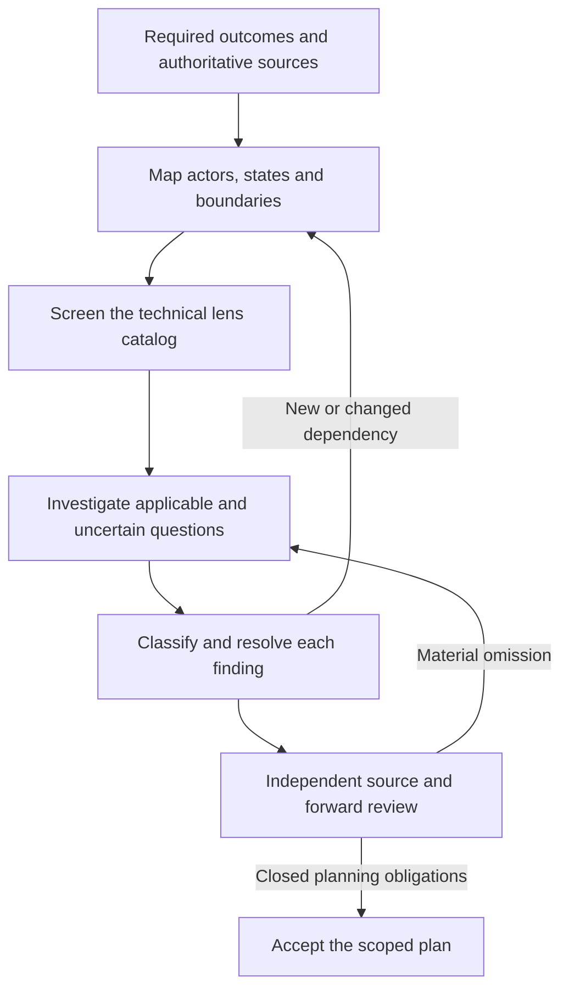

**Backchain technical dependency catalog — September 17, 2026**

Recommendation: pilot a comprehensive technical lens library inside Backchain's existing dependency method. The library broadens what the planner examines; it does not replace CLAIM / NEEDS / SUPPLY / PULL / RESOLVE, add forty-two workflow stages, or require particular technologies. The proposed catalog has **42 core lenses**, cross-lens scenarios, and specialist extensions. It is a research and design artifact; production skill prompts have not been changed by this task.

The desired result is an explainable causal relationship: a particular consumer requires a particular state, contract, artifact, capability, or observation, at a particular lifecycle boundary. Questions about concurrency, UI, schema, system calls, setup, and deployment become precise through the actual implementation, runtime versions, interfaces, and requirements. A complete category list by itself is not evidence of dependency completeness.

**What exists and what should change**

Backchain already has deep claim-based reasoning and distinguishes authored artifacts from applied state. Its generator has five conditional environment probes; its elaborator asks for candidate needs and revisits added suppliers. The missing improvement is a broad, reusable technical interrogation library and an explicit way to account for the applicability and consequences of those questions. [generator.v1.md - Environment probes: current five-category screen](/Users/dadleet/src/backchain/prompts/generator.v1.md:108) [elaborator.v1.md - NEEDS and dual-layer facts: current inference and state distinctions](/Users/dadleet/src/backchain/prompts/elaborator.v1.md:221)

ShipLoop's current working copy already provides a strong starting point: eight recursive-discovery areas, actor/state/interaction analysis, source reconciliation, and test lifecycle guidance. Reuse their concepts and source locators; do not maintain two independent full technical catalogs. Current inspection baseline: Backchain `39fce43`, skill-craft `004447f` plus pre-existing uncommitted ShipLoop work. The latter is candidate content, not a publication claim. [research-loop.md - Coverage and frontier: eight-area discovery screen](/Users/dadleet/src/skill-craft/skills/shiploop/references/research-loop.md:162) [behavioral-requirements.md - Research: forward and backward behavior tracing](/Users/dadleet/src/skill-craft/skills/shiploop/references/behavioral-requirements.md:39)

**Method: breadth, depth, interactions, then closure**

1. Start from every required observable outcome, applicable source clause, negative constraint, conditional obligation, and required verification. Resolve source authority and contradictions. Do not let the candidate plan define the only requirements reviewed.
2. Derive the actors, state owners, artifacts, flows, runtimes, environments, interfaces, and lifecycle transitions involved. Include setup, execution, failure, verification, rollout, and retirement when implicated. Inspect existing code and conventions before choosing a mechanism.
3. Screen all core lenses against that source-derived scope. Record **applicable**, **not applicable with a concrete scope basis**, or **uncertain**. Shared exclusions may be grouped when the same inspected fact supports them. Missing information is uncertain, not irrelevant. A newly discovered consequential actor or boundary receives its own screen.
4. Deepen the applicable and uncertain lenses using the cards below. Instantiate concrete names, versions, data shapes, operations, and failure behavior. Ask what must exist, what must remain true, what can invalidate it, and what would demonstrate the required result. Research a consequential unknown before freezing a decision that depends on it.
5. Check relevant interactions among lenses and material failure scenarios. Use the cross-lens table below. Do not perform an indiscriminate Cartesian product of every lens and every failure. Activation follows an actual requirement, shared state, interface, or observed risk.
6. Resolve findings using existing evidence, a real supplier, a narrowly scoped change to an existing owner, necessary new work, an appropriate non-edge constraint, or an explicit unresolved condition. New suppliers must have their own prerequisites examined.
7. Revisit when a source obligation, supplier, consumer, interface, carrier, lifecycle transition, or relevant failure condition changes. Follow affected upstream and downstream relationships, including shared-contract consumers that were not wired into the original graph. Reuse unchanged evidence; reopen volatile or contradicted facts.
8. Independently compare the resulting plan with the original sources, then simulate execution forward to required observations. Planning succeeds when all in-scope obligations have justified dispositions, required needs have evidenced initial facts or adequate planned suppliers, material unknowns are resolved, and available structural checks pass. A valid incomplete plan is an honest outcome; a budget limit or required external blocker is not success. Actual execution remains separately unverified.

**Classify the relationship before adding an edge**

| Finding type | Representation and test |
| --- | --- |
| Prerequisite or supplied artifact/state | Add an immediate dependency only when the consumer cannot correctly establish its stated result without that specific supplier output. |
| Contract or design decision | Reuse or establish the interface/invariant decision that enables consumers. This may be existing evidence or ordinary scoped work, not a mandatory separate design phase. |
| Ongoing invariant | Put it in the owning behavior and acceptance conditions. A predicate that must remain true throughout an interval is not satisfied forever by an earlier task finishing. |
| Resource conflict or exclusivity | Record the shared resource, ownership, isolation/lock requirement, and release condition for the execution owner. Do not fabricate a causal dependency between otherwise independent deliverables. |
| Verification prerequisite | Give the check its actual target, fixture, identity, and observation inputs. Do not force a production operation to depend on test data it does not consume. |
| Temporal or invalidation condition | Specify the qualifying event, interval, continued conditions, expiry/reset, and revalidation point. |
| Knowledge gap | Inspect existing sources or create necessary bounded research whose result supplies the affected decision. A question is not an assumed fact. |
| External authority or unavailable resource | Preserve the unresolved prerequisite and its real owner. Planning a request does not establish that approval or access will be granted. |

For every material finding, preserve a short trace in existing planning/review notes:

`source or observation → consumer claim → precise need → relationship type → owner and lifecycle scope → supplier/evidence or unresolved reason`.

Also identify its concrete carrier when ambiguous: record key, schema version, operation, artifact digest, target, tenant, configuration revision, cursor, or receipt. Mark evidence **observed**, **required by source**, **planned**, or **unresolved**. A normative spec is evidence of an obligation; it is not evidence that an environment already satisfies it. These are proposed prose conventions, not additions to Backchain's closed plan schema.

Keep three graphs distinct: the product's runtime interaction/state graph, the implementation dependency DAG, and resource conflicts among execution workers. Runtime request/response, subscriptions, and recovery may form cycles. That does not require a circular build plan. Graph-independent steps may still contend for the same database, file, port, deployment target, or quota. [SKILL.md - Health metrics and parallel agents: dependency-only scheduling boundary](/Users/dadleet/src/backchain/skills/backchain/SKILL.md:117)

**Core lens index**

| Family | Lenses |
| --- | --- |
| Intent and engineering foundation | T01 requirements; T02 architecture; T03 repository/integration; T04 toolchain; T05 configuration; T06 setup |
| State and data | T07 state lifecycle; T08 identity; T09 schema/representation; T10 persistence; T11 migration |
| Concurrency and distributed work | T12 concurrency; T13 transactions; T14 replication; T15 messaging; T16 retries; T17 time; T18 caches; T19 durable workflows |
| Calls and system boundaries | T20 API contracts; T21 system/platform calls; T22 connections; T23 external integrations; T24 access control |
| Human interaction | T25 UI journeys; T26 component/design contracts; T27 accessibility; T28 language/locale/domain units |
| Protection and runtime qualities | T29 security; T30 privacy; T31 resilience; T32 performance/capacity/cost; T33 observability |
| Verification and delivery | T34 test oracles; T35 test lifecycle; T36 artifact identity; T37 deployment; T38 rollout; T39 restore; T40 operational ownership |
| Cross-cutting evolution | T41 compatibility/version skew; T42 dependency supply-chain trust |

The following cards are proposed engineering questions. Their examples illustrate possible dependencies, not prescribed technology choices or a required node count.

**T01 — Requirements, scope, authority, and acceptance**

- Trigger: every requested change, including apparently trivial edits.
- Ask: Which original and maintained requirements apply? Which negative and conditional obligations must remain? Which document is authoritative, proposed, or superseded? What observable result establishes each obligation? Is a disagreement unresolved rather than silently chosen?
- Hidden relationship: a feature plan needs the applicable existing contract; a green test for a newly invented behavior does not establish compliance with that contract.
- Inspect: user request, PRD/spec clauses, existing acceptance cases, architecture decisions, product policies, explicit supersession decisions.

**T02 — Architecture, responsibility, and change boundaries**

- Trigger: behavior crosses modules, services, layers, or ownership boundaries, or introduces a reusable capability.
- Ask: Who owns each behavior and state? What existing component should supply it? Which abstractions or extension points are already intended? Does a change require another component's contract to change? What new coupling or failure domain would it introduce?
- Hidden relationship: two features may share an existing validation contract without one feature depending on the other. A genuinely shared supplier should be consumed by both, without serializing their independent implementation.
- Inspect: architecture diagrams/decisions, imports and call sites, ownership conventions, analogous implementations, dependency direction rules.

**T03 — Repository, workspace, generated files, and integration**

- Trigger: code, documentation, configuration, generated bindings, or multiple workers change a repository.
- Ask: Which checkout, base revision, branch, and generated source are authoritative? Which files are shared or tool-owned? What registration/export/build wiring makes the change reachable? What integration checks apply after merging independently correct branches? Which existing user changes must be preserved?
- Hidden relationship: implementing a module does not make it discoverable; an export/registration and integrated revision may be required. Shared file ownership is an execution constraint, not automatically a product prerequisite.
- Inspect: README/AGENTS, Git state, package/build entry points, generation scripts, worktree policy, CI integration route.

**T04 — Toolchain, dependencies, and reproducible build setup**

- Trigger: compilation, packaging, code generation, native extensions, SDK use, or a new runtime/library.
- Ask: Which language/runtime/compiler/SDK versions are actually supported? Are dependencies and generators pinned and available? Are native libraries, platform headers, and build assets present? Do local and CI builds consume equivalent inputs? What existing tooling can be reused?
- Hidden relationship: source code alone cannot supply an executable without its toolchain and generated assets; a developer's global installation is not evidence that CI can reproduce it.
- Inspect: lockfiles, runtime version files, build scripts, generator definitions, container/base images, CI configuration and logs.

**T05 — Configuration, secrets, feature flags, and policy**

- Trigger: environment settings, endpoints, credentials, entitlements, experiments, flags, or kill switches affect behavior.
- Ask: Where is each value defined and validated? Which artifact/config revisions must agree? When do changes propagate or reload? What are missing/default/fallback behaviors? How do identity, tenant, experiment assignment, and policy changes affect an in-flight operation? Can a flag be safely disabled after new-format data is written?
- Hidden relationship: a flag value or secret exists somewhere, but the selected runtime may not receive or be authorized to read it. A code rollback need not restore configuration.
- Inspect: configuration schemas, bindings and role policies, flag evaluations, startup checks, actual non-secret runtime configuration evidence.

**T06 — Setup, bootstrap, infrastructure, and environment lifecycle**

- Trigger: a required environment, account, resource, target, test service, or host capability may not exist or be ready.
- Ask: What creates and owns it? Which identity and permissions are needed? What must exist before bootstrap itself can run? Is setup repeatable and isolated? What differs between local, test, and consumer environments? What cleanup and readiness checks prove the intended instance is usable?
- Hidden relationship: an installed CLI or SDK does not supply an accessible project, registered application, database, permission grant, or populated fixture.
- Inspect: environment inventory, bootstrap/IaC scripts, supported safe probes, resource roles, setup logs, target identity and cleanup contract.

**T07 — State ownership, transitions, and lifetime**

- Trigger: a status, entitlement, workflow phase, local draft, or persisted object changes.
- Ask: What is authoritative versus derived or transient? Which before/after states are legal? What guards each transition? What must persist across page close, process crash, service restart, or device change? What invalidates a previously true state? Which actor owns local/offline intent versus confirmed state?
- Hidden relationship: “submitted,” “accepted,” “committed,” and “displayed” are different states. Completing one does not supply all the others.
- Inspect: transition handlers, state diagrams, persistence boundaries, client storage/offline queues, restart and forbidden-transition cases.

**T08 — Entity, tenant, instance, and revision identity**

- Trigger: lookup, association, authorization, correlation, state reuse, or evidence refers to a particular object.
- Ask: Which exact record or instance is required? How are tenant and resource identities bound? Can identifiers be reused or stale? Which revision/generation must a response match? What prevents a result from a previous account, document, or run updating the current one?
- Hidden relationship: a user table or lookup function is not a matching user record. A success receipt for one tenant or revision cannot supply another consumer's need.
- Inspect: key and scope definitions, lookup predicates, correlation IDs, version checks, representative records, identity-bound test cases.

**T09 — Schema, serialization, representation, and domain constraints**

- Trigger: stored or exchanged data, file formats, validation, computed values, or data-bearing APIs change.
- Ask: Which types, required/null/missing distinctions, encodings, units, ranges, uniqueness, and relationships apply? What is rejected versus coerced? Do producer and consumer agree on serialization and validation? Are arithmetic precision, ordering, overflow, and normalization defined where relevant?
- Hidden relationship: a syntactically valid payload can violate a domain invariant; generated type declarations do not establish runtime validation at an external boundary.
- Inspect: schema definitions, validators, serialization code, constraints, domain examples and independent edge-case oracles.

**T10 — Persistence, queries, indexes, and durability**

- Trigger: data survives an operation or queries must find, sort, aggregate, or update it.
- Ask: Where is the source of truth? Which schema, actual rows, indexes, and access paths are needed? What makes an acknowledgment durable? What read/write volume and storage growth apply? Can a partial file write, failed flush, or interrupted commit leave a misleading success state?
- Hidden relationship: an index migration file does not supply an applied index; a schema does not supply populated data; a successful application call does not always establish the intended persistence boundary.
- Inspect: database/file access code, query plans, applied schema, constraints, actual durability contract, data-shape and crash-recovery checks.

**T11 — Data migration, backfill, import/export, and reconciliation**

- Trigger: existing data must change shape, location, ownership, meaning, or indexing.
- Ask: Which legacy values exist? What order makes old and new readers/writers safe? Is backfill resumable and idempotent? How is completeness and semantic preservation verified? What concurrent writes occur during it? What data changes make rollback impossible?
- Hidden relationship: adding a column does not supply valid historical values. A completed batch job may still miss late-arriving records or overwrite concurrent updates.
- Inspect: migration/backfill logic, applied versions, representative legacy samples, watermarks, reconciliation totals, compatibility and rollback checks.

**T12 — Concurrency, shared resources, locks, and liveness**

- Trigger: threads, processes, users, workers, tests, or agents may overlap on mutable state or scarce resources.
- Ask: What is shared? Which ownership/lock/lease/version rule prevents lost updates and corruption? Are lock order, lease expiry, starvation, deadlock, and cancellation defined? Are resources partitioned or isolated? What releases ownership after failure?
- Hidden relationship: parallel branches may contend for a table, file, port, directory, GPU, deployment target, or quota even when their output dependencies are independent.
- Inspect: synchronization primitives, resource names, isolation boundaries, lock acquisition/release paths, race tests and execution ownership rules.

**T13 — Transactions, atomicity, isolation, and commit boundaries**

- Trigger: multiple reads/writes or side effects must preserve one invariant.
- Ask: What is atomic? Which anomalies does the chosen isolation level permit? Is a check-and-write protected by a constraint or concurrency control? What work repeats after conflict? Can a remote effect happen even if the local transaction rolls back?
- Hidden relationship: checking availability and then decrementing it can violate capacity under concurrent requests unless the invariant is enforced at the actual write boundary.
- Inspect: transaction scope, database constraints/isolation, conflict handling, commit/error paths, concurrency fixtures. PostgreSQL's isolation documentation supplies concrete examples of anomalies and transaction retries; the appropriate mechanism depends on the actual database. [PostgreSQL - Transaction Isolation](https://www.postgresql.org/docs/current/transaction-iso.html)

**T14 — Replication, distributed consistency, and reconciliation**

- Trigger: multiple replicas, regions, services, devices, or projections expose the same logical fact.
- Ask: Which authority decides truth? What consistency/freshness is promised? Can reads lag writes or leaders change? How are partitions, split ownership, divergent writes, and reconciliation handled? Which operations require a stronger boundary than the default read path?
- Hidden relationship: a write acknowledged by one component may not yet supply a fresh read or decision elsewhere. A replica's availability does not establish its freshness.
- Inspect: consistency contracts, replica/read routing, version vectors or revisions where used, reconciliation logic, lag/failover observations and tests.

**T15 — Events, queues, subscriptions, and processing acknowledgment**

- Trigger: messages, jobs, webhooks, polling, streaming, push updates, or subscriptions carry work or state.
- Ask: What delivery and ordering guarantees exist, and at what scope? What distinguishes enqueued, received, processed, and durable effect? How are offsets/acks coordinated with output? What handles duplicates, poison messages, backlog, missed events, and snapshot-to-live handoff?
- Hidden relationship: acknowledging before output persistence can lose work; persisting before acknowledgment can allow duplicate effects. A connected subscription need not contain a current snapshot.
- Inspect: broker/provider guarantees, consumer checkpoint code, dead-letter/replay route, cursor identity, backpressure policy. Kafka documents why coordinating consumed position with an external output requires additional cooperation. [Apache Kafka - Delivery Semantics](https://kafka.apache.org/40/design/design/)

**T16 — Retry, idempotency, cancellation races, and compensation**

- Trigger: operations can time out, be retried, be delivered twice, or span systems with partial success.
- Ask: Which layer owns retry? What logical intent does an idempotency key identify, for how long, and within which tenant? What if the same key carries different input? How is a lost response distinguished from a failed effect? What is retried, reconciled, or compensated, and what cannot be undone?
- Hidden relationship: retrying a non-idempotent mutation after timeout can duplicate a successful first attempt; a client-generated key needs durable server-side semantics.
- Inspect: retry policy, dedupe state, request/result binding, retention, ambiguous-outcome reconciliation and compensation tests. [AWS Builders' Library - Making Retries Safe with Idempotent APIs](https://aws.amazon.com/builders-library/making-retries-safe-with-idempotent-APIs/)

**T17 — Time, deadlines, expiry, scheduling, and transition windows**

- Trigger: TTLs, leases, schedules, grace periods, delayed work, cutovers, or request deadlines matter.
- Ask: Which event starts the clock? Which clock/time zone and precision apply? Must a condition remain continuously true? What resets the interval? What happens on clock skew, daylight-saving changes, delayed execution, expiry, or restart?
- Hidden relationship: a retirement window starts from its qualifying state, not necessarily the deployment timestamp; rollback can invalidate elapsed eligibility.
- Inspect: timestamp sources, timer persistence, scheduling expressions, monotonic versus wall-clock use, boundary tests, restart/reset rules. Backchain already has a useful transition-window rule to retain. [elaborator.v1.md - Transition-bound clocks: qualifying state and invalidation](/Users/dadleet/src/backchain/prompts/elaborator.v1.md:196)

**T18 — Caching, materialized views, search indexes, and freshness**

- Trigger: a consumer uses cached, derived, replicated, precomputed, or indexed data.
- Ask: What key, tenant, authorization context, version, and TTL identify an entry? Who invalidates or rebuilds it? What freshness is required after writes or revocation? Can failures serve stale data? What handles rebuild gaps, stampedes, and derived-format changes?
- Hidden relationship: updating authoritative state does not automatically supply a fresh UI, permission check, search result, or report.
- Inspect: cache keys, validators/headers, invalidation paths, projection checkpoints, freshness indicators and read-after-write checks. HTTP cache reuse and validation have distinct semantics. [RFC 9111 - HTTP Caching](https://datatracker.ietf.org/doc/html/rfc9111)

**T19 — Durable workflows, restart, replay, and cleanup ownership**

- Trigger: work outlives one call, page, process, or worker and may pause, cancel, or resume.
- Ask: What progress and identity survive interruption? Which actions are replay-safe? Who owns outstanding work after disconnect? How are late results and cancellation/completion races resolved? Which resources must be cleaned up, and who can reclaim abandoned ownership?
- Hidden relationship: “started” cannot supply “completed”; replay can repeat external effects unless durable history or idempotency protects them. A screen-independent promise needs a screen-independent owner.
- Inspect: checkpoints/history, task identity, completion import, cancellation and cleanup paths, crash-between-boundaries tests. Temporal provides one concrete durable-history/replay model, not a required implementation. [Temporal - Workflow Execution](https://docs.temporal.io/workflow-execution)

**T20 — API, RPC, command, and error contracts**

- Trigger: one component invokes another through a public boundary.
- Ask: What operation is actually exposed? Which path/method/arguments, serialization, response envelope, errors, pagination, and limits apply? Which status means accepted versus completed? What authentication, cancellation, retry, and version behavior is part of the contract?
- Hidden relationship: an internal exported function or generated client does not prove the public operation is registered and callable with that envelope.
- Inspect: actual boundary registration, versioned API/SDK docs, command help, generated stubs, contract tests and negative cases. OpenAPI describes HTTP operations; HTTP semantics constrain interpretation of methods and responses. [OpenAPI 3.0.4 - Specification](https://spec.openapis.org/oas/v3.0.4.html) [RFC 9110 - HTTP Semantics](https://datatracker.ietf.org/doc/html/rfc9110)

**T21 — Operating-system, browser, device, and platform calls**

- Trigger: filesystem/process APIs, browser capabilities, hardware access, hosted APIs, native libraries, or sandboxed execution.
- Ask: Is the operation supported in the actual version and context? What permissions, user activation, secure-context, sandbox, thread-affinity, handles, or runtime quotas apply? Can a call partially succeed or return short/partial data? What happens when the process is suspended, permission revoked, or a handle/path changes?
- Hidden relationship: an API symbol existing does not supply platform permission, target capability, safe path ownership, or a usable device. A blocking call may be incompatible with the event-loop or execution deadline.
- Inspect: platform specification and system-call contract, wrappers, actual runtime version, safe capability probe, error/cleanup tests. Browser Permissions Policy is one example of a host policy constraining an otherwise available API. [W3C - Permissions Policy](https://www.w3.org/TR/permissions-policy/)

**T22 — Networking, discovery, transport, and connection lifecycle**

- Trigger: components communicate across a network or through persistent connections.
- Ask: What resolves and routes the destination? Which DNS, TLS/certificate, proxy, firewall, CORS, origin, or transport conditions apply? When is a connection ready and authenticated? How are reconnect, heartbeat, buffering, backpressure, stale sessions, and graceful close handled?
- Hidden relationship: a listening process does not supply a reachable or trusted endpoint; a reconnected socket does not automatically supply restored subscription state or current authorization.
- Inspect: network topology, endpoint and certificate configuration, transport/client lifecycle code, handshake and reconnect tests, safe target reachability evidence.

**T23 — External providers, integrations, and callbacks**

- Trigger: a vendor, managed service, remote workspace, callback/webhook, payment/email service, or data feed participates.
- Ask: What exact service/account/region/version is selected? What setup and callback registration exist? How is a callback authenticated and correlated? What do provider acceptance and delivery receipts prove? What happens on delay, duplicate delivery, outage, quota exhaustion, or discontinued behavior?
- Hidden relationship: local success or a provider's delivery acknowledgment does not prove the requested downstream domain state or human observation.
- Inspect: provider's versioned contract, endpoint registration, non-secret target identity, sandbox limitations, signed callback fixtures, reconciliation and end-to-end checks.

**T24 — Authentication, authorization, sessions, and delegation**

- Trigger: an operation depends on a user, workload, role, scope, tenant, entitlement, or delegated identity.
- Ask: Who authenticates whom? Where is authorization enforced for this resource and action? Which issuer/audience/subject/session/tenant binding is validated? What happens on expiry, revocation, refresh, account switch, or delegated callback? Are negative and cross-tenant cases checked at the authority?
- Hidden relationship: a signed-in UI or hidden button does not supply server-side authorization. An old-session response must not be accepted into a new-session state.
- Inspect: actual identity and policy contracts, service enforcement, credential lifecycle, permit/deny tests and role-specific integration paths. [OpenID Connect Core - Token Validation](https://openid.net/specs/openid-connect-core-1_0.html)

**T25 — User journeys, async feedback, and client-state reconciliation**

- Trigger: a human initiates, observes, cancels, retries, or resumes an operation.
- Ask: What are idle/loading/empty/pending/success/error/conflict/offline states? What survives navigation, refresh, or another device? Which state is optimistic versus confirmed? Can a stale response overwrite a newer action? What does the user do after ambiguous success, timeout, or permission denial?
- Hidden relationship: a truthful completion cue depends on a matching authoritative outcome; animation completion and request submission cannot establish that outcome.
- Inspect: journey and state models, local storage/offline queues, response correlation, browser behavior under delay/failure/reconnect, visible recovery paths.

**T26 — Components, visual design, responsiveness, and rendering**

- Trigger: UI layout, controls, design tokens, component variants, assets, or rendering behavior change.
- Ask: Which existing component/design system supplies the needed behavior? What props/events/states and responsive breakpoints are required? Are hydration, rendering timing, fonts/assets, reduced motion, and layout shifts relevant? Which behavior and visual decisions are preserved from prior design? Can shared components change without breaking other consumers?
- Hidden relationship: a screenshot supplies appearance evidence but not a working interaction contract. A component may need an existing primitive, asset, or API decision, while independent page sections can proceed in parallel.
- Inspect: analogous component code, design decisions/tokens, actual supported runtime, visual and behavioral checks at relevant sizes/states.

**T27 — Accessibility and input modalities**

- Trigger: any affected human-facing interaction, validation, navigation, or status message.
- Ask: What semantic name/role/state/value is exposed? Are keyboard, pointer, touch, and assistive-technology paths usable? What happens to focus during navigation, modal open/close, async replacement, and errors? Are changes announced and persistent where needed? Do contrast, zoom/reflow, target size, and motion meet the applicable requirements?
- Hidden relationship: visual state, keyboard behavior, and programmatic state must remain consistent. Adding ARIA alone does not implement keyboard interaction.
- Inspect: semantic markup, focus rules, supported assistive paths, target browser tests, applicable accessibility criteria. [W3C APG - Keyboard Interface](https://www.w3.org/WAI/ARIA/apg/practices/keyboard-interface/) [W3C - WCAG 2.2](https://www.w3.org/TR/WCAG22/)

**T28 — Internationalization, content, units, and numerical semantics**

- Trigger: text, dates, time zones, numbers, currency, measurements, sorting, export/import, or multiple locales are involved.
- Ask: What is stored canonically versus displayed locally? Which encoding, Unicode normalization, pluralization, collation, directionality, units, precision, and rounding apply? Can a localized label or delimiter be mistaken for a stable key? Are assets/content/translations actually available for supported states?
- Hidden relationship: formatting a date does not establish its intended time zone; parsing a localized number can change value. A rendered label is not a durable protocol identifier.
- Inspect: domain examples, locale resources, parsing/formatting code, numeric types, asset licenses where relevant, round-trip and boundary fixtures.

**T29 — Trust boundaries, abuse resistance, and application security**

- Trigger: untrusted input, code/content execution, public or privileged operations, or a changed trust boundary.
- Ask: Which input is trusted, validated, encoded, or executable? Can paths, URLs, serialized objects, templates, or commands escape their intended scope? Which isolation, rate/abuse controls, secret protection, and administrative boundaries apply? Do fallback and error paths weaken the selected security contract?
- Hidden relationship: a validated internal object does not establish validation of public input; a defensive control must be applied at the boundary it is intended to protect.
- Inspect: threat/data-flow model, input/output handling, actual platform security contracts, negative tests and existing review requirements. Secure-development practices should be integrated with the lifecycle rather than left to a final scan. [NIST SP 800-218 - SSDF](https://csrc.nist.gov/pubs/sp/800/218/final)

**T30 — Privacy, data minimization, retention, deletion, and residency**

- Trigger: personal, sensitive, regulated, or user-controlled data is collected, copied, logged, shared, or retained.
- Ask: What data is necessary and under which established policy? Where do copies, logs, caches, backups, analytics, and provider transfers exist? What retention, export, deletion, access, and residency obligations apply? Can a restore or replay resurrect deleted data? Do diagnostics expose more than the product contract permits?
- Hidden relationship: deleting the primary row may not supply deletion across derived stores or later restore. Do not invent regulatory obligations; use applicable accepted policy and qualified decisions.
- Inspect: data inventory/flows, product and privacy requirements, retention configuration, provider contracts, deletion propagation and restoration tests.

**T31 — Failure isolation, graceful degradation, and resilience**

- Trigger: another component can fail or an availability/recovery promise is made.
- Ask: What fails independently and what shares a failure domain? What happens if a dependency is absent at startup or fails during work? Which timeout, circuit, bulkhead, load-shedding, failover, and shutdown behavior is appropriate? Does recovery amplify load or repeat effects? What user-visible behavior is allowed in degraded mode?
- Hidden relationship: adding replicas does not remove a shared dependency or data-plane failure. Retrying without bounds can worsen the failure the retry was meant to handle.
- Inspect: failure-path code, actual dependency topology, response/deadline policies, fault-injection evidence, accepted availability and recovery criteria.

**T32 — Performance, capacity, limits, and operating cost**

- Trigger: workload size, latency, concurrency, data volume, resource limits, or spend can affect the outcome.
- Ask: Which accepted workload and response bounds apply? Where are CPU, memory, connections, storage, bandwidth, API rate, or token limits? How does fan-out multiply demand? What happens near saturation and under failure? Is setup/steady-state/retry cost affordable within the stated budget? What capacity or quota has lead time?
- Hidden relationship: more workers may exhaust database connections or provider limits; a successful tiny fixture does not establish behavior at the required scale.
- Inspect: measured baselines, actual quotas, profiling/load tests, request fan-out, resource policies and cost model. Unknown targets remain decisions to resolve, not invented SLAs.

**T33 — Observability, diagnostics, audit, and operational decisions**

- Trigger: a claim, failure, rollout, support decision, or operational response requires evidence.
- Ask: Which observable symptom matters? What logs, metrics, traces, audit events, and correlation identify the relevant request/build/config/tenant? Are errors actionable without leaking data? Do cardinality, sampling, retention, and telemetry failure hide the event? Who acts on an alert and on what threshold?
- Hidden relationship: a promotion gate cannot consume an undefined or uncollected health signal. A metric that only measures process survival may miss a broken user journey.
- Inspect: instrumentation paths, dashboards, alert routes, release annotations, trace continuity and diagnostic tests. [Google SRE - Monitoring Distributed Systems](https://sre.google/sre-book/monitoring-distributed-systems/)

**T34 — Verification strategy, independent oracles, and coverage**

- Trigger: every required behavior or quality claim that can be checked.
- Ask: Which independent observation discriminates correct from plausible behavior? What unit, contract, integration, browser, remote-runtime, load, or recovery boundary is needed? Does each requirement have an executable or otherwise inspectable check? What failures, omissions, skipped cases, and false-positive controls must remain visible?
- Hidden relationship: tests authored from the same mistaken plan can confirm its omissions. A process exit, screenshot, mock response, or aggregate pass is insufficient for a claim at a different boundary.
- Inspect: source requirements, test selectors/oracles, negative controls, actual execution records and limits of each test surface.

**T35 — Test setup, fixtures, isolation, teardown, and repeatability**

- Trigger: verification consumes mutable state, shared infrastructure, remote access, or expensive setup.
- Ask: What exact records, target versions, identities, clocks, ports, and services are needed? What is reusable read-only infrastructure versus per-case data? What proves noninterference under parallel execution? Who cleans up after assertion failure, timeout, or interruption? Can a focused case run independently and repeatedly?
- Hidden relationship: a seeded user belongs upstream of a login test, not necessarily upstream of production login implementation. Shared setup without isolation can create order-dependent false passes.
- Inspect: fixture lifecycle, namespace/reset policy, remote invocation/retrieval route, cleanup evidence, focused/smoke/full-suite wiring. [repeatable-test-suites.md - Case lifecycle and shared fixtures: independent setup and noninterference](/Users/dadleet/src/skill-craft/skills/shiploop/references/repeatable-test-suites.md:72)

**T36 — Artifact identity, packaging, provenance, and distribution**

- Trigger: a build, package, plugin, image, document, client bundle, or release is consumed elsewhere.
- Ask: Which exact inputs produced the artifact? What identifies its content and configuration? Does the package include all referenced resources? Do signing, installation, discovery, execution, and update paths work? Are validation and distribution receipts for the same artifact?
- Hidden relationship: a skill card can be discoverable while required files are absent; a tested source checkout can differ from the distributed package. A mutable tag is weaker than the actual content identity needed by a gate.
- Inspect: package manifest, artifact contents, build provenance, digests, installation/update tests, consumer-visible version. [SLSA - Provenance](https://slsa.dev/spec/v1.1/provenance)

**T37 — Deployment, registration, routing, and readiness**

- Trigger: code or configuration must become active in a runtime or reach a consumer.
- Ask: What installs, registers, starts, and routes the artifact? What schema/config/secret/network conditions must hold first? Which probe establishes startup, readiness, liveness, and actual feature behavior? What propagation delay or activation step exists? Which target/revision does the receipt identify?
- Hidden relationship: uploaded code is not necessarily active; a healthy process can still lack its required data or public route. Readiness and restart decisions can require different signals.
- Inspect: deployment/registration configuration, runtime identity, activation receipts, routing and consumer smoke checks. Kubernetes distinguishes startup, readiness, and liveness probes; use the corresponding concepts of the actual platform. [Kubernetes - Probes](https://kubernetes.io/docs/concepts/workloads/pods/probes/)

**T38 — Rollout, promotion, cutover, rollback, and retirement**

- Trigger: new and old versions coexist, traffic shifts, a feature is enabled, or a component is removed.
- Ask: What same-candidate observations permit promotion? Is the evaluated population representative? What order makes schema/config/code/client changes safe? Which rollback restores code, configuration, data, and access? What is irreversible? What evidence permits disabling old writers, draining work, or deleting compatibility code?
- Hidden relationship: passing staging deployment alone does not supply smoke evidence; rolling code back may fail against data written by the new version. A zero-traffic canary can appear healthy.
- Inspect: rollout policy, actual target/build/config receipts, observation window, compatibility matrix, drain/retirement criteria and rollback rehearsal. [Google SRE - Canarying Releases](https://sre.google/workbook/canarying-releases/)

**T39 — Backup, restoration, disaster recovery, and consistency of recovery**

- Trigger: durable user state, destructive changes, or recovery objectives exist.
- Ask: What is backed up, how consistently, and at what recovery point? Are keys, metadata, schema, and dependent stores restorable together? Can the recovery identity access them during the failure? Has restore been checked at the required scale and time? How are replay, deletion tombstones, and duplicate effects handled afterward?
- Hidden relationship: a backup file does not supply a usable recovery path; restoration can produce inconsistent stores or resurrect prohibited data without reconciliation.
- Inspect: backup and restore code/configuration, restore rehearsals, observed recovery bounds, key and role availability, integrity and post-restore checks.

**T40 — Operational ownership, documentation, human decisions, and external prerequisites**

- Trigger: another person/team/provider must decide, approve, operate, support, or maintain something needed for success.
- Ask: Who owns the resource, release, incident response, data, and rollback? Which authority is actually required? What instructions and diagnostics enable another operator to act? Which support windows, vendor lead times, contracts, or end-of-life constraints matter? What happens when the owner or authority is unavailable?
- Hidden relationship: writing an approval request or runbook does not establish approval or an authorized operator. A dependency with no reachable owner may leave required recovery or delivery blocked.
- Inspect: applicable ownership and authority records, runbooks, support agreements, documentation checks and observed external decisions.

**T41 — Compatibility, version skew, negotiation, and downgrade behavior**

- Trigger: independently deployed clients/servers, libraries, protocols, schemas, persisted formats, or rolling changes coexist.
- Ask: Which producer/consumer version combinations are supported? What negotiates capabilities? How do unknown fields, enum values, event kinds, and older readers/writers behave? Can a new-format failure wrongly fall back to a legacy path? When may an old format or dependency be retired?
- Hidden relationship: upgrading one endpoint does not upgrade its clients. A correct new parser can still violate security or data invariants through a permissive legacy fallback.
- Inspect: explicit version matrix, compatibility fixtures, protocol/SDK release notes, negotiation/fallback implementation, rollout and deprecation records.

**T42 — Dependency supply chain, trust, updates, and withdrawal**

- Trigger: third-party libraries, packages, images, plugins, generated code, build actions, registries, or binary downloads enter the change.
- Ask: Which exact versions/origins are selected and trusted? What integrity, license, vulnerability, or provenance policy actually applies? Can a build substitute an unreviewed dependency? What transitively affects the result? Can the dependency be updated, revoked, rebuilt, replaced, or unavailable without silently changing behavior?
- Hidden relationship: scanning a lockfile does not establish the integrity of an unpinned build action or base image. A package being installable does not establish a compatible or maintainable integration.
- Inspect: dependency and transitive manifests, hashes/signatures, repository policies, actual build inputs, release advisories and replacement/update route. [NIST SP 800-218 - Secure Development and Software Protection](https://csrc.nist.gov/pubs/sp/800/218/final)

**Cross-lens review: where hidden dependencies often appear**

Activate a row when its conditions exist in the actual system. These scenarios are proposed controls, not claims that the corresponding defect exists in this repository.

| Interaction | Probe and expected dependency consequence |
| --- | --- |
| UI × API × transaction × retry | The mutation commits but its response is lost. Determine how a retry recovers the original outcome without duplicating the effect, and how the UI identifies the confirmed result. |
| UI × identity × cancellation | Switch accounts or documents while a request is in flight. A stale response must not mutate or announce success in the replacement context. |
| UI × accessibility × permission | A capability is denied or revoked. Recovery must remain discoverable, keyboard-usable, and truthfully announced; a transient visual toast may not supply it. |
| Schema × migration × concurrency | A backfill and old writers run together. Establish how new writes are included, conflicts avoided, and completion verified before the new reader relies on the field. |
| Schema × serialization × locale | A localized date, decimal, delimiter, or enum crosses an API/export boundary. Verify canonical meaning and round-trip behavior, not merely syntactic validity. |
| Transaction × event × external effect | The local commit succeeds and dispatch fails, or dispatch succeeds before a local rollback. Determine the durability/reconciliation mechanism needed for the promised outcome. |
| Queue × idempotency × restore | Replay after recovery can redeliver already processed events. Ensure restored dedupe/checkpoint/output state agrees or define reconciliation. |
| Cache × authorization × tenancy | Permissions change while a cached entry remains usable. Check key scope, invalidation, revocation, and permitted staleness at the authority. |
| Subscription × snapshot × version | Updates occur between snapshot retrieval and live subscription. A cursor/reconciliation contract must prevent missing or misordering required changes. |
| Configuration × flag × rollback | A disabled feature leaves persisted new-format data. Determine whether the old code/config can still read and safely act on it. |
| Deployment × artifact × observation | A smoke check is green for a different image/config/target. The promotion prerequisite remains unsatisfied for the candidate being released. |
| Canary × traffic × observability | The candidate appears healthy because no representative request reached it. Require a meaningful exposure or applicable synthetic observation before the gate can claim coverage. |
| Autoscaling × database × quotas | New replicas consume connections or provider quota faster than useful capacity grows. Revisit admission, limits, startup behavior, and degradation. |
| Lease × time × external mutation | A lease expires while a paused worker still holds authority to write. Decide how stale ownership is detected or fenced at the actual resource. |
| Fixture × concurrency × cleanup | Parallel tests use the same account, port, file, or queue. Partition/isolate resources and preserve cleanup responsibility after failure; do not create test-order dependencies. |
| Backup × privacy × replay | Restore reintroduces deleted records or triggers old side effects. Preserve deletion/reconciliation policy and effect identity through recovery. |
| Security × operational recovery | Normal least-privilege access exists, but the restore identity or keys do not. Recovery has a distinct prerequisite that ordinary readiness does not supply. |
| Version skew × fallback × security | A payload identified as new format fails validation. Check whether legacy fallback can incorrectly accept it and bypass new-format rules. |
| Supply chain × build × release | The checked dependency set differs from the image/action used by CI or the artifact promoted. Bind provenance and policy evidence to the actual candidate. |
| Runtime cycle × implementation DAG | A UI sends a command, receives an event, then issues another command. Implement common contracts and independent producers/consumers in an acyclic delivery plan; do not serialize every runtime hop as development work. |

For each consequential transition, select relevant perturbations from: absent prerequisite, invalid input, denied authority, duplicate, concurrent update, reordered event, delay/timeout, disconnect, crash/cancellation, partial commit, stale identity/revision, expired lease, mixed versions, resource exhaustion, cleanup/reuse, deletion, and restore. Trace failures and recovery to the user-visible or durable effect. Do not stop at the first component that returned success.

**Make the questions specific to the actual technology**

The catalog is technology-neutral at discovery, then becomes technology-specific through the selected system's contract. These are illustrative specializations, not suggested dependencies to install.

| Encountered technology | Replace a vague question with a concrete investigation |
| --- | --- |
| Relational database | Replace “is concurrency handled?” with the actual isolation level, transaction boundary, uniqueness/conditional-write mechanism, conflict behavior, and retry scope. |
| Browser client | Replace “does the UI work?” with exact request correlation, local/confirmed state, account-switch behavior, focus/announcement transitions, and the actual browser security context. |
| Filesystem or shell tool | Inspect path ownership, symlink behavior, atomic replacement versus partial writes, working directory, executable/version resolution, exit/error semantics, and interruption cleanup. |
| Hosted scripting platform | Inspect the exposed remote invocation convention, installed versus active deployment identity, authorization scope, execution/quota limits, serialization limits, and remote test route. |
| Queue or stream | Name the actual partition/order scope, acknowledgment/offset semantics, redelivery policy, dedupe persistence, retention, replay, and external-output coordination. |
| Container/platform deployment | Name the artifact digest, rendered config, startup/readiness distinction, rollout parameters, drain/termination behavior, routing, and actual consumer check. |
| Plugin or skill package | Inspect the selected package root, bundled resource paths, host/runtime support, discovery versus activation versus execution, result contract, and update compatibility. |
| External API | Name the selected API/SDK version, operation/response/error contract, tenant/account/region, authentication method, idempotency behavior, rate limits, and callback semantics. |

A technology profile should come from repository evidence, accepted decisions, actual dependencies, and selected-version primary documentation. If an important technology is unrecognized, add a task-specific question card from its contract; the fixed catalog is a starting inventory, not a reason to ignore unfamiliar systems. A search hit or package name is only a lead until its applicability is established.

**Specialist extensions**

Activate these from a source obligation or encountered technology. They deepen the core lenses and may reveal missing core questions; they do not add mandatory platforms.

| Domain | Additional considerations to investigate |
| --- | --- |
| Mobile, offline, and device software | Background execution restrictions, app-store/install/upgrade lifecycle, device permissions, battery/network constraints, local encryption, offline queue reconciliation, and supported OS/device versions. |
| Real-time, embedded, or physical systems | Deadline and scheduling guarantees, interrupts, device ownership, sensor validity/calibration, safe physical states, watchdogs, clock drift, firmware/hardware compatibility, and recovery constraints. |
| AI/ML, retrieval, and tool-using agents | Model/prompt/data/index versions, context and token limits, nondeterministic outputs, evaluation oracles, data/feedback drift, untrusted retrieved instructions, tool-effect authority, output validation, provider limits, and fallback quality. |
| Payments, ledgers, reservations, or regulated workflows | Domain invariants, units/precision, reconciliation, duplicate effects, irreversible external operations, audit records, retention, and actual applicable expert-approved rules. Do not infer an entire compliance regime from a keyword. |
| Analytics, ETL, and scientific computation | Data lineage, completeness/watermarks, late events, schema drift, reproducibility, sampling/bias, precision/error bounds, numerical stability, checkpointing, and recomputation cost. |
| Libraries, SDKs, compilers, and generators | Source/binary/API compatibility, language/runtime matrix, ABI/FFI behavior, generated-file ownership, determinism, package exports, extension points, and downstream consumer tests. |
| Infrastructure/control-plane products | Reconciliation/idempotency, drift detection, eventual convergence, controller leadership, deletion/finalizers, bootstrap dependencies, admission policy, and safe partial failure. |
| Media, publishing, and notifications | Asset/codec/font compatibility, rendering fidelity, upload/transcoding limits, content availability and rights where relevant, delivery versus display acknowledgment, channel preferences, and accessibility alternatives. |

**Worked example: a shared reservation interface**

This is a hypothetical illustration, not an observed product implementation. Suppose the accepted requirement says: “Two signed-in users can reserve the final available slot; capacity is never exceeded, retry after an interrupted response creates no duplicate reservation, and the interface reports the confirmed result.” Assume the existing architecture uses a browser, HTTP service, and relational database. That assumption would need inspection in a real task.

1. T01/T07/T08 establish the actual outcome and its identity: a committed reservation for a specific user, resource, and logical request. A visual pending state is different from a confirmed reservation.
2. T09/T12/T13 expose the shared-capacity invariant. The service needs an appropriate atomic write/constraint/concurrency mechanism, rather than an unprotected read-then-write. Choose among existing supported mechanisms from the actual database contract; the checklist does not mandate a particular isolation level.
3. T16/T19 expose the interrupted-response case. The same logical request needs a durable outcome-binding/deduplication or equivalent mechanism. That supplier itself requires schema/storage, transaction behavior, retention, and recovery decisions, so Backchain reopens those prerequisites.
4. T20/T24/T25 establish the public operation, authorized principal/resource binding, and response-correlation rules. The UI may show pending work and retry, but “confirmed” consumes the matching committed outcome. A stale response cannot overwrite another account's state. T27 supplies the corresponding focus/status behavior.
5. T34/T35 add verification needs: an isolated applied schema, a representative final-slot fixture, concurrent callers, and a fault case that loses a successful response. These supply the tests, not the product's runtime lookup. The oracle checks one successful capacity allocation and no duplicate effect for a repeated intent.
6. T37/T38/T41 ask whether the target has the applied schema and compatible code/config, and whether older clients can coexist during rollout. A promotion gate consumes the relevant candidate's actual observation, not a generic CI success.

The resulting work is a branch-and-join plan: an agreed operation/invariant contract can enable UI and service work in parallel; environment preparation can proceed separately; integration checks consume the compatible pieces and fixture. A source-linked discovery of a retry requirement creates real storage/transaction/test needs. Merely labeling all work “reservation” creates no dependency by itself.

An existing Backchain fixture demonstrates the simpler deployment version of this reasoning: input requires passing smoke for a production build; the initial graph supplies only staging deployment; the closed fixture adds a smoke-result producer between staging and production. The output is a graph with the missing evidence dependency, not proof that smoke has run. [prod-deploy-hidden-precond.draft.json - Goal and staging producer: missing evidence layer](/Users/dadleet/src/backchain/fixtures/prod-deploy-hidden-precond.draft.json:2) [closed.json - D1 and S3: repaired supplier relationship](/Users/dadleet/src/backchain/test/fixtures/prompt-holes/implicit-staging-smoke/closed.json:27)

**How Backchain and ShipLoop would use the catalog**

For Backchain, keep the canonical library in its own portable package, proposed as `skills/backchain/references/technical-lenses.md` with a small index and a few focused detail references if needed. Keep the long research catalog out of every model call. Do not change Layer 0/1/2 numbering or add a new planner runtime.

- Before drafting: perform the source-derived breadth screen and record applicable/uncertain areas. Preserve its source and decision locators.
- During NEEDS: deepen the selected technical questions for each claim and its required verification. Do not use “2–6 candidates” as a completeness ceiling or create work to meet a numeric target.
- During SUPPLY/PULL: inspect concrete provider/consumer contracts across the relevant graph, including shared and currently unwired consumers. Challenge state, identity, version, and layer mismatches.
- During RESOLVE: use the relationship classification above. Add true supplier edges, keep invariants and resource constraints in the right contract, and retain unresolved dependencies honestly.
- During review: independently recheck source coverage, new boundaries, cross-lens findings, and forward execution. A capped list of high-priority clarification questions must not erase the remaining material questions.

The current elaborator's suggested candidate range and the dependency-review prompt's eight-question limit are planning aids, not exhaustive coverage rules. A future prompt revision should make that distinction explicit and retain unresolved material questions in existing review/context notes. [elaborator.v1.md - NEEDS: candidate-count guidance](/Users/dadleet/src/backchain/prompts/elaborator.v1.md:221) [dependency-review.prompt.md - Task: current question cap](/Users/dadleet/src/backchain/prompts/dependency-review.prompt.md:16)

For ShipLoop's proposed native calls, pass the original requirement/source locators, actual technology/environment profile, relevant lens decisions and findings, candidate identity, and edit boundaries. Reopen source material through those locators after context loss. At initial planning, cover the whole requested outcome; at step planning, deepen the affected work and dependencies; at carry-forward, reconsider changed contracts and newly discovered branches. Reuse existing `evidence_refs`, plan notes, acceptance cases, and work-item `context` rather than introducing another editable technical inventory or plan.

The current active owner controls helper use. Before a producer callback, the stage worker may call Backchain within scope. During Improve, only its authorized executor may use Backchain as a reasoning helper while ShipLoop remains parked. Out-of-scope or frozen changes follow the existing recovery route. This extends the earlier call proposal. [backchain-shiploop-call-design-2026-09-17.md - Call contract and ownership: proposed integration](/Users/dadleet/src/skill-craft/docs/backchain-shiploop-call-design-2026-09-17.md:76)

**Evidence-informed design choices**

CMU SEI's quality-attribute approach supports analyzing architectural properties and their interactions through concrete scenarios. Here, each applicable lens should identify the initiating actor/event, operating conditions, affected part, required response, and observable criterion. That produces a testable condition rather than a label such as “concurrency considered.” [CMU SEI - Reasoning About Software Quality Attributes](https://www.sei.cmu.edu/library/reasoning-about-software-quality-attributes/)

Google's launch process provides a useful broad review precedent, including architecture, integration, capacity, failures, and external dependencies. Its contrary lesson matters too: an unbounded checklist becomes burdensome; questions should be practical, justified, and adapted to the product. Our recommendation is exhaustive breadth against the applicable sources, then selective technical depth and explicit exclusions—not every possible architecture pattern in every plan. [Google SRE - Reliable Product Launches at Scale](https://sre.google/sre-book/reliable-product-launches/)

The technology documents cited in the cards support particular distinctions, not the effectiveness of this whole Backchain catalog. No finite catalog guarantees that all future technical concerns are known. The explicit uncertainty route, specialist extensions, source review, and changed-boundary revisit are required to catch gaps outside the catalog.

**Pilot and acceptance criteria**

Compare the existing prompts with the catalog-assisted method on the same original requests, source bundles, and candidate plans. Use independent, source-owned defect oracles and held-out variants; repeat model runs to expose variance. Include at least these controls:

| Fixture family | Required behavior |
| --- | --- |
| Source clause missing from draft and declared goals | Detect the omitted obligation from the source. |
| Two-hop prerequisite and shared supplier | Discover the deeper prerequisite and reuse a genuine shared owner without adding a global barrier. |
| False but plausible sibling edge | Identify unnecessary ordering; permit repair only within provisional edit authority. |
| Runtime event feedback loop | Preserve correct runtime behavior while producing an acyclic implementation plan. |
| Concurrent final-slot reservation | Identify the actual invariant-enforcing write boundary and discriminating concurrency test. |
| Successful mutation with lost response | Identify logical request identity and ambiguous-outcome recovery without duplicate effects. |
| Old writer during backfill/cutover | Require coexistence and verified completion before relying on new-only state. |
| Cross-tenant cached or late UI response | Identify authorization/freshness/correlation guards at the correct boundary. |
| Setup or provider capability unavailable | Retain the real prerequisite and uncertainty; do not assume readiness or silently add a new integration. |
| Correct code, wrong config/build/target receipt | Reject the evidence mismatch. |
| Remote check replaced by local mock | Preserve the missing verification boundary. |
| Parallel test fixture collision or failed cleanup | Identify isolation/ownership and repeatability requirements. |
| No-traffic canary or restore without usable keys | Identify the missing observation or recovery prerequisite. |
| Simple local/stateless change | Explain irrelevant families, preserve a small plan, and avoid inventing a database, service, queue, or deployment. |
| Unknown technology or later source change | Open an appropriate research question and revisit affected consumers without discarding accepted historical receipts. |

Score missed requirements/prerequisites, false dependencies, unsupported facts, incorrect evidence layers, preservation of parallel work, correct non-edge classification, actionable unresolved findings, review recurrence, and tokens/time. A larger graph, more questions, or a longer catalog is not a quality score. Adopt only if the method improves material dependency coverage without regressions on false-edge, clean-plan, and authority/frozen-boundary controls. No live model efficacy experiment was run while preparing this catalog.

Implementation should begin with prompt/reference integration and these fixtures. Preserve package parity and the required Backchain local-change gate when production files are later changed. There is no demonstrated need for a new schema, registry service, MCP integration, or loop controller to pilot this reasoning method.

**Unsubstantiated conditions and experiments before dependent work**

Every lens should ask both whether the consumer actually needs the proposed condition and what supports that condition. An unjustified ordering edge is a graph-quality finding; repairing it requires provisional edit authority, not an experiment that merely confirms some adjacent behavior. For a genuine prerequisite, distinguish these diagnoses in review notes:

| Diagnosis | Appropriate next work |
| --- | --- |
| Existing evidence has not been inspected | Read the applicable spec, contract, implementation, or current receipt; establish exactly what it supports. |
| A known condition needs to be created | Schedule the ordinary implementation, setup, migration, or verification supplier. |
| Feasibility or behavior is empirically uncertain | Schedule a bounded, discriminating experiment before the first decision or action that relies on its result. |
| Evidence requires unavailable access or external authority | Keep an explicit unresolved dependency with its owner and resumption condition. |

A spec may establish the required condition without establishing that the selected technology or environment satisfies it. Test only consequential uncertainty that existing applicable evidence cannot settle. This extends Backchain's existing evidence-or-supplier rule; it does not replace the four-way resolution or introduce new plan-schema enums. [elaborator.v1.md - Four-way need resolution: evidence, a real supplier, or unresolved](/Users/dadleet/src/backchain/prompts/elaborator.v1.md:81)

The proposed experiment contract belongs in existing research/review notes: exact hypothesis and affected consumers; inspected evidence and remaining gap; actual versions/configuration/target; smallest representative setup and its prerequisites; observations and acceptance criterion fixed before running; controls or repetitions appropriate to the claim; limits, allowed effects and cleanup; result locator and fidelity; and how each outcome changes the plan. Reuse a sufficient applicable receipt instead of repeating a test on every review. Changed versions, configuration, workload, or contrary evidence can invalidate that reuse.

An experiment produces observations and a decision report. It does **not** promise a positive result. A valid supporting result can substantiate only the scoped condition it actually tested. A valid negative result triggers redesign or rejection of that route; an inconclusive result leaves the condition open. Wrong-target, broken-control, or otherwise invalid evidence cannot support either conclusion. Execution or cleanup problems are recorded separately; missing authority or unexpected effects stop that experiment path. Completing the research activity and satisfying its dependent condition are separate judgments. Never repeat until a favorable result appears or relax the criterion after seeing results.

When feasibility determines architecture, investigate before accepting the dependent architecture. When the experiment requires later build/setup work, include those prerequisites and defer the affected decision until the result is reviewed. In a static DAG, preserve the uncertain downstream condition in assessment/unresolved notes and replan on the actual result; do not invent conditional-edge fields or make every possible alternative mandatory. Only consumers of the uncertain condition need that ordering; this creates no global gate or permission to bypass the active workflow stage.

Hypothetical example: a hosted API client assumes an interrupted successful write can be retried without duplicating the effect. If applicable contracts leave that uncertain, a disposable experiment submits one logical request, loses the response after commit, retries with the same identity, and observes durable effects and returned outcomes. A valid result showing one effect supports that narrow retry strategy; duplicate effects require another design; inability to induce or observe the ambiguous outcome leaves the claim unresolved. A local mock alone cannot establish the provider's behavior. The experiment also needs its own fixture, isolation, observation, and cleanup prerequisites. Final integration and delivery verification remain necessary.

ShipLoop already specifies hypothesis-driven bounded experiments, outcome fidelity, and research producers whose scheduling is not verification. Backchain should identify the condition, affected consumers, and required experiment; ShipLoop's current research/Improve route should execute and review it, then return evidence to scoped Backchain revision. [research-loop.md - Bounded experiments: predeclared observations and plan consequences](/Users/dadleet/src/skill-craft/skills/shiploop/references/research-loop.md:329) [research-loop.md - Outcome fidelity: local evidence cannot establish deployed behavior](/Users/dadleet/src/skill-craft/skills/shiploop/references/research-loop.md:371) [research-loop.md - Research producers: scheduled is not verified](/Users/dadleet/src/skill-craft/skills/shiploop/references/research-loop.md:665)

Microsoft's architecture guidance likewise recommends working proofs of concept for critical assumptions before finalizing a design. That supports this targeted practice, not the efficacy of the proposed Backchain prompts. [Microsoft Azure Well-Architected - Critical assumptions: validate high-risk components with working code](https://learn.microsoft.com/en-us/azure/well-architected/architect-role/fundamentals)

Add evaluation controls for a supporting result, a counterexample, an inconclusive result, invalid/wrong-target evidence, an experiment needing earlier setup, an already sufficient receipt, and a false dependency. Require truthful result-dependent replanning, no premature consumer readiness, and preserved independent work. This remains a design addition; production prompts and runtime behavior have not been changed.
