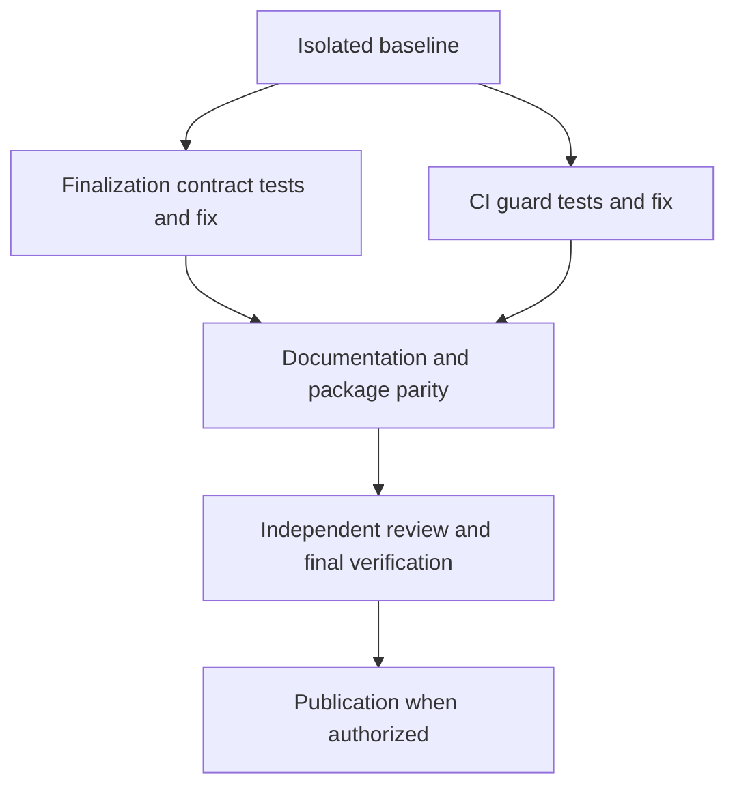

# CI and final-candidate verification plan

Status: implemented and verified locally on `codex/ci-final-verification-20260914`. Publication, integration, installation, and repository-setting changes remain deferred.

Prepared: 2026-09-14. Inspected published baseline: `83a736e7f2515f09969c2a8410908ecbecd53bf3`.

## Outcome and scope

Close two verified gaps without adding a runtime, host dependency, or another improvement loop:

1. Review Coverage's instructions must not declare delivery success using test evidence from before its final trivial edits.
2. Both CI matrix checkouts must reject tracked changes left by their tests, including after a suite or parity failure.

Branch protection is a separate decision, not a prerequisite for either fix. Preserve the existing core/ShipLoop split, one aggregate action walk, optional external integrations, and read-only CI permissions.



The two work slices can proceed independently after scope isolation. Their shared documentation and publication steps follow both. For example, a final trivial edit creates candidate B after tests passed on candidate A: Review Coverage must obtain verification for B before reporting delivery success. A failure leaves delivery incomplete; it does not count as another review iteration.

## Evidence and boundaries

The following gap descriptions are observations at the inspected baseline,
not claims that the repaired current files retain those defects.

- [SKILL.md - Wrap-up trivials: immediate success after cleanup](../skills/review-coverage/SKILL.md#phase-b--post-implement-residual-agent-runs-the-campaign) and the full/short references permit final edits after the second clean test without explicitly requiring retesting.
- [review-policy.md - Interrupted work and final inventory: refresh checks after cleanup](../skills/improve/references/review-policy.md#interrupted-work-and-final-inventory) already supplies the desired principle. Align with it; do not import a second execution engine.
- [review-coverage - goal_body: reference-owned instruction generation](../skills/review-coverage/scripts/review-coverage) prints policy; it does not execute or attest campaign finalization. Static and packet tests prove the instruction contract, not that every model will obey it.
- [ci.yml - checks: separate matrix checkouts and core-only mutation check](../.github/workflows/ci.yml) is the CI change target. The aggregate job cannot inspect files in the two completed checkouts.
- [test-groups.test.py - test_ci_preserves_a_fail_closed_aggregate_check: current regression coverage](../test/test-groups.test.py) covers aggregate results but does not require a separate mutation check in each group.
- The shared main checkout is behind the published baseline and contains unpublished marketplace work. Do not reset, clean, automatically stash, or broadly stage that checkout.
- GitHub's [required-check guidance](https://docs.github.com/en/pull-requests/how-tos/merge-and-close-pull-requests/troubleshooting-required-status-checks) distinguishes current-SHA evidence and explains why dependent gates need `always()`.

## Phase 0 — Safe baseline and definitions of ready

- Refresh remote refs and inspect the latest seven complete commit messages before implementation. Record the actual base SHA, selected paths, and existing test evidence; do not assume this document's baseline is still latest.
- Resolve any changes to the target files since the inspected baseline. Build in a new isolated worktree from the chosen published base. Preserve all shared-tree edits and coordinate overlap with the marketplace owner.
- Run the narrow existing tests before changing them. Confirm whether any baseline failure is relevant rather than weakening assertions to hide it.
- Ready when scope ownership is clear, the implementation worktree is isolated, and baseline results are recorded.

## Phase 1A — Finalization contract repair

### Test first

Extend `test/review-coverage.test.sh` using its existing fixture style. Demonstrate that the current instructions fail the new finalization requirements before editing policy.

Cover the skill card, full and short templates, success/exit tables, generated `goal-body`, and `run-card`. Merely finding a new paragraph is insufficient if another surface still says to exit immediately.

### Intended behavior

| Situation | Required outcome |
|---|---|
| Two consecutive clean reviews; no deferred edits; candidate unchanged | Reuse valid current second-review evidence; no ceremonial retest or extra review |
| Final trivial edits change the candidate | Land the scoped cleanup, execute the plan's test command against that candidate, record evidence, then report delivery success |
| Test command is explicitly N/A | Record a concrete current manual verification method and result; never call N/A an automated PASS; halt if adequate verification is unavailable |
| Verification fails, is missing, is stale, or is interrupted | No delivery success; retain the evidence and report finalization incomplete/HALT |
| Resume after cleanup was committed but verification was interrupted | Reconcile the existing commit and evidence; perform only missing work, without duplicate cleanup commits |
| Repair requires material changes | Do not classify them as trivial or preserve the old streak for the changed work; use the existing operator-authorized campaign reopen path, otherwise halt |

Keep the terminal review ledger history intact: review convergence and successful final delivery are distinct. Do not silently reopen a completed campaign or invent new machine-state enums. Record finalization details in an ordinary Markdown subsection of the existing campaign ledger, and ensure finalization instructions read it on resume.

The record identifies the tested candidate commit, verification command or manual method, exit/result, and log reference. A later bookkeeping-only receipt commit may reference the tested candidate; it must not pretend to have tested a new code revision. Any subsequent in-scope product/policy/configuration change invalidates affected evidence.

### Files and acceptance

- Edit `skills/review-coverage/SKILL.md`, `references/review_coverage.md`, and `references/review_coverage.short.md`.
- Update all premature success exits, including the full reference's printer trailer. Keep the static convergence sentence unchanged unless testing proves that impossible; final delivery requirements belong in its binding trailer.
- Keep the CLI a reference-driven printer. Change `scripts/review-coverage` only if an actual rendering defect is demonstrated; do not duplicate policy there.
- Bump the skill's patch version from the latest baseline and update the version assertion. Regenerate, never hand-edit, `plugins/review-coverage/`.
- Done when every emitted instruction surface has the same final-candidate requirement and no contradictory early-success route remains.

## Phase 1B — Per-checkout CI mutation protection

### Minimal workflow change

In `.github/workflows/ci.yml`, keep parity core-only and make tracked-file verification a separate post-suite step for both matrix groups:

```diff
-      - name: Plugin views in sync and tracked checkout unchanged
+      - name: Plugin views in sync
         if: ${{ always() && matrix.group == 'core' }}
         run: |
           bash scripts/sync-plugin-views.sh --check
-          git diff --exit-code HEAD
+      - name: Tracked checkout unchanged
+        if: ${{ always() }}
+        run: |
+          git diff --exit-code
+          git diff --cached --exit-code
```

The two comparisons distinguish working-tree and staged changes, including a staged edit masked by restoring only the working file. Keep the existing fail-closed `hermetic` aggregate and `fail-fast: false`. This is a post-test dirty-tree guard, not an adversarial sandbox or proof against tests deliberately committing their own changes.

### Test first and expected outcomes

Extend `test/test-groups.test.py` without adding a YAML dependency or a workflow emulator. Assert the guard's step scope, its position after the suite/parity checks, `always()`, and absence of a core-only condition. Extract the actual guard commands and run them with CI-equivalent shell failure semantics in disposable Git fixtures:

| Fixture | Expected result |
|---|---|
| Clean tracked worktree and index | PASS |
| Unstaged tracked modification | FAIL |
| Staged tracked modification or staged new file | FAIL |
| Staged edit with working file restored to original bytes | FAIL |
| Prior suite or parity failure | Guard remains scheduled; the original failure still makes the matrix job and aggregate fail |
| Failure, cancellation, skipped group, or missing aggregate result | Existing aggregate must not pass |

Local fixture tests prove the Git command behavior and workflow contract, not GitHub's whole scheduler. Validate actual scheduling through the eventual candidate CI run; add no deliberately broken commit to main for this purpose. Untracked/ignored-file policy, history mutation, host matrices, and external integrations remain out of scope.

## Phase 2 — Documentation and package verification

- Update `test/README.md`: both jobs now check tracked mutation; distinguish that from full sandboxing. Replace the deferred retest-gap note only when Phase 1A is verified.
- Update the existing CI paragraph in `docs/ARCHITECTURE.md` and Review Coverage documentation where required. Avoid rewriting unrelated distribution content.
- Record this plan's eventual completion and evidence in this document; do not create another overlapping backlog.
- Regenerate the Review Coverage plugin with `bash scripts/sync-plugin-views.sh review-coverage`, then run `--check review-coverage` and the repository-wide parity check from the isolated candidate.

## Phase 3 — Independent review and final evidence

Run from the isolated candidate root:

```sh
python3 test/test-groups.test.py
bash test/review-coverage.test.sh
bash scripts/sync-plugin-views.sh --check
git diff --check
bash test/run-all.sh
```

Use a disposable HOME for the hermetic aggregate as in the previous publication. Keep logs outside the checkout and capture the real exit code with pipefail when piping output. No Hermes, credentials, live weather project, or new pip/npm dependency is required.

Review the scoped change using the last seven commit messages, planned intent, affected tests, and the generated consumer packets. Continue improvement until two distinct consecutive reviews leave only trivial findings; apply remaining trivials and refresh affected checks afterward. A test run is not another review pass. Do not use the old unsafe Review Coverage wrap-up path to certify its own replacement.

Include a fresh-context teach-back of emitted instructions for unchanged candidate, changed candidate, failed verification, N/A/manual verification, and interrupted finalization. Report that as interpretation evidence, not a universal model-compliance guarantee. Preserve failure evidence rather than rewriting it as success.

Done when the final scoped candidate has passing applicable checks, package parity, current finalization evidence, and an independent review with no unresolved material findings. No success claim may rely on a pre-cleanup test result for changed candidate bytes.

## Phase 4 — Publication, only when authorized

- Prefer two logical implementation commits: finalization policy/tests/package; CI guard/tests/docs. Keep verbose key learnings and scoped file lists. Do not stage unrelated marketplace or research changes.
- Revalidate after any integration/rebase change. Preserve the shared dirty checkout; do not advance or overwrite it implicitly.
- Publish through the chosen authorized Git workflow. Verify the remote SHA and the core, ShipLoop, and aggregate CI results for that exact revision before calling publication fully verified.
- If a published regression appears, revert the scoped commit through the normal workflow; never reset shared main or force-push as a cleanup step.

## Separate decision — Enforcement on main

Disposition: defer configuration until the user chooses it. At the previous audit, classic branch protection was absent and applicable rulesets were empty; recheck before acting.

If enabled, require the existing `hermetic` status from GitHub Actions for the candidate revision. First verify it has completed successfully, decide the direct-push/PR workflow and any narrowly defined bypass, then configure and read back the rule. Preserve optional external integrations outside the required gate. Test pending/failing checks on a disposable PR, not by merging broken changes. Keep an explicit rollback of only the newly added rule.

The two repository fixes above do not depend on this decision. No required reviewers, merge queue, branch restrictions, action pinning, dependency bot, or scheduled job is implicitly included.

## Planning record

Backchain native dependency review separated the shared baseline from the two parallel fixes and their final verification obligations. Evidence-first review kept branch-policy changes optional. Independent review identified the N/A/manual-verification branch and the need to preserve completed campaign history. This is a human-readable native plan, not a structurally packaged scheduler handoff.

## Implementation audit

Audit at baseline `83a736e`: one HIGH behavioral-contract finding, with four affected surfaces: skill card, full reference, short reference, and reference-rendered goal/run card. There are no new phase IDs, runtime bindings, or host dependencies to migrate.

**Q1 — Does review convergence establish final delivery after cleanup?** Priority/information-gain heuristic: 0.9, because the answer determines every success route. No: the baseline card's Phase B step 7 and full reference's Success paragraph permit cleanup after the second clean test. Improve's final-inventory policy requires refreshed checks after changed cleanup. The approved repair separates convergence from final delivery, retaining the existing driver.

**Q2 — What does N/A mean?** Priority/information-gain heuristic: 0.7. The baseline full template explicitly permits a Test command of N/A; preserving that contract requires concrete manual verification, not invented automated PASS evidence.

Remediation: test first, repair all success surfaces together, preserve reference-owned rendering, regenerate the package, and independently test consumer interpretation. The unchanged helper CLI cannot prove actual campaign execution; no such claim will be made.

Evidence directory for this implementation: `/tmp/ci-final-verification-evidence.p1bXPz`. Baseline Review Coverage passed 113 assertions with an empty HOME (`review-coverage-baseline.log`). Subsequent evidence is recorded below only after it is observed.

Independent implementation review caught a receipt-ordering ambiguity: recording
verification may itself create a later bookkeeping commit. The instruction
repair explicitly retains the tested product/policy/configuration candidate SHA
and permits a receipt-only commit without pretending the new HEAD was tested.
Any subsequent in-scope implementation change still invalidates affected proof.
The N/A branch also needs the same manual-evidence alternative during the second
review, not just during finalization.

Concurrent documentation publication advanced `origin/main` to
`05d59f6644e68b81d2ec72b4d14177c172ddfc37` while this isolated implementation was
running. Its four documentation changes were inspected and are not incorporated
here. Later authorized integration must preserve that commit and revalidate;
this work does not push or overwrite shared main.

## Completion record — 2026-09-14

Both approved fixes are implemented. Review Coverage 0.2.5 now separates review
convergence from current-candidate delivery verification, including manual N/A
verification, interrupted finalization, and receipt-only commits. Its generated
plugin matches the source; the helper CLI remains an unchanged reference-owned
printer. CI now checks both the working tree and index in each matrix checkout
after the suite. No new runtime, mandatory Hermes dependency, or integration was
introduced.

### Local commits and producing candidate

| Commit | Scoped result |
|---|---|
| `c91cd25440aa007018652c08cfea920927625262` | Both matrix checkout guards, executable Git fixtures, and CI documentation |
| `18dd0388d1979279b93071c980e51e0a914d901c` | Finalization contract, tests, generated package, and approved plan |
| `b6025a137c99a232846a47445a56176a9d0b7fcc` | Review-found N/A readiness and Finalization-only recovery corrections |

The complete hermetic aggregate ran against **`b6025a137c99a232846a47445a56176a9d0b7fcc`**
with a clean tracked worktree and index throughout. This completion section is
bookkeeping only: its later commit records that tested candidate, not a claim
that the full aggregate ran against the receipt commit. No CI, test, product,
policy, package, or configuration bytes changed after that producing revision.

### Verification receipt

Environment: macOS 26.6.2, Python 3.14.7, Node 25.9.0. The exact aggregate command
used a newly created disposable HOME and disabled Python bytecode writes:

```sh
task_final_home=$(mktemp -d /tmp/ci-final-frozen-home.XXXXXX)
env HOME="$task_final_home" PYTHONDONTWRITEBYTECODE=1 \
  bash test/run-all.sh \
  > /tmp/ci-final-verification-evidence.p1bXPz/full-hermetic-frozen.log 2>&1
```

Observed exit: **0**. All **19 catalog entrypoints** passed, including **51
ShipLoop suites / 510 test methods** and all **13 action-walk methods**.
Review Coverage passed **132 assertions**; the CI contract/fixture suite passed
**10 tests**. These are actual local execution results, not a simulated workflow
or the results of the published baseline.

Full-log SHA-256:
`18742fe1b39b9fac5d48b100316c59d8ea842321f5c5c613386b895499855f3e`.
The local raw log remains in the temporary evidence directory above; this
committed receipt preserves its identity and observed results, not a promise
that temporary logs are published or retained indefinitely.

Final receipt checks cover Review Coverage, CI fixtures, shell syntax, scoped
Ruff `F,E9`, native frontmatter validation, all 18 plugin views, whitespace, and
local Markdown destinations. The receipt-only diff is checked separately from
the unchanged tested product. Their output is retained as
`review-3-final-checks.log` in the same evidence directory.

### Improvement and interpretation evidence

The installed Improve skill and its bound Until adapter drove this implementation's
review sequence. This did not add a competing engine to ShipLoop. Every distinct
review read seven complete Git commit messages and considered the scoped diff,
consumer packets, tests, and prior learnings before its plan/apply/check record.

| Review | Finding and action | Clean streak |
|---|---|---|
| 1, root | Material readiness/recovery contradictions; added a failing regression and fixed them in `b6025a1` | 0 → 0 |
| 2, independent plus root adjudication | No supported material finding; no changes; completed after the frozen full suite passed | 0 → 1 |
| 3, root | No additional behavior change needed; reconcile evidence and make only this completion receipt, with affected checks | 1 → 2 |

Initial implementation, test retries, and the full-suite run do not count as
review passes. No empty review commits were manufactured. The independent
reviewer withdrew a proposed mandatory Git-landing rule for Finalization:
ordinary on-disk Markdown already survives a context reset, and no authorized
operation demonstrated the claimed loss. A stronger persistence policy was not
added without evidence.

A reader without parent conversation history interpreted actual emitted goal
and run packets for unchanged, changed, failed, manual, interrupted, receipt-only,
and mixed receipt/policy-change scenarios. It selected current verification,
honest HALT/manual outcomes, and nonduplicating recovery as intended. The first
manual fixture incorrectly paired an N/A scenario with an automated-command
packet; the reader detected the mismatch. A genuine N/A packet was then emitted
and correctly interpreted. This is limited interpretation evidence, not actual
campaign execution or universal model/host compliance. See the local
`teachback-observation.md` and three emitted packet files in the evidence directory.

### Preserved failures and remaining boundaries

- Baseline Review Coverage: 113 passing assertions. New-contract tests first
  failed before the repair; the first review's extra regression also failed
  before its fix. The optimistically named `review-coverage-green.log` actually
  records 124 passes / 7 failures and is not treated as green evidence.
- `full-hermetic.log` began on `18dd038`, was superseded by the material review
  repair, and was intentionally terminated; it ended with exit 1. Only
  `full-hermetic-frozen.log` supplies complete final-product aggregate evidence.
- Generic skill quick-validation could not start because PyYAML was unavailable.
  Native frontmatter/parser and package checks passed; no dependency was installed.
- Optional live-host integration tests were not run. The empty-HOME optional
  Cursor-import check skipped as designed. This is not native Hermes certification.
- No candidate GitHub run was triggered. Published baseline run `34856891699`
  succeeded on `83a736e`, but does not certify this branch or its Ubuntu/Python
  3.12/Node 22 execution. Candidate CI remains a publication-time verification.
- No push, merge, branch-rule change, global installation, or edit to the shared
  dirty checkout was performed. Later authorized integration must preserve
  `05d59f6644e68b81d2ec72b4d14177c172ddfc37` and revalidate the integrated revision.
