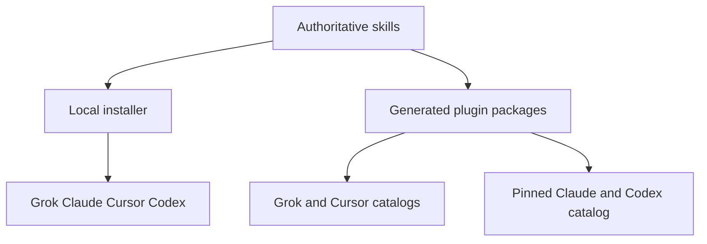

# Install and distribute Skill Craft



Edit `skills/<leaf>/`, then run `./scripts/sync-plugin-views.sh`. It copies each
skill into `plugins/<leaf>/skills/<leaf>/` and derives host metadata from its
frontmatter. For example, `skills/shiploop/SKILL.md` produces the shared ShipLoop
plugin and a `./plugins/shiploop` entry in each native catalog. All hosts receive
the same skill body; host-specific files describe how to find it.

## Your own use on four hosts

From the source checkout:

```sh
./install.sh --grok-only --claude-only --cursor-only --codex-only --dry-run
./install.sh --grok-only --claude-only --cursor-only --codex-only
./install.sh --grok-only --claude-only --cursor-only --codex-only --status
```

Host flags combine. These commands install all source skills; add
`--skill shiploop` to select one. Without host flags the installer also targets
Hermes. Links use `~/.grok/skills`, `~/.claude/skills`, `~/.cursor/skills`, and
`~/.codex/skills`. Keep the checkout in place. Update with `git pull` and rerun
the installer when new skills are added. Restart the host session to refresh discovery.

Cursor also discovers Claude/Codex skill directories. Its native links point to
the same canonical files. Do not install another plugin copy of a skill already
provided through skill-dir. Claude's installer status distinguishes
`confirmed-enabled`, `disabled`, and `cached-state-unknown` plugin records. Only
confirmed enabled records produce an active-duplicate warning. When enablement
is unknown, inspect `claude plugin list --json` for the host's current state.

## Marketplace entry points

| Host | Repository to distribute | Index | Packages |
|------|--------------------------|-------|----------|
| Grok | `whichguy/skill-craft` | `.grok-plugin/marketplace.json` | Source skill packages |
| Cursor | `whichguy/skill-craft` | `.cursor-plugin/marketplace.json` | Source skill packages |
| Claude Code | `whichguy/skill-craft-market` | `.claude-plugin/marketplace.json` | Source packages plus external pins |
| Codex | `whichguy/skill-craft-market` | Same Claude-compatible index | Same pinned entries |

The source repo owns Grok/Cursor adapters because those indexes can point directly
at its existing plugin directories. The sibling repo stays catalog-only and
preserves per-package release pins. Backchain is private and requires repository
access; Lennox S40 and the standalone Until Loop skill are maintained separately.
Improve remains owned here and includes its own compatible runtime; the standalone
Until Loop entry does not replace Improve's source or pin.

### Grok

Use the local source checkout while developing:

```sh
grok plugin marketplace add /absolute/path/to/skill-craft
grok plugin list --available --json
```

After publishing the native index, consumers register `whichguy/skill-craft`.
Install a selected package with `grok plugin install shiploop --trust`, only
after reviewing its contents and choosing plugin mode for that skill. Grok
supports these same-repository local source entries and the existing
`.claude-plugin/plugin.json` package manifests. Its installed user guide documents
this under **Plugins → Create your own marketplace**.

### Claude Code and Codex

```sh
claude plugin marketplace add whichguy/skill-craft-market
claude plugin install shiploop@skill-craft-market

codex plugin marketplace add whichguy/skill-craft-market
codex plugin list --marketplace skill-craft-market --available --json
codex plugin add shiploop@skill-craft-market
```

For local development, pass the absolute `skill-craft-market` checkout path to
`marketplace add`. A host may require replacing an existing registration of the
same name before changing its source. Refresh Git catalogs with Claude
`plugin marketplace update skill-craft-market` or Codex
`plugin marketplace upgrade skill-craft-market`. Start a new Codex task after
installing. See the [Codex marketplace reference](https://developers.openai.com/plugins/build/plugins#marketplace-metadata).

### Cursor

Each package has a generated `.cursor-plugin/plugin.json`. The root marketplace
uses same-repository paths, as required by the
[Cursor multi-plugin format](https://cursor.com/docs/reference/plugins).

For a local plugin smoke test, first choose a skill not already installed through
skill-dir. Place or symlink that **individual** `plugins/<leaf>` directory under
`~/.cursor/plugins/local/<leaf>`, reload Cursor, and inspect **Customize → Plugins**
and **Skills**. Do not link the whole monorepo there as a single plugin. Remove
the test link when finished. This tests an individual package; it is not a public
catalog submission.

Team marketplace import requires a Cursor Teams or Enterprise admin to use
**Dashboard → Settings → Plugins → Import from Repo**, selecting the published
`whichguy/skill-craft` repository. A public listing additionally requires submitting
the public repository through [Cursor's publication form](https://cursor.com/marketplace/publish)
and passing review. See [Cursor plugin distribution](https://cursor.com/docs/plugins).

## Keeping generated files in sync

```sh
./scripts/sync-plugin-views.sh
./scripts/sync-plugin-views.sh --check
bash test/sync-plugin-views.test.sh
python3 scripts/check-marketplace-packages.py
python3 test/installed-skill-invocation.test.py
```

Full sync updates both native catalogs and the README inventory. It refuses an
empty source tree or missing inventory markers. Leaf-only sync updates that package;
run full sync before release so catalog descriptions and versions match. Never
hand-edit generated manifests or copy bodies into `skill-craft-market`.

Every package contains its own LICENSE, generated root README, canonical skill
tree, and Claude, Cursor and Codex manifests. Authored skill READMEs remain next
to their SKILL.md. The Codex adapter declares `./skills/`; it does not require
an MCP server or hooks. The offline package checker rejects incomplete payloads,
escaping paths, leftover symlinks and invalid metadata. It is not host approval.

Script-backed cards bind the directory of the **loaded** SKILL.md before running
a quoted absolute bundled-script path. The consumer's working directory remains
the target project. Package resources are read-only; state belongs in that
project or a declared writable data location. In particular, the installed
Skill Interop marketplace helper works without a source checkout. Its optional
`install-local` route instead requires an explicit absolute `MARKETPLACE_INSTALL_SH`
pointing to a trusted source checkout's installer.

Optional real-host checks (installed CLIs required):

```sh
bash test/run-integration.sh marketplace-claude
bash test/run-integration.sh marketplace-grok
bash test/run-integration.sh marketplace-codex
```

These create disposable host profiles and local catalogs, install Skill Interop,
invoke its installed marketplace helper, install Review Coverage, run its bundled
script from an unrelated project, and remove the target. They do not inherit
provider credentials, alter personal plugin registrations, call a model, or prove
that remote pins already serve these bytes. Cursor import and public marketplace
review remain separate manual checks.

Commit and publish the source adapters and catalog repairs before giving remote
install instructions to other people. Validate pins with the sibling catalog's
CI; its private Backchain source needs `MARKETPLACE_READ_TOKEN` with read access.
The full [release checklist](skill-release-checklist.md) preserves package versions
and immutable pins. Catalog generation and local validation do not establish
that changes are published or that every script can execute on every host.

## Runtime limits

Skill discovery is separate from execution. Prompt skills can still reference
optional host agents, external CLIs, or project-specific harnesses. In particular,
the DevLoop engine has Grok/Hermes runtime bindings; discovery in Claude, Codex,
or Cursor does not add another engine transport. The distributed DevLoop runtime
never downloads or provisions an engine. An operator may explicitly provision it
from a trusted source checkout with `bash scripts/devloop-setup.sh --host grok`;
see that command's `--help` for pin and destination controls. Missing engines
fail with exit 2 and setup guidance. Claude/Codex/Cursor can use an explicitly
selected supported external transport, not a claimed native transport.
Benchmark skills retain declared independent-session, harness and project-access
prerequisites; packaging does not manufacture unavailable capabilities.
