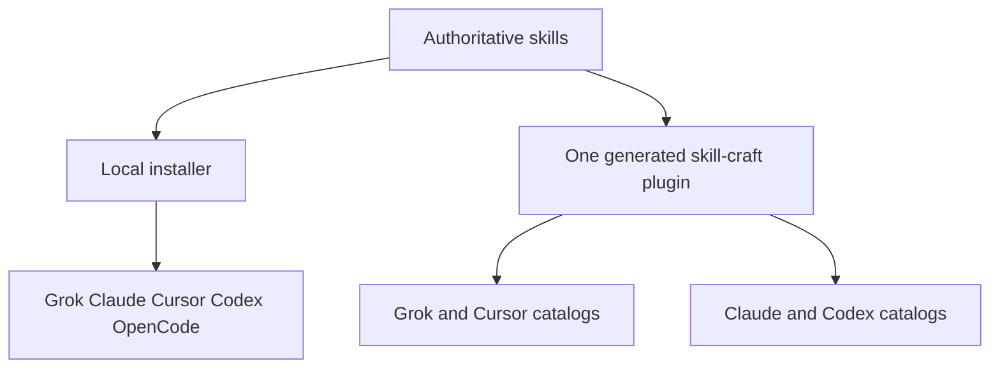

# Install and distribute Skill Craft



Edit `skills/<leaf>/`, then add a change note under `changes/<leaf>/`
([format](../changes/README.md)). At release, `scripts/release.py` runs
`./scripts/sync-plugin-views.sh`, which copies every skill into the one
`skill-craft` plugin at `plugins/skill-craft/skills/<leaf>/` and derives host
metadata from the frontmatter and `catalog/skill-craft-plugin.json`. Each native
catalog lists that plugin once as `./plugins/skill-craft`, so hosts expose every
skill as `skill-craft:<leaf>` (Claude `/skill-craft:shiploop`, Codex
`$skill-craft:shiploop`). All hosts receive the same skill body; host-specific
files describe how to find it.

## Your own use

Claude, Codex, Grok and Cursor install every skill from the `skill-craft`
marketplace plugin ([entry points](#marketplace-entry-points)). OpenCode has no
skill marketplace, so `install.sh` links it from the source checkout; without
host flags the installer targets only OpenCode (Hermes needs `--hermes-only`):

```sh
./install.sh --dry-run
./install.sh
./install.sh --status
```

To develop against the checkout on a plugin host, link it explicitly (for example
`./install.sh --claude-only --skill shiploop`) and disable the plugin meanwhile;
`--status` warns when an enabled `skill-craft` plugin would load the same skill
twice. Add `--skill shiploop` to select one skill. Links use `~/.grok/skills`, `~/.claude/skills`, `~/.cursor/skills`, `~/.codex/skills`, and
`${XDG_CONFIG_HOME:-$HOME/.config}/opencode/skills`. Keep the checkout in place. Update with `git pull` and rerun
the installer when new skills are added. Restart the host session to refresh discovery.

OpenCode's [Agent Skills documentation](https://opencode.ai/docs/skills/) defines
the XDG path above as its native global target. The installer does not edit
`opencode.json`, permissions, provider configuration, or experimental flags. OpenCode
also discovers `~/.claude/skills`. In an isolated OpenCode 1.18.31 check, matching
Claude and native symlinks to the same `ask-agent` source produced one selected
native skill root. Treat those links as one shared source, not independent copies.
Do not rely on that selection for divergent source trees or copied versions: keep one
source for each name, or use `--opencode-only` when the native path must be unambiguous.

Cursor also discovers Claude/Codex skill directories. Its native links point to
the same canonical files. Do not install another plugin copy of a skill already
provided through skill-dir. Claude's installer status distinguishes
`confirmed-enabled`, `disabled`, and `cached-state-unknown` plugin records. Only
confirmed enabled records produce an active-duplicate warning. When enablement
is unknown, inspect `claude plugin list --json` for the host's current state.

## Marketplace entry points

`whichguy/skill-craft` is the one marketplace for every host:

| Host | Index | Packages |
|------|-------|----------|
| Claude Code | `.claude-plugin/marketplace.json` | Skill packages and external pins |
| Codex | `.agents/plugins/marketplace.json` (falls back to the Claude index) | Same selection |
| Grok | `.grok-plugin/marketplace.json` | Skill packages |
| Cursor | `.cursor-plugin/marketplace.json` | Skill packages |
| OpenCode | none (no skill marketplace) | `./install.sh` skill directories |

All four indexes are generated at release (`scripts/release.py` runs
`scripts/sync-plugin-views.sh`), are named `whichguy` after the publisher, and point at
`./plugins/skill-craft`. The install ID on every host is
`skill-craft@whichguy`. Lennox S40, Until Loop and Workflow are published
from their own repositories and pinned by full commit in
`catalog/external-plugins.json`; they are listed in the Claude and Codex indexes
only.

`plugins/` and the indexes are **release output**. They change only in a
release commit made by `scripts/release.py`, so users of a marketplace
install receive released packages, never work in progress. The plugin updates
when its `version` (in `catalog/skill-craft-plugin.json`) changes, which happens
at every release; each skill keeps its own `version:` for the changelog.

Backchain and Plan Dispatcher are ordinary skills here (`skills/backchain`,
`skills/plan-dispatcher`), shipped in the skill-craft plugin like every other skill. Backchain's
research harness, schema, fixtures and samples stay in the separate Backchain
development checkout and are not shipped.
Improve remains owned here and includes its own compatible runtime; the standalone
Until Loop entry does not replace Improve's selected source.

### Grok

Use the local source checkout while developing:

```sh
grok plugin marketplace add /absolute/path/to/skill-craft
grok plugin list --available --json
```

After publishing the native index, consumers register `whichguy/skill-craft`.
Install the plugin with `grok plugin install skill-craft --trust`, only
after reviewing its contents. Grok
supports these same-repository local source entries and the existing
`.claude-plugin/plugin.json` package manifests. Its installed user guide documents
this under **Plugins → Create your own marketplace**.

### Claude Code and Codex

```sh
claude plugin marketplace add whichguy/skill-craft
claude plugin install skill-craft@whichguy

codex plugin marketplace add whichguy/skill-craft
codex plugin list --marketplace whichguy --available --json
codex plugin add skill-craft@whichguy
```

For local development, pass the absolute `skill-craft` checkout path to
`marketplace add`. Refresh Git catalogs with Claude
`plugin marketplace update whichguy`, Codex
`plugin marketplace upgrade whichguy` or Grok
`grok plugin marketplace update`. Start a new Codex task after
installing. See the [Codex marketplace reference](https://developers.openai.com/plugins/build/plugins#marketplace-metadata).

#### Moving from per-skill plugins

Earlier releases published one plugin per skill (`shiploop@skill-craft-market`)
from a Claude/Codex marketplace named `skill-craft-market`. Those IDs are gone.
Remove the old registration, which uninstalls the per-skill plugins installed
from it, then add the repository again and install the one plugin:

```sh
claude plugin marketplace remove skill-craft-market
claude plugin marketplace add whichguy/skill-craft
claude plugin install skill-craft@whichguy
```

Codex: `codex plugin marketplace remove skill-craft-market`, add the repository,
then `codex plugin add skill-craft@whichguy`. Grok: uninstall each per-skill
plugin (`grok plugin list` shows them), update the `whichguy` marketplace and
install `skill-craft`. Plugins from other repositories (Until Loop, Workflow) are
separate sources; keep them.

### Install IDs and skill namespaces

The marketplace selects a package; the plugin name supplies the skill namespace.
Skill Craft ships every source skill in one plugin named `skill-craft`, so the
namespace is `skill-craft` on every host. The marketplace is named after its
publisher, `whichguy`, so the install ID reads `skill-craft@whichguy`. Keep `name: shiploop` in the source
card: the host adds the `skill-craft:` prefix when it loads the plugin. Do not
put `skill-craft:` into the source card's name.

| Identity | ShipLoop example | Purpose |
|----------|------------------|---------|
| Marketplace | `whichguy` | Catalog registration on every host |
| Plugin install ID | `skill-craft@whichguy` | Install or remove every skill at once |
| Plugin skill in Codex | `$skill-craft:shiploop` | Select the installed plugin's skill |
| Plugin skill in Claude | `/skill-craft:shiploop` | Select the installed plugin's skill |
| Skill-dir skill in Codex | `$shiploop` | Select the separately side-loaded skill |

In a fresh task, the host exposes the packaged `skills/shiploop/SKILL.md` as
`skill-craft:shiploop`. If a side-loaded `shiploop` also exists, a bare
`$shiploop` does not establish that the marketplace copy was selected. Inspect
the loaded card's path and plugin identity when verifying an installation. A
bare `/shiploop` is not a registered command in headless Claude; use the
qualified name.

The generated Codex action prompts and package README use the qualified plugin
identity. The source card retains its portable bare name for skill-dir installs.

This distinction follows the [OpenAI plugin namespace contract](https://developers.openai.com/plugins/build/plugins#create-a-plugin-manually)
and [Claude plugin skill namespacing](https://code.claude.com/docs/en/plugins#create-your-first-plugin).
`bash test/native-marketplace-adapters.test.sh` checks the generated invocation
examples; runtime discovery remains a separate host check.

### Cursor

The plugin has a generated `.cursor-plugin/plugin.json`. The root marketplace
uses same-repository paths, as required by the
[Cursor multi-plugin format](https://cursor.com/docs/reference/plugins).

For a local plugin smoke test, first remove skill-dir installs of the same skills.
Place or symlink the generated `plugins/skill-craft` directory under
`~/.cursor/plugins/local/skill-craft`, reload Cursor, and inspect **Customize →
Plugins** and **Skills**. Do not link the whole monorepo there. Remove the test
link when finished. This tests the package; it is not a public catalog submission.

Cursor also supports a personal marketplace import in the current desktop UI:
**Customize → Browse Marketplace → Add Marketplace → Import from GitHub**. Select
**Scope: User** and enter the source repository root exactly as
`https://github.com/whichguy/skill-craft`. This User import was verified in Cursor
3.20.21 with the earlier per-skill packages; re-check that the one
`skill-craft` plugin lists every skill. That repository
owns the required root
`.cursor-plugin/marketplace.json`; the retired `skill-craft-market`
repository has no Cursor index. Cursor does not document a ref or `/tree/<branch>` URL syntax for
this field, so use the repository root. To stage a different default branch without
changing the production repository, use a separate staging repository with a valid
root marketplace index.

Team-scoped marketplace import remains a Teams or Enterprise administrator action
through **Dashboard → Settings → Plugins → Import from Repo**. A public listing
additionally requires submitting the public repository through
[Cursor's publication form](https://cursor.com/marketplace/publish) and passing
review. See [Cursor plugin distribution](https://cursor.com/docs/plugins).

## Checking packages

`plugins/` and the catalogs are committed only by `scripts/release.py`, so
between releases they lag the source. Check a build of the current source
instead:

```sh
OUT="$(mktemp -d)/build"
python3 scripts/build-packages.py "$OUT"
python3 scripts/check-marketplace-packages.py --root "$OUT"
python3 test/installed-skill-invocation.test.py
```

`build-packages.py` writes every package, the four host catalogs and the README
inventory into `OUT` without touching the checkout; package tests build the same
way through `test/package_build.py` (or reuse `SKILL_CRAFT_PACKAGES`). The sync
it runs refuses an empty source tree or missing inventory markers. Never run
`sync-plugin-views.sh` to commit its output by hand, and never hand-edit
generated manifests.

Every package contains its own LICENSE, generated root README, canonical skill
tree, and Claude, Cursor and Codex manifests. Authored skill READMEs remain next
to their SKILL.md. The Codex adapter declares `./skills/`; it does not require
an MCP server. A skill with `host-hooks.json` also gets generated host hook files
under `hooks/`, and its Codex and Cursor manifests name theirs. The offline package checker rejects incomplete payloads,
escaping paths, leftover symlinks and invalid metadata. It is not host approval.

Script-backed cards bind the directory of the **loaded** SKILL.md before running
a quoted absolute bundled-script path. The consumer's working directory remains
the target project. Package resources are read-only; state belongs in that
project or a declared writable data location. In particular, the installed
Skill Interop marketplace helper works without a source checkout. Its optional
`install-local` route instead requires an explicit absolute `MARKETPLACE_INSTALL_SH`
pointing to a trusted source checkout's installer.

Optional real-host checks (installed CLIs required):

```sh
bash test/run-integration.sh marketplace-claude
bash test/run-integration.sh marketplace-grok
bash test/run-integration.sh marketplace-codex
```

These create disposable host profiles and local catalogs, install Skill Interop,
invoke its installed marketplace helper, install Review Coverage, run its bundled
script from an unrelated project, and remove the target. They do not inherit
provider credentials, alter personal plugin registrations, call a model, or prove
that remote pins already serve these bytes. Cursor import and public marketplace
review remain separate manual checks.

Remote installs serve only published release commits: cut one with
`scripts/release.py`, then publish it with `scripts/release-push.py` (see the
[release checklist](skill-release-checklist.md)) before giving remote install
instructions to other people. External plugins are pinned by full commit `sha`
in `catalog/external-plugins.json`; verify each pinned commit in its own
repository. Catalog generation and local validation do not establish that
changes are published or that every script can execute on every host.

## Runtime limits

Skill discovery is separate from execution. Prompt skills can still reference
optional host agents, external CLIs, or project-specific harnesses. In particular,
the DevLoop engine has Grok/Hermes runtime bindings; discovery in Claude, Codex,
or Cursor does not add another engine transport. The distributed DevLoop runtime
never downloads or provisions an engine. An operator may explicitly provision it
from a trusted source checkout with `bash scripts/devloop-setup.sh --host grok`;
see that command's `--help` for pin and destination controls. Missing engines
fail with exit 2 and setup guidance. Claude/Codex/Cursor can use an explicitly
selected supported external transport, not a claimed native transport.
Benchmark skills retain declared independent-session, harness and project-access
prerequisites; packaging does not manufacture unavailable capabilities.
