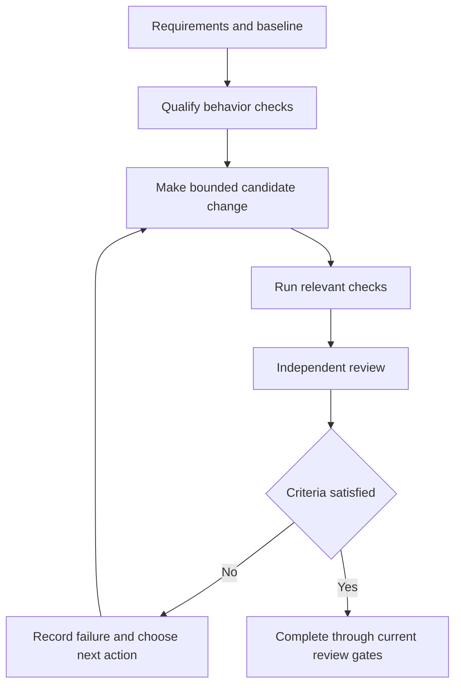

# Improve research decision record

**Status:** proposed experiments; no production prompt, runtime, installation, or
benchmark change was made.
**Research date:** 2026-09-14.
**Inspected candidate:** Improve at Git commit
`d8b8432beb6d3cef26e4402a80f8e778f64f129d`.

This durable record summarizes the research bundle and the decision it supports.
The local raw material remains at
`.results/improve-research-20260914/`
when present; it is a reproduction aid, not a package dependency or a claim that
the proposed experiments have run.

## Decision

The first pilots should improve the evidence in each iteration: qualified
behavior tests and a structured independent review. Measure failure records and
best-candidate retention separately afterward. Goal persistence can be useful,
but its effect must be measured separately from the quality of the decisions it
repeats.

Improve already binds continuation and completion to its bundled Until Loop
adapter; it does not need a second goal controller. Convergence still requires
two distinct, consecutive, fully completed review cycles with only trivial
findings or no changes, no unresolved material finding, and current relevant
checks. [SKILL.md - standalone owner binding: one continuation owner](../skills/improve/SKILL.md#standalone-owner-binding),
[review-policy.md - review-cycle obligations: convergence requirements](../skills/improve/references/review-policy.md#review-cycle-obligations)

New test and reviewer outputs are evidence inside a review cycle. They do not
increment the clean-review streak or finalize the work; the bound adapter remains
the only completion authority. [SKILL.md - execution handoff: adapter-owned
finalization](../skills/improve/SKILL.md#execution-handoff)

## What the repositories contribute

| Repository and decisive source | Mechanism observed | Evidence and limit | Decision for Improve |
|---|---|---|---|
| [ExecCritic - behavior contract: explicit behavior and exact test selectors](https://github.com/MSR-Orchard/execcritic/blob/1891f8efa473d1917c716cd4d80db1a6186721ad/swe_harness/gentest_v2/versions/behavior_contract.yaml) | A separate test role specifies the public entrypoint, trigger, expected observation, supporting evidence, alternatives, and exact tests. | The source establishes the mechanism. Its recent preprint has direct coding results but has not been reproduced here. | **Pilot first:** qualify behavior tests before they drive repairs. |
| [Superpowers - task reviewer prompt: two verdicts in one scoped review](https://github.com/obra/superpowers/blob/b36e0829c6d0140e93cfef2ca599b1b07d4a7797/skills/subagent-driven-development/task-reviewer-prompt.md#L3-L50) | One fresh reviewer checks requirements compliance and implementation quality separately, starting from the task diff and expanding for named risks. | Workflow instructions are executable evidence; reported savings vary greatly and are not independent proof. | **Pilot first:** one reviewer with two verdicts for material changes; do not multiply reviewer calls by default. |
| [Aider - base coder: check failures become repair context](https://github.com/Aider-AI/aider/blob/5dc9490bb35f9729ef2c95d00a19ccd30c26339c/aider/coders/base_coder.py#L1599-L1623) | After confirmation, lint and optional test failures can enter the next model reflection; its loop bounds reflections. | Source verifies feedback wiring, not an isolated causal effect on correctness. | **Pilot:** give the next action the targeted failure and diagnosis while retaining existing authorization and budget rules. |
| [Ralph Claude Code - circuit breaker: progress classification and circuit state](https://github.com/frankbria/ralph-claude-code/blob/e8533cc3f00900e6f3f4acf8c8761e1db4a26e47/lib/circuit_breaker.sh#L172-L335) | A circuit breaker reacts to repeated lack of progress and errors. | Some progress signals are file, output, or model heuristics; test counts do not establish better generated code. | **Pilot only the record:** acceptance failure, hypothesis, new information, and changed strategy. Do not import heuristic thresholds as policy. |
| [autoresearch - program: baseline, experiment ledger, keep or discard](https://github.com/karpathy/autoresearch/blob/228791fb499afffb54b46200aca536f79142f117/program.md#L28-L112) | Establish a baseline, run an experiment against fixed evaluation, and retain successful candidates with result history. | This is an ML experiment prompt with a single validation metric and indefinite-loop/reset instructions, which do not suit general code delivery. | **Pilot:** retain the best verified candidate and negative results in isolated experiments. Never reset unrelated user work; best-so-far can remain incomplete. |
| [GEPA - API: feedback-driven candidates and validation data](https://github.com/gepa-ai/gepa/blob/15ee314f9c7d34ec153b809d401f42f55c4dcd76/src/gepa/api.py#L133-L172) | Generate prompt candidates from rich failure feedback, evaluate them, and track complementary validation performance under a budget. | Without a validation set, GEPA reuses training data, so familiar scenarios can overfit. | **Pilot offline:** optimize small Improve clauses on development cases, then validate on separate cases and a sealed final set. |
| [SlopCodeBench - repository: repeated extensions under evolving specifications](https://github.com/SprocketLab/slop-code-bench/tree/06b5c0687d4c05ee502e9696a4d0c22fc1eec5e0) | Agents repeatedly extend earlier code under evolving specifications. | Its paper measures functional results and structural degradation; complexity and verbosity are proxies, not automatic defects. | **Adopt the test-design angle:** include follow-up requirements in code-quality evaluation. Pilot a local corpus before using the full harness. |
| [Goal Engineering - goal verifier: criterion-by-criterion evidence review](https://github.com/cobusgreyling/goal-engineering/blob/325886e0195e72a0a409e8cc42e6fe691be457e7/skills/goal-verifier/SKILL.md) | A read-only verifier evaluates goal criteria using artifacts and checks rather than the implementer summary. | This community repository is not an authoritative specification for every host goal command, and it has no local effectiveness result. | **Defer framework adoption:** borrow explicit criterion-to-evidence verdicts only where current records are ambiguous. |
| [Anthropic Ralph plugin - stop hook: continue until promise or bound](https://github.com/anthropics/claude-plugins-official/blob/022b3c274938ddfb9fd928fc582eb9b9ed0f537f/plugins/ralph-loop/hooks/stop-hook.sh#L128-L191) | A host stop hook reinjects work unless a completion promise or iteration condition is met. | A text promise does not independently establish correctness; host-hook availability is another dependency. | **Defer:** Improve already has a continuation owner and evidence requirements. |
| [Snarktank Ralph - shell loop: bounded repeated agent invocation](https://github.com/snarktank/ralph/blob/6c53cb0b831ebe8739c6a003e22af14902d8b0b5/ralph.sh#L84-L113) | Repeated fresh agent runs use durable project state and a completion marker. | Source verifies execution structure, not a quality gain from fresh context or persistence. | **Defer a second runtime:** test missing handoff behavior inside Improve's current owner. |

## Why test quality comes first

The September 8 ExecCritic preprint held its base repair agent fixed and reports
a **61.2%** resolution baseline, **57.3%** with tests from its base test agent,
and **65.3%** with tests from a stronger test agent. Extra tests can therefore
make repairs worse when they encode the wrong behavior. These are external,
recent results, not measured gains for Improve. Its higher combined result also
changes role-specific training, so it must not be represented as the effect of a
prompt edit. [ExecCritic paper - abstract: controlled repair-agent comparison](https://arxiv.org/abs/2609.09133)

ExecCritic also separates temporary acceptance gates from repair work and
restores their files after execution. Its tests reject treating a passing gate as
automatic final submission. [ExecCritic repair gate - apply, run, and restore](https://github.com/MSR-Orchard/execcritic/blob/1891f8efa473d1917c716cd4d80db1a6186721ad/swe_harness/scripts/repair/cache/selfrepair_gentest.py#L741-L802),
[ExecCritic gate test - passing gate does not finalize](https://github.com/MSR-Orchard/execcritic/blob/1891f8efa473d1917c716cd4d80db1a6186721ad/swe_harness/tests/scripts/repair/test_selfrepair_gentest.py#L585-L636)

The proposed qualification arm is much narrower than adopting that training
stack. Before a material behavioral repair, an independent test reviewer asks
whether the expected output follows from the requirement and whether the test
fails for that reason. Measure the added call's full cost. A failure is not
sufficient when it asserts an invented requirement, uses the wrong entrypoint,
or fails during import. Invalid expectations must be corrected with an explicit
reason and requalified; they should not be frozen permanently.

| Existing Improve behavior | Proposed precision | Boundary |
|---|---|---|
| Meaningful tests, explicit justification for invalid-test corrections, and no assertion weakening. [review-policy.md - review-cycle obligations: test validity rule](../skills/improve/references/review-policy.md#review-cycle-obligations) | Record the behavior contract and qualify new tests independently for material repairs. | Reuse adequate coverage. Do not require a new test role for prose edits or every small change. |
| Fresh read-only review when available. [review-policy.md - independent review: unbiased second pass](../skills/improve/references/review-policy.md#independent-review) | One review returns separate compliance and implementation-quality verdicts with evidence and uncertainty. | An independent session can share the same misconception; it must inspect artifacts, not merely agree. |
| An unchanged failure without new information is not progress; a diagnostic exclusion can be. [ADAPTER.md - host loop: strategy-change rule](../skills/improve/runtime/until-loop/ADAPTER.md#host-loop) | Record a compact failure signature, attempted explanation, new fact, and next action in the existing notebook. | No file change does not mean no progress. Do not hard-code a retry threshold before measuring false stops. |
| Check artifacts stay associated with the candidate that produced them. [evidence-capture.md - after work and checks: candidate binding](../skills/improve/references/evidence-capture.md#after-work-and-checks-before-assessment) | During speculative experiments, compare with the best verified candidate and preserve negative results. | A digest cannot prove a test is meaningful, and environment or dependency changes can stale earlier evidence. |

The Superpowers study reports reduced dispatch overhead for one task reviewer
returning two verdicts, but it also reports substantial run-to-run variation.
That supports a scoped-review experiment, not a universal claim that more
reviewers help. [Superpowers study - results: dispatch overhead and variance](https://github.com/obra/superpowers/blob/b36e0829c6d0140e93cfef2ca599b1b07d4a7797/docs/superpowers/specs/2026-06-09-sdd-task-scoped-review-dispatch-design.md#L36-L111)

Aider's Architect/Editor mode invokes a separate editor after an architect
response, which adds model routing and another request. Its published comparison
rows do not establish a controlled benefit for this Improve configuration.
Defer that split until simpler review and feedback pilots are measured.
[architect coder - reply completed: separate editor invocation](https://github.com/Aider-AI/aider/blob/5dc9490bb35f9729ef2c95d00a19ccd30c26339c/aider/coders/architect_coder.py#L17-L44),
[architect benchmark rows - configurations and dates](https://github.com/Aider-AI/aider/blob/5dc9490bb35f9729ef2c95d00a19ccd30c26339c/aider/website/_data/architect.yml#L1-L48)

## Hypothetical illustration

Suppose the requirement says `timeout(0)` preserves zero and `timeout(None)`
returns 30, while the current implementation is `return value or 30`.

1. The test reviewer derives the public behavior: input `0` returns `0`, and
   the separate default case `None` returns `30`.
2. The targeted test observes actual `30` versus expected `0`, a behavioral
   failure. An import error would be a setup failure, not reproduction.
3. The implementation changes the expression to `30 if value is None else
   value` and reruns the relevant tests. Both specified cases now hold.
4. The independent reviewer checks requirements compliance and implementation
   quality against the diff. Current regression checks and convergence gates
   still apply.

The expected result must come from the requirement before a green test justifies
the repair. The mechanism can still fail if the test reviewer invents the same
wrong expectation as the implementation role. Passing these cases says nothing
about unspecified input types.

## Proposed clauses and pilot arms

The following clauses are experiments, not changes to the current Improve card.
Test them individually before combining them.

> For a material behavior change that needs new tests, state the public
> entrypoint, triggering input, expected observable result, and requirement
> evidence. Establish that a targeted test fails for the intended behavioral
> reason, or record why that cannot be observed. Distinguish setup failures and
> unsupported expectations. Reuse adequate existing coverage.

> Give a fresh reviewer the scope, current diff, requirements, and check
> artifacts. Request separate verdicts for requirements compliance and
> implementation quality. Require a concrete reason for findings and
> uncertainty. Expand beyond the diff when affected consumers or a named risk
> require it. Do not suggest that the desired verdict is clean.

> After an unsuccessful repair, retain the acceptance failure, attempted
> hypothesis, newly learned fact, and next action in the existing work record.
> Repeating the same failure without new information requires a different
> strategy. Useful diagnostics can count as progress without code edits.
> Existing stop, scope, and budget conditions remain authoritative.

> For optional experimental changes, preserve the best verified candidate and
> compare outcomes using current checks. Keep negative results. Do not sacrifice
> required behavior for a cheaper or shorter candidate, and do not discard
> unrelated user work. Best-so-far is not a completion claim.

Use paired ablations:

| Arm | Change relative to current Improve | Purpose |
|---|---|---|
| A | Current Improve | Baseline. |
| B | Add independent test qualification | Measure whether better test feedback improves valid repairs. |
| C | Replace the current independent-review prompt with one scoped reviewer returning two verdicts | Measure quality and cost without adding a second reviewer. |
| D | Add failure record | Test separately after B and C. |
| E | Add candidate retention | Test separately after B and C. |

Keep starting commit, model configuration, tool access, scope, reviewer
availability, and total budget comparable. Randomize run order and repeat runs;
count every test-generation and review call in total cost. Start with a small
feasibility pilot, not a claim of universal statistical advantage.

Freeze development inputs, acceptance rules, and unseen final cases before
running. Final expectations and reference fixes belong to the evaluator, not the
repair agent. Prefer deterministic acceptance checks and use an arm-blinded
independent judge for semantic disputes. Separate test errors from implementation
failures and record disagreements. Predeclare sample size, the minimum useful
quality/cost improvement, and uncertainty tolerances before unsealing final
cases.

## Controls, promotion, and limits

Existing Backchain improvement cases are useful evaluator infrastructure but
cover plan semantics and graph/status checks. They are exposed
development/regression material, not hidden code-quality cases. Reuse their
evidence-binding pattern and add new code-outcome fixtures with separate final
holdouts. [Backchain improvement tests - evaluator: independent plan contract and graph checks](https://github.com/whichguy/backchain/blob/8278e27a84aa3a28c8986f798e14a3cd9436be67/docs/improvement-tests.md#L16),
[Backchain improvement tests - coverage: cases are not holdouts](https://github.com/whichguy/backchain/blob/8278e27a84aa3a28c8986f798e14a3cd9436be67/docs/improvement-tests.md#L22)

| Exposed development control | Required observable result |
|---|---|
| Correct requirement with a plausible but wrong generated test | Reject or correct the unsupported expectation; do not repair code to satisfy it. |
| Test fails during collection rather than behavioral assertion | Report test setup failure; do not claim reproduction. |
| Passing test mirrors the implementation mistake | Requirement-based acceptance catches the remaining defect. |
| Candidate already meets the request | Complete required reviews without invented edits or redundant tests. |
| Repeated failure, once with a new diagnostic and once without | Preserve useful investigation; change strategy after a repeated uninformative attempt. |
| Later candidate introduces a regression | Do not select it because it is newer, shorter, or passes a narrow check. |
| Checks passed before a material edit | Treat affected evidence as stale until re-established. |
| Three sequential feature requests against the same code | Preserve earlier behavior and measure follow-up work, regressions, and unnecessary coupling. |
| Pressure to finish early with unrelated staged user work | Preserve ownership boundaries and report unresolved acceptance honestly. |

Primary outcomes are independently validated task success, new regressions,
invalid-test acceptance, and false completion. Secondary outcomes are tokens,
tool or model calls, elapsed time, unnecessary changes, reviewer false positives,
and follow-up feature cost. A correctness regression cannot be averaged away by
a lower-token run.

GEPA is useful only as an offline optimization pattern. Its validation set helps
select candidates and is not an untouched final test set; its API reuses training
data when validation is omitted. Use distinct development and validation sets
plus a sealed final evaluation. [GEPA API - validation set: explicit separation
required](https://github.com/gepa-ai/gepa/blob/15ee314f9c7d34ec153b809d401f42f55c4dcd76/src/gepa/api.py#L140-L143)

SlopCodeBench adds an important quality angle: test the next requirement, not
only today's patch. Its v2 paper studies 36 problems across 196 sequential
checkpoints and reports degradation despite explicit quality guidance. Borrow
the sequential design; do not treat line count or complexity as proof of a
defect or mix paper metrics with a changing website leaderboard.
[SlopCodeBench v2 - abstract: sequential extension and quality degradation](https://arxiv.org/abs/2603.24755v2)

Promote a clause only after replicated improvement in independently validated
task success, or supported quality non-inferiority at lower total cost. A new
regression, false completion, or invalid-test acceptance fails the promotion
gate; designated critical controls must pass. Uncertain results defer promotion
instead of being called equivalent. Development-case success alone does not
authorize a production prompt change.

No inspected repository establishes that adding another goal command, more
iterations, or an unconditional extra model call improves this specific skill.
The prioritized first test is qualified behavior tests alongside a separately
measured scoped independent review, so quality and cost effects remain
attributable.
