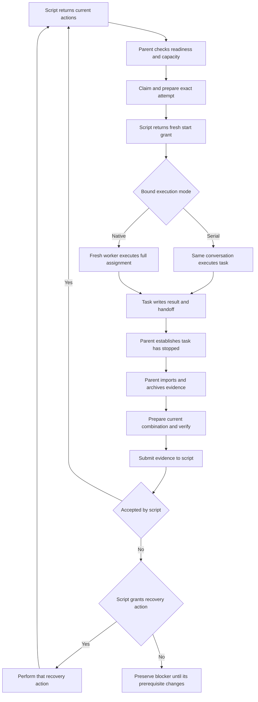
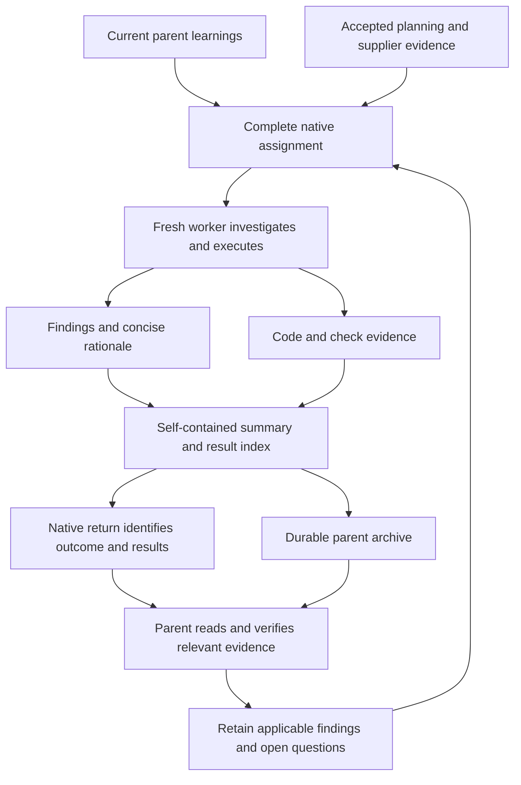

# Plan Orchestrator: intentions, context flow, and prompt audit

**The execution design largely matches the intended behavior. The main weakness is that preserving bytes is better specified than preserving their meaning across contexts.** The scripts already choose current actions and distinguish execution, recovery, reporting, verification, and acceptance. The most useful changes are to reinforce the incoming learnings and outgoing findings at the actual generated prompt boundaries, remove parent-only directions from worker prompts, and correct the serial walkthrough.

This records the pre-repair audit and proposed wording at the source identities below. The subsequent [repair and release record](plan-orchestrator-prompt-repair-2026-09-22.md) tracks implementation and qualification. The user explicitly reaffirmed four intentions: script-owned orchestration; a skill that follows returned prompts; execution either in the current context or a fresh context; and useful return of information discovered in a fresh context. Other intentions below are corroborated by current source contracts rather than newly assumed requirements.

## Scope and evidence

Audited on 2026-09-22 against initially clean source checkouts:

| Component | Source identity | Scope inspected |
| --- | --- | --- |
| Plan Orchestrator / Plan Dispatcher | `/Users/dadleet/src/backchain`, `6fd7a86ca284d8467ec55413d9b2ab42667e7657` | Skill, generated task and parent prompts, protocol, state transitions, planning-context projection, relevant tests |
| ShipLoop and Ask Agent | `/Users/dadleet/src/skill-craft`, `918de64752ba4d253393c1891764a553493de48a` | Chain adapter, generated navigation, worker-packet rewrite, planning material, archive/import, Ask Agent launch and result contracts, relevant tests |

The selected Codex Plan Dispatcher link resolves to that Backchain source package. This audit covers execution from an agreed graph through chain completion. Backchain generation and the later Improve cycle are boundary context, not a stage-by-stage audit of their internal prompts. Plan Orchestrator is the repository/product name; it is not an additional umbrella skill. [component-contracts.md — composition and names](https://github.com/whichguy/plan-orchestrator/blob/6fd7a86ca284d8467ec55413d9b2ab42667e7657/docs/component-contracts.md#L3)

Two independent readers examined dispatcher ownership and Ask Agent handoffs. Established deterministic suites and temporary public-CLI probes supplement the source review. They establish mechanical behavior, not model adherence, native context isolation, or delivery across every host.

## The intended interaction model

The script decides **what action is currently eligible**. The parent interprets the action, obtains real-world facts, performs the authorized operation, and submits its evidence. The bounded executor, a native worker in parallel mode or the parent conversation in serial mode, decides how to solve its assignment and reports what happened. Neither the skill nor the bounded executor computes another graph schedule.

This still leaves judgment with the model: whether an input actually exists, whether shared resources permit concurrency, whether checks support the definition of done, and whether a discovery invalidates a premise. Those judgments are inputs to the workflow. They do not authorize a new transition outside the returned action.

### Intentions and their current reinforcement

| ID | Intended behavior | Where it is reinforced | Assessment |
| --- | --- | --- | --- |
| I1 | The script owns graph traversal and continuation. | Dispatcher `actions`/`next_argv`; ShipLoop `navigation` | Strong. The skill supplies facts and executes returned actions. |
| I2 | A skill explains bootstrap and contracts, then follows the script. | Both skill cards explicitly reject a second scheduler. | Mostly strong; the serial prose loop still contains stale procedure. F5. |
| I3 | Inline execution stays in the same conversation. | Atomic `main-context` executor and `execute` grant; serial capacity one in the bridge | Strong. A separate worktree does not imply a separate context. |
| I4 | Native execution starts with a fresh context and sufficient task information. | Ask Agent excludes inherited history; Dispatcher/ShipLoop require full-packet delivery. | Explicit in skill guidance; fresh-context and learnings directions are weak in the bridge's returned launch prompt. F2/F3. |
| I5 | Relevant current discoveries and decisions reach a new worker. | Ask Agent's **Current learnings** block; immutable planning brief and references | Good separate contracts, incomplete assembly guidance at the chain launch boundary. F2. |
| I6 | Discoveries, rationale, checks, and open questions return usefully. | Ask Agent result/index and parent-consumption rules; bridge's decisions/checks/uncertainty sentence | Storage is strong; semantic return requirements need more prominence in generated prompts. F1. |
| I7 | The task/ready/done contract bounds execution without suppressing useful investigation. | Planning references support the assignment and cannot grant permissions or scheduling. | Consistent. Clarify how to report a conflicting premise rather than silently dropping it. |
| I8 | Readiness includes external facts, planning inputs, resources, and available capacity. | Script candidates plus parent checks; immutable readiness evidence | Strong distinction between structural eligibility and observed readiness. |
| I9 | A fresh grant runs once; recovery cannot accidentally relaunch it. | `start` versus `packet`/replay; saved attempt, handle or executor | Strong; reproduced in both modes. |
| I10 | A worker report is a claim, not acceptance. | Immutable receipt followed by parent verification and settlement | Strong. A receipt also does not prove native stoppage. |
| I11 | Successors consume accepted supplier results and usable evidence. | Accepted direct dependencies, integrated commits, archived handoff references | Mechanically strong. The parent still must extract and retain relevant findings. F1. |
| I12 | Safe independent work proceeds without waiting for an entire wave. | Script action order, capacity reservation, refresh after callbacks | Strong. Unknown native status keeps its reservation. |
| I13 | Accepted contributions survive cleanup and parent context loss. | Archive-before-removal, immutable receipts, attempt-bound records | Strong storage contract; durable content must contain the essential meaning. |
| I14 | Rejected or unknown work remains explicit and cannot become success by timeout. | Negative handoff, recovery, retry fencing, retained workspaces | Strong. Some host facts remain attestations; unsupported superseded cleanup can block finish. |
| I15 | Completion means the appropriate enclosing flow is complete. | Dispatcher acceptance versus ShipLoop `navigation.complete` and later stages | Strong in current runtime; serial cleanup wording contradicts it. F5. |

Sources: [Plan Dispatcher SKILL.md — navigation ownership](https://github.com/whichguy/plan-orchestrator/blob/6fd7a86ca284d8467ec55413d9b2ab42667e7657/skills/plan-dispatcher/SKILL.md#L51), [dispatch.js — current actions](https://github.com/whichguy/plan-orchestrator/blob/6fd7a86ca284d8467ec55413d9b2ab42667e7657/skills/plan-dispatcher/scripts/dispatch.js#L138), [ShipLoop SKILL.md — chain authority](https://github.com/whichguy/skill-craft/blob/918de64752ba4d253393c1891764a553493de48a/skills/shiploop/SKILL.md#L454), [Ask Agent SKILL.md — current learnings](https://github.com/whichguy/skill-craft/blob/918de64752ba4d253393c1891764a553493de48a/skills/ask-agent/SKILL.md#L96), [result-handoff.md — reports and collection](https://github.com/whichguy/skill-craft/blob/918de64752ba4d253393c1891764a553493de48a/skills/ask-agent/references/result-handoff.md#L143).

### Two execution modes, one parent controller

| Boundary | Inline / `serial` | Separate context / `parallel` |
| --- | --- | --- |
| Conversation performing task | Current parent conversation, temporarily acting as the bounded executor | Fresh native worker; no inherited conversation where supported |
| Filesystem | Helper-prepared sibling worktree | Helper-prepared sibling worktree |
| First grant | `action: execute` with recorded main-context executor | `action: launch`; parent records the actual native handle after launch |
| Capacity | One bounded task; enforced by ShipLoop binding, caller-enforced in standalone Dispatcher | Bound safe capacity, reduced by claimed, launching, running, or unresolved attempts |
| Completion signal | Task-owned commands are stopped; task phase returns its handoff | Native completion and stoppage must be collected; files alone are insufficient |
| Verification | A separate parent verification phase in the same conversation; no claim of an independent reviewer agent | Parent verifies the returned contribution and combined candidate |
| Recovery | Resume/reconcile recorded executor and attempt; no new native launch | Reconcile original native identity; no replacement launch while outcome is unknown |

The repository also uses **inline** to mean “put the complete assignment text in the native tool call.” That is a transport choice and can launch a separate context. It is not the same as inline execution. Use `serial/main-context` and `native/fresh-context` when explaining execution mode. [parallel-chain.md — full-packet transport](https://github.com/whichguy/skill-craft/blob/918de64752ba4d253393c1891764a553493de48a/skills/shiploop/references/parallel-chain.md#L158), [parallel-chain.md — serial mode](https://github.com/whichguy/skill-craft/blob/918de64752ba4d253393c1891764a553493de48a/skills/shiploop/references/parallel-chain.md#L377)

**The task returns control to the parent; the script determines the next eligible action.** The diagram shows the ShipLoop chain. Its current navigation decides whether cleanup or final verification remains after acceptance; it does not imply an unconditional retry from a blocker.

### Standalone Dispatcher and ShipLoop use different report transports

Read each returned surface according to its owner and purpose:

| Returned surface | Intended interpretation |
| --- | --- |
| Standalone successful run-scoped `instruction` and `next_argv` | Parent executes the instruction, then refreshes through the exact argv; the task-facing `report` response is the explicit exception below. |
| Chain `navigation.actions` | Follow each current action's `instruction`, named `operation`, required evidence and attempt identity. `next_argv` refreshes the view; it is not a substitute for performing the action. |
| Fresh `launch` or `execute` packet | Begin this attempt exactly once. A later `packet` read provides context, not another execution grant. |
| `collect`, `reconcile`, `resume`, `recover-import`, `recover-integration`, `recover-workspace` | Establish or resume the recorded identity/effects. These differ from starting a replacement task. |
| `inspect-planning-context`, `resume-parent`, `blocked-parent`, `blocked` | Preserve the stated prerequisite or blocker. Do not interpret a lack of executable work as success or permission to retry. |
| `prepare`, `verify`, `cleanup`, `finish`, `return-parent` | Follow the current contribution/candidate and ownership boundary; only `return-parent` with completed navigation hands the chain back to ShipLoop. |
| `history`, `pending`, and preflight capability/input views | Inspection or setup information. These views do not issue a task launch or acceptance. |
| Error response | Both CLIs emit an error/code without the normal continuation prompt. Preserve the error and same-run recovery information; a failed call does not establish that it had no effects or authorize a blind retry. |

Sources: [shiploop_chain.py — navigation branches](https://github.com/whichguy/skill-craft/blob/918de64752ba4d253393c1891764a553493de48a/skills/shiploop/scripts/shiploop_chain.py#L2569), [shiploop_chain.py — inspection views](https://github.com/whichguy/skill-craft/blob/918de64752ba4d253393c1891764a553493de48a/skills/shiploop/scripts/shiploop_chain.py#L5025), [shiploop_chain.py — error return](https://github.com/whichguy/skill-craft/blob/918de64752ba4d253393c1891764a553493de48a/skills/shiploop/scripts/shiploop_chain.py#L5137), [dispatch.js — error return](https://github.com/whichguy/plan-orchestrator/blob/6fd7a86ca284d8467ec55413d9b2ab42667e7657/skills/plan-dispatcher/scripts/dispatch.js#L338). Successful response self-direction is well specified; errors remain a coverage boundary rather than evidence of a complete recovery prompt on every possible return.

| Step | Standalone Dispatcher | ShipLoop chain adapter |
| --- | --- | --- |
| Worker receives | Task packet with concrete result/envelope paths and `report_argv` | Rewritten packet with worker-local `handoff` and managed workspace receipt |
| Worker publishes | Writes artifact/envelope, executes `report_argv` | Writes the required `shiploop-chain-handoff/v1` handoff and any declared result files; **does not call Dispatcher report** |
| Task returns | Actual report response, including `next_argv`, to the parent | Workspace, contribution, status, handoff location and delivery facts to the parent |
| Parent resumes | Executes returned `next_argv`, follows `next.actions` | Follows `navigation.actions`, calls `import-handoff`, then uses `navigation.next_argv` |
| Where Dispatcher reporting happens | Worker invokes the bounded report operation | Bridge archives the handoff and publishes the Dispatcher result/envelope on the parent's behalf |

These are intentional adapter differences. Copying standalone `report_argv` instructions into a chain worker would bypass its archive/import boundary. Conversely, a standalone worker must not replace its exact report response with an informal “done.” The bridge deliberately retains the internal packet separately and removes direct report fields from its external worker packet. [protocol.md — report continuation ownership](https://github.com/whichguy/plan-orchestrator/blob/6fd7a86ca284d8467ec55413d9b2ab42667e7657/skills/plan-dispatcher/references/protocol.md#L292), [shiploop_chain.py — packet rewrite](https://github.com/whichguy/skill-craft/blob/918de64752ba4d253393c1891764a553493de48a/skills/shiploop/scripts/shiploop_chain.py#L1826), [shiploop_chain.py — parent report publication](https://github.com/whichguy/skill-craft/blob/918de64752ba4d253393c1891764a553493de48a/skills/shiploop/scripts/shiploop_chain.py#L3438)

## Information must survive three distinct crossings

**An archived file is only useful if the parent can identify what it means and when to read it.** The final arrow means carry relevant information into a later script-authorized assignment, not independently create another task.

| Crossing | Information needed | Current carrier | Remaining concern |
| --- | --- | --- | --- |
| Parent → fresh worker | Objective, ready/done, scope, workspace, selected identities, current facts/decisions/hypotheses, relevant checks, supporting locators | Full packet; planning manifest/brief; Ask Agent's manually composed Current learnings block | The generated launch action does not explicitly tell the parent to assemble the learnings block. |
| Worker → parent | Outcome, material discoveries, corrected assumptions, decisions and rationale, actual checks/gaps, implications, durable result locators, exact contribution/identity | Native return plus manifest `summary` and declared `files`; generic Ask Agent report/index guidance | Generated chain wording emphasizes Git and lifecycle facts much more than discoveries or rationale. |
| Parent → later context or dependent | Accepted facts, unresolved risks, relevant decisions, exact evidence and contribution identities | Existing parent records; integrated supplier commits; direct-dependency archives/handoff/verification | Archives are forwarded, but finding selection and consumption remain model obligations. |

A direct dependent receives durable supplier archive references. This does not prove every earlier conversational discovery reaches every later task. A finding relevant beyond its direct consumers needs a concise entry in existing durable project/parent context and, where applicable, the next worker's learnings. Preserve evidence and the distinction between observations and hypotheses; do not edit a frozen plan or promote a worker recommendation into scheduling authority. [shiploop_chain.py — dependency archives](https://github.com/whichguy/skill-craft/blob/918de64752ba4d253393c1891764a553493de48a/skills/shiploop/scripts/shiploop_chain.py#L1805), [Ask Agent SKILL.md — recheck and carry learnings](https://github.com/whichguy/skill-craft/blob/918de64752ba4d253393c1891764a553493de48a/skills/ask-agent/SKILL.md#L116), [result-handoff.md — parent consumption](https://github.com/whichguy/skill-craft/blob/918de64752ba4d253393c1891764a553493de48a/skills/ask-agent/references/result-handoff.md#L180)

## Findings and proposed resolutions

### F1 — High: generated handoffs underemphasize discoveries and parent consumption

Ask Agent already says to put findings in result files, include current state/checks/unresolved decisions, and have the parent read the summary/index. ShipLoop also says to retain decisions, actual checks, and uncertainty. The intent is present; it is dispersed across references instead of being reinforced at the decisive worker-return and parent-collection prompts. [result-handoff.md — required meaning](https://github.com/whichguy/skill-craft/blob/918de64752ba4d253393c1891764a553493de48a/skills/ask-agent/references/result-handoff.md#L143), [shiploop_chain.py — guidance](https://github.com/whichguy/skill-craft/blob/918de64752ba4d253393c1891764a553493de48a/skills/shiploop/scripts/shiploop_chain.py#L1096)

The generated worker return sentence foregrounds workspace, contribution commit, status, handoff path, and an integration/removal recommendation. The handoff parser accepts any nonempty summary and an empty `files` list. A diagnostic probe confirmed that a structurally valid `summary: "Done."`, `files: []` passes this shape parser. That is **not** evidence that it passes contribution verification or final acceptance. [shiploop_chain.py — worker return](https://github.com/whichguy/skill-craft/blob/918de64752ba4d253393c1891764a553493de48a/skills/shiploop/scripts/shiploop_chain.py#L1914), [shiploop_chain_handoff.py — exact v1 keys and file validation](https://github.com/whichguy/skill-craft/blob/918de64752ba4d253393c1891764a553493de48a/skills/shiploop/scripts/shiploop_chain_handoff.py#L403)

The parent-facing generated result projects status, commit, summary, and archive locators. It cannot recover a discovery that the worker never recorded, and archival itself does not ensure the parent reads a buried discovery. [shiploop_chain.py — parent artifact](https://github.com/whichguy/skill-craft/blob/918de64752ba4d253393c1891764a553493de48a/skills/shiploop/scripts/shiploop_chain.py#L3438)

**Adopt:** strengthen existing prompts without inventing a new ledger or requiring fixed report fields. Put essential findings in `summary`; when detailed evidence is needed, declare its file and identify its purpose in the summary. An index can be one of those ordinary files, but it is not a required schema field. Do not add arbitrary top-level keys to the strict v1 handoff schema.

Proposed worker wording:

> Your handoff must let a parent with no memory of this task understand the outcome. Preserve material discoveries, corrected assumptions, decisions and concise rationale, checks actually performed, unresolved questions, and implications for the assigned result. State when there are no material new findings. Keep essential meaning in the summary and identify supporting result files. If a discovery prevents the definition of done or conflicts with the agreed contract, return the discrepancy and evidence; do not silently expand the task or change the graph.

Proposed parent collection/verification wording:

> Read the returned summary, its declared supporting files, and the evidence needed for the current decision. Preserve relevant findings, open questions and surviving evidence locators in the existing parent handoff before releasing the workspace. After import, use the archived locations. Evaluate the worker's recommendation against the current action and contract, then submit the requested verification facts and follow the script's returned continuation.

### F2 — High: current learnings are required by Ask Agent but absent from the generated launch assembly

Ask Agent explicitly requires a Current learnings block for every fresh worker, including an explicit statement when there are no relevant learnings. The chain documentation says to forward the complete packet. The generated `launch` action says to launch once and record the handle, but does not mention this block. The generated packet has frozen planning material, which is valuable but cannot contain every late conversational correction. [Ask Agent SKILL.md — incoming learnings](https://github.com/whichguy/skill-craft/blob/918de64752ba4d253393c1891764a553493de48a/skills/ask-agent/SKILL.md#L98), [parallel-chain.md — launch](https://github.com/whichguy/skill-craft/blob/918de64752ba4d253393c1891764a553493de48a/skills/shiploop/references/parallel-chain.md#L263), [shiploop_chain.py — launch navigation](https://github.com/whichguy/skill-craft/blob/918de64752ba4d253393c1891764a553493de48a/skills/shiploop/scripts/shiploop_chain.py#L2675)

The public-CLI probe found no Current learnings block in either returned chain packet. This is a prompt-assembly gap, not proof that a compliant Ask Agent parent fails to add it. There is no supported pre-start `current_learnings` field demonstrated here; this audit does not claim the bridge deletes such a field.

**Adopt:** have the script's fresh native launch action explicitly require the selected Ask Agent's Current learnings block alongside the unchanged full worker packet. Preserve task-relevant meaning in the existing durable attempt/parent record for recovery. Keep observed facts, decisions and hypotheses distinct. The block cannot grant broader scope or replace the frozen task contract.

Proposed parent launch wording:

> Launch once in a fresh native context using the selected Ask Agent contract. Include the complete returned worker packet unchanged and a compact Current learnings block distilled from the current conversation; say explicitly if none are relevant. Keep essential facts and rationale inline, with evidence locators for detail. Retain the effective assignment and launch identity in the existing parent record. Record the actual native handle after confirmation, then follow the returned continuation.

Inline execution does not need an artificial native launch block. It still needs a durable result handoff because its parent conversation may later be cleared or compacted.

### F3 — Medium: parent directions occupy the worker's instruction surface

The standalone native packet contains a Parent launch contract, extensive Parent status contract, and directions for the dispatcher's waiting/collection behavior. These are explicitly role-labeled, so they are not a literal grant of scheduling authority to the worker. They nevertheless duplicate instructions already returned to the parent and compete with the worker's task and return contract. [dispatch.js — native instructions](https://github.com/whichguy/plan-orchestrator/blob/6fd7a86ca284d8467ec55413d9b2ab42667e7657/skills/plan-dispatcher/scripts/dispatch.js#L85), [dispatch.js — parent start and launched responses](https://github.com/whichguy/plan-orchestrator/blob/6fd7a86ca284d8467ec55413d9b2ab42667e7657/skills/plan-dispatcher/scripts/dispatch.js#L247)

Actual context-bound packets emitted during the probe contained **1,123 instruction words for standalone native execution versus 421 for main-context execution**, counted by whitespace and excluding other JSON fields/references. ShipLoop replaces that instruction list rather than forwarding it unchanged: its external packets contained 442 and 438 words. These are one fixture's prompt measurements, not token counts or a measured quality effect.

The rewrite removes much parent material, but its worker-facing list still says “Launch the native task with this exact workspace as its operation directory.” A worker reading that sentence after it has already started should not need to infer that it was meant for its parent. Serial packets also begin with “worker launch payload” despite having no launch. [shiploop_chain.py — replacement instructions](https://github.com/whichguy/skill-craft/blob/918de64752ba4d253393c1891764a553493de48a/skills/shiploop/scripts/shiploop_chain.py#L1915)

**Adopt the role separation; pilot any larger shortening.** Keep parent launch/status/wait instructions in parent responses. Tell the native worker, “You are the already-started worker for this attempt; execute in this workspace.” Tell the serial executor, “You are performing this bounded task in the current conversation.” Preserve exact report/handoff obligations and all applicable authority, scope and evidence requirements.

The bridge's wholesale instruction replacement also means future dispatcher worker guidance does not automatically reach chain workers. A regression should verify the intended shared obligations in both emitted prompts while preserving their deliberately different report transports.

### F4 — Low: clarify context as useful evidence without making it another assignment

The repeated “sole execution assignment” wording is consistent with the user's orchestration intent. It prevents a worker from using a broad project goal or reference document to invent work. The generated brief and packet still explicitly require reading applicable planning material. No demonstrated defect justifies removing this boundary. [shiploop_planning_context.py — brief preamble](https://github.com/whichguy/skill-craft/blob/918de64752ba4d253393c1891764a553493de48a/skills/shiploop/scripts/shiploop_planning_context.py#L431), [shiploop_chain.py — planning use](https://github.com/whichguy/skill-craft/blob/918de64752ba4d253393c1891764a553493de48a/skills/shiploop/scripts/shiploop_chain.py#L1108)

**Adopt a clarification; retain the boundary:** “Use applicable planning facts and constraints to carry out this assigned task. If they conflict with task/ready/done, preserve the discrepancy and report it to the parent before proceeding with affected work.” This makes investigation productive without turning supporting material into permission or a replacement schedule.

Hypothetical example: a worker discovers that a required API assumption is false. It should preserve the observed response, affected acceptance criterion, and implications. If the assigned result cannot be achieved, report BLOCKED. The parent follows the existing reconciliation/replanning boundary; neither participant quietly edits the bound graph or declares success from a narrower check.

### F5 — Medium: the serial walkthrough describes an obsolete cleanup sequence

The serial section says to choose from `ready` and later says `done` “merges, accepts and removes the step worktree.” Current documentation elsewhere says cleanup is deferred, and the script emits a separate cleanup action. This is a direct internal conflict. A reader following the long prose loop can miss cleanup or reconstruct control flow outside `navigation`. [parallel-chain.md — serial loop](https://github.com/whichguy/skill-craft/blob/918de64752ba4d253393c1891764a553493de48a/skills/shiploop/references/parallel-chain.md#L416), [parallel-chain.md — deferred cleanup](https://github.com/whichguy/skill-craft/blob/918de64752ba4d253393c1891764a553493de48a/skills/shiploop/references/parallel-chain.md#L243), [shiploop_chain.py — cleanup navigation](https://github.com/whichguy/skill-craft/blob/918de64752ba4d253393c1891764a553493de48a/skills/shiploop/scripts/shiploop_chain.py#L2814)

**Adopt:** replace the procedural serial loop with a mode-specific explanation of the current packet contract. After a fresh execute grant: finish task-owned work, write/import its handoff, then follow returned preparation, verification, acceptance, cleanup and finish actions. State explicitly that `done` does not itself prove cleanup and that the next action remains script-selected. Use current claim actions, not the raw `ready` array, as the launch-selection authority.

## Design questions resolved by the audit

### Q1 — What must return from an isolated context?

**Info-gain: 0.95.** This determines whether context isolation preserves useful discoveries or only deliverable files.

**Evidence:** Ask Agent requires findings and self-contained summaries; the chain's generated return foregrounds identities and lifecycle; its parser permits a minimal summary. Sources are linked in F1.

**Answer:** Return the material facts needed to assess and continue the work: outcome, discoveries, corrections, decisions/rationale, checks and gaps, unresolved implications, and usable evidence locators. Keep detailed evidence in files. A full transcript or private reasoning trace is unnecessary. F1 strengthens the existing obligation; it does not introduce another storage system.

### Q2 — Who orchestrates if the parent still makes judgments?

**Info-gain: 0.90.** This separates supplying evidence from inventing transitions.

**Evidence:** Dispatcher makes `actions` authoritative; the bridge replaces direct continuation with `navigation.next_argv`. [protocol.md — ownership](https://github.com/whichguy/plan-orchestrator/blob/6fd7a86ca284d8467ec55413d9b2ab42667e7657/skills/plan-dispatcher/references/protocol.md#L292), [shiploop_chain.py — bridge continuation](https://github.com/whichguy/skill-craft/blob/918de64752ba4d253393c1891764a553493de48a/skills/shiploop/scripts/shiploop_chain.py#L5125)

**Answer:** The script owns workflow transitions. The parent performs current actions and supplies honest readiness, capacity, lifecycle and verification facts. The task executor owns its bounded work. A next-action recommendation is evidence for the parent to assess, not a new command source.

### Q3 — Does inline mode eliminate the handoff?

**Info-gain: 0.80.** This resolves the apparent contradiction of returning to oneself.

**Evidence:** Both the standalone report response and serial bridge instructions distinguish a task phase from a parent verification phase. [dispatch.js — main-context handoff](https://github.com/whichguy/plan-orchestrator/blob/6fd7a86ca284d8467ec55413d9b2ab42667e7657/skills/plan-dispatcher/scripts/dispatch.js#L249), [parallel-chain.md — separate verification](https://github.com/whichguy/skill-craft/blob/918de64752ba4d253393c1891764a553493de48a/skills/shiploop/references/parallel-chain.md#L433)

**Answer:** No. It removes the native context crossing, while preserving the result record, ownership transition and evidence check. The same conversation changes roles; it must not mistake execution success for accepted completion.

## Verification and proposed regression work

The five established skill-craft suites completed once: **60 tests passed**, with recorded zero exits. These are focused baseline checks, not the whole monorepo suite.

| Command from `/Users/dadleet/src/skill-craft` | Result | Evidence |
| --- | --- | --- |
| `python3 -B test/shiploop-planning-context.test.py` | 9 passed | `/tmp/plan-orchestrator-audit-20260922-baseline-8HHvTh/skill-craft-shiploop-planning-context.log` |
| `python3 -B test/shiploop-chain-planning-context.test.py` | 15 passed | `/tmp/plan-orchestrator-audit-20260922-baseline-8HHvTh/skill-craft-shiploop-chain-planning-context.log` |
| `python3 -B test/shiploop-chain-handoff.test.py` | 16 passed | `/tmp/plan-orchestrator-audit-20260922-baseline-8HHvTh/skill-craft-shiploop-chain-handoff.log` |
| `python3 -B test/experiments/shiploop_chain/test_native_pilot.py` | 10 passed | `/tmp/plan-orchestrator-audit-20260922-baseline-8HHvTh/skill-craft-test-native-pilot.log` |
| `python3 -B test/ask-agent-delivery.test.py` | 10 passed | `/tmp/plan-orchestrator-audit-20260922-baseline-8HHvTh/skill-craft-ask-agent-delivery.log` |

The Dispatcher recovery baseline also **passed all 13 required suites**: `make test-dispatcher`, exit 0 in 117.94 seconds, no timeout, exclusive log with all expected suite markers. Both pre/post checks recorded the same clean Backchain SHA. Recovery summary: `/var/folders/_n/cth41tgs171367b_gghs0kgm0000gn/T/plan-orchestrator-audit-dispatcher-recovery-byiye9a0/summary.json`, raw log: `/var/folders/_n/cth41tgs171367b_gghs0kgm0000gn/T/plan-orchestrator-audit-dispatcher-recovery-byiye9a0/make-test-dispatcher.log`

The first Dispatcher baseline evidence attempt remains **INCOMPLETE**: an accidental duplicate execution wrote to the same log, leaving NUL bytes and missing complete command-exit evidence. It is retained as an invalid attempt, not a pass; the exclusive recovery run supplies the valid result. No test or runtime was edited to obtain a pass. Skill-craft retained its original SHA with only this declared audit document added. Raw logs and probes are local temporary evidence; their key results and source identities are recorded in this document.

Local source/evidence links and line bounds were checked, and the document includes two Mermaid diagrams. Direct inspection of the Codex rendered preview was unavailable because computer-use access to the Codex app is disabled; visual rendering is not claimed.

The additional temporary probe used the existing disposable real-Git chain fixture with the **current source Dispatcher selected through the public CLI**, once in each mode. It generated and retained fresh and recovery packets without launching a native worker. Results:

| Probe | Observed result | Limit |
| --- | --- | --- |
| Native fresh start → packet recovery | `launch` → `reconcile` | No native launch/notification was exercised. |
| Serial fresh start → packet recovery | `execute` → `resume` | No model executed the assigned coding task. |
| Planning/reference and instruction projection | Full packet retained; bridge instruction rewrite and counts recorded | Presence does not establish comprehension. |
| Minimal handoff shape | `Done.` with no extra files accepted by shape parser | Not a complete import, semantic verification or accepted result. |

Temporary probe source and captured packets: `/tmp/plan-orchestrator-audit-20260922-probes/probe.py`, `/tmp/plan-orchestrator-audit-20260922-probes/summary.json`. Fixture workspaces were removed after capture; paths within saved packets are historical. The first probe setup incorrectly used the pinned-fixture selector for a live source package and failed on missing `PROVENANCE.json`; the corrected probe selected the live package through the public binding. The sparse-parser observation was corrected to measure a successful parser return rather than equality with the input schema wrapper. Neither diagnostic correction changed repository code.

Use existing suites for changes; do not create another harness solely for this audit:

| Proposed check | Evidence required | Existing home |
| --- | --- | --- |
| Fresh launch includes current learnings and full packet | Nonempty learnings or explicit none; exact task packet retained; recovery is not a new launch | `test/experiments/shiploop_chain/test_native_pilot.py` plus dispatcher CLI checks |
| Discovery survives worker → parent → dependent/cold recovery | Distinct material finding and rationale available in summary/index and archived references after removal | `test/shiploop-chain-planning-context.test.py`, `test/shiploop-chain-handoff.test.py` |
| Same obligations, different report transport | Native and serial packets retain task/scope/findings/checks; standalone returns report response; chain never calls direct report | `test/dispatcher-cli.test.js`, chain planning-context tests |
| Parent role language stays out of worker imperative text | Generated packet role/continuation assertions; parent actions retain launch/collection duties | Dispatcher CLI and native-pilot prompt-adapter tests |
| Serial walkthrough agrees with runtime | Acceptance retains a cleanup action; cleanup and final verification precede complete | `test/shiploop-chain-lifecycle.test.py` |
| Prompt quality improves | Repeated fresh-context tasks with planted new facts and conflicting premises; grade preservation, proper escalation, and correct continuation | Bounded native pilot, separate from deterministic baseline |

Mechanical tests must not label “a findings field exists” as proof that a model discovered or understood anything. A behavioral comparison should include both a meaningful finding and a no-new-finding control, ambiguous versus resolved inputs, serial recovery, and out-of-order native returns. Keep success criteria focused on retained useful facts and correct actions, not exact prose matching.

## Remediation order and learnings

| Priority | Decision | Exact target | Change |
| --- | --- | --- | --- |
| High | Adopt | `shiploop_chain.py` worker/collect/verify instructions | Reinforce findings, concise rationale and parent consumption using existing summary/index and archives. |
| High | Adopt | `shiploop_chain.py` fresh launch action; `parallel-chain.md` launch guidance | Explicitly assemble Current learnings alongside the complete packet through Ask Agent. |
| Medium | Adopt; pilot broader reduction | Dispatcher `dispatch.js` task instructions; chain worker introduction | Separate parent directions from task directions and name the active role. |
| Medium | Adopt | `parallel-chain.md` serial walkthrough | Replace obsolete cleanup and raw-ready procedure with returned-navigation semantics. |
| Low | Adopt | Generated planning/worker wording | Clarify applying contextual constraints and reporting contradictions within the assigned scope. |
| — | Defer | New schemas, ledgers, integrations or orchestration layers | Existing contracts and archive mechanisms are sufficient for the proposed prompt repair. |

Non-obvious lessons for future prompt authors:

1. **A context boundary is not a worktree boundary.** Both modes use worktrees; only native mode adds a fresh model context.
2. **Transport and comprehension are different contracts.** Hashes preserve exact bytes. A summary/index and an explicit reading obligation preserve their usefulness.
3. **The adapter is an actual prompt author.** Updating Dispatcher wording alone does not update ShipLoop's replacement worker instructions.
4. **Return values need an owner.** A standalone report's `next_argv` is returned by the worker and executed by the parent; the chain uses its own navigation instead.
5. **Scope boundaries should allow evidence to challenge a premise.** The worker can discover a problem and return it without gaining permission to replan.
6. **Serial verification is a separate phase, not another person.** Describe the evidence check honestly and preserve the same result/acceptance boundary.

External primary-source guidance supports explicit objectives, boundaries and useful returned summaries, while cautioning that additional agents and context transmission create cost and coordination overhead. Anthropic's research-system account recommends inspecting actual prompts and outcomes; its context-engineering guidance discusses subagents returning condensed findings. These support a bounded prompt pilot, not replacing the local script with an LLM scheduler. LangChain's discussion distinguishes clean contexts from inherited/forked contexts; the intended mode must therefore be explicit. [Anthropic — multi-agent research](https://www.anthropic.com/engineering/multi-agent-research-system), [Anthropic — context engineering](https://www.anthropic.com/engineering/effective-context-engineering-for-ai-agents), [LangChain — organizing context](https://www.langchain.com/blog/organizing-context-in-a-multi-agent-harness)
