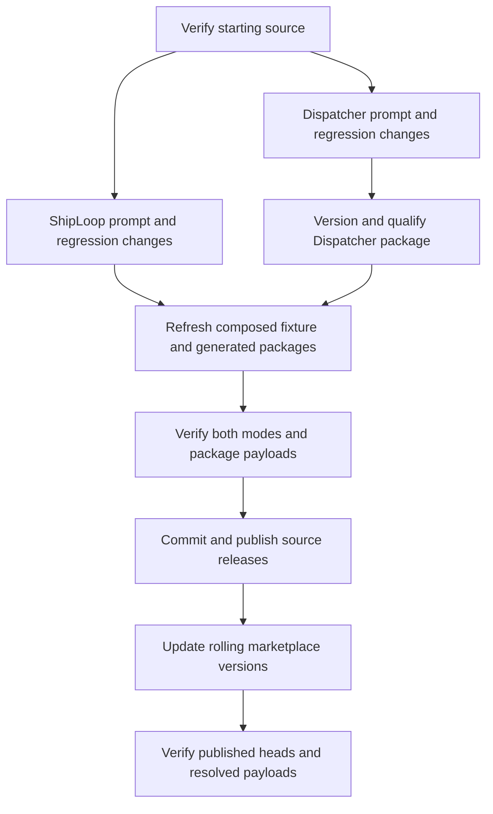

# Plan Orchestrator prompt repair and release

The implementation preserves script-owned orchestration while making information transfer and execution roles explicit at the returned-prompt boundaries. Native execution receives a fresh context; serial execution stays in the current conversation. Both produce useful, durable findings and pass through parent verification before acceptance.

## Plan and completion criteria

**Source releases precede marketplace validation so the rolling entries resolve the new packages.** Each arrow requires the preceding evidence; a failed check remains an explicit prerequisite.

| Work | Ready when | Done when |
| --- | --- | --- |
| Regression setup | Clean isolated worktrees and starting suites recorded | Tests fail for the missing worker findings or launch-learnings instructions; transport/role assertions cover both modes |
| Dispatcher prompts | Red evidence recorded | Parent launch/status/wait instructions stay with parent responses; task packets preserve scope, findings, checks and exact report return; parent consumes evidence |
| ShipLoop prompts | Red evidence recorded | Fresh native launch requires Current learnings beside the unchanged packet; worker and serial roles are explicit; discoveries and discrepancies return through existing summary/files; collection and verification consume them |
| Documentation | Current behavior verified | Serial guidance follows returned navigation, including deferred cleanup; interaction model distinguishes context, worktree, report, and acceptance |
| Packaging | Source edits reviewed | ShipLoop 0.19.3 and Backchain 0.3.7 / Dispatcher 0.1.3 are coherent; generated views and composed Dispatcher fixture match their declared source |
| Release | Frozen candidate checks and independent review pass | Source commits are merged and pushed; release tags identify verified tips; marketplace versions match published packages and resolved heads are checked |

The existing graph, readiness, report, handoff and receipt schemas remain compatible. Material findings belong in the existing result summary, with supporting files and their purposes identified there. Facts, hypotheses, decisions and unresolved questions stay distinct. A finding that invalidates the agreed task is returned for the parent's existing recovery/replanning boundary; it does not authorize a worker to alter the graph.

## Implemented interaction contract

| Boundary | Resulting behavior | Existing carrier |
| --- | --- | --- |
| Parent to fresh native context | Complete unchanged task packet plus a formatted Current learnings block; facts and hypotheses distinguished; scoped authority decisions carried separately through the selected Ask Agent contract | Native assignment, retained durably in the parent task record or handoff outside the worker workspace |
| Parent to serial task phase | Current conversation executes the complete bounded packet in the prepared workspace; no native launch or invented handle | Recorded main-context executor and returned execute/resume action |
| Bounded task to parent | Essential discoveries, rationale, checks and their limits, uncertainty, and next owner; supporting file purposes belong with the summary | Standalone result artifact and exact report response; chain manifest summary and any declared files |
| Parent to successor/recovery | Parent reads and evaluates relevant findings, preserves them outside the worker, and follows the next returned action | Existing parent handoff, accepted supplier archives and immutable task packet |
| Conflicting planning premise | Return the discrepancy and evidence before affected work; preserve task/ready/done authority | Existing blocked/result handoff and parent recovery or replanning boundary |
| Acceptance to cleanup | Current candidate verification precedes acceptance; cleanup and finish are separately returned actions | Existing navigation and helper receipt lifecycle |

The integrated Ask Agent 0.7.3 contract also requires authority continuity: applicable approvals, declines, pending and revoked decisions retain their scope, conditions and actual source. The returned launch action now names the selected Ask Agent contract, preserves host capabilities within existing task authorization, and carries these decisions separately from advisory learnings. Pending decisions grant no authority. No new schema, ledger or approval flow was added.

The frozen packet does not contain later conversational learnings. The host must
obey the returned assembly and retention instruction; a cold packet lookup cannot
reconstruct a learnings block that the parent never saved. The CLI validates the
existing structural contracts, not whether an LLM has supplied useful meaning.

## Evidence

Initial checks ran in isolated worktrees before edits. Dispatcher CLI: 25 groups passed; ShipLoop handoff: 16 tests passed; marketplace catalog: 22 tests passed. Each command exited zero and retained unchanged pre/post content fingerprints. Starting commits were Backchain `6fd7a86ca284d8467ec55413d9b2ab42667e7657`, skill-craft `918de64752ba4d253393c1891764a553493de48a`, and catalog `fdd045772ab59e89dd825dba509d5f4411ec803d`.

New regression checks first failed on missing Current learnings, missing material discoveries, and planning-fact application. Their source fingerprints stayed unchanged during execution. After the repair, five focused ShipLoop tests passed: both execution modes, fresh/cold packet behavior, a declared finding and rationale surviving actual worker cleanup into successor archives, and the native-pilot launch adapter. Independent review then tightened durable retention and the learnings format; those changes are included in final qualification below.

The first full Backchain gate passed 71 of 72 file suites and exposed one stale
CLI assertion requiring parent collection inside the worker prompt. The corrected
assertion preserves that prerequisite on the parent and checks its absence from
the worker. After also clarifying non-Git execution, all 13 Dispatcher suites
passed with `test-harness RESULT=PASS_CLEAN`, unchanged source fingerprints, and
no detected side effects. The published Backchain 0.3.7 / Dispatcher 0.1.3 source
is `86cf08050d0d3eb402ce29e687652d3d53600d5c`; its exact six-file package is retained
in the composed fixture with updated provenance hashes.

During this work, an independent source release advanced `main` to
`f8242e8e45830486403d0da58d8021b7783f5f4a` (Ask Agent 0.7.3, Improve 0.2.0-rc.7,
ShipLoop 0.19.1). The repair was rebased onto it, preserving that release and
using ShipLoop 0.19.2. Final checks therefore qualify the combined source and
updated Dispatcher fixture. The prior candidate had already passed 29 smoke
suites and all 20 package payload checks; those passes are not substituted for
qualification after this integration.

Before publication, a second concurrent release advanced `main` to
`66dd4ffea2e2bd991fe3ae205df256c9e05bd455` (ShipLoop 0.19.2 planning-intent
changes and Improve 0.2.0-rc.8). The repair was rebased onto that source and
versioned 0.19.3. The upstream changes leave `shiploop_chain.py` unchanged;
its navigator planning and skill guidance are preserved. Integration review also found a stale v3-only chain description despite executable v4 support. The chain-facing guidance now explicitly applies to v3/v4; an existing reconciled-v4 consumer test first failed on the missing wording after its real binding check succeeded. The final integration
checks passed on this final combined source: 35 v3 guidance tests, 14 v4 navigator tests, 5 v4 consumer tests, all 16 chain planning-context tests, the native-pilot authority adapter, generated-view parity and all 20 package payloads. The final targeted review found no remaining conflict.

The prior combined source passed the 29-suite smoke selection (including 269 unittest cases and 133 review-coverage checks), the full ten-test native-pilot suite, three async tests, and sixteen handoff tests. Its first full planning-context run exposed a new test-helper error: the helper assumed successful import always grants preparation, while required planning drift correctly returns inspection instead. After correcting that distinction, all sixteen planning-context tests passed. The two new authority assertions first failed as expected; after the prompt repair, both passed, together with ten prompt-integrity tests, generated-view parity, and all twenty offline package payload checks.

The lifecycle command reached its 900-second deadline after 28 of 49 tests passed. The parent retained that TIMEOUT evidence and selected only the interrupted and unrun cases for a longer continuation. All remaining 21 tests passed in 684 seconds, covering every lifecycle case across the two runs. The only intervening runtime edit was the parent launch authority wording; the final planning-context, adapter and prompt checks qualify that wording. This is combined case coverage, not a claim that one full lifecycle command completed.

The deterministic integration fixture verifies real discovery, rationale and uncertainty text in a manifest summary and declared evidence file, archives it, removes the supplier workspace, and checks that the same evidence reaches successor and cold-recovery packets. Phrase assertions separately guard prompt placement. The base standalone native instruction text fell from 1,057 to 466 whitespace-separated words after parent-only duties moved out; this excludes packet fields and optional planning references and is not a model-token measurement.

Independent review covered role ownership, durable retention, fixture provenance, serial navigation, and the final authority wording. All six copied Dispatcher package files match published source `86cf08050d0d3eb402ce29e687652d3d53600d5c` and their provenance hashes. No actionable findings remained in the final targeted review.

Local qualification receipts are retained under `/Users/dadleet/Documents/Codex/experiments/prompt-intent-release-20260922`: `dispatcher-final-6qs1ok_j`, `source-final-1qho286c`, `composition-final-5hdb_hv9`, `authority-red-avpdsskm`, `authority-green-ptaar7rq`, `lifecycle-remaining-e75k83cz`, `v4-scope-red-mossdnnt`, `final-navigator-integration-hvvhd7fq`, and `final-chain-integration-bskf8x_1`. Every command records source SHA, dirty-file status, content fingerprint, exit, timeout, and full log; failed and incomplete attempts remain separate from later passing evidence.

Release targets are Backchain **0.3.7** / Dispatcher **0.1.3** and ShipLoop **0.19.3**. The rolling marketplace entries retain their existing source locations and `main` tracking; Ask Agent **0.7.3** and Improve **0.2.0-rc.8** remain from the concurrent release. Publication requires checking the source commits and tags, then validating the catalog against the exact published commits resolved by its payload gate. Remote receipts and CI results are reported in the final release handoff.

These checks establish transport, instruction placement, archive retention and lifecycle mechanics. They do not establish semantic review quality or every host's native context isolation. The Markdown diagrams received source inspection; a rendered preview could not be inspected in this session.
