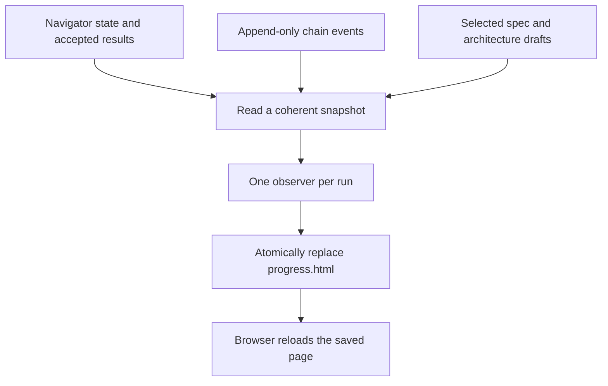

# Live ShipLoop progress view

Keep one ordinary `progress.html` with each run. A script observes saved state,
recorded worker activity, and selected documents; the page reloads that complete
snapshot automatically. No HTTP service or model invocation is required.

## Responsibilities and data flow

The observer is the only live-page publisher. `state.md` remains the navigator
authority; existing chain ledgers remain append-only. `transaction.md` is a
temporary recovery journal and is never treated as an activity feed. The view
uses current accepted state plus recorded activity, rather than inventing a new
event-sourced workflow. `report.html` retains its terminal-report role.

The page begins with the default preparation/work/release outline and explicitly
labels the concrete plan pending. Accepted items replace that placeholder as
planning completes. It shows current work, blockers, history, and expandable key
files. Implementation steps are generated during the run: the view reads each
accepted inline step plan's explicit dependencies or each bound execution graph,
and draws its prerequisite edges and recorded step status.
It rebuilds that diagram when graph or dispatcher state changes, including while
the parent action is parked. Parallel branches remain visible, with a text
dependency list beside the diagram. A missing graph is shown as pending, without
inventing steps from the default phase outline.

A latest on-disk document is a draft with a content hash and observation
time. Accepted producer results are shown separately; file existence or an edit
does not constitute acceptance. Missing documents remain visible as placeholders.

## Dependency-aware delivery plan

| Step | Depends on | Completion evidence |
| --- | --- | --- |
| Read-only snapshot adapter | Existing state/ledger contracts and baseline tests | Fixtures show plans, chain activity and changing documents; unsafe or unstable inputs are bounded and refused |
| Standalone renderer | Agreed snapshot shape | Escaped, responsive HTML contains dynamic step/dependency diagrams, embedded previews, freshness and refresh controls without external assets |
| Observer and CLI | Adapter and renderer | A real subprocess updates the file while the parent state stays unchanged; singleton/start/stop/restart tests pass |
| Default lifecycle | Observer | Init creates the view, packet commands recover observation, terminal state settles into a final snapshot |
| Qualification and delivery | All slices | Focused and full hermetic tests, independent review, release-boundary check, merge to main and verified remote push |

## Failure and lifecycle boundaries

Use a separate singleton lock for the observer and a non-blocking shared run lock
for sampling. Skip held locks or pending transactions; never recover state from
the viewer. Atomically replace the entire HTML file and retain the last good
page on failure. A successful observation, source activity and browser load are
different timestamps. Heartbeats allow the page to flag a stopped observer;
refreshing the browser does not prove the runner is alive.

Only selected, bounded regular text files within the bound repository/run may
be embedded. Reject symlinks, hardlinks, special files and escaping references;
apply existing credential screening and escape rendered text. This screening
does not guarantee all secret formats are detected. Registered source links are
conveniences; the embedded preview survives relocation.

Default observation stops after a terminal state has been re-sampled or after
30 minutes with no input changes; a later packet can restart it. An explicit
stop persists until explicit start. Terminal snapshots retain unverified
workspace-return/delivery warnings. HTML is disposable and must never gate a
workflow transition. The observer starts no model processes and owns no stage.

## Verification boundaries

Tests cover actual file publication and subprocess lifetime, interrupted saves,
exclusive writers, plan acceptance, documents edited between stage completions,
escaping and offline content. Browser refresh uses the standard reload API with
pause and reading-position restoration. Actual local-file browser cache and
position behavior requires a target-browser check; the available browser
automation rejects file URLs. HTTP preview checks, when performed, establish
layout only and must not be described as local-file refresh proof.
