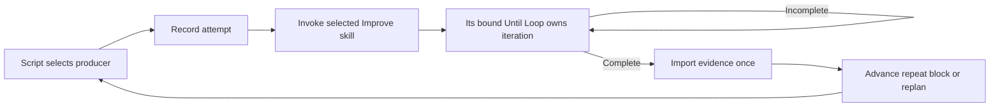

# Actual Improve after every ShipLoop step

Implemented September 17, 2026 in the isolated `codex/shiploop-actual-improve`
worktree, based on `8cd6fa979e1f72bf0d3753ab2aacbd0d4fc61b11`.
ShipLoop 0.12.0 defaults new public runs to navigator protocol 3. Existing saved
v1/v2 and managed runs retain their execution contract.

## Implemented behavior

- All 34 SDLC producers use the same post-step handoff: 7 preparation stages,
  18 stages per work item, and 9 outer stages. This includes no-change/N/A and
  failed or blocked attempts. Administrative pause/resume/halt are controls,
  not producers to review recursively.
- Test specification, baseline execution, test authoring, expected RED,
  implementation, focused GREEN, refinement, regression, documentation,
  skill assessment/validation, static checks and integration verification are
  discrete stages. The [flattened plan](shiploop-improve-owned-sdlc-plan-2026-09-14.md)
  lists the full lifecycle.
- Markdown parent state stores the one current action and child binding. The
  actual selected Improve card chooses its own Until Loop runtime and keeps
  child state under the workspace `.until-loop`. ShipLoop does not execute a
  replacement review algorithm or maintain a second convergence counter.
- Parent import checks runtime completion, exact task binding, terminal result,
  two distinct final review references and check evidence, then archives the
  evidence and advances atomically. Duplicate completion is idempotent.
  Missing, foreign or unfinished children leave the parent pending.
- `repeat` reruns the current step; outer `replan` appends uniquely identified
  corrective work, then reruns outer checks. Historical results remain retained,
  while progress marks affected outer checks pending again.
- Opt-in consumer-delivery contracts are required at v3 `plan`, after its child
  review, instead of the legacy `plan-improve` checkpoint.
- The child receives an explicit no-commit boundary; parent integration owns
  delivery authority. Runtime artifacts are excluded from workspace capture
  and return. V3 performs its once-only source return only after the final
  handoff child completes successfully, before importing that child. No later
  producer can invalidate an already-returned candidate. Release review
  reconciles effects rather than replaying an ambiguous external operation.
  If source return itself is a prerequisite for required consumer checks, the
  ordering conflict remains incomplete for reconciliation; the graph cannot
  claim pre-return evidence observed those later effects.

## Verification record

| Check | Evidence and scope |
| --- | --- |
| Protocol-3 graph | 7 tests: independently enumerated 34 stages, universal handoffs, blocked attempts, replay, cold recovery, corrective work/progress malformed bindings, bounded learning carry-forward and report progress. |
| Standalone runtime bridge | 9 tests using the actual bundled runtime: terminal import, package bindings, wrong/unsafe evidence, child ownership, settled-child import and lexical workspace aliases. Review judgments in these tests are synthetic. |
| Public CLI | 3 tests: default v3, pending child rejection, real runtime terminal import, cold recovery, idempotent callbacks and conflicting/unsafe receipt rejection. The third test uses real Git to reject early/unfinished/blocked returns, then return the final reviewed candidate and complete without a deadlock. Review judgments are synthetic. |
| Graph dry-run | 7 tests: default v3, explicit legacy v2, expected edges, per-item ownership and no live runtime/project execution. |
| Aggregate core | Passed `bash test/run-all.sh --group core`; final log `/tmp/shiploop-actual-improve-validation/core-rerun.log`. |
| Aggregate ShipLoop | All three local shards passed with terminal `run-all.sh: PASS` and exit 0; logs `/tmp/shiploop-actual-improve-validation/shiploop-{1,2,3}-rerun.log`. Late boundary edits were additionally checked in the focused suites below. |
| Final boundary checks | Workspace 27, consumer delivery 23, consumer CLI 6, actual Improve CLI 3 and v3 graph 7 passed after the late fixes. Scoped Ruff, Python syntax, generated plugin parity and diff checks passed. |
| Independent review | Found malformed-bound-skill recovery and wrong v3 dry-run owner labels; both fixed with regression coverage. The final actual Improve candidate review completed with two clean reviews and no remaining material findings. |

Initial aggregate failures exposed old fixtures relying on the former public
v2 default; those fixtures now explicitly select v2 while new tests assert v3.
A core hygiene check also found generated Python bytecode in the isolated
worktree. Test subprocesses now suppress bytecode; task-generated caches were
removed and the complete core group passed. No test expectation was weakened
to accept missing actual Improve handoffs. A subsequent boundary audit caught
the legacy-only delivery contract gate and premature workspace return. Both
now have protocol-3 regression coverage, including a settled child whose final
producer disposition remains blocked.

## Actual skill pilots

The live test-author and implementation pilots selected
`/Users/dadleet/.codex/skills/improve/SKILL.md`, resolving to
`/Users/dadleet/src/until-loop-v2/examples/improve/SKILL.md`, and followed its
bound `/Users/dadleet/src/until-loop-v2/scripts/until-loop` runtime.

1. At `test-author`, Improve found a missing blank-input test and changed only
   tests. Two subsequent separate clean reviews retained the meaningful expected
   RED: two tests, one failure because `Blue != BLUE`. Parent import advanced to
   `test-red` without premature production implementation.
2. At `implement`, the producer initially had two passing tests. Improve found
   accidental `AttributeError` behavior for a non-string input, added an explicit
   `TypeError` guard and regression test, then completed two separate clean GREEN
   reviews with three passing tests. Parent import advanced to `test-green`.

Both actual children completed after three cycles, imported once, tolerated an
identical callback replay without changing state, and cold-recovered the same
successor. These pilots found two macOS `/tmp` versus `/private/tmp` identity
bugs in bind/import; both were fixed and the original saved children/receipts
were retried successfully without bypassing validation. Disposable detailed
artifacts: `/tmp/shiploop-actual-improve-live.Et6i1j/live-pilot-report.md`.

Two further actual selected-skill pilots completed under
`/private/tmp/shiploop-v3-actual-improve-extra-gsl1w8d0`:

3. At `plan`, Improve repaired a missing prerequisite in `docs/prerequisites.md`,
   then completed two fresh clean verifier-backed reviews. The child finished at
   cycle 3, and parent import advanced to `prepare`. The first verifier attempt
   encountered an inherited Xcode environment failure; it was retained as a
   failure and did not count toward the clean pair.
4. At `document`, Improve repaired an actual ambiguity in `docs/usage.md` without
   changing product code. Two fresh clean reviews and passing documentation
   checks followed; the child finished at cycle 3 and parent advanced to
   `skill-assess`.

Both additional fixtures verified identical import replay and cold `next` from
`/`, with unchanged Git HEAD and only the allowed uncommitted document edits.
They use the same explicit synthetic-predecessor boundary as the initial pilots.
The separate final source review selected the repo-bundled
`skills/improve/SKILL.md` and its `runtime/until-loop` package. Its actual runtime
reached `phase: done`, cycle 3, with two consecutive clean reviews after the
material fixes. A fresh independent evaluator also found no material issue in
the final return/import boundary, consumer gate or learning propagation.
Evidence remains outside the returned source in the implementation worktree:
`.until-loop/working.md`, final snapshot
`.until-loop/evidence/improve-evidence-20260917T190317Z-521c360c7449.json`, and
accepted clean review results `11412c6ee0ea29e4dba733e4cfc2dbcb.json` and
`3d7f1935e1bbe2710a52f837df87f37d.json` under `.until-loop/results/`.
No source edits or commits were made by that reviewer.

## Limits and delivery

These are local mechanics tests and targeted actual skill invocations. Pilot
predecessor stages were positioned with explicitly synthetic graph receipts;
this is not a complete live 34-stage product run. The two initial live child
pilots used self-review, with that limitation recorded. No remote deployment,
consumer acceptance, token benchmark or cross-host execution is claimed.
Until Loop terminal status and evidence presence do not independently prove
semantic review quality or freshness after later edits; the selected skill and
host remain responsible for those judgments.

Implementation was returned from the isolated worktree to the original
`/Users/dadleet/src/skill-craft` checkout as a working-tree delta. Existing dirty
test documentation/inventory and unrelated experiment files were preserved;
HEAD and index were unchanged. The combined inventory contains 79 suites.
Post-return verification passed: inventory tests 14, public actual Improve CLI 3,
existing generalized-discovery tests 26, generated plugin parity and diff checks.
No `.until-loop`, `.shiploop` or cache path was returned. Backup and transfer
manifest: `/var/folders/_n/cth41tgs171367b_gghs0kgm0000gn/T/shiploop-actual-improve-return.1gyw5me4`.
At that initial source return, no commit, push, marketplace pin update or remote
release had been performed. The subsequent quality review below is a separate
run; the original no-commit reviewer does not satisfy its per-cycle commit rule.

## Subsequent quality review

The follow-up review re-read the last seven full Git commit messages and found
three material improvements: preserve an explicit relative Improve locator as
an absolute path at initialization so cold recovery is independent of cwd;
remove README guidance that described the legacy embedded review as current;
and cover the full v3 consumer-delivery path, including corrective work.

The new relative-locator CLI regression failed before the fix and passed after
it. Independent review passed all four actual CLI tests and all 24 consumer
delivery tests. The new consumer case rejects missing system/release evidence
at child import, preserves that same parked child, accepts corrected final
results, appends corrective work on replan, and requires the remaining outer
checks before completion. Its child judgments are explicitly synthetic.

These are material changes and reset this new run's qualifying review count to
zero. The earlier clean reviews are historical evidence, not substitutes for
two fresh consecutive reviews of this corrected candidate. The requested
per-iteration commit messages retain Review, Plan, Changes, Validation, Key
learnings, Remaining work, classification, and the resulting review count.
No-change iterations use explicit empty audit commits, without manufacturing
product edits or including runtime records. Detailed current review evidence
remains in the checked `.until-loop/working.md` in the isolated worktree.
