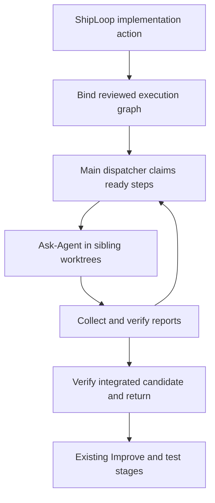

# ShipLoop parallel-chain integration

Status: implemented candidate (ShipLoop 0.16.0); base
`9827ca52bd73ac68c1d7d1c3d15d72b9482bd919`.
Scope: an explicitly bound parallel chain inside the current navigator-v3
`implement` producer. The existing work-item queue and SDLC order stay intact.

## Decision and authority

Reuse the selected Plan Dispatcher package as the child graph authority and the
selected Ask-Agent skill as the native execution contract. ShipLoop stays the
only parent SDLC owner. A worker cannot submit ShipLoop callbacks or choose the
next graph node. Scripts produce launch instructions; they never invoke a model
CLI or manufacture native completion.

The binding freezes parent run/action, reviewed graph, selected package bytes,
capacity, initiating Git checkout/branch/base and external worktree container.
An optional `chain_bindings` locator/digest in `state.md` prevents a missing or
changed sidecar from bypassing the parent completion guard. Existing runs do not
receive that field unless explicitly bound. No automatic mode conversion occurs.

The new ledger is append-only, timestamped Markdown event files. `recorded_at`
records dispatcher intake, `occurred_at` optionally preserves source time, and
sequence preserves append order even when reports arrive late. Prior entries
are never rewritten or sorted. The log records bridge intent, result and
reconciliation; it is not a second authority from which to reconstruct the
existing Plan Dispatcher snapshot. Recovery inspects actual child state, native
execution and Git effects. Incomplete intent never grants a second launch.

## Implementation graph and acceptance

| ID | Scope / ownership | Depends on | Ready | Done |
| --- | --- | --- | --- | --- |
| L | Immutable Markdown event module and tests | — | Event schema and single-dispatcher lock boundary agreed | Timestamp ties/late arrivals preserve prior bytes; duplicate IDs are inert or conflicting; corruption and competing-process cases covered |
| G | Sibling Git helper and real-Git tests | — | Clean explicit initiating checkout and external `.work-trees` root | Distinct indexes; containment/symlink/foreign roots rejected; exact contribution and guarded return verified |
| B | Bridge over selected dispatcher/Ask-Agent packages | L,G | Current v3 implementation action and complete reviewed execution graph | Frozen binding, capacity, claim/start/collect/verify/retry/recovery and final integration gates work through public commands |
| N | Navigator/CLI integration | B contract | Stable command and guard API | `next` prints recovery route; missing/incomplete binding blocks producer completion and Improve import; old protocols unchanged |
| T | Composition tests and documentation | B,N | Real pinned dispatcher fixture; temp Git repositories | Fan-out, eager successors, join, bad reports, unknown launches, target drift and cold recovery tested; generated package matches source |

L and G are independent. Bridge code and navigator routing can proceed in
parallel after agreeing their interfaces. Every change owns its focused tests;
the final hermetic aggregate is required after package synchronization.

## Git and return policy

Create per-attempt worktrees beneath an external `.work-trees/<repo-key>`
container, never inside the initiating checkout or another registered checkout.
The initiating checkout may itself be ShipLoop's whole-run execution worktree.
Its identity is the return target; the primary checkout and `main` are not
implicit destinations. Require a clean target for this first integration.

Each worker starts from an exact base containing its required accepted suppliers.
A multi-supplier join must assemble the required code before work starts or use
an explicit integration task whose ready contract accepts separate supplier
commits. A result must identify the actual clean worker commit. The final
integrated candidate must contain every accepted contribution and the initial
target state. Only that combined verified candidate returns by a guarded
fast-forward. Independent sibling branches are not each fast-forwarded in turn.
Target movement observed at validation and merge conflicts preserve work for
reconciliation. Cooperative chain returns share a lock in the target's private Git directory
through final target validation, fast-forward and postcondition checks. A busy
return fails without merging; after the competing return finishes, a stale base
must be reconciled. Manual Git commands do not honor this advisory lock, so the
guard does not claim compare-and-swap protection against those writers.

The enclosing ShipLoop workspace's final source return remains separate and
uses its existing once-only guard. No remote push, installation or deployment
follows merely from chain completion. Keep unresolved worktrees/evidence; no
automatic cleanup, force reset, stash or orphan-lock stealing.

## Verification and limitations

Baseline before integration: navigator-v3 22 tests and workspace 32 tests passed.
New tests use real Git and the pinned Plan Dispatcher v1 code as a test-only
fixture, with provenance and license. Synthetic worker/native observations are
labeled; they do not establish a host-specific callback or recovery capability.
Where native execution is exercised, record exact package bytes and actual
handles/results separately from the deterministic suite.

Check append-prefix preservation, equal/skewed timestamps, duplicate/conflicting
receipts, stale action/attempt/package identity, missing bindings, premature
parent completion, capacity, resource conflicts, launch-intent uncertainty,
interrupted allocation/return, target drift and rejected combined checks.
Preserve running reservations after uncertain completion. Fuzzy matching applies
to prose only; identifiers, graph edges, digests, Git topology and acceptance
are exact assertions.

Use `python3 -B test/shiploop-chain-ledger.test.py`,
`python3 -B test/shiploop-chain-git.test.py`, and
`python3 -B test/shiploop-chain.test.py` for focused tests, then synchronize
generated plugin views and run `bash test/run-all.sh`.

Full parallel work-item lifecycles would require another execution protocol;
this bounded integration deliberately retains today's per-action review/test
ownership. Cross-host recovery, distributed resource locks, power-loss/NFS
durability and exactly-once external effects need separate evidence.

## Review findings incorporated

- Validate clean exact contributions and supplier ancestry before child
  acceptance can release resources or unlock dependencies.
- Reconcile claim/retry responses lost after the child commits its transition;
  a later retry must produce a fresh attempt, not replay an obsolete claim.
- Recover a completed Git fast-forward from the persisted finish intent and
  exact target state if the process exits before recording its result.
- Require a passing final JSON proof bound to the proposed commit, separate
  from worker and settlement evidence; hashes alone do not establish success.
- Validate the external worktree container before binding. Retain the current
  action's binding through Improve while leaving historical bindings archival.
- Refuse new claims/starts during pause and refuse halt while a chain is
  unfinished. Collection and reconciliation remain available while paused.
- Repair only the exact private temporary hardlink left by interrupted event
  publication; preserve canonical ledger bytes and refuse ambiguous links.

The independent final review found no remaining concrete blocker in these
changes. Focused coverage: 18 bridge/parent composition tests, 5 real-Git tests,
and 10 ledger tests passed. Final validation is recorded below; these results
do not claim publication, installation, or host-wide qualification.

The [native pilot report](shiploop-chain-native-pilot-2026-09-18.md) records an
actual A/B fan-out, rejected B report, fresh B2 retry, verified J join and return
to a linked feature checkout. Its retained evidence distinguishes synthetic
prerequisite navigation from actual worker execution and verifies append-prefix
preservation. Reproduce it using the
[manual pilot guide](../test/experiments/shiploop_chain/README.md).

## Revised direction: native observation, one completion authority

The user subsequently selected native notification/collection and deferred
custom asynchronous message passing. The ledger remains append-only execution
history for audit and recovery; it is not a worker-progress bus. Durable reports
remain evidence inputs to verification. Native return, report publication and
accepted graph completion are distinct facts.

The [native status research and plan](shiploop-native-agent-status-plan-2026-09-18.md)
records actual per-host capabilities, gaps, parent-visible status design and
focused qualification criteria. Reuse the Ask Agent parent pending-job record and
existing dispatcher snapshots. Do not add transport, timers or progress records
to the terminal report inbox.

The user also requested an explicit done/not-done view and serial execution in
the main context. Accepted is the sole persisted done state; every other step
status is not done. A read-only completion projection must derive from it.
Serial mode uses the same DAG, claims, sibling worktrees, reports, verification,
settlement and guarded return, with one local executor and no agent dispatch.
Serial start atomically records main-context execution ownership without
fabricating a native worker handle. Continue through ready steps until all are accepted and
the combined return is verified; blockers remain incomplete and recoverable.

The implementation extension and its new validation must be recorded separately
from the already-completed native pilot below. Its frozen U16 receipts remain
unchanged.

## Parallel candidate validation before the serial extension

- All **93 ShipLoop suites** passed, including the full managed and action walks.
  The executed ordered suite list exactly matched the registered inventory.
- All **23 core groups** passed on their corrected rerun. The original aggregate
  exited 1 because its initial inventory test still expected 90 suites. That
  expectation was updated to 93 and the whole core group rerun passed. The
  original aggregate log remains a failed historical run; it was not relabeled
  green or repeated in full. The unchanged ShipLoop group finished successfully.
- The three new suites contribute 33 focused checks. The existing v3 guidance
  suite also passed after fixing the new guide's required section anchor.
- Generated plugin/package consistency and `git diff --check` passed.
- Actual native A/B fan-out, B rejection/retry, J integration and guarded return
  passed. Duplicate accepted-message replay was inert; the obsolete B message
  was rejected. Full live ShipLoop/Improve and host restart wake-up remain
  outside this pilot's evidence.

The [machine-readable validation record](shiploop-chain-validation-2026-09-18.json)
retains counts, base revision, raw-log hashes and the aggregate/core distinction.
The source candidate is in branch `feat/shiploop-dispatcher-20260918` at the
isolated external sibling worktree. At that validation checkpoint, this task had
not committed, merged, pushed, installed or published the candidate. Generated package views and READMEs are
included for review; installed checkouts remain separate.

## Serial execution and completion extension

The candidate now freezes `parallel` or `serial` mode in a v2 chain binding;
legacy v1 bindings remain parallel. Serial mode uses capacity one and an atomic
Plan Dispatcher `start.executor` grant for the main context. It uses the same
external sibling worktrees, readiness evidence, result verification and guarded
return, without launching native workers or manufacturing handles.

`done` invokes the identical `settle` operation. Completion lists derive from
accepted dispatcher steps. Terminal ledger identity binds attempt, verification
and outcome; changing downstream snapshots cannot append another settlement.
A crash after child acceptance but before bridge recording can reconcile that
single terminal result. Claim/start packets do not independently grant execution.

The public bridge suite passes 25 tests, including a complete real-Git serial
A/B/C/J chain, frozen old-package rejection, recovery, stale results and terminal
replays after downstream progress. The selected v2 fixture is the uncommitted
Plan Dispatcher 0.1.1 candidate based on `1a7e6f6`; its provenance records exact
hashes. Existing native/parallel cases retain the old v1 fixture. Native handles,
product changes and prerequisite judgments in these suites remain synthetic;
these tests do not qualify model adherence or a new native host campaign.

The separate Backchain ledger experiment has 13 focused passing controls,
including actual two-process optimistic-writer contention. Its `init`, typed
`apply`, `state` and historical `history` API can reconstruct completion and
explicit dependency revisions without snapshots. It is not integrated into the
bridge: production dispatcher state is still `state.json`, with immutable
receipts and an append-only bridge audit trail. See the
[ledger adoption design](/Users/dadleet/src/.work-trees/backchain/serial-dispatcher-20260918/docs/ledger-derived-orchestration-2026-09-18.md)
for generation fencing, old/new dependency closure and migration criteria.

The [native status plan](shiploop-native-agent-status-plan-2026-09-18.md) records
host-specific progress evidence and a pending capability-qualified pilot. It
also records U18 Ask Agent baseline/output/cleanup consumer obligations. The
completed U16 native pilot above is unchanged.

## Completed extension validation

All 93 registered ShipLoop suites passed across the three disjoint CI shard
selections, with each suite executed exactly once in that aggregate selection.
All 23 core groups passed. The Backchain companion passed its required full
`make test-fast` / filesystem gate (`PASS_CLEAN`, 66 aggregate file entries),
including the 13 replay experiment cases. Generated package parity and whitespace
checks passed. These are offline tests; the prior native pilot remains separate.

The [extension validation record](shiploop-serial-ledger-validation-2026-09-18.json)
records exact source and log hashes, package/candidate identities, test scopes
and retained limitations. The planning packet size advisories were compared with
the prior baseline and are byte-for-byte the same values. At that checkpoint all
candidate changes remained uncommitted and uninstalled in the two isolated sibling
worktrees. These timestamped records describe their tested snapshots; subsequent
commit receipts belong to the relevant Improve or delivery record.

## Cross-task ownership acknowledgment

The shared Ask Agent/Backchain charter was accepted after this candidate's
verification. Backchain owns this orchestration/worktree slice; Ask Agent owns
the generic native-delegation contract and independent host qualification.
The local acknowledgment is
`/Users/dadleet/Documents/Codex/coordination/ask-agent-backchain-20260918/backchain-ack.md`;
it identifies the exact charter and selected package hashes.

The completed pilot used Ask Agent 0.3.0 card
`cd3d4fc04cceef1c1364be99432ba2a66cdbf55a91583cc484d8162844793699`,
not the counterpart's newer U17 card
`462583a2ac85f7fe4b4945a3859dc05a788b1f7e1ad41275ec21bfdc27966b40`.
Their Git reference is byte-identical. The observed card changes strengthen
waiting-status guidance. Preserve the old binding and evidence; this task owns
a future bounded consumer qualification before claiming execution of the newer
snapshot. The coordination acknowledgment starts no new experiment or refactor.
