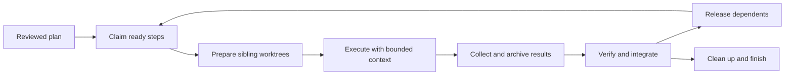

# Chain interaction audit and test plan

Baseline: `6a4bc45`. Scope: the existing ShipLoop per-step chain, selected
Ask-Agent 0.4 fixture, legacy compatibility, and the native pilot's observer.
Baseline smoke and all 31 observer controls passed before changes.

## Plan and completion criteria

1. Trace planning, package binding, claims, execution contexts, results,
   integration, cleanup, retry, recovery, and final completion. For each boundary
   record the owner, durable state, Git effect, next-context input, and existing
   test evidence. Distinguish runtime checks from instructions to the host.
2. Use concrete counterexamples to select missing tests. Extend the current
   public-CLI fixtures and real Git helpers. Reuse the ledger and fixture graph;
   add no scheduler, queue, dependency, state schema, or generic test framework.
3. Add regression tests first, make the smallest warranted repair, and retain
   positive controls for supported replay and cold recovery.
4. Run focused checks and independent review. If production runtime/state/Git
   changes, run the full existing ShipLoop inventory as required by the repository
   architecture. Keep offline and native qualification separate.

Done means every supported boundary has an explicit coverage disposition,
selected regressions pass, relevant existing tests pass, package views agree,
and remaining host-only assumptions are named. It does not mean testing every
possible interleaving or proving arbitrary generated code correct.

## Selected gaps

| Gap | Baseline evidence | Planned change | Oracle |
| --- | --- | --- | --- |
| Global native-pilot claims and finish are omitted from trace receipt validation | Removing claim or finish, failing finish, and moving finish before work all incorrectly produce `passed: true` | Reuse the existing exact terminal-receipt checker for global operations; require each step's claim before its start and finish after all step completions | Negative trace controls fail; valid A/B fan-out, eager C, and B+C join still pass |
| A dispatcher takeover is checked after some Git effects | Public serial start with the old owner exits with an owner error but adds a worktree and five bridge events first | Check the selected owner at the per-step public mutation boundary; retain read-only history/pending and supported recovery | Old-owner start, cleanup and finish preserve target, worktrees and ledger |
| Serial rejected attempts cannot be retired after replacement | Serial allocation has no adopted `worker` field, but superseded cleanup assumes one | Reuse the Git helper's existing allocation validation for both allocation modes | Serial reject, retry, accept replacement, retire old worker, finish; rejected code never reaches target |
| Successful verification may omit its workspace binding | Removing workspace from both input and verification still accepts a per-step candidate, contrary to the documented proof contract | Require workspace in new per-step positive evidence while preserving the shared legacy proof decoder | Missing or mismatched workspace refuses acceptance before target, dispatcher or ledger changes; correct proof still succeeds |
| Planning evidence must survive loss of conversational context | Graph identity is retained in ordinary Improve evidence, while the cold prompt may show a later transition | Extend the real Improve callback test through a cold implementation packet; reuse durable locators | Current action and graph/review evidence remain reachable without treating a structural receipt as semantic review |
| Generic runtime filename and risk of competing status copies | The dispatcher and bridge name the one current snapshot `state.json`; status views are already computed | Name new runs `plan-dispatcher-state.json`; resume legacy runs in place; reject two candidate files | New and legacy runs each maintain one authority, views write no completion copy, missing state fails, and duplicate files refuse before mutation |

The four baseline observer counterexamples are retained in
`/private/tmp/shiploop-chain-trace-audit-20260919.J7TKUS/observer-baseline-counterexamples.json`.
The composed handoff-import test interrupts after report and after deletion,
then confirms replay publishes each receipt once. The existing recovery
mechanism passed without modification. No live model run or installed-package
update is part of this audit.

## Coverage map

Test suites referenced below:

- [shiploop-chain.test.py - ChainIntegrationTests: public CLI state and compatibility coverage](../test/shiploop-chain.test.py)
- [shiploop-chain-lifecycle.test.py - PerStepChainTests: code-producing per-step interactions](../test/shiploop-chain-lifecycle.test.py)
- [shiploop-chain-git.test.py - Git helper cases: real worktree and commit boundaries](../test/shiploop-chain-git.test.py)
- [shiploop-chain-handoff.test.py - ShipLoopChainHandoffTests: archive and deletion boundaries](../test/shiploop-chain-handoff.test.py)
- [shiploop-chain-ledger.test.py - ShipLoopChainLedgerTests: append-only publication and recovery](../test/shiploop-chain-ledger.test.py)
- [test_trace.py - NativeHostTraceTests: retained native-event validation](../test/experiments/shiploop_chain/test_trace.py)

The following table maps supported interactions, including aliases and inspection
commands. It is a contract map, not a claim of complete branch coverage.

| Interaction and owner | State and Git contract | Context expected next | Coverage disposition |
| --- | --- | --- | --- |
| Host planning: step-plan, Backchain audit, selected Improve | Planning review precedes binding; review concerns the exact graph. No worker executes during review. | Current action scope, graph path/digest, ready/done criteria, dependencies and review evidence | Actual Improve CLI test `test_planning_improve_packet_carries_graph_identity_through_real_child_callbacks` checks transport. Semantic review is a host responsibility, not inferred from a digest. |
| Parent `bind` | Freeze graph, selected package bytes, target checkout/branch, mode and capacity in the indexed binding; initialize child once | Exact selected cards and current implementation action; changed bindings require replanning | Existing missing/stale binding, package drift, unsupported Ask-Agent, bad-parent topology and non-implementation tests |
| Parent `claim` | Ready subset only; reserve capacity and resources; journal intent/result. No worktree yet. | Exact attempt IDs, direct dependencies and ownership | Existing capacity, resource reservation, claim-response-loss and fan-out tests; new observer claim receipt controls |
| Parallel `start` without workspace | Return `prepare-workspace`; do not allocate or launch | Ask-Agent prepares one sibling branch/worktree at the requested base | Existing per-step lifecycle and Git adoption tests; prompt-driven creation still needs live qualification |
| Parallel `start` with workspace | Adopt the actual clean worktree; check common repository, sibling topology, base/supplier ancestry, scope and filesystem instance; produce one launch grant | Full worker packet, current target identity, owned paths/resources, handoff contract | Existing fan-out, stale-base, topology, allocation-reuse and packet-recovery coverage |
| Serial `start` | Record creation intent before Git allocation; persist a main-context executor; capacity one; no native handle or launch | Same task contract in the returned sibling checkout | Existing serial graph, both creation-crash windows, start replay and no-native-fallback tests; new owner preflight and serial retirement tests |
| Host launch, parent `launched` | Host launches only on a fresh grant; parent records the actual handle. Timeout or a missing response is not completion. | Handle plus attempt/workspace identity; parent remains dispatcher | Existing no-double-launch, missing-handle, native-stoppage and trace ordering tests |
| Parent `packet` | Recover the saved/reconstructed packet; never issue another launch grant | Self-contained assignment or reconciliation action, not assumed chat memory | Existing packet recovery and serial cold-recovery tests |
| Native progress and parent `observe` | Observation appends timestamps; neither progress nor a result file accepts a step | Parent may show progress and collect a terminal native result | Existing receipt-observation immutability and pending-state tests; observer distinguishes pending collection from terminal failure |
| Parent `import-handoff` | Validate exact attempt/base/files; archive first, publish report/envelope, then remove only declared worker-local handoff files | Durable parent archive references replace soon-to-be-deleted worker paths | Existing 16 archive controls; selected composed report/delete interruption regression |
| Parent `prepare` | Inspect source contribution W and current target T; construct candidate I in the stopped worker; do not advance target | Verify the exact returned candidate and workspace independently | Existing dirty/unowned-path, supplier, stale-target and semantic-combination tests |
| Parent `done` / `settle` | Same operation. Positive evidence binds receipt and W/T/I/workspace; integrate before acceptance; reject conflicts before Git. Negative evidence does not release dependents. | Accepted contribution/archive or explicit rejection; retry needs a new attempt | Existing semantic failure, exact replay, stale attempt, missing handle and post-acceptance crash tests; new workspace-proof and wider owner fences |
| Parent accepted `cleanup` | Remove only the accepted clean original allocation. Cleanup failure leaves acceptance intact. Branch refs remain. | Observable cleanup-pending action; descendants may use integrated code and archives | Existing cleanup failure, recreated-path refusal, removed-before-receipt recovery and descendant-executes-before-cleanup tests |
| Parent `retry` | Require stopped old attempt; journal retry; keep failed evidence/worktree; release reservations through child API | Fresh claim and attempt; old work cannot complete its replacement | Existing lost-response reconciliation, stale success and rejected/blocked cases; serial creation intent blocks premature retry |
| Parent superseded `cleanup` | Retire unintegrated old allocation only after an accepted integrated replacement; never merge rejected code | Old archives remain; no new execution grant | Existing parallel retirement and replacement-instance guards; selected serial retirement regression |
| Parent `history` | Read bridge events in append sequence; no child invocation, lock creation or repair | Audit chronology, including indexed past actions | Existing history/current/past/drift/corruption/no-repair tests |
| Parent `pending` | Read unaccepted steps and unmet direct dependencies/capacity; do not claim, launch or repair | Explicit remaining work and lifecycle blockers | Existing pending-state, malformed-child and serial-executor tests |
| Parent `next` / `recover` | Reconcile supported interrupted initialization/publication; expose durable unresolved operations; never infer native stoppage or relaunch | Exact replay/reconciliation action, selected package locations and current attempt | Existing cold recovery, lost-response, ledger crash, serial allocation and integration-intent tests |
| Parent `finish` | Require all steps accepted, contributions integrated, archives intact, owned worktrees removed and final verification; per-step finish is audit-only | Parent implementation may complete and enter its existing standalone Improve/test flow | Existing unfinished-parent guard, wrong final proof, archive corruption and final graph tests; new finish-observer and owner-preflight controls |
| Standalone Improve after chain | The navigator owns its own cursor; Improve may refine/repeat/block after chain completion. It is not another dispatcher step. | Existing parent completion callback and bounded candidate review | Existing Improve repeat/refine/blocked and unfinished-chain guard tests |
| Ledger append/recovery | Caller holds the run lock; events are immutable, hashed, sequenced and timestamped. Clock skew does not reorder history. | Read-only views versus explicit recovery stay distinct | Existing 10 ledger cases include competing processes and actual SIGKILL after hardlink publication |

## State authority and context boundaries

The selected dispatcher owns graph, claim, execution, acceptance and retry state.
The bridge owns immutable configuration, Git integration/cleanup receipts and
parent action gating. Its append-only audit derives bridge lifecycle and expected
target position; it is not a second scheduler or a native message bus.

New dispatcher runs use `dispatcher/plan-dispatcher-state.json` as their sole
mutable step-status authority and validate it against immutable inbox receipts.
Legacy runs keep `dispatcher/state.json` in place without a second copy. The
dispatcher and bridge reject two candidate files even when their bytes match;
they do not guess which is newest or fall back from a corrupt file. Read-only
status and completion views are calculated and never persisted as a second
current-state snapshot. Generated run state is outside Git checkouts and survives
interruptions and finish until explicit run disposal.

The dispatcher does not rebuild its snapshot from a child event ledger. `history` is therefore an
audit view, not a promise to reconstruct the entire dispatcher from bridge events.
Missing/corrupt child state must fail closed; history can still be inspected when
the indexed bridge records remain valid. This boundary must remain explicit when
selecting a newer dispatcher package.

This audit compared the frozen Ask-Agent 0.4 card and Git reference with the
canonical working contribution: both matched byte-for-byte. The original
dispatcher-v2 runtime scripts matched Backchain candidate `0a11b1a`. This increment
explicitly refreshes `state.js` and `references/protocol.md` from `ea25f73`, whose
repository gate passed; `PROVENANCE.json` records the commit and each file hash.
The protocol refresh also clarifies that native stoppage is verifier evidence,
not an extra dispatcher `settle` input field. Other fixture files retain their
recorded origins. Tests qualify these selected bytes, not an installed package.

| Context | Must receive | May change | Must return or retain |
| --- | --- | --- | --- |
| Main dispatcher, including cold recovery | Current action/binding, selected packages, graph, pending/recovery actions, actual native handles | Claims, validated bridge operations and invoking target through guarded integration | Durable lifecycle evidence and observable status; execute the returned recovery action |
| Parallel worker | Inline task, ready/done criteria, workspace/base, ownership, direct supplier inputs, result contract and relevant skill instructions | Its assigned sibling checkout and worker-local handoff only | Clean owned commit or blocked/failed result, observed workspace, checks and handoff manifest; leave acceptance, merge and removal to parent |
| Serial main-context executor | The same packet plus recorded local executor identity | The assigned sibling checkout, one task at a time | The same evidence/handoff contract; no native launch or fabricated handle |
| Parent verifier | Archived result, source W, current T, prepared I, exact workspace and test obligations | Verification evidence and subsequent parent bridge calls | Actual check outcomes bound to I; worker self-report alone is insufficient |
| Selected Improve context | Candidate scope, graph identity during planning, evidence and the existing owner callback | Its bounded review candidate | Actual terminal review result; blocked/stopped review does not authorize execution |

## Minimal test strategy

Use deterministic code-producing workers and synchronization gates to prove local
overlap, joins and recovery. Assert exact identity, state, commit ancestry, archive
bytes and preservation of unrelated work. Allow narrative summaries to vary.
Shared setup is reused only inside an established isolated fixture; each test
owns a disposable repository and cleans it up. Existing full-suite registration
already covers the modified suites.

Keep actual Ask-Agent worktree creation, cross-host completion delivery, parent
restart after an unrecorded native launch, nested-worker stoppage and shared MCP
service contention as explicit live-qualification cases. Filesystem isolation
does not prove isolation of a remote database or deployment target. No new lease,
message queue, automatic relaunch or dispatcher migration is justified by this
local test increment.

## Verification record

The initial ShipLoop smoke passed at `6a4bc45`; the connected dispatcher's
baseline `--dispatcher-only` aggregate passed at `0a11b1a` before edits.
Counterexamples drove the changes: the observer's new controls failed 14
subcases, owner and workspace checks reproduced unsafe effects/acceptance,
and the three filename/authority tests failed on the old fixture.

Focused verification passed:

- Native trace observer: 34 cases, including claim-before-start,
  finish-after-all-integrations, failed/missing/early finish, and finish replay.
- Expanded real-Git lifecycle: 22 cases, including serial retirement, stale-owner
  preflight, workspace evidence and both import crash windows. This local full
  run preceded the filename fixture refresh; final CI must cover the refreshed
  fixture as well.
- Filename/authority integration: 3 cases against the refreshed fixture.
  The duplicate-file diagnostic can come from either the bridge or selected
  child helper; assertions accept both while requiring identical state and Git.
- Git helpers: 16 cases; handoff/archive: 16 cases; append-only ledger: 10 cases.
- Actual Improve CLI: 8 cases, with the planning case extended through cold
  implementation recovery. Review judgments remain fixture inputs.
- Dispatcher source: 37 state cases, 20 CLI groups and 2 compound groups;
  its required full repository gate reported `PASS_CLEAN`, 171 reported cases,
  zero failures, run `20260919T151816Z-d46e26`. Inspected stderr contained fixture
  diagnostics/help; temporary fixture leftovers were outside product paths.
- Independent read-only reviews found no must-fix in the observer, lifecycle
  repairs, or single-file selection. Ownership preflight assumes a cooperative
  single dispatcher; it does not atomically fence a concurrent external takeover
  across separate Git/child processes.

The final published ShipLoop commit requires the existing full CI selection
(`core`, `shiploop-1`, `shiploop-2`, `shiploop-3`) plus plugin synchronization.
The PR records its exact commit and CI result. No native-model or deployment
qualification is inferred from any of these local checks.
