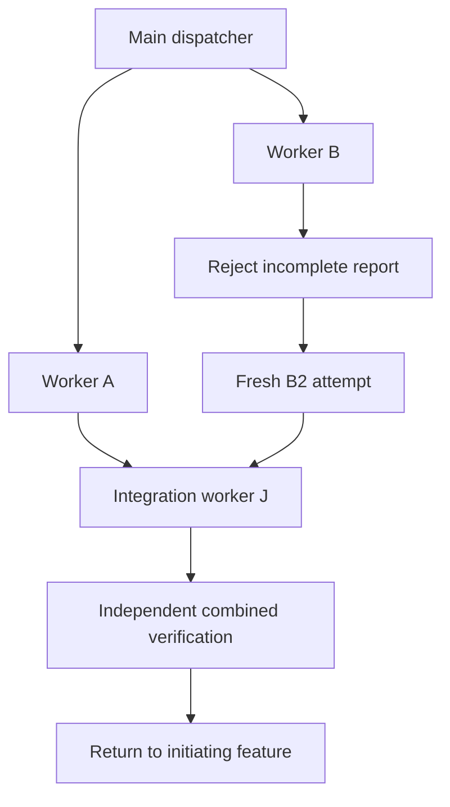

# ShipLoop chain: native pilot, 2026-09-18

Result: the local native-agent chain completed and returned its verified combined
commit to the initiating **linked feature worktree**, preserving the primary
`main` checkout. This is a bounded integration observation, not a full live
ShipLoop SDLC run or a cross-host qualification.

## Apparatus and scope

The [manual driver](../test/experiments/shiploop_chain/README.md) used the actual
ShipLoop public `chain` CLI, the selected live Plan Dispatcher package from the
Backchain checkout, and Ask-Agent 0.3.0. The parent launched fresh native
`default` agents, with no inherited conversation or model override, then retained
their actual native handles. A and B were both launched before collection; the
parent continued implementation and regression work while they were pending.
There was no model subprocess launcher, shell imitation of an agent, or role
substitution. J used a further native packet reviewer and collected it before
returning. Native completion notifications and native status collection were
available; no collection call was rejected.

The actually bound main card SHA-256 was
`cd3d4fc04cceef1c1364be99432ba2a66cdbf55a91583cc484d8162844793699`;
Git reference SHA-256 was
`127e0fad5af53067360e3429fd319870fec4f08f09a2f697bc6ccd4f533321fd`.
This is not a claim of testing the later U17 main card, even though both cards
use version 0.3.0. The completed pilot binding is preserved unchanged.

The three-node graph was `A,B -> J`, capacity two. A implemented arithmetic in
`toy/add.py`; B implemented whitespace/case normalization in `toy/format.py`.
J merged the exact accepted supplier commits and checked their composition.
The independent read-only oracle lived outside every worker checkout. Result
identity, clean HEAD, file ownership, supplier ancestry and behavior were exact
assertions. Fuzzy prose matching did not decide acceptance.

Synthetic prerequisite receipts positioned the disposable fixture at a v3
`implement` action. No live survey, planning, Improve review, deployment or
whole-product run is claimed by those prerequisites.

## Observed results

| Native task | Returned status | Parent acceptance / result |
| --- | --- | --- |
| A | SUCCEEDED | Accepted after independent checks; `b15644887b28c6ede563d28a1a4353c22c9e2483` |
| First B | SUCCEEDED | **Rejected**: result omitted the required attempt identity; its report and worktree were retained |
| B2 | SUCCEEDED | Fresh attempt accepted after independent checks; `0002f3d8b2eafecb9e5951b1404733d6eb14d744` |
| J | SUCCEEDED | Both accepted suppliers merged with `--no-ff`; combined oracle passed at `4904806d28d9e23d9f632ef751b6914dd4967057` |

The first B result was settled with verification failure only after native
completion, then explicitly retried. No immutable report was repaired in place.
J became ready after B2 acceptance. It remained unable to update the initiating
target; the parent independently verified J, settled its stopped attempt, and
submitted a separate candidate-bound passing proof to `finish`.

The final check proved
`normalize('Result ' + str(add(2, 3))) == 'result 5'`. It also proved both exact
supplier commits were ancestors of J's clean HEAD. The feature advanced from
`1e29f8ed096e44176fd4c534cee40eba927e700f` to J's commit. Primary `main` remained
at the original commit and both checkouts were clean. Final dispatcher state was
accepted `[A,B,J]`, complete `true`, with no active or ready steps. All required
native workers had returned; no job remained pending.

Four allocated worker worktrees (A, rejected B, B2, J) were pairwise siblings
under an external `.work-trees/project` container, alongside the initiating
feature checkout. No checkout contained another. A pre-join manifest of 33
canonical ledger files matched byte-for-byte after completion; the final ledger
had 51 events. New events appended rather than rewriting the earlier history.

An additional asynchronous-message probe replayed A's exact accepted envelope:
the public `report` command returned the same receipt successfully. Replaying the
original rejected B envelope after B2 acceptance failed with `attempt is stale`.
All 64 preexisting dispatcher and bridge-ledger file digests remained unchanged.
`messaging-replay-probe.json` retains these results. The probe initially expected
exit 2 for rejection; the dispatcher uses exit 1. Correcting that test expectation
required no product change. This demonstrates duplicate/stale message handling,
not missed-notification recovery or automatic parent wake-up.

## Learnings incorporated

- Explicitly copy/fill the result template so `step` and `attempt` survive the
  handoff. A worker's success statement alone cannot unlock dependencies.
- Print the exact independent-oracle argv and digest in the manual dispatch
  brief. The original parent task supplied them, but the first generated brief
  was not independently sufficient. Preserve old briefs; improve future ones.
- Record the worker's actual starting revision/branch and allow several merge
  commits for an integration node. Do not impose a one-commit rule on a join.
- After the last accepted node, direct the caller to final verification/return,
  not to claim another node.

The production bridge's crash reconciliation and independent final-proof checks
were hardened during the working pilot. A source-hash manifest was first taken
after initial launch, not before it. The bridge, navigator guide reference and
manual driver changed after that manifest; the final source hashes and changes
are recorded with the retained evidence. Final acceptance/return used the
finished bridge, and deterministic tests cover the final implementation. This
was not a frozen-source benchmark, prompt A/B study, timing study or token study.

## Evidence and limits

Local evidence is retained at
`/private/tmp/shiploop-native-chain-20260918-live/`: `context.json`, immutable
worker reports, exact public command results, accepted/failed verification,
`results/finish.json`, `final-view.json`, and `final-integrity.json`. The latter
records final source hashes, four sibling paths, and preservation of the
33-event prefix. The [integration plan](shiploop-chain-integration-plan-2026-09-18.md)
records automated coverage separately. Temporary evidence paths are local
receipts, not published fixtures or portable installation paths.

This establishes one observed local path with an actual rejection/retry and
join. It does not establish speedup, exactly-once external effects, power-loss
durability, remote resource isolation, host restart recovery, or a full live
Improve cycle. Production binding remains explicit and scoped to one current
implementation action. The skill-craft candidate itself has not been merged,
installed or published by this pilot; only the disposable fixture's feature
branch was advanced.
