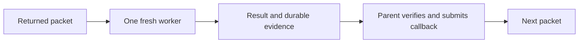

# Serial INNER context: packet-only delivery and ledger experiments

## Decision

ShipLoop returns packets; it does not control the host input stream. Keep the
portable opening **Clear and then execute the prompt.** The operational route
is one native fresh assignment worker at a time, without inherited conversation,
when the live host exposes the required tools and a return route to the parent.
The parent verifies the result and alone submits the ShipLoop callback.

Bound implementation chains retain their existing mode and executor. Parallel
chains keep their capacity and bypass this serial boundary. Explicit serial
chains run in the main context without agents, so only callable reset or manual
handoff applies there. Do not wrap a chain in another worker or restart an
existing attempt. Choose the implementation-chain route before delegation.

An already-fresh assignment does not clear or delegate again because recovery
reprints the prefix. Improve keeps one fresh context for its whole invocation
and follows its existing selected delegation and ownership policy.

If a same-conversation reset is actually callable, the host may use it and the
saved recovery command. Printing `/clear` in tool output is not that operation.
When neither route exists, use the printed pause command and retain the operator
handoff: host clear or fresh conversation, exact Recovery command, then printed
Resume command. `next` only reads state; it does not unpause.

See the [shared packet prefix](../skills/shiploop/scripts/shiploop_navigator_v3_prompts.py),
[durable handoff contract](../skills/shiploop/SKILL.md#durable-handoff), and
[packet-only route](../skills/shiploop/references/navigator.md#packet-only-context-boundary).
Claude documents both [sequential subagents](https://code.claude.com/docs/en/sub-agents#chain-subagents)
and [fresh non-fork context](https://code.claude.com/docs/en/sub-agents#what-loads-at-startup).
These documents support the mechanism; they do not qualify every host or prove
that a particular returned packet was followed.

## Live ledger study, September 21, 2026

Claude Code 2.1.278, observed model `claude-sonnet-5`. Separate persistent sessions
and timestamped append-only fixture ledgers compared the exact directional
prefix against the same prefix with its first line replaced by `/clear` and
`Then execute the prompt.` Both variants arrived as tool output. Safe mode
disabled custom skills; native worker tools were unavailable. Separate fresh
control fixtures used an external driver to issue standalone `/clear`.

| Route | Normal case | Resumed case | Verified fresh entry |
|---|---|---|---|
| Directional sentence in packet | W1=11 correct; canary retained | W1 preserved, W2=13 correct; canary retained | 0/2 cases |
| Literal `/clear` in packet | W1=11 correct; canary retained | W1 preserved, W2=13 correct; canary retained | 0/2 cases |
| External host clear, then recovery | W1=11, W2=7; total 18 | Existing W1=11 plus W2=13; total 24 | 2/2 cases, 3/3 resets |

All four corrected prompt-only observations completed their sole current
assignment, retained their session ID, and recalled their seeded canary. The
model rejected the reset instructions embedded in fixture output. Those results
do not establish how a loaded, authorized ShipLoop skill behaves, and did not
test the native-worker route.

Each standalone clear control emitted `conversation_reset`, changed session ID,
and returned a zero-model-token command result. The same recall challenge
succeeded immediately before clear and returned `UNAVAILABLE` afterward. The
previously pending result was appended after recovery. Earlier ledger bytes
remained unchanged; step completions and event IDs were unique. In the resume
case, durable W2 inputs `[6, 7]` correctly displaced an old conversational hint
of 99, yielding 24 without repeating W1.

The external-driver control demonstrates durable recovery, but is not itself
a packet-only solution. It agrees with the documented [host command behavior](https://code.claude.com/docs/en/agent-sdk/slash-commands#reset-context-with-clear).

## Corrections and evidence limits

The initial allowlist accepted only an absolute helper path. Both initial A
cells chose its valid relative equivalent and were denied before reading the
packet. They are retained and excluded. One corrected matched run allowed both
spellings; there were no retries to seek favorable model responses.

The raw normal A/B reporter expected both steps although those observations
requested only W1. Separate adjudications preserve the raw reports and score
assignment PASS, freshness FAIL. Separate positive-control fixtures prevent
previously completed work from counting as post-clear recovery. Independent
raw-evidence review and the parent verifier agreed on the qualified results.
Raw streams, ledgers, judgments, manifests, and the reproducible verifier are
retained in the operator's external evidence archive rather than the package.

This is two small cases on one host/model, not statistical reliability, token
savings, full ShipLoop, installed-package, or cross-host evidence. Regression
tests cover prefix selection across INNER stages/items and producer/Improve
owners, recovery, and exclusion of stopped states. They do not prove a native
host performed a reset. No model launcher, state schema, or scheduler was added.
Bound-chain fixtures additionally check that fresh and cold navigator packets
preserve parallel capacity guidance and serial main-context ownership without
changing the binding or restarting an attempt.
