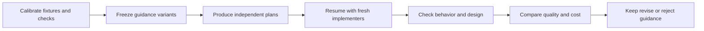

# Coding-guidance experiment plan

## Decision and deliverables

**Decision:** Which conditional coding instructions improve actual plans and implementations, preserve existing behavior, and remain economical in a small-context workflow?

This is an experiment design, not an experiment result. No coding-agent trials, benchmark workloads, live notifications, installations, or production workflow changes were performed for this plan. The candidate instructions are isolated in [shiploop-coding-guidance-candidate-2026-09-18.md - treatment: core instructions and conditional cards](/Users/dadleet/src/skill-craft/docs/shiploop-coding-guidance-candidate-2026-09-18.md). Fixtures, hidden tests and a v3 study adapter remain to be built and calibrated.

Interpret “L&I-token-efficient” as documentation that is clear for people and economical for LLM use. Cover notifications as both user-visible status and application/operator delivery. Treat a flyweight specifically as sharing equivalent intrinsic representations; separately assess caches, pools and other shared resources where relevant.

The twelve requested concerns map to ten families: E01 existing code; E02 documentation; E03 library reuse/augmentation; E04 composition and layering; E05 flyweights; E06 state; E07 notifications; E08 security; E09 logging/debugging; E10 feature flags. Test both a case where the practice helps and one where blanket application causes harm or needless work.

| Concern | Candidate clause | Positive / control discrimination | Primary observable | Phase |
| --- | --- | --- | --- | --- |
| Existing code | Existing behavior; Core inspection | Repair both consumers / recognize already-supported behavior | Required outputs and compatibility; justified scope | 1, 3 |
| Human/LLM documentation efficiency | Documentation | Three complete layouts / reject omitted critical facts | Correct reader action, then total measured usage | 2; stale-link holdout |
| Library reuse/augmentation | Libraries | Supported extension / decline unsuitable API | Real pinned API behavior and retained contracts | 3 |
| Composition | Composition and layers: collaborators | Shared policy across entry points / honor a required framework subclass | Equivalent real-entry-point behavior | 3 |
| Proper layering | Composition and layers: dependency direction | Portable policy / avoid needless forwarding layers | Core runs without transport/storage startup; no control regression | 3, 4 |
| Flyweights | Flyweight and shared resources | Repeated immutable representation / low reuse or mutable data | Correct isolated behavior within calibrated resource budget | 1, 3 |
| Security | Security | Tenant-owned operation / proportionate local validation | Denial before protected effects; no secret exposure | 3; flag holdout denial |
| State | State | Concurrent persisted update / stateless or already-owned data | Invariants after interleaving, retry and restart | 3, 4 |
| Notifications | Notifications | Commit plus ambiguous acknowledgment / synchronous inline status | Truthful state, retained obligation and contracted visible effects | 3, 4 |
| Logging | Logging and debugging: records | Correlated redacted records / simple local diagnostics | Required safe records and correct sink-failure policy | 1, 3 |
| Debugging | Logging and debugging: investigation | Diagnose planted configuration cause / no needless instrumentation | Correct causal repair, preserved error and zero disabled debug construction | 1, 3 |
| Feature flags | Feature flags | Coherent rollout / retire release flag or use ordinary configuration | Defined branch/default behavior and preserved authorization | 3, 4 |

Composition/layering and logging/debugging share fixtures but retain separate assertions and rubric rows. Passing one does not establish the other. Phase 0 must turn each primary observable into named assertions before that case runs.

## Starting evidence and scope

Inspected source: `/Users/dadleet/src/skill-craft`, branch `main`, HEAD `004447fd395d1820332cf454c9f966c4c85f63fe`, September 18, 2026. The checkout has extensive uncommitted work. Freeze exact file contents and package/reference identities at study preparation; HEAD alone does not identify the treatment. Reopen the active instructions if the checkout changes before launch.

Current guidance already includes concise colocated contracts, conventions, dependency restraint, redacted diagnostics and error preservation. Measure improvement over the real current guidance, not an artificially weak “just code it” baseline. [testing-and-documentation.md - Documentation: existing compact contract guidance](/Users/dadleet/src/skill-craft/skills/shiploop/references/testing-and-documentation.md:465), [shiploop_navigator_v3_prompts.py - IMPLEMENTATION_CONSTITUTION: existing coding and diagnostics duties](/Users/dadleet/src/skill-craft/skills/shiploop/scripts/shiploop_navigator_v3_prompts.py:313)

Use the prior assessment for the concrete plan-to-execution handoff question. Its 36 passing structural checks are prior scoped evidence, not results for these proposed experiments. [shiploop-inner-loop-due-diligence-2026-09-18.md - Scope and evidence status: prior assessment limits](/Users/dadleet/src/skill-craft/docs/shiploop-inner-loop-due-diligence-2026-09-18.md:18)

## Hypotheses and treatments

H1: A small decision-oriented core plus relevant conditional guidance reduces missed design decisions and defects compared with current instructions.

H2: Explicit plan locators and decision rationale improve implementation after a genuine context break.

H3: Guidance about when to decline a pattern reduces overengineering without weakening required behavior.

H4: Complete, focused documentation reduces total cost of correct downstream work compared with a longer complete form. This is not assumed true; retrieval overhead can reverse the outcome.

Primary behavioral comparison:

| Arm | Material supplied | What changes |
| --- | --- | --- |
| A — current | Frozen active v3 guidance, existing references and normal project instructions. | Nothing; retain its actual baseline/test/review obligations. |
| B — conditional candidate | The same material plus the candidate core, card index and accessible conditional cards. | Engineering decision/output cues and conditional retrieval only. |

Keep model, effort, tools, fixture contents, accepted requirements, stage ownership, review policy and resource caps equal. Do not infer a baseline from `HEAD~1`. Record which material each consumer actually received and read, including referenced files and selected Improve card/runtime identity.

First test the incremental value of B. If useful, consolidate duplicated prose and evaluate the consolidated version as a new candidate. An optional later whole-checklist arm can test retrieval versus always-loaded guidance, but should not multiply the initial study unnecessarily.

## Shared fixture contract

Each behavioral family has a positive scenario and a counterexample/control. Build small repositories with real code paths and conventional local tools. Use Python standard-library fixtures for storage/state/backend cases where adequate; use an existing browser-capable JavaScript fixture for rendered UI. Use a pinned real library in E03. Record synthetic collaborator substitutions and retain required real-boundary follow-up separately.

Every scenario definition must include:

- User request and accepted behavior, existing code/version, relevant docs/examples, baseline observations and permitted edit scope.
- At least one meaningful challenge: seeded defect, missing behavior, misleading precedent, or tempting unnecessary mechanism. Do not name the intended design in the user request.
- Ordinary, boundary and failure/recovery cases, preserved invariants, independent expected outputs, and representative performance/resource workloads when relevant.
- Setup, clean starting identity, controlled clock/event schedules when needed, teardown even after failure, and focused/smoke/full-suite membership.
- A calibrated correct reference and one or more plausible wrong implementations that the checker rejects. References illustrate correctness; they are not the only permitted designs.
- Exact executable commands/selectors after implementation of the fixture. Commands below that are not verified existing commands are specifications, not claims that a runner already exists.

For no-change controls, the original seed may already satisfy the contract. Calibration must confirm that fact and reject harmful overengineered mutants; do not manufacture a failing baseline merely to fit a RED/GREEN template.

## Experiment families

### E01 — Existing code: preserve behavior and reject bad precedent

**Hypothesis:** Tracing the current execution path and consumers improves scoped changes more than copying the nearest example.

**Positive scenario:** Add an export option to an existing import/preview/write application. A shared canonical normalizer exists, but preview and committed output differ for one boundary value. Current tests cover only preview. The accepted contract defines both paths. Include a stale design note proposing a competing implementation.

**Control:** The requested behavior is already implemented behind a supported input option. Verification and a small documentation correction may be sufficient. A separate variant contains unsafe adjacent code that must not be treated as a binding convention.

**Plan evidence:** Identify the actual path, authoritative contract, relevant consumers and baseline defect disposition; explain reuse versus a necessary correction.

**Independent checks:** Ordinary and boundary inputs produce consistent required preview/commit results; prior supported behavior remains; relevant inputs are not mutated. For the already-supported variant, behavior remains correct without gratuitous code/dependency changes. Review scope and rationale rather than imposing a line-count quota.

**Mutation controls:** A preview-only fix, copied obsolete validator, unrelated rewrite and a test expectation altered to match the defect.

### E02 — Documentation: correct use per total token cost

**Hypothesis:** Compact complete contracts and selective references help a fresh maintainer act correctly at lower total cost.

Freeze the same code and critical fact inventory into three documentation packages: (D1) a complete prose/module guide; (D2) concise colocated contracts and one runnable example; (D3) concise entry/index plus focused references. All three must preserve the same essential facts. An intentionally overcompressed document that omits a side effect is a calibration mutant, not an equivalent arm.

This is an independent supporting study of documentation layout, not an A/B estimate of the candidate guidance's effect. D1/D2/D3 hold semantic content constant; they do not represent current versus candidate ShipLoop policy. A winning layout can inform a later frozen treatment, which must then be compared separately before attributing improvement to B.

Use three downstream tasks: call an API with a subtle default and mutation rule; fix a caller while preserving retry/exception behavior; and recover an interrupted operation without replaying a committed effect. A fresh reader receives only the assigned repository/docs and task, can inspect code normally, and must explain the contract and complete the action. No author chat or hidden reference solution is supplied.

**Independent checks:** Correct behavior, side effects, errors, ownership and recovery; working example commands and links; no lost critical caveat. A blinded reviewer checks readability and ease of correct use. Code inspection is allowed and its cost counted; do not force the reader to rely on documentation that is actually stale.

**Metrics:** Critical-fact accuracy; correct downstream patch/action; total model input/output usage across turns; bytes/tokens read from docs, code and tools; repeated retrievals; time and number of navigational steps. Distinguish document length, provider-reported total usage, cached input, and charged cost. Missing telemetry is unavailable, not zero. Label tokenizer or character estimates and never combine them with measured usage as one comparable total.

For fixed-layout trials, authoring is held out to isolate reader cost. Separately report measured author/update cost when available and amortize it as `author cost + N × reader cost` at stated N; do not claim a net saving from shorter files alone. Include one stale/renamed-reference holdout. No requirement to add docstrings to trivial self-explanatory code or create four empty documentation sections.

### E03 — Libraries: reuse, extend or deliberately decline

**Hypothesis:** Inspecting the actual version/API produces safer reuse and smaller justified adaptations.

**Positive scenario:** A pinned client already supports retry policy, structured errors and an extension hook. Add request metadata or an application-specific conversion while preserving those contracts. Supply a tempting example from an incompatible newer version. Select and freeze the actual client/API before building this fixture; that choice remains a phase-0 prerequisite.

An inexpensive concrete starting variant uses a repository URL helper and the runtime's real `URL`/`URLSearchParams` library: add a referral parameter while preserving repeated tags, encoded values, fragments, host policy and older callers. One helper already fits; another needs a compatible repeated-pair input extension. Pin the installed supported Node runtime and its documentation. The built-in-library variant can run without adding a package; retain a real third-party-client variant before claiming broader library compatibility evidence.

**Control:** The current library cannot express a required contract. A small local adapter or different supported primitive is appropriate; blindly reusing it is wrong. Include a simple standard-library case where adding a package has no current benefit.

**Plan evidence:** Exact version/API, existing capability, verified gap, chosen supported extension/adapter and compatibility implications.

**Independent checks:** Real pinned library loads and executes through the application's path; required outputs/errors/metadata are correct; retries and resources have one owner; no edited vendor files, silent API mismatch or unauthorized dependency changes. Equivalent sound mechanisms pass.

**Mutation controls:** Double retries, an unsupported method copied from newer docs, an adapter that loses an error cause, and reimplemented behavior that diverges on an edge case.

### E04 — Composition and proper layering

**Hypothesis:** Explicit responsibilities and dependency direction improve changeability without requiring extra architectural layers.

**Positive scenario:** A business calculation is embedded in an HTTP handler. Add a CLI/batch entry point using the same policy and an existing storage boundary. The fixture contract requires the policy to be callable without an HTTP server or database.

**Control:** A small pure calculation has one caller, no external effects and no plausible second responsibility. Added factories, interfaces, inheritance hierarchies or a container provide no present benefit. A separate extension variant requires a framework-prescribed subclass, testing whether “composition” is treated dogmatically.

**Independent checks:** Both real entry points implement the same accepted policy; core behavior runs without transport/database startup; malformed inputs receive appropriate boundary errors; supported framework extension remains valid. Static import/dependency checks are used only for explicit architectural requirements, not to force a favorite folder layout. Evaluate unnecessary indirection by concrete cost, not the number of classes alone.

**Mutation controls:** Duplicated business policy, domain code importing the web server, storage objects leaking into public results, and a forwarding abstraction that changes error behavior.

### E05 — Flyweight sharing: benefit, identity and lifetime

**Hypothesis:** Conditional sharing guidance reduces repeated representation cost while protecting isolation; blanket flyweight advice creates risks.

**Positive scenario:** Render a large set of objects sharing a small number of substantial immutable style descriptors. Instance position, selection and ownership remain per object. The required outcome is reduced retained memory under an explicit benchmark workload, not a class named `Flyweight`.

**Counterexample:** A low-repetition workload or mutable per-user descriptors makes global sharing wasteful or unsafe. Holdouts vary key cardinality, descriptor size and retention duration; include a tenant-specific field so an incomplete key produces an observable leak.

**Independent checks:** Identical rendered output and instance behavior; changing one instance cannot affect another; no cross-tenant data exposure; expected release after references/operations end; bounded growth across successive workloads. Compare retained/peak memory and throughput in fresh processes with identical runtime/input and repetitions. Record allocation counts as a diagnostic, not the only success oracle. A more compact equivalent representation can pass without literal object interning.

**Calibration:** Establish a measurable repeated-allocation cost, noise envelope and predeclared workload-specific resource budget before worker runs. Do not use a brittle absolute memory threshold on an arbitrary laptop or move thresholds after seeing candidate results. In the control, resource improvements are optional; safe simplicity is the desired decision.

**Mutation controls:** Share mutable instance state, omit a key dimension, retain all past descriptors forever, add sharing overhead to the low-repetition case, or benchmark a workload with different output.

### E06 — State: authority, concurrency and recovery

**Hypothesis:** Naming authoritative state and allowed transitions prevents lost updates, stale results and unsafe recovery.

**Positive scenario:** Two operations update a persisted job or reservation. Inject a crash between preparation and commitment, a duplicate request, and a stale response arriving after a newer one. The fixture defines which changes must be atomic, durable and idempotent.

**Control:** A stateless calculation is made needlessly stateful by a singleton/cache. Another variant already has a sound state owner; adding a second store creates conflicting authority.

**Independent checks:** Required invariant holds under controlled interleavings; restart reconstructs committed state; duplicate IDs do not duplicate effects; stale results cannot overwrite newer accepted state; cancellation and failed validation preserve the stated contract. Use explicit barriers/fake clock/controlled release rather than arbitrary sleeps. An ordinary transaction or small lock can pass; no state-machine framework is required.

**Mutation controls:** Read-modify-write race, state shared between requests, success acknowledged before the required durable point, stale cache authority and leaked locks on failure.

### E07 — Notifications: truth, delivery and presentation

**Hypothesis:** Separating acceptance, commitment, delivery and presentation prevents false success, lost events and duplicate user effects.

**Positive scenario:** An export/job commits a result and then emits a notification. A controlled sink can fail before accepting an event or accept it and lose the reply. Crash/restart occurs between relevant steps. The fixture specifies a durable event obligation and a sink with an idempotency/deduplication contract.

**Control:** A local synchronous UI operation needs accessible inline status, not a queue/service. Separately, bursty progress updates may be coalesced visually while every required business event is preserved.

**Independent checks:** No success claim before the contractually required state; committed work retains its required notification obligation; retry delivers one visible effect per logical event when the sink's specified deduplication contract allows it. Transport attempts may repeat. Without that sink guarantee, report duplicate-delivery risk instead of claiming exactly-once delivery. Rolled-back work produces no success event. Verify preferences/recipient scope and recovery after failure.

For UI variants, observe pending/success/failure at controlled points, keyboard focus and applicable live-region semantics in a real browser. DOM assertions support accessibility analysis but do not establish actual screen-reader announcements; retain an assistive-technology check if the acceptance contract requires it. Local sinks do not prove delivery through an external provider. No real emails, push messages or operator pages are sent.

**Mutation controls:** Notify before commit, drop the event on crash, replay without stable identity, swallow delivery failure, show a success toast on HTTP acceptance alone, or discard business events while reducing visual noise.

### E08 — Security: boundaries and preserved denial

**Hypothesis:** A small change-specific threat assessment catches violations that positive functional tests miss.

**Positive scenario:** Add an endpoint that reads or updates a tenant-owned object. A browser field supplies an object ID; the server has an authenticated identity. Include another tenant's ID, malformed input, a feature-enabled unauthorized user and synthetic secrets in error-producing inputs.

**Control:** A pure local formatter with no new trust boundary needs scoped input correctness, not a new authentication framework or cryptography implementation. Existing security requirements still apply; “no new exposure” is not a waiver.

**Independent checks:** Unauthorized operations are denied regardless of UI or flag state; protected state is unchanged; tenant isolation holds; malformed input cannot trigger unintended effects; diagnostics contain no sentinel secrets. Freeze response-disclosure expectations as part of the fixture contract. Use local synthetic accounts/data only.

**Mutation controls:** Client-only checks, validation mistaken for authorization, shared privileged cache keyed without tenant identity, error response leaking a token, and a feature flag granting access.

### E09 — Logging and debugging: diagnosis without collateral effects

**Hypothesis:** Bounded structured context plus discriminating probes improves diagnosis while preserving error, privacy and performance behavior.

**Positive scenario:** An operation fails from a wrong configuration key or stale state, while a plausible note blames the network. The handler loses the original cause; debug serialization is expensive; a log sink can fail. Provide an existing logging/debug control and synthetic sensitive values.

**Control:** A simple pure function should not gain mandatory tracing/state dumps. A second contract variant makes an audit record mandatory for a privileged operation: unlike optional debugging, inability to record that audit must follow the explicitly required fail-closed behavior.

**Independent checks:** The real seeded cause is repaired; a regression rejects it; operation IDs distinguish concurrent attempts; useful bounded context survives; sentinel secrets and log-injection payloads do not contaminate output. An instrumented expensive-summary function is not evaluated when debug is disabled. Optional sink failure cannot mask the original exception. Mandatory audit failure follows its separate policy. Temporary unsafe instrumentation is removed.

**Mutation controls:** Catch-and-return-success, duplicate stack traces at every layer, eager state serialization under debug-off, full credential dumps, high-cardinality unbounded labels, and a swallowed mandatory-audit failure.

### E10 — Feature flags: evaluation, failure and retirement

**Hypothesis:** Explicit flag lifecycle and operation scope prevent incoherent behavior and permanent accidental complexity.

**Positive scenario:** Roll out a new calculation/storage route to eligible users using an existing flag provider. Its value may change mid-operation or fail to resolve. The fixture defines the safe default, user evaluation context and whether decisions are fixed for a logical operation or require live reevaluation.

**Control:** A permanent formatting choice belongs in ordinary code/configuration. Another case asks to retire a completed release flag while preserving current accepted behavior. A long-lived operational kill switch instead needs ownership/review, not an invented expiry date.

**Independent checks:** On/off behavior and required combinations; missing/wrong-type/provider-error states; correct context and no cross-user leakage; operation consistency per the accepted contract; server-side authorization in every branch. After flag retirement, searches and runtime tests confirm no dead branch/config dependency remains. Disabling the flag does not falsely claim to undo committed data or notifications; required migration/forward-recovery stays explicit.

**Mutation controls:** Default-on during a security-sensitive failure, repeated inconsistent evaluation within one operation, only testing the enabled branch, stale global user context, disabled UI used as authorization, and an abandoned flag with no owner/removal condition.

## One worked trace to calibrate the evaluator

For E07, define logical event `job-17-completed`. The job commits. The controlled sink records one visible notification, then drops its acknowledgment. The sender restarts and retries the same event ID. The sink recognizes the ID and returns the existing receipt. The final oracle expects one committed job, one visible notification and a completed delivery obligation; the transport may show two attempts.

That is a proposed fixture trace, not a result already observed. A mutant that generates a new ID on retry must fail. A sink without deduplication cannot satisfy the same observable guarantee by a client-side claim; its contract must use honest at-least-once semantics or supply the missing prerequisite.

## Study sequence and size

The experimental unit is a **fixture-arm-repeat chain**: independent planning, a genuine context boundary, implementation through the assigned packet(s), ordinary scoped Improve review, and final grading. Resume the actual next packet after the accepted step-plan/Improve handoff and continue the selected item's intervening testing and verification stages; do not jump directly to `implement`. A chain contains at least a planning context and an implementation context; callback/Improve sessions can add more. Do not describe a chain as one model call. Earlier synthetic navigation establishes routing only, never evidence that project preparation or testing occurred.

| Phase | Work | Proposed size | Decision |
| --- | --- | --- | --- |
| 0 — apparatus | Build fixtures, seed/reference/mutant checks, frozen packet adapter, access isolation and evidence collection. | No measured model trial; all intended cases must calibrate before their launch. | Fail closed on invalid fixture or leaked oracle. |
| 1 — diagnostic smoke | E01, E05 and E09, positive plus control, A/B, one repeat. | 3 × 2 × 2 = **12 chains**, at least 24 primary contexts. | Detect broken apparatus and gross problems; do not declare a winner. |
| 2 — documentation | E02, three equivalent complete layouts, three reader tasks, two independent readers/repeats each. | 3 × 3 × 2 = **18 reader trials**. | Compare correct downstream action and total retrieval cost. |
| 3 — behavioral comparison | Nine behavioral families excluding E02, positive plus control, A/B, two repeats. | 9 × 2 × 2 × 2 = **72 fresh chains**. | Assess the frozen candidate; do not count tuned smoke runs as replications. |
| 4 — held-out confirmation | Four new hidden instances across layering, state, notifications and flags; A/B, two repeats. | 4 × 2 × 2 = **16 chains**. | Check transfer before broad adoption; retain host/model-specific limits. |

Start with phase 0 and the diagnostic smoke. Later phases are a staged plan, not an instruction to launch the full campaign now. Use observed non-scored calibration/smoke cost to set equal, finite per-chain token/action/time limits before phase 3. Freeze numerical limits and concurrency in the study manifest; missing caps block launch. Include all review and recovery work in the cost. Broader studies or additional hosts require their own recorded scope and budget.

Keep concurrency low enough that fixtures, CPU/memory measurements and tool sessions cannot interfere. Resource benchmarks run serially on a stable host. For generalization, repeat a small held-out subset in another language/runtime and separately in a second intended agent host. Do not infer portable effectiveness from one host or a set of mostly Python fixtures.

### Frozen allocation and pairing

Before launching a phase, write an observer-only allocation manifest containing fixture hash, repeat, opaque arm/layout, launch order, planner/executor context IDs, configuration hash and permitted retry relation. Use proposed seed `20260918`, record the exact allocation algorithm and hash its output; changing the seed after outcomes are visible is prohibited.

For A/B, block by fixture and repeat. Balance AB/BA order within each family across the two scored repeats, with seeded assignment of the first order; counterbalance the one-repeat smoke across its six fixtures. Each chain has its own fresh planner and executor. The executor receives only its own arm's accepted durable artifacts and actual next packet, with normal authorized revisions retained. The same model/version is deliberately used across arms, but no session, writable memory, prior answers or cross-run conversation may carry over.

For E02, the six task-by-repeat blocks each receive all three layouts in separate fresh reader contexts. Assign each of the six possible layout orders once, with a seeded permutation of orders across blocks. No reader context sees another layout or an earlier answer. For the optional 2×2 study, record each immutable plan's parent ID and its two fresh executor IDs; randomize executor order and preserve the shared-plan block in analysis.

## Isolate planning from execution effects

The primary A/B trial measures the combined change. If B helps, a second experiment can identify where it helps using a 2×2 design: current/candidate planning guidance crossed with current/candidate execution guidance. Use a small preselected subset and hold implementation tools, reviews and budgets constant.

Generate each plan once per condition/block, then give immutable copies to fresh executors for both execution conditions. Score the plan before any implementation output is visible. These paired executors share a plan, so analyze them as a block rather than pretending every observation is independent. Blind arm labels during judging. Report beneficial plan decisions separately from defects actually prevented in code.

If a condition helps only with a long uninterrupted transcript, it has not met ShipLoop's cold-handoff objective. Never give the implementation worker the planner's chat or hidden grader material to rescue a missing handoff.

## Calibration, isolation and evidence protocol

1. Freeze accepted fixture behavior, source/dependency versions, selected packet/reference bytes, candidate guidance, grader version, model/effort/tool configuration and permitted paths. Keep task identity and relevant project instructions equal between arms.
2. Calibrate good references and wrong mutants against every required assertion. Negative controls may start green. Check setup/teardown and selection counts so zero tests, all-skipped tests or fixture breakage cannot appear as success.
3. Use fresh isolated repositories/processes and fresh contexts per chain. Do not share Git history, mutable caches, test data, logs, plan notebooks or source edits between arms. Randomize/counterbalance launch order and use opaque run labels.
4. Put hidden expected outcomes, references, mutants and arm mapping behind an actual access boundary. A path outside the working directory is not inaccessible to an unrestricted shell. Use an existing verified sandbox/container/mount boundary; if unavailable, report that blinding is unproven and do not label the run contamination-resistant. Public behavior requirements remain worker-visible; only reserved checks/solutions and study metadata are hidden.
5. Give graders the frozen rubric and necessary behavior evidence. Withhold arm identities and treatment instructions where possible; retain code/diffs and facts needed to judge. Style can reveal the arm, so call this blinded labeling rather than guaranteed perfect blindness.
6. Score final state and independent assertions first. Then inspect the plan, diff, relevant commands, selected references, ordinary review evidence and handoff. Never reward pattern names, class counts, file counts or number of comments by themselves.
7. Record each attempt, immutable artifact hashes, start/end reason, environment, commands/selectors, setup/teardown, before/after identity, observed outcomes, current evidence locators and limits. Keep synthetic secrets out of human-facing raw output; tests can assert sentinel absence safely.
8. Separate model/task failure, timeout, infrastructure failure and contamination. Model failures remain in the allocated denominator. A proven infrastructure-invalid pair is excluded from the primary paired comparison but reported, with its cost. Permit at most one matched rerun after fixing infrastructure; preserve the original and rerun both arms. Never retry only a losing arm until it passes.

## Scoring and adoption rules

Use concrete requirements as gates, then a small anchored rubric. Do not let subjective polish outweigh a failed contract.

**Hard gates:** required behavioral/invariant tests pass; protected state and secret handling are correct; scope/authority and oracle integrity are preserved; final evidence is current; no unsupported completion/delivery claim. Failed, stale, blocked or unrun required evidence prevents a task pass. Extra correct documentation cannot compensate for a security or state defect.

**Plan rubric, each 0/1/2:** inspected current path; defensible reuse/design choice; changed contract/state/risk decision; independent verification and readiness; recoverable locators and revalidation. Zero means missing/incorrect, one means partial, two means concrete and supported. Freeze fixture-level applicability before trials and report the explicit denominator; a worker cannot remove a weak dimension by declaring it N/A.

**Execution rubric, each 0/1/2:** plan-to-diff consistency or justified revision; cohesive/minimal implementation; independent test strength; relevant consumer/integration verification; accurate concise documentation and diagnostics. No bonus for using the requested pattern when an alternative is sound. Record concrete evidence and reviewer disagreement; unknown remains unknown.

**Primary endpoints and ties:** For E01 and E03–E10, preregister the named assertions implementing the matrix's primary observable plus all hard gates. A task pass requires all of them, including calibrated resource requirements in E05. A material paired quality improvement means B passes and A fails the same fixture in both scored repetitions. Both pass is a quality tie; both fail is no demonstrated benefit. Rubric scores and mutant rejection explain outcomes but cannot substitute for this endpoint or rescue a failed task. Mutants calibrate the grader; they are not model-trial successes. Controls must preserve their required behavior and bounded scope.

For E02, critical-fact accuracy and correct action are the quality gate; total measured reader-token usage is the cost endpoint among layouts satisfying equal quality. Report per-task paired outcomes as well as the median; no aggregate saving may conceal a failed recovery task. Missing comparable usage prevents a token-saving conclusion.

Use two independent reviewers for judgment-dependent scope/readability findings, with frozen anchors and evidence locators. A third blinded reviewer resolves disagreements against those anchors; retain all original judgments. Missing required review or unresolved disagreement yields an inconclusive disposition, never an assumed pass. Freeze the exact per-family assertions, applicable rubric rows, reviewers' decision procedure and tolerances before phase 3; do not choose a favorable endpoint afterward.

**Costs:** provider-reported total input/output/cached tokens and cost when available; elapsed time, active worker time where observable, calls/reads, repeated source retrieval, guidance bytes consumed, changed surface and unnecessary abstractions. Count failed runs too. Avoid pooling incomparable token estimates or cross-provider pricing. Quality comparisons use paired fixture-level outcomes, not aggregate averages that hide a harmed family.

**Pilot promotion rule:** retain the combined B package only if the defined material paired quality improvement occurs in at least two families, with no new material correctness/security/state regression or repeated overengineering on the controls. A single conditional card may qualify separately through the same repeated improvement on at least two distinct relevant instances, including a fresh holdout, with its controls and unrelated regression checks preserved; do not require a flyweight-specific card to improve an unrelated family. The held-out cases must preserve required behavior before broader adoption. These are practical screening rules, not statistical proof or an estimated production success rate.

If quality is indistinguishable, retain the simpler existing guidance unless a preregistered cost comparison shows a useful reduction. For E02, a proposed practical threshold is at least 15% lower median measured total reader-token usage at equal critical-fact/action success, without a new material loss of readability or recovery. Freeze this policy and a timing tolerance after measuring apparatus noise and before scored trials; the percentage is a proposed decision threshold, not a literature-derived constant.

If B helps one family and harms another, retain only independently validated conditional guidance and retest the revised candidate. If both arms already pass everything, report a ceiling effect. If neither can solve a calibrated valid task, investigate task difficulty and shared capability limits; do not tune the oracle to produce a win.

## Reuse available apparatus without importing old semantics

The historical inner-SDLC apparatus already separates worker fixture/packet from a reserved oracle and calibrates seed versus reference. Its README explicitly says it demonstrates bounded capability, not matched causal benefit, and its historical protocols are older than v3. Reuse the fixture/oracle pattern after adaptation; do not reuse old outcomes as A or execute its old callbacks as v3. [README.md - Inner-SDLC synthetic pilots: protocol and capability limits](/Users/dadleet/src/skill-craft/test/experiments/shiploop_inner_sdlc/README.md:3), [README.md - worker boundary: excluded grader and calibration material](/Users/dadleet/src/skill-craft/test/experiments/shiploop_inner_sdlc/README.md:18)

The generalized-discovery study supplies patterns for frozen inputs, matched opaque arms, integrity checks and blinded review bundles. Its task-specific launch/model behavior must be inspected before reuse. Adapt narrow functions or procedures rather than creating a new scheduler or silently inheriting its model/effort defaults. [prepare.py - matched arms: preparation and integrity design](/Users/dadleet/src/skill-craft/test/experiments/shiploop_generalized_discovery/prepare.py:26), [collect.py - review bundles: blinded artifact collection](/Users/dadleet/src/skill-craft/test/experiments/shiploop_generalized_discovery/collect.py:193)

Use actual v3 packets with a frozen test-only guidance overlay/adapter and verify that the receiving host sees the intended material. Deterministic routing checks establish delivery, not behavior. Keep external model launching in the experiment harness; normal ShipLoop execution must not gain a model launcher, stage, ledger or new result schema from this study.

The generic compare-prompts workflow offers useful independent-session and randomized-judge ideas, but its prose scores, approximate token accounting and possible diff-only mode are insufficient for this coding study. The proposed oracles inspect actual code/state, retain failures and measure multi-turn cost. A diff-only review must never be reported as an execution trial.

## Research basis and limits

These are primary engineering sources supporting questions to test. They do not establish a local improvement rate or mandate installing the named library/service.

| Source | Supported practice and limitation |
| --- | --- |
| [Google code review](https://google.github.io/eng-practices/review/reviewer/looking-for.html) | Review design, functionality, complexity and whether tests discriminate broken code; this is engineering guidance, not an agent benchmark. |
| [Google function documentation](https://google.github.io/styleguide/pyguide.html#383-functions-and-methods) | Explain callable semantics and relevant side effects; avoid forcing a reader through implementation to learn the contract. Language-specific formatting need not become a portable requirement. |
| [Diataxis guidance](https://diataxis.fr/how-to-use-diataxis/) | Improve documentation for actual reader needs; do not manufacture empty structure. It does not establish LLM token savings. |
| [Anthropic context engineering](https://www.anthropic.com/engineering/effective-context-engineering-for-ai-agents) | Specific guidance, canonical examples and on-demand references offer a plausible strategy; retrieval overhead must also be measured. |
| [Evaluating AGENTS.md, v2](https://arxiv.org/abs/2602.11988v2) | Context files did not generally improve success and increased inference cost in evaluated settings. This is contrary evidence to assuming more instructions help, not evidence about the proposed cards. |
| [Node URLSearchParams](https://nodejs.org/api/url.html#class-urlsearchparams) | A concrete built-in API for the E03 URL helper case, including repeated query values. Freeze version-specific behavior; current web docs do not prove the local runtime version. |
| [Microsoft dependency guidance](https://learn.microsoft.com/en-us/dotnet/core/extensions/dependency-injection/guidelines) | Service responsibility and lifetime issues motivate composition and isolation checks. The study does not mandate a container or import .NET conventions into other runtimes. |
| [Boost.Flyweight basics](https://www.boost.org/doc/libs/latest/libs/flyweight/doc/tutorial/basics.html) | Sharing repeated representations and keeping shared values immutable motivate E05. It does not imply a Boost dependency or universal resource benefit. |
| [RFC 9110 If-Match](https://datatracker.ietf.org/doc/html/rfc9110#section-13.1.1) | Conditional requests provide one concrete lost-update defense. Equivalent transaction/version mechanisms are also valid under the fixture contract. |
| [OpenTelemetry log data model](https://opentelemetry.io/docs/specs/otel/logs/data-model/) | Structured severity/context and trace correlation provide concrete observable fields. Structured logging alone does not establish privacy, durability or successful notification. |
| [OpenFeature evaluation specification](https://openfeature.dev/specification/sections/flag-evaluation/) | Typed values, defaults, evaluation context and failure semantics provide explicit flag boundaries. SDK semantics do not choose the application's safe default or authorization policy. |
| [OWASP authorization guidance](https://cheatsheetseries.owasp.org/cheatsheets/Authorization_Cheat_Sheet.html) | Permission checks and denied paths must remain meaningful across all entry points and flag variants. |
| [OWASP logging guidance](https://cheatsheetseries.owasp.org/cheatsheets/Logging_Cheat_Sheet.html) | Sensitive-data exclusions, log injection and logging failure behavior motivate adversarial diagnostic tests. |
| [W3C status messages guidance](https://www.w3.org/WAI/WCAG22/Understanding/status-messages.html) | User status must be available appropriately to assistive technology; DOM presence alone is incomplete evidence of actual announcements. |
| [Anthropic agent evaluations](https://www.anthropic.com/engineering/demystifying-evals-for-ai-agents) | Separate trials, graders, traces and environmental outcomes; use repeated trials and calibrated checks. This does not validate an unrun local harness. |

## Build order and ready-to-run gate

Phase 0 exits separately for each intended phase only when its readiness record names: exact host/model/version/effort and launch method; frozen v3 packet adapter and delivered assets; installed runtime/library versions and locked dependencies; executable assertion IDs and, for UI cases, browser fixture/version and observation selectors; a tested worker/observer access boundary; setup/teardown and seed/reference/mutant receipts; telemetry field definitions and an example captured record; allocation manifest; finite numerical budgets; and frozen endpoints/tolerances. Missing browser or third-party-library evidence blocks those cases, not an unrelated calibrated smoke case. No model-effectiveness or contamination-resistance claim follows merely from completing this plan.

1. Freeze the study question, arm delivery and core/card wording after review of this plan. Retain the original baseline and earlier trial versions.
2. Build E01/E05/E09 positive and control fixtures, independent references/mutants, setup/teardown and resource measurements. Establish permitted runtime/tools and isolated observer/worker access.
3. Implement only the necessary v3 adapter and evidence collection using existing apparatus patterns. Verify current/cold packet delivery and ordinary Improve ownership. Run deterministic harness tests before model trials.
4. Freeze budgets, model/effort, snapshots, labels, calibration and grading records; confirm all required evidence can be collected. Any missing item makes the study unready, not passed.
5. Run the 12-chain diagnostic smoke when executing the study, retain all outcomes and revise apparatus/guidance if necessary. Start scored trials only with a newly frozen candidate after any change.
6. Build the documentation study and remaining cases, then run the staged comparisons and holdouts. Promote only the guidance supported by the resulting evidence.

Deliverable from actual execution: a report with each planned/started/completed/failed/invalid trial, fixture and prompt hashes, plan and code evidence, criterion outcomes, resource use, reviewer disagreements and limits, plus a per-card retain/revise/reject decision. No claims of implementation benefit are available at the present planning stage.

## Platform research and local calibration follow-up

The user's subsequent request authorized research and bounded experiments for UI, Google Apps Script, Salesforce, Python and Bash. The resulting [shiploop-platform-guidance-research-and-results-2026-09-18.md - outcomes: executed probes and incorporation decisions](/Users/dadleet/src/skill-craft/docs/shiploop-platform-guidance-research-and-results-2026-09-18.md:1) records actual browser/interpreter/tool probes and explicitly labeled cloud contract models, plus popular-repository source review. It adds conditional platform-card candidates. These researcher-authored reference/mutant checks are supporting calibration evidence; they do not complete this plan's phase-1 coding-agent chains, phase-2 documentation comparison or later A/B/holdout trials. Retain the frozen-allocation, isolation, grading and runtime-readiness requirements before making those claims.
