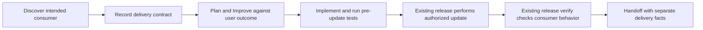

# ShipLoop consumer-delivery improvement plan

Status: implemented as an opt-in pilot, with verification qualifications recorded
in the implementation record. The original plan is retained below; actual
changes, experiments, review findings, and limits are
tracked in [the implementation record](shiploop-consumer-delivery-implementation-2026-09-15.md).
No application publication or default adoption is authorized by this plan.

Baseline: skill-craft HEAD `335a7b6` plus the current dirty working tree, including the previously added discovery/planning Improve duties. Preserve unrelated changes. This plan concerns the current navigator, not the older review-receipt worktree.

## Decision and intended outcome

Pilot a generic consumer-delivery contract; validate it with bounded experiments before default adoption. Keep the current SDLC graph and Improve ownership. Do not make all hosted apps auto-publish.

An incremental feature is not complete merely because its source is edited. Establish where the user expects it to become usable, what operation makes that happen, the operation's authority, and the evidence that establishes the requested behavior. Explicit source-only work remains valid. Required but unauthorized or unverified work remains incomplete, not N/A.



There are two distinct defects to address:

1. **Initial interpretation:** an agent can incorrectly make hosted delivery optional while drafting the spec. Better prompts, original-request review, and a timely user question address this. A later consistency guard cannot discover that an initially wrong requirement was wrong.
2. **Later omission/contradiction:** a required update or test can disappear in later summaries, be downgraded to N/A, or be called complete with missing evidence. A small script-owned declaration guard can prevent those structural transitions. It does not independently prove a host's claims.

KISS/YAGNI boundary: corrected prompts are the cheapest improvement; prototype the guard only to test protection they cannot provide. Reuse the current ledger, result submission, graph, and Improve skill. The added cost is a small structured host assessment and its validation/tests, not another orchestration system. Measure packet size, result-authoring mistakes, retries, and runtime maintenance alongside correctness; simplify any field or abstraction that adds no demonstrated protection. No new integration or dependency is proposed.

## Evidence anchoring the change

- In the actual incremental game run, [SPEC.md - acceptance A4/A5: optional HEAD and visual cases](../../gas-checkeers/.shiploop-jump-track/notes/SPEC.md#acceptance) made HEAD optional while retaining visual identity cases.
- [RELEASE-PLAN.md - decision: upload deferred to the operator](../../gas-checkeers/.shiploop-jump-track/notes/RELEASE-PLAN.md#decision) inherited that choice. This was not a missing release node.
- [System-test result - summary: no upload and no browser execution](../../gas-checkeers/.shiploop-jump-track/results/nav-f1f9165209254bf6bd6ac73bcc377a4d.md) nevertheless recorded `outcome: done`. These are historical host declarations, not a new remote-state check.
- [shiploop_navigator.py - apply and canonical result: declared transitions](../skills/shiploop/scripts/shiploop_navigator.py) currently accepts a small generic result; it has no typed delivery obligation or independent remote verification.
- shiploop_navigator_prompts.py - discovery, planning and release duties: current host guidance (removed in ShipLoop 0.23.0) already assigns the relevant work and complete Improve campaigns. The improvement is the success criterion and its continuity, not another review engine.

External checks support the distinction, not a platform-specific default: [Google's web-app guide](https://developers.google.com/apps-script/guides/web#test_a_web_app_deployment) states that `/dev` uses the latest saved code. [The HEAD update API](https://developers.google.com/apps-script/api/reference/rest/v1/projects/updateContent) also affects other execution contexts, including triggers. A private development endpoint is not evidence of harmless writes. [Anthropic's evaluation guidance](https://www.anthropic.com/engineering/demystifying-evals-for-ai-agents) distinguishes reported success from the resulting environment state; both transcripts and actual outcomes belong in the experiment.

The game paths above are local audit evidence, not portable skill dependencies. Future fixtures must use synthetic targets and sanitized records; never ship a personal script ID, credential, or live URL as a default.

## 1. Resolve the consumer and scope early

Intake/discovery must identify the existing or intended consumer: a hosted page, service/API caller, installed application, CLI user, library consumer, documentation site, or another task-relevant entry point. Do not equate a Git repository with the consumer.

For an existing system, revalidate and carry forward its delivery target and **user-approved** delivery policy from README, applicable instructions, and existing environment/design material. For a new product, discover the intended entry point and any authorized setup. Empty local files do not prove there is no existing remote consumer.

Use one high-value question when the answer changes delivery scope or authority, for example: "Should this be usable at the existing hosted entry point, or is this change source-only?" Infer the likely consumer from the task, but do not infer permission for a remote mutation from a framework, connection, or prior successful run. Absence of an explicit publish command is not evidence that the user wanted source-only work. Continue independent authorized implementation while a release-only decision is pending; leave delivery unresolved.

Capture the answer and its basis durably, then return the current packet's callback. A question/answer must not abandon the run. An agent-authored spec or policy cannot grant itself additional authority.

Declare the authority source explicitly: exact original-request text, an explicit user answer/decision, or an applicable repository-policy path whose approval is traceable to such a user instruction. Preserve that approval reference when reusing an unchanged policy; do not repeatedly ask when the operation, target, and scope are already authorized. Merely finding `AGENTS.md`, README, a connection, or a past upload is not policy approval. The script checks declared source/link consistency and operation/target scope, not the authenticity of a host's assertion about what the user approved.

## 2. One durable delivery contract, with readers at every boundary

Use the current run's accepted-result/history ledger in `state.md` as the authoritative location. Reuse existing spec/environment notes for detailed explanation, linked through `evidence_refs`; do not create a parallel delivery journal or a JSON-backed authority store.

The logical contract needs these facts; freeze the exact minimal schema after the experiment below:

| Fact | Purpose |
| --- | --- |
| Consumer and required behavior | Who must observe what, at which entry point. |
| Target identity and operation | The affected system and actual update mechanism; source sync, install/reload, versioned deployment, promotion, and access changes are not interchangeable. |
| Necessity and basis | Required, not required, or unresolved; basis comes from the original request, a user decision, or an applicable user-approved policy. |
| Authority and exclusions | Allowed operation/target plus its source; keep public access, production, data migration, unrelated projects, and other exclusions explicit. Unknown authority does not make a necessary operation unnecessary. |
| Acceptance checks and placement | Observable expected outcomes and which existing boundary must establish them: pre-update system-test, release effect/artifact identity, or post-update consumer behavior. |
| Candidate and evidence references | Bind observations to the described candidate/target/contract; preserve operation, artifact identity, and behavior evidence as different claims. |

Keep scope proportional. A single-target task needs one small contract. If multiple consumers are in scope, represent an ordinary list of obligations and their evidence under the same contract; do not silently select one, invent a dependency scheduler, or claim the whole delivery from one passing consumer. The existing release action owns the whole applicable set and still has one callback. Implementation boundary: version 1 supports one activation target/operation shared by multiple consumers. Distinct activation targets are explicitly unsupported rather than implicitly sharing authority; expansion to per-target authority is deferred.

Produce the initial assessment at discovery, refine it during research/spec/plan, and require it to exist by accepted `plan-improve` for pilot runs. An explicitly unresolved release-only field is valid at planning; omission is not a substitute for recording the question. Before release, unresolved necessary target/operation/authority becomes a blocker.

The script derives current context from the newest accepted contract/correction and its applicable observations, scanning past intervening ordinary results. Packets print the effective contract, its producing action/result locator, required checks, and relevant evidence paths. The host need not remember a target, calculate the next completion signal, or reconstruct a review counter.

Define update semantics before writing the validator: a contract creation/correction supplies the **full contract** and explicitly supersedes the prior accepted contract; an observation only adds evidence to a particular accepted contract. Never field-merge an observation into the contract or interpret an omitted field as deletion. Use the existing script-owned accepted action/revision as the immutable contract anchor, rendered into completion templates, rather than asking the host to invent another ID. The host can submit a full correction and new observations together when necessary; the script binds those observations to the newly accepted contract. Ordinary partial observations cannot change necessity, scope, exclusions, or check definitions. A correction retains prior history and invalidates affected observations under the rules below.

Relationship to the separate, unpublished repository-context proposal: local target classification and consumer delivery are separate questions. This plan does not implement that collector/guard or require it to ship first. Use `state.repo` for the workspace; if an accepted repository assessment exists, reference it rather than duplicating its local observations. A consumer target may legitimately differ from the local repository. Avoid one assessment silently overriding the other.

## 3. Responsibilities on the existing graph

| Existing action(s) | Planned improvement | Durable output / reader |
| --- | --- | --- |
| `intake`, `discovery`, `research` | Establish intended consumer, current system, activation mechanism, standing authority, and unknowns; distinguish facts from inferred intent. | Contract and source references read by spec/planning and all later packets. |
| `spec`, `spec-improve` | State consumer-visible completion and independent expected outcomes. Do not weaken intent because access or a tool is inconvenient. | Acceptance and delivery contract read by test strategy and plan. |
| `test-strategy`, `plan`, `plan-improve` | Backchain from actual availability and behavior to prerequisites, update operation, and verification. Place pre/post-update tests correctly. | Ordered work and check obligations read by steps/system-test/release. |
| `step-plan`, `step-plan-improve`, implementation/test stages | Protect existing behavior; choose tests that exercise the feature, not just the presence of a symbol. Carry new delivery implications forward. | Current source/tests and discoveries read by integration and outer work. |
| `carry-forward`, `outer-improve` | Reconcile pending update/verification obligations across steps; material discoveries revise the existing contract and affected checks. | Current contract and pending obligations read by release planning. |
| `system-test` | Execute pre-update checks against the relevant candidate. A post-update check may remain pending here only when explicitly assigned to `release-verify`; do not label it passed. | Actual pre-update results and named future checks. |
| `release-plan` plus its Improve campaign | Recheck necessity, exact operation/target, scope/authority, candidate, protection/rollback plan, and checks. N/A requires no necessary in-scope activation. | Ready release contract or explicit blocker. |
| `release` | Perform the required authorized operation once, or establish with current evidence that the target is already at the intended candidate. Reconcile uncertain effects before retry. | Operation/effect and artifact identity observations read by release-verify. |
| `release-verify` | Establish required consumer behavior on the right candidate/target. Source synchronization, a URL, or a successful GET alone cannot replace a required interaction check. | Consumer evidence or a blocked result read by handoff. |
| `handoff` / HTML report | Report implemented, update performed/already satisfied, identity checked, behavior verified, and remaining limitations separately. | Honest user-facing result; no unqualified complete with required work outstanding. |

Do not add a default `W-push` as well as a release-owned push. Use work items only for genuine prerequisites; one owner executes each external operation. The existing stage order remains unchanged.

### Late changes without an invented backward transition

Before `release-plan` completes, a material change in `outer-improve` or `release-plan` must refresh affected pre-update checks within that current action and finish its existing Improve campaign. The original `system-test` history stays intact; newer observations supersede stale evidence. A check's assigned phase is its earliest due boundary, not a prohibition on later refresh. The `release-plan` completion guard also requires all necessary pre-update checks to be current.

After `release-plan` has completed, a newly discovered material candidate/target/operation change that requires replanning blocks the current `release` or `release-verify` action. Do not improvise planning inside the effectful action, silently re-upload, or pretend `repeat`/`resume` returns to planning: those controls remain at the current stage. For this pilot, request explicit direction for a new planning run that references the prior contract, successful effects, and unresolved work; do not automatically create it or retrofit the old run. This deliberate rare-case stop preserves the fixed graph. Consider a typed backward transition only if experiments demonstrate a recurring need and it is separately approved.

An unchanged candidate whose upload succeeded but whose browser check is blocked does **not** need a new release plan or upload. Persist the partial effect, resolve the missing access within authority, and resume verification at its current stage. The recovered packet must make that distinction explicit.

## 4. Improve must challenge the outcome, not just the generated plan

Add this question to the appropriate discovery/spec/plan/outer/release-plan campaign duties:

> If all planned steps succeed, will the intended user actually receive the requested behavior at the intended entry point? Identify any missing update operation, authorization decision, consumer test, or second-order effect. Compare against the original request, not only this generated specification.

Keep the current complete Improve campaign: review, inspect the latest seven full commit messages when available, plan justified improvements, apply, refresh meaningful checks, record learnings, and assess two consecutive trivial-only/no-change reviews. Apply the final trivial fixes; material findings or changes reset the campaign's clean-review condition. Do not manufacture history or edits. Honor scoped commit authority and no-commit instructions.

The shared Improve policy remains the owner of this review contract. Do not add a ShipLoop review counter, nested Improve wrapper, or standalone Until runtime. A dry-run/teachback repetition is not a completed Improve review or proof of a deployment.

## 5. Small opt-in declaration guard, not a remote-verification engine

Pilot corrected prompts **and** a versioned guard. Prompt-only changes are useful for initial interpretation but cannot establish the requested mechanical no-omission guarantee.

Provisional implementation: a new-run-only `--delivery-contract` option for navigator protocol 2 stores `delivery_contract_version: 1`; one optional typed result member, `delivery_assessment`, carries a full contract/correction and/or separately bound current-stage observations using the explicit update rules above. Do not reuse a protocol number or reinterpret old records from another branch. Exact field shape is an experiment output, not a mandate to add every possible status.

Keep the state machine pure. `new_state`, `validate`, `apply`, `render`, and `next` do not inspect product files, run tools, validate remote URLs, or execute callbacks from notes. Add no remote credential, watchdog, fingerprint engine, or new store. All relevant target checks and external effects remain host actions.

Guard invariants for marked runs:

1. **Planning has a contract.** A successful `plan-improve` needs an accepted delivery assessment, including explicit unresolved release-only matters. No remote access or release permission is demanded merely to do independent local work.
2. **No silent downgrade.** Required activation/checks cannot be removed or changed to N/A merely because they are hard or unavailable. A scope-reducing correction needs an explicit user decision or applicable user-approved policy reference and preserves the prior requirement in history. Observing an already-current target satisfies the requirement; it does not erase it.
3. **No premature effect claims.** Planning can declare required checks and their placement but cannot supply execution evidence that completes a later action. A required activation cannot advance from `release-plan` to an effectful assignment without the declared exact target/operation, scoped authority, and current necessary pre-update checks. Missing readiness returns a resolution instruction; the host can record `blocked` through the existing callback. A material post-plan change requiring replanning follows the explicit block/new-planning-run rule, not an implicit back-edge.
4. **No omitted execution/verification.** `system-test` requires declared results for checks due there, not post-update checks due later. `release` needs the relevant operation/effect and artifact-identity observations or an evidenced already-current result. `release-verify` needs all required consumer observations. The guard validates statuses/coverage/bindings, not the truth of a supplied evidence path.
5. **No source-only substitution for behavior.** The typed distinction must let the guard reject an upload/identity-only report when a required consumer-behavior report is absent. A reported failed, blocked, stale, or unrun required check cannot be accepted as its completion.
6. **No stale reuse.** Observations identify the accepted contract and described candidate/target. A declared material change to those facts invalidates affected prior observations. Reusing an old observation's acceptance anchor under a new label does not refresh it; the host must declare a new check/reconciliation with its own producing action and evidence. On a real interruption, retain completed effect evidence while obtaining missing verification; do not re-upload solely to generate a fresh receipt. This detects declared inconsistency, not unreported source edits or fabricated rechecks.
7. **Preserve control/replay.** Rejected results do not change state, revision, history, or action. `blocked`/`repeat` can retain useful contract corrections and partial observations without a successful advance; they do not create success. Ordinary results without delivery data do not erase prior context. Exact replay is non-mutating, conflicts are rejected, and `next` remains read-only.
8. **Safe finalization.** Handoff cannot discard a recorded outstanding required obligation. Partial progress can be reported while blocked; `halt` remains unfinished. An explicit source-only scope change is recorded as such, not called a successful hosted delivery.

Do not treat a nonempty `authority_ref`, test path, typed status, or accepted callback as independent authentication/proof. The guard prevents omission and declared contradiction; it cannot decide whether the original intent was interpreted correctly, detect hidden external edits, or certify that a browser test actually ran. Preserve this limitation in packets, README, tests, and report labels.

Old unmarked navigator v1/v2 and managed/legacy runs keep their recorded result/state contracts. The new flag must not silently enable on resume or retrofit completed runs. Validate supported flag combinations; tests cover interaction with the separately proposed repository-context contract if/when available. Default adoption for new runs is a later explicit decision after validation.

## 6. Experiments before adoption

Freeze sanitized input fixtures and expected outcomes before editing runtime or prompts. Evaluate three variants:

| Variant | Purpose | Expected limit |
| --- | --- | --- |
| A: current packets | Record baseline interpretation and generic completion behavior. | May accept an N/A or missing-evidence declaration. Do not fabricate a semantic failure if the host responds correctly. |
| B: corrected prompts | Test whether the host discovers the intended consumer/authority and plans real verification. | Cannot mechanically reject an ignored instruction. |
| C: B plus opt-in guard | Test required-obligation retention, current-stage coverage, cold recovery, and incompatible/missing declarations. | Still trusts semantic host observations. |

### Fixed scenario families and oracles

| Scenario | Required observation |
| --- | --- |
| Existing hosted game, ambiguous incremental UI request | Recognize hosted delivery as a material scope question; ask or retain it unresolved. Do not grant push authority or silently choose source-only completion. |
| Same game with an approved private source-update policy and public/versioned deployment forbidden | Plan the required source update and actual visual check on the exact allowed target; never promote or broaden access. |
| Explicit source-only change to an existing hosted app | Accept scoped local delivery; no invented remote operation. |
| New CLI/library with no activation requirement; new hosted app with unknown target | First can honestly use N/A; second plans/discovers setup and authority instead of inventing a target. Missing Git history is not a fabricated seven-commit window. |
| Hosted documentation edit | Decide from its consumer/delivery scope, not a docs-only heuristic that automatically skips publication. |
| Upload succeeds and source matches, but browser reaches a login page | Retain successful update evidence; required visual behavior remains blocked/unverified. No blind upload replay, false pass, or N/A downgrade. |
| UI source contains all expected strings, but rendered movement behavior is broken | A meaningful interaction check fails; string-presence gates do not establish visual correctness. |
| Required update but missing authority, wrong target, external drift, or destructive preview | Do not perform the operation. Explain the specific missing decision/protection and preserve independently completed local work. |
| Explicit user narrows scope; agent merely proposes the same downgrade | Only the authorized scope correction can remove a requirement; agent inconvenience cannot. |
| Arbitrary repository file cited as authority; approved private-sync policy cited for promotion | Reject missing approval links or declared operation/target mismatch. A syntactically valid but falsely asserted approval remains outside the guard's proof boundary. |
| Partial observation omits contract fields or references a superseded contract | Preserve the full effective requirement set; reject obsolete binding, not erase requirements through partial updates. |
| Candidate/target changes after earlier evidence, or only one of two required consumers is verified | Invalidate affected observations or leave the other consumer incomplete; never reuse unrelated evidence to finalize. |
| Outer Improve invalidates a pre-update check; candidate/target changes after release planning | First refreshes the check in the current pre-release action; second blocks for explicitly directed replanning. Neither case invents a back-edge or replays an external effect. |
| Cold restart after planning, intervening ordinary results, and partial release | Rehydrate current contract plus partial effects and outstanding checks; preserve callback identity and avoid repeated writes. |
| Malformed result, rejected completion, repeat/block/resume, identical/conflicting replay, old unmarked run, package relocation | State/control/compatibility behavior remains correct and pure; no live target calls. |

Run deterministic A/C state-machine cases against deliberately incomplete or contradictory declarations, including a mutation that bypasses each guard. Require a red result from the relevant negative control and a green result from its valid counterpart. Do not use prose matching as the semantic oracle.

Run fresh-context A/B teachbacks on a small fixed subset covering ambiguity, authorized activation, explicit source-only, missing authority, missing visual verification, and login-after-upload. Use two independent repetitions per variant/fixture, equal context/tool allowances, and the same outcome rubric. Record wrong classifications, unauthorized proposed operations, lost obligations, and token/time cost. These repetitions measure interpretation, not Improve convergence. For C, additionally teach back recovered packets after a partial effect and a declared candidate change.

Use a disposable local fake deployment/consumer boundary for execution experiments: local candidate, separately observable served artifact, and a browser/UI fixture. Include a stale served version, successful update with blocked consumer access, a failed visual interaction, and an unknown operation outcome. Check fixture state independently of the agent transcript; no credentials or real cloud write is required. Measure unchanged unrelated user files and forbidden-operation count. A loopback fixture is not proof of Apps Script or any other live provider.

Decision gates: B must eliminate silent source-only assumptions and forbidden-operation proposals on all chosen sentinel cases across both passes, without breaking explicit local-only cases. C must reject every deterministic omission/contradiction control while permitting valid, already-current, and local-only cases; preserve old runs, replay, recovery, and purity. Investigate any failed case before adoption, rerun affected comparisons after changes, and do not claim statistical reliability from a small pilot. Reject extra nodes/counters/remote executors that add no measured protection.

A live canary is optional later and requires the user's exact disposable target and operation authority. This plan does not authorize publishing the existing game, installing integrations, changing credentials/access, or mutating another system.

## 7. Implementation sequence and definition of done

1. **Fixtures and baseline:** retain sanitized failure inputs, fixed oracles, current A behavior, and candidate B/C contracts. Do not run the existing game's real callbacks or rewrite its completed run.
2. **Prompt pilot:** update the existing prompt catalog plus reference routing. Scope the consumer-delivery question through discovery/spec/plan/Improve/testing/release/handoff. A/B results determine wording corrections.
3. **Guard prototype:** add the smallest typed field/opt-in marker and pure ledger projector/validator that satisfy C. Reuse the existing transaction/result machinery and generated completion templates; the host supplies current evidence, not a successor or invented transition ID. Freeze the schema only after the fixture walk exposes required cases.
4. **Recovery/reporting:** render current contract and pending obligations from Markdown after every boundary; preserve partial effects and show source, activation, and behavior outcomes separately in the HTML report. Test full-contract versus observation updates, late pre-update check refresh, post-plan replanning blocks, and unchanged-candidate verification recovery. Test old and fresh runs from cold processes.
5. **Documentation/package:** update ShipLoop `SKILL.md`, README, navigator/research/testing guidance, and generated plugin copies. Include existing-hosted, explicitly-local-only, and new-project examples, plus the no-proof/no-auto-permission boundary. Cross-reference the repository-context plan without merging its unfinished implementation.
6. **Validation and review:** run focused tests first, then the actual repository's full hermetic groups and packaging checks; do not substitute remembered green results. Independently review permission boundaries, final-candidate behavior, and the experiment conclusions. Leave opt-in until an explicit default-adoption decision.

Likely implementation files: `skills/shiploop/scripts/shiploop_navigator.py`, `shiploop_navigator_prompts.py`, `shiploop_protocol.py`; possibly one small pure delivery-contract helper if it materially improves readability. Relevant documentation is under `skills/shiploop/`; tests extend `test/shiploop-navigator.test.py` or a focused delivery-contract suite registered in the existing test catalog. Keep experiment assets under the existing `test/experiments/` convention. Regenerate `plugins/shiploop` from source; never edit its copied skill independently.

Verification commands to confirm against the checkout at implementation time:

```sh
python3 test/shiploop-navigator.test.py
python3 test/shiploop-navigator-dry-run.test.py
python3 test/shiploop-improve-policy.test.py
bash scripts/sync-plugin-views.sh --check shiploop
bash test/run-all.sh --group shiploop
bash test/run-all.sh --group core
```

Add the new focused guard/fixture commands to the actual catalog rather than creating another CI runner. Use the supported Git/Python binaries already available on the host; do not accept licenses or install tools just to hide a test limitation.

Definition of done: the two root failure modes have explicit passing evidence; no required update/test disappears across ordinary or cold-context transitions; negative controls reject false completion; existing modes and graph remain compatible; generated packages match; docs distinguish declaration checks from observed consumer success; unrelated changes are preserved; actual test and experiment limits are recorded. Commit/push, default adoption, and real app publication remain separate user-authorized actions.

## Review status

Independent experiment-design and final plan reviews informed the A/B/C split and controls. The final plan review identified contract/observation update ambiguity, missing fixed-graph recovery, and underspecified policy approval. The implementation record distinguishes the resulting changes and observed evidence from this original plan; the plan itself is not a completion receipt.
