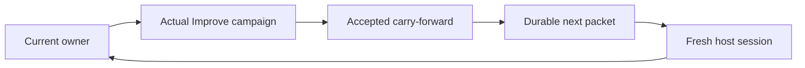

# ShipLoop context-reset integration

Status: experimental and opt-in.

ShipLoop can start a fresh native host session after an accepted carry-forward
completion. The goal is to release accumulated conversational context while
keeping the durable ShipLoop records as the continuation authority. This is a
fresh-session mechanism, not a literal `/clear` command and not a compaction
feature.



The controller reads the next action from the same Navigator protocol 3 run.
It does not invent a successor or copy the prior conversation into the fresh
session. A producer completion that only creates an Improve child is not a
reset boundary. The reset becomes eligible only after the carry-forward
Improve result is accepted and the work item advances.

## Operating model

The `drive` controller accepts `--context-reset=inner-loop` or the
`SHIPLOOP_CONTEXT_RESET=inner-loop` environment setting. The first-launch
default is `off`; a saved policy continues to bind a resumed controller. The
feature is scoped to `drive`, leaving ordinary ShipLoop invocation unchanged.

`state.md` remains the graph authority. The controller records its separate
host receipt, binds it to the selected run and host, locks one controller per
run, and stops automatic replay when an owner is uncertain. The next owner
receives the current durable packet, repository locator, run locator, and
selected CLI locator. Requirements, decisions, and evidence therefore need to
be maintained in the packet-reachable Markdown records.

| Host | Fresh boundary | Retained continuation | Important boundary |
| --- | --- | --- | --- |
| Codex | New app-server task | Resume the saved task | The adapter uses its available workspace policy and stops for host interaction. |
| Grok | New ACP session | Load the saved session | Native permissions remain in effect; supervised child sessions use `--no-leader` and `GROK_MEMORY=0`. |
| Claude | New persistent CLI session | Resume the saved CLI session | Native permissions remain in effect; the adapter does not claim a writable-root or network sandbox. |

The controller does not replace host authentication, change global host
configuration, bypass approvals, or relay late user input into an outstanding
owner. Native host capabilities and permission behavior remain host-specific.

## Automated coverage

Four hermetic suites cover the shipped controller and transport contracts:

```sh
python3 test/shiploop-context-host.test.py
python3 test/shiploop-host-codex.test.py
python3 test/shiploop-host-grok.test.py
python3 test/shiploop-host-claude.test.py
```

They test policy selection, exact reset qualification, saved identity and
recovery behavior, copied-package use, malformed transport responses, and
host-specific capability boundaries. They use synthetic Navigator/Improve
receipts and mocked or fake host protocol endpoints. A green result proves
local controller and adapter mechanics; it does not prove a model completed a
live product workflow.

## Local host observations

The following are summaries of bounded local trials. They are not published
raw evidence, and they do not identify accounts, native sessions, or local
machine paths.

| Check | Codex | Grok | Claude |
| --- | --- | --- | --- |
| A retained session recalled its seeded canary | Observed | Observed | Observed |
| A resumed retained session recalled the canary | Observed | Observed | Observed |
| A fresh session answered `UNKNOWN` to the repeated recall question | Observed | Observed | Observed |
| A fresh session ran a harmless local Python continuation command | Observed | Observed | Observed |

Grok required a process-isolated ACP launch with `--no-leader` and
`GROK_MEMORY=0`. Those controls prevent its cross-session memory feature from
confounding the fresh-session check; they do not erase a user's saved memory or
change global configuration. Claude and Codex each used their native
fresh-session and resume interfaces.

The Codex fresh-session prompt also included its continuation command; the
Claude and Grok isolated-recall prompts were byte-identical to their retained
recall prompts.

Failed trials are retained locally for diagnosis and are deliberately excluded
from this publication. The included Claude probe is an explicit local tool that
generates a result only when an authenticated host is available; its output is
not a default test artifact.

## Measurement and release limits

A preliminary local Codex comparison recorded 28.31% lower continuation input in
one synthetic fresh-context comparison, while uncached input increased. That result does
not establish lower cost, lower subscription usage, or a general token saving.
Fresh sessions may lose prompt-cache reuse, and a proper evaluation must compare
whole paired tasks, including rehydration and cache behavior.

No full live multi-item ShipLoop campaign with an actual Improve loop was run
across reset boundaries. The integration is therefore suitable only as an
explicit experiment until a workflow-faithful end-to-end run establishes both
continuity and delivery quality.
