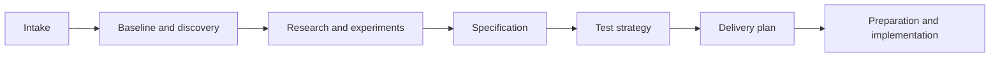
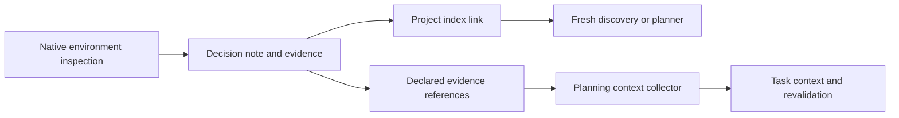

# Discovery organization and runtime-state handoff

This change makes complex discovery easier to organize and its evidence easier
for a fresh planner to recover. It preserves ShipLoop's existing v3 stages and
Improve checkpoints. The implementation starts from `98c72b65bdd3bae624bb4939497a58d0fdd25621`,
whose chain planning-context collector already transports declared planning
files. An earlier assessment of an older shared checkout described that
integration as proposed; that description does not apply to this base.

## Plan and design decisions

1. Establish the unchanged baseline and audit the actual source/consumer paths.
2. Add a conditional investigation plan inside existing discovery/research notes.
   A simple inspection uses the direct path and omits the plan section/table.
   Evidence dependencies, independent ownership, conflicting sources, expensive
   probes or interruption needs justify a compact plan with an explicit stop.
3. Add runtime-state placement guidance, independently of investigation depth.
   A single stateless deployed component may still require durable native state.
   Discover lifetime, authoritative ownership, native reuse, runtime access,
   concurrency and recovery before selecting a mechanism.
4. Strengthen the existing evidence handoff: exact index/note/observation links,
   principal/target/operation/time scope, explicit collector references and
   consumer revalidation. Distinguish researchable unknowns, access/owner gaps
   and known setup prerequisites; block only their actual dependent work.
5. Verify selective packet routing, relocated references, accepted discovery
   material transport, fresh discovery behavior and a cold index-driven planner.
   Regenerate the versioned plugin package and native catalogs, review, commit
   and push an isolated branch.

The research note owns the evolving question frontier. Existing architecture or
environment documentation owns maintained decisions, indexed from `SHIPLOOP.md`.
Accepted `evidence_refs` declare the files the selected transport needs; affected
item `context` carries the compact decision and revalidation summary. The index
is not a recursive dependency manifest, and collecting a file does not prove a
host read it or that the remote observation remains true.

ShipLoop's Markdown holds development knowledge. Application state is selected
from the application's execution environment and required lifetime. Native
objects, files, databases, identity services and caches are candidates whose
guarantees must be inspected through available MCP/API/CLI routes. Several
systems may own different facts without a shared transaction or duplicate masters.

The patch does not add a discovery scheduler, stage, result field, storage
adapter, platform-specific default or production stage-skipping flag. Its
incremental stage samples are test-only and label predecessor transitions as
synthetic.

## Where findings live and how tasks receive them

| Material | Durable home | Consumer responsibility |
| --- | --- | --- |
| Current environment and accepted architecture | Existing maintained environment/design documentation | Reopen the exact section; distinguish a proposal from acceptance |
| Dated observations and probe receipts | Discovery/research notes and sanitized evidence files | Check target, principal, operation, observation time and coverage |
| Human navigation | `REPO/SHIPLOOP.md` | Follow the actual note-section link, not just a repeated summary |
| Declared planning inputs | Existing accepted result `evidence_refs` | Supply absolute local files or explicit collector resolution, including supporting receipts |
| Affected task premises | Existing work-item `context` | Carry only relevant decisions, prerequisites and revalidation conditions |
| Application state | Selected native facilities in the deployed runtime environment | Verify lifetime, runtime authority, consistency and recovery at the real boundary |

In the synthetic CRM/document trace, the request is a CRM review that produces a
remote document while the workstation is offline. Discovery finds CRM
`ReviewState` on the second inventory page and an existing document-side state
file. They remain candidates: uniqueness and conditional writes are unknown,
and the named document worker currently lacks write permission. The note retains
those observations, a conditional ownership model and their first consumers.
The index links the note, while declared evidence references separately supply
files to the collector. A cold planner can then retain independent contract
research and gate document creation on runtime authorization and recovery.
No step may promote a metadata read or a queued acknowledgement into proof of
an unattended completed operation.

See the [investigation rule](../skills/shiploop/references/research-loop.md#plan-the-investigation),
[runtime-state contract](../skills/shiploop/references/service-discovery.md#runtime-state-placement),
and [handoff contract](../skills/shiploop/references/project-knowledge.md#discovery-evidence-handoff).
The full stage-entry sampler is test-only; it uses real rendered packets but
synthetic predecessor transitions and never claims an actual Improve checkpoint.

## Prior evidence and audit

Earlier synthetic discovery trials found that an explicit investigation plan
could improve target ordering and inventory coverage, but could also add ceremony
to a trivial local change. Both approaches produced weak evidence locators.
Cold planners supplied explicit note paths could recover the main constraints,
which did not prove index-only handoff. These small trials justify focused
guidance and acceptance samples, not a causal quality ranking.

The current prompt audit separated the retained-state trigger from the
investigation-depth trigger and identified the collector's absolute-path
requirement. Independent diff review also caught a short prompt clause that
broadened the plan trigger to generic uncertainty; the clause now defers to the
precise guide. Observation evidence is allowed without inventing a receipt.

## Verification

The unchanged baseline passed 45 focused checks (research-template 7,
reference-routing 8, v3-guidance 30) and the documented smoke aggregate. Pre/post
HEAD, tracked-file fingerprint and clean status matched. The test-runner skill's
fresh Luna/high fallback executed the suites because its named native role was
not available.

Candidate checks passed 70 focused/integration tests, the smoke aggregate,
generated-plugin parity and packaging validation. After the final wording
clarifications, the 46 research/routing/guidance tests, smoke, parity and all
20 package checks passed again with an unchanged source fingerprint. The
collector/chain implementation and its 24 checks were unchanged after their
passing run. Version 0.18.11 and generated package views contain the final guidance.

Six fresh discovery samples and two cold-planning samples used frozen packages
and synthetic fixtures. The final cold planner recovered the indexed note and
actual receipt log, retained consumer-specific prerequisites and left independent
contract research eligible. Protected inputs remained unchanged.

Semantic discovery acceptance remains mixed. Failed samples omitted plan fields
or an end-user role, used a Codex UI locator where a portable note link was needed,
or made rejected target-free reads; one narrative also misstated their chronology.
All failures are retained. Prompt guidance alone does not enforce probe ordering,
authority attribution or locator quality. These findings justify the guidance
and continued review/revalidation, not a new mandatory scheduler or an autonomous
remote-execution claim. The samples did not run real callback acceptance or
Improve campaigns and do not certify Salesforce, Google, SAP, AWS or any remote
runtime. See the [experiment results and raw evidence](../test/experiments/shiploop_discovery_handoff/RESULTS.md).
