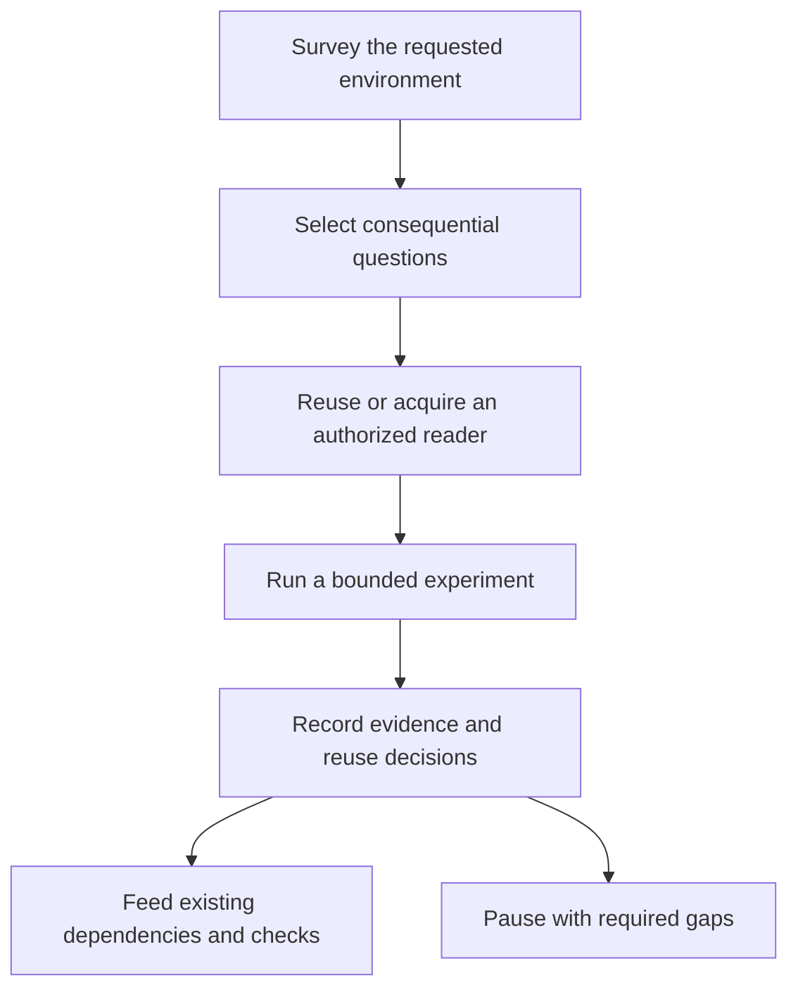

# Permanent recursive discovery improvement

## Decision and scope

Implement the user-authorized permanent improvement in ShipLoop's existing
discovery/research guidance and action packets. Preserve Markdown as authoritative
state, the selected writer, frozen survey identity, dependency routing, and both
legacy and managed Improve callbacks. Do not introduce a discovery engine,
platform adapter, package dependency, new result schema, or external integration.

The source of truth remains `skills/shiploop/`. Generate plugin views from it
after verification. Existing Claude, Codex, Grok and Cursor skill links already
target that source tree. The current installer classifies the separate Hermes
copy as foreign; preserve it rather than changing installation ownership as part
of this work. Installation parity is not a claim of live execution on each host.

## Evidence for adoption

The September 14, 2026 temporary trials tested recursive discovery for Checkers
requests in Apps Script and Salesforce, plus an explicitly synthetic local
positive control. All used the same model/reasoning setting; these were scoped
trials, not a statistically controlled success-rate comparison.

| Trial | Observed result | Limit |
| --- | --- | --- |
| Apps Script | Existing-grant project reads; 14 local RPC/security/cache checks passed. A focused follow-up used additional supported readers to retrieve remote source and deployment configuration. | Local tests used mocks; neither intended target nor deployed-player behavior was established. |
| Salesforce | Official MCP package acquired, initialized and invoked; two local LWC/Jest tests passed, one accessibility case skipped. | Org listing failed during local initialization before a service read. No real-org discovery was proved. |
| Local control | Filesystem MCP and published testing skill acquired; MCP source access and HTTP authorization/state/cache/restart checks passed. | Browser failed before navigation. Forced capability selection does not prove spontaneous selection on unfamiliar systems. |

The three main runs used 31, 25 and 18 of 64 monitored host actions and completed
in 412.308, 420.554 and 454.830 seconds against 900-second limits. The focused
follow-up used 27 of 32 actions and 473.646 of 480 seconds. Its narrow remaining
margin showed that stating a closing reserve does not enforce it. Frozen trial
inputs stayed unchanged and runner-owned process groups were closed. Host-action
counts include batched operations and are not underlying network-request counts.

Primary implementation examples: [Salesforce MCP](https://github.com/salesforcecli/mcp),
[LWC Jest setup](https://developer.salesforce.com/docs/platform/lwc/guide/unit-testing-using-jest-installation),
[filesystem MCP](https://github.com/modelcontextprotocol/servers/blob/main/src/filesystem/README.md),
and [webapp-testing skill](https://github.com/anthropics/skills/blob/main/skills/webapp-testing/SKILL.md).
These informed capability/probe techniques, not a fixed platform or dependency
list for ShipLoop. Raw temporary logs, accounts and project IDs are not packaged.

## Implementation plan

1. Expand the existing recursive-discovery reference section with all eight
   requested areas, relevant recursive boundaries, evidence fidelity, reuse
   decisions, authorized temporary acquisition and bounded experiments.
2. Reconcile setup prohibitions: existing user authorization permits temporary
   local setup; a prompt, tool catalog or downloaded skill cannot grant additional
   authority. Additional authorized readers do not replace the designated writer
   or mutate the frozen selected-interface inventory.
3. Route the guidance into survey as well as existing research and projected
   managed research/product phases. Put coverage, acquisition stages, experiment
   observations and budget accounting in existing authored Markdown bodies and
   source/question records, preserving exact structured schemas.
4. Set a default exploration allowance of 15 active minutes / 64 observable host
   actions, two capability candidates and three experiments, with two minutes /
   eight actions reserved for reporting and cleanup. Explicit user limits win.
   All branches of the same investigation share the allowance; new tools,
   context resets and phase changes do not refill it. Use the closing reserve to
   submit a valid current result with gaps intact before pausing, or retain an
   explicitly unaccepted inbox draft and its locator in the pause reason. The
   existing pause path works for legacy and managed actions; do not invent child
   statuses. This is a host-observed operating instruction,
   not a new script watchdog or a claim that ShipLoop intercepts native tools.
5. Verify packet selection, evidence preservation, unresolved-question gates,
   old/new schema compatibility and managed cold-resume behavior. Run the complete
   ShipLoop suite and generated-package checks before making the source active.

## Acceptance and verification

- All eight areas name existing mechanisms, evidence/unknowns and reuse choices.
- Skill/MCP acquisition distinguishes fetched, initialized, invoked, authorized
  and observed target behavior. Setup is justified by a consequential gap.
- Actual permission denials remain boundaries; an incomplete catalog is not one.
- Required unresolved evidence and an exhausted allowance never imply convergence.
- Budget checkpoints and unaccepted drafts survive a cold pause/resume without
  silently accepting partial findings or resetting the recorded allowance.
- A cold survey/research/managed product packet selects the maintained policy.
- Legacy and versioned research records retain their exact existing wire shape.
- Existing full workflow and packaging checks pass; no platform-specific test
  infrastructure or temporary trial files become runtime dependencies.

Targeted validation: research-template, research-packet-protocol, reference-routing,
protocol, managed-walk and platform-discovery tests. Final validation:
`bash test/run-all.sh --group shiploop`, `bash scripts/sync-plugin-views.sh --check`,
and the relevant package/install checks. Record measured outcomes below after
implementation; planned checks are not passed checks.

## Completion record

Implementation and validation in progress.
