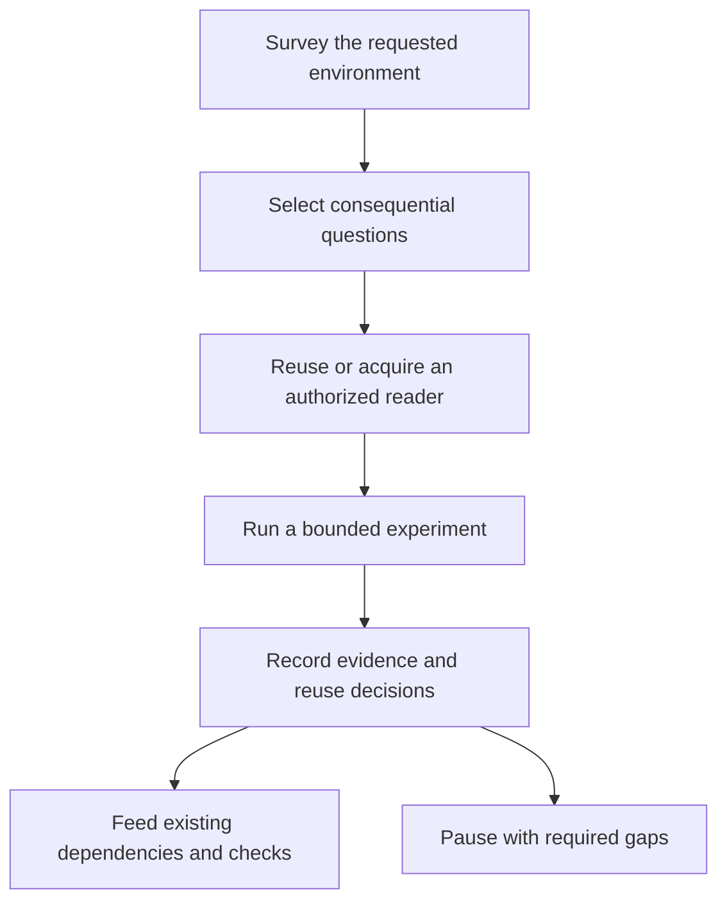

# Permanent recursive discovery improvement

## Decision and scope

Implement the user-authorized permanent improvement in ShipLoop's maintained
discovery/research guidance and action packets, including the default navigator.
Preserve Markdown as authoritative state and each protocol's existing ownership:
navigator uses generic results and host-owned Improve campaigns; managed/legacy
compatibility runs retain their selected writer, frozen survey identity, typed
records, dependency routing, and callbacks. Do not introduce a discovery engine,
platform adapter, package dependency, new result schema, or external integration.

The source of truth remains `skills/shiploop/`. Generate plugin views from it
after verification. Existing Claude, Codex, Grok and Cursor skill links already
target that source tree. The current installer classifies the separate Hermes
copy as foreign; preserve it rather than changing installation ownership as part
of this work. Installation parity is not a claim of live execution on each host.

## Evidence for adoption

The September 14, 2026 temporary trials tested recursive discovery for Checkers
requests in Apps Script and Salesforce, plus an explicitly synthetic local
positive control. All used the same model/reasoning setting; these were scoped
trials, not a statistically controlled success-rate comparison.

| Trial | Observed result | Limit |
| --- | --- | --- |
| Apps Script | Existing-grant project reads; 14 local RPC/security/cache checks passed. A focused follow-up used additional supported readers to retrieve remote source and deployment configuration. | Local tests used mocks; neither intended target nor deployed-player behavior was established. |
| Salesforce | Official MCP package acquired, initialized and invoked; two local LWC/Jest tests passed, one accessibility case skipped. | Org listing failed during local initialization before a service read. No real-org discovery was proved. |
| Local control | Filesystem MCP and published testing skill acquired; MCP source access and HTTP authorization/state/cache/restart checks passed. | Browser failed before navigation. Forced capability selection does not prove spontaneous selection on unfamiliar systems. |

The three main runs used 31, 25 and 18 of 64 monitored host actions and completed
in 412.308, 420.554 and 454.830 seconds against 900-second limits. The focused
follow-up used 27 of 32 actions and 473.646 of 480 seconds. Its narrow remaining
margin showed that stating a closing reserve does not enforce it. Frozen trial
inputs stayed unchanged and runner-owned process groups were closed. Host-action
counts include batched operations and are not underlying network-request counts.

Primary implementation examples: [Salesforce MCP](https://github.com/salesforcecli/mcp),
[LWC Jest setup](https://developer.salesforce.com/docs/platform/lwc/guide/unit-testing-using-jest-installation),
[filesystem MCP](https://github.com/modelcontextprotocol/servers/blob/main/src/filesystem/README.md),
and [webapp-testing skill](https://github.com/anthropics/skills/blob/main/skills/webapp-testing/SKILL.md).
These informed capability/probe techniques, not a fixed platform or dependency
list for ShipLoop. Raw temporary logs, accounts and project IDs are not packaged.

## Implementation plan

1. Expand the existing recursive-discovery reference section with all eight
   requested areas, relevant recursive boundaries, evidence fidelity, reuse
   decisions, authorized temporary acquisition and bounded experiments.
2. Reconcile setup prohibitions: existing user authorization permits temporary
   local setup; a prompt, tool catalog or downloaded skill cannot grant additional
   authority. Additional authorized readers do not change the selected mutation
   boundary; compatibility inventories remain frozen under their existing rules.
3. Route the shared policy into navigator discovery, research and research
   Improve, plus later product/outer Improve for consequential new findings.
   Bind evidence and accounting to durable notes and the generic `evidence_refs`.
   Preserve whole-action host ownership and distinguish pause from an accepted
   blocked result. Keep survey/research/projected managed routes on the same
   policy with their existing authored bodies and typed source/question records.
   No result schema gains new fields.
4. Set a default exploration allowance of 15 active minutes / 64 observable host
   actions, two capability candidates and three experiments, with two minutes /
   eight actions reserved for reporting and cleanup. Explicit user limits win.
   All branches of the same investigation share the allowance; new tools,
   context resets and phase changes do not refill it. Use the closing reserve to
   submit a valid current result with gaps intact before pausing, or retain an
   explicitly unaccepted inbox draft and its locator in the pause reason. The
   existing pause path works in each protocol; navigator pause preserves the
   current action, while an accepted blocked result creates a new same-stage
   action. Do not invent child statuses. This is a host-observed operating instruction,
   not a new script watchdog or a claim that ShipLoop intercepts native tools.
5. Verify packet selection, evidence preservation, compatibility unresolved-question
   gates and schemas, navigator host obligations, and cold-resume behavior. Cover
   the complete existing ShipLoop suite and generated-package checks, then verify
   the default-navigator integration against the actual merged source before
   making it active.

## Acceptance and verification

- All eight areas name existing mechanisms, evidence/unknowns and reuse choices.
- Skill/MCP acquisition distinguishes fetched, initialized, invoked, authorized
  and observed target behavior. Setup is justified by a consequential gap.
- Actual permission denials remain boundaries; an incomplete catalog is not one.
- Required unresolved evidence and an exhausted allowance never imply convergence.
- Budget checkpoints and unaccepted drafts survive a cold pause/resume without
  silently accepting partial findings; each binding instructs the host to retain
  the recorded allowance rather than pretending the script enforces it.
- Cold navigator discovery/research/Improve and compatibility survey/research/
  managed product packets select the maintained policy with their own binding.
- Legacy and versioned research records retain their exact existing wire shape.
- Existing full workflow and packaging checks pass; no platform-specific test
  infrastructure or temporary trial files become runtime dependencies.

Targeted validation: research-template, research-packet-protocol, reference-routing,
protocol, managed-walk and platform-discovery tests. Final validation:
`bash test/run-all.sh --group shiploop`, `bash scripts/sync-plugin-views.sh --check`,
and the relevant package/install checks. Measured outcomes and revision boundaries
are recorded below; planned checks are not passed checks.

## Completion record

Implemented as ShipLoop **0.9.1** and activated on local `main` on September 14,
2026. The integrated source and tests are commit
`037b02a06b62c738af4f96832583cbe66b95dfcd`. This documentation closeout does not
change that tested source. The default navigator and managed/legacy compatibility
runs now select the shared discovery policy through their respective bindings.

### Regression baseline

The original discovery candidate,
`674e0581a010bb83b7bb0d0dcd80468d289a63d0`, covered all **612 tests in 61 suite
files**. The single `bash test/run-all.sh --group shiploop` invocation hit its
external 40-minute ceiling after 60 complete suites (599 tests) and five passing
cases in the final 13-case legacy action suite. It returned timeout code 124,
not success; no assertion failure was reported.

The eight unfinished cases were then explicitly selected in the unchanged test
class and passed under a separate 20-minute ceiling in **523.377 seconds**. Case
selection used the standard unittest method order and the five completed passing
case markers; no completed case was silently omitted or treated as skipped.
The initial run's owned process group had no remaining processes after cleanup.
The combined coverage is a completed baseline, not a claim that one uninterrupted
aggregate invocation returned zero.

### Integrated navigator and compatibility checks

Concurrent main changes introduced the default prompt navigator during baseline
validation. They were merged without conflicts. The integration added direct
core-plus-adapter routing and public-CLI checkpoint tests rather than applying
compatibility schemas or child ownership to the new mode. On the committed
integrated revision above, all **100 focused tests** passed:

| Check | Passing tests |
| --- | ---: |
| Navigator public CLI, envelope, references, draft pause/resume and accepted blocker | 15 |
| Navigator graph dry-run | 4 |
| Compatibility protocol | 35 |
| Reference routing | 5 |
| Relocated managed package | 1 |
| Test-group inventory | 10 |
| Research templates | 7 |
| Platform discovery | 17 |
| Research packet protocol and recovery | 5 |
| Complete managed delivery walk, including discovery packet and draft recovery | 1 |

The navigator/protocol group completed in 25.016 seconds, research group in
52.665 seconds, and managed walk in 209.052 seconds. Each group had a ten-minute
external limit. Full generated-plugin parity and frontmatter checks also passed
for the 18 source skills. Independent review found no remaining material issue
after correcting the navigator adapter pointer and testing its actual target
heading.

These checks prove packet selection, declared-result behavior, and state/draft
preservation in their exercised paths. They do not prove that a model follows
every instruction, enforce a native-tool watchdog, or upgrade the earlier
Apps Script/Salesforce trials into deployed-user validation.

### Activation

The tested integrated commit was fast-forwarded into local `main`. The existing
Claude, Codex, Grok, and Cursor links were verified to resolve to the updated
source and its 0.9.1 skill metadata. The installer still classifies the separate
Hermes copy as foreign; it was preserved. Unrelated untracked documents were
hash-checked immediately before and after the merge and remained intact.
Generated plugin copies match the maintained source. Linked source availability
does not establish live execution on every host.
