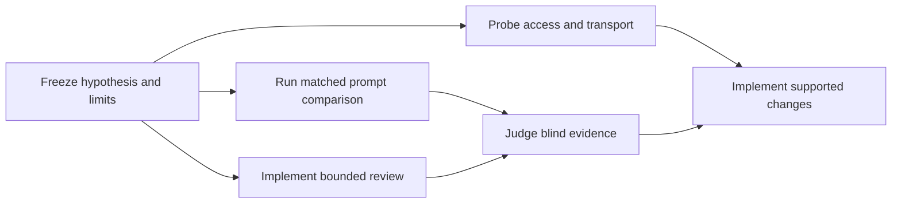

# Generic discovery follow-up: historical experiment plan

This publication copy summarizes the plan frozen before the September follow-up.
The exact frozen plan, trial inputs, raw receipts, and private mappings remain
outside this portable source tree. The accompanying [results summary](shiploop-discovery-validation-results-2026-09-17.md)
is historical evidence reporting, not an independently auditable experiment
archive. Freeze a new plan and fresh deadlines before repeating an experiment.

## Objective

Investigate arbitrary referenced systems without prescribing a technology, MCP
server, skill, or client/server architecture. Preserve the eight discovery areas:
message passing, client connections, service authentication, design, client-side
libraries, storage, caching, and security. Reuse existing capabilities when their
applicability is established; avoid new production orchestration.

## Prompt comparison

Compare the existing guide with a candidate that adds only this reuse paragraph:

> Before recommending a discovered mechanism for reuse, establish from source,
> configuration, or observation how it is selected by the affected flow: the
> trigger or entrypoint, the binding that selects it, and the state or result it
> influences. A file, dependency declaration, catalog entry, or isolated probe
> alone does not establish that connection. If the connection is unobserved,
> retain the mechanism as a candidate and name the smallest observation needed
> to establish applicability.

Run eight fresh contexts: one baseline/candidate pair for each existing fixture
family (exporter, event flow, restricted managed system, interactive refresh).
Match tasks, allowed tools, budgets, and all other inputs. Use the existing
calibrated oracle for execution/evidence readiness, not report quality. Give
independent reviewers blinded reports and supporting source/probe evidence.

Primary outcome: avoid recommending cache/store reuse without a demonstrated
connection to the affected refresh path (F4). Adoption requires improvement on
that outcome, no loss of a consequential correct baseline finding in any family,
both F1 guardrails (active dependency selection and preview-versus-committed
missing-id failure), and a fresh paired F4 replication. Preserve F2 completion
limits and F3 access denial. A tie, regression, incomplete judgment, or failed
replication retains the baseline. Do not tune the candidate after outcomes.

## Access and transport

Acquire one public, pinned, task-local MCP reader and a relevant skill only to
resolve a named capability gap. Inspect provenance and installation behavior;
measure initialization, effective tools, allowed read, outside-scope refusal,
applied procedure, and cleanup. Distinguish reading a skill from independently
demonstrating model selection or performance.

Inspect known Apps Script and Salesforce examples through existing authorized
bindings. Use non-mutating operations and preserve missing prerequisites.
Observe a real application transport path where a read-only contract is known.
Keep source inspection, existing rendered pages, local HTTP traces, and fresh
hosted action outcomes separate. No new account, scope, remote write, resource,
or deployment is part of this investigation.

## Deadline implementation and bounds

Add a standard-library subprocess reviewer wrapper under the experiment tree.
Capture raw streams, exit status, reason, elapsed time, and bounded cleanup.
Reject expired deadlines and evidence overwrites. Test stalled processes and
same-group descendants; do not claim coverage of deliberately detached processes
or native host agents. Successful process exit is not a valid semantic verdict.

The original overall cap was 90 wall minutes, with no new experiments after
75 minutes. Workers retained 480 seconds/32 calls each, with exploration ending
at 360 seconds/24 calls. At most ten worker contexts, five reviews of 300 seconds,
and three simultaneous model subprocesses were allowed. Replication was
conditional, not an allowance to retry until the result improved. Reserve time
for evidence retention and cleanup. Native active time and aggregate model tokens
were not observable enforcement dimensions.

## Implementation rule

Promote only the exact candidate that passes the frozen rule. Otherwise retain
the existing prompt and implement supported experiment controls and recipes.
Keep acquisition conditional across environment investigation, inner loop,
outer loop, and test expansion. Run hermetic apparatus tests, reference checks,
test inventory checks, and package parity. Review claim boundaries independently.
