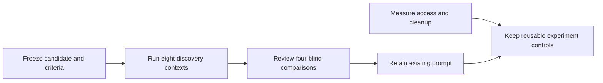

# Generic discovery: historical follow-up and reusable improvements

The follow-up retained the production discovery guide and implemented bounded
review execution, evidence preservation, and reusable access experiments.

This is a **historical summary**. Original trial reports, raw model streams,
private mappings, authenticated target receipts, and machine-local artifacts
are excluded from this portable publication. The observations below were
recorded in that local study; they cannot be independently audited from this
checkout. A new experiment must retain its own evidence outside the source tree.



## Prompt decision

The [plan summary](shiploop-discovery-validation-plan-2026-09-17.md) describes a
72-word addition requiring evidence that a discovered mechanism is selected by
the affected flow. The recorded comparison was:

| Family | Preference | Consequential observation |
| --- | --- | --- |
| F1 exporter | Baseline | Both identified declared versus active parser versions. Baseline named missing `id` as a preview blind spot; candidate omitted it. Neither fully stated the committed-write failure, so baseline also retained a weakness. |
| F2 event flow | Baseline | Baseline explicitly warned that editing selection metadata cannot activate a statically imported component. Candidate left that consequence implicit but uniquely identified a hashable-ID constraint. Both preserved transient versus durable completion. |
| F3 managed access | Tie | Both preserved denial, rejected the unrelated connector, and separated process exit from operation success. |
| F4 interactive refresh | Tie | Both preserved the missing JavaScript-to-cache/store connection and conditional applicability of reuse. |

The primary F4 outcome tied and the candidate failed its F1 guardrail. No
replication or revised candidate was launched. The existing generic prompt was
retained. The F2 preference does not imply baseline won every finding; an
unverifiable interpreter assertion was not credited. This small comparison is
not proof of universal discovery quality or a model-independent ranking.

The record reports eight completed worker contexts of 100.796–147.265 seconds
and 15–19 workspace calls each, plus four independent subprocess reviews of
12.670–15.498 seconds. Summed worker duration was 1,024.208 seconds and summed
review duration 56.084 seconds; these sums are not concurrent wall duration.
Seven preflight checks and all eight evidence-readiness grades passed. Those
grades establish apparatus completion, not semantic superiority. The host-default
model's identity was not reliably observable and was not claimed as pinned.

## Separate access observations and limits

The original acquisition probe took 4.435 seconds. It installed a pinned official
filesystem MCP server in a temporary prefix/cache with lifecycle scripts disabled,
initialized the real stdio connection, listed 14 tools, read allowed synthetic
and existing local HTML files, and observed an outside-root refusal without
sentinel disclosure. The process was reaped and temporary workspace removed.

A pinned published webapp-testing skill was inspected and its static HTML
reconnaissance branch applied through the MCP reader. This identified a selector,
click handler, and source-visible result transition. No downloaded script,
browser, or independent model ran in that arm. It did not prove autonomous skill
selection, comparative benefit, or a reason for a permanent installation.

Pinned registry integrity metadata and installed-file hashes were retained.
The direct-prefix lock entry did not expose integrity, so independent acquired
tarball verification remained unestablished. Installed-file hashes do not close
that gap. The probe exercises one filesystem policy, not arbitrary authorization.

| Separate target or trace | Recorded observation | Limit |
| --- | --- | --- |
| Existing Apps Script project | A project-bound source read returned 23 files; three relevant local/remote hashes matched. Deployment metadata was readable. | No identity-correlated fresh hosted action-to-service outcome. |
| Existing owner browser page | A Checkers board and controls were already rendered. | No reload or game action was exercised; rendered revision identity remained unproved. |
| Existing Salesforce binding | The explicitly selected existing CLI binding reported Connected. | No application metadata, UI, SOQL, deployment, or client/server behavior was inspected. |
| Copied local HTTP fixture | A new browser load caused `GET /api/state`, HTTP 200/version 1, then rendered version 1. | Actual local transport only; not Apps Script or Salesforce behavior. No move POST occurred. |

A generic reader initially refused a mismatched frozen target pin before any
remote GET; a correctly bound existing route enabled the source read. That local
pin refusal was not a remote authorization denial. No new account, scope,
resource, login, or deployment was part of these observations.

## Reusable implementation

- [`review_runner.py`](../test/experiments/shiploop_generalized_discovery/review_runner.py)
  bounds one explicit subprocess command, captures raw streams, clamps to the
  original study deadline, retains interruption receipts, and cleans up its
  owned POSIX process group. The recorded 0.150-second stalled-process probe
  finished in 0.186614 seconds, including 0.023139 seconds of cleanup. Cleanup
  adds a bounded reserve; deliberately detached processes and native agents are
  outside the guarantee. Process success is not semantic verdict validity.
- [`acquisition_probe.py`](../test/experiments/shiploop_generalized_discovery/acquisition_probe.py)
  is an opt-in network experiment with public pins and an existing synthetic
  fixture. It requires a fresh explicit output directory and rejects an existing
  or symlink leaf before acquisition. Results follow observed outcomes. The
  original measured run preceded this output-hardening edit; no new network run
  was used to claim the revised helper had been revalidated end to end.
- [Experiment recipes](../test/experiments/shiploop_generalized_discovery/EXPERIMENT_RECIPES.md)
  preserve a question, target/binding, smallest observation, deadline, cleanup,
  and evidence level. Findings carry into environment investigation, inner loop,
  outer loop, and test expansion. MCPs and skills remain conditional on a gap;
  all eight discovery areas remain applicable across stacks.

## Verification boundary

The source follow-up recorded 43 apparatus tests, seven research-template tests,
eight reference-routing tests, and 14 inventory tests: 72 focused tests plus
package parity. It finished in approximately 36 minutes within its 90-minute
cap. Those historical counts are not a substitute for validating a new checkout.

Run current hermetic verification from the repository root:

```sh
python3 test/shiploop-generalized-discovery.test.py
python3 test/shiploop-research-template.test.py
python3 test/shiploop-reference-routing.test.py
python3 test/test-groups.test.py
bash scripts/sync-plugin-views.sh --check shiploop
```

The existing CI discovery entrypoint automatically includes the new review and
acquisition regression tests; no model or acquisition network call runs in CI.
These checks do not prove hosted behavior or new prompt quality. The remaining
questions are the F1 committed-write omission and identity-correlated hosted
client/service behavior; they require a new bounded hypothesis or applicable
authorized operation.
