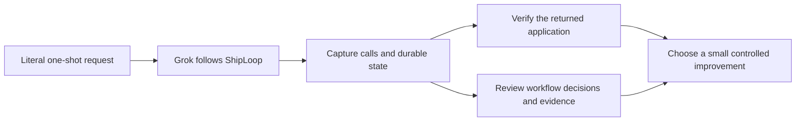

# ShipLoop one-shot E2E audit — September 17, 2026

The samples found actionable ShipLoop issues even where the local games worked.
The most consequential is **scope drift in checkers**: the requested Google Apps
Script app became a static local game with GAS-shaped files. Both runs also
showed gaps between browser requirements and ShipLoop's completion evidence.
The empty-repository startup failure has a separately reproduced script cause.
These findings support focused fixes and prompt pilots; they do not justify
replacing the SDLC graph or removing Improve reviews.

## What ran

The two comparable full creates used the same frozen ShipLoop package,
`91ca0d6c6e5651558a2140b8756d5d362987370f927558d210acb06a049ec294`,
fresh repositories and Grok processes, the unchanged catalog prompts,
`grok-4.6 --reasoning-effort xhigh`, and **4800 seconds / 80 minutes per request**.
The runner observed the workflow; it supplied no plan, callback, follow-up, or
repair prompt. All work was local; no hosted-delivery result is claimed.

| Full sample | Elapsed | Work items / accepted actions | Local behavior | Important qualification |
| --- | ---: | ---: | --- | --- |
| Tic-tac-toe create | 34m 28s | 2 / 35 | Independent 18-action browser trace passed; engine passed 5,478 reachable states and 49,302 transitions | Catalog and structural lifecycle checks passed; semantic workflow gaps remain below. |
| Checkers create | 42m 32s | 1 / 25 | Independent browser journeys and rules checks passed, including capture chain and promotion | The source does not establish a compatible HtmlService path for its engine; original observer correlated 24/25 callbacks. |

A newer, stricter observer replay leaves complete lifecycle attribution
unverified for both runs: tic-tac-toe startup contains unsupported dynamic shell
assignments; Checkers' plan callback follows an unsupported nested heredoc.
TTT still has 35/35 correlated callbacks and return; Checkers has 24/25. Original
grades remain historical records, and neither replay weakens the independently
observed product findings.
`assessment.json - TTT strict replay: startup attribution limit` (external/private retained artifact; not included in this repository),
`assessment.json - Checkers strict replay: callback attribution limit` (external/private retained artifact; not included in this repository).

Both native processes exited 0, returned clean source repositories through
guarded fast-forward receipts, kept the selected skill stable, and captured
complete streams without truncation. Their host-reported terminal cost totals
were approximately $11.35 and $11.20; these are reported usage, not independently
verified billing. Review children used Grok 4.5. Their effective effort is not
exposed, so the evidence proves the requested parent `xhigh` setting without
claiming every nested request's effective setting.
`TTT-final-audit.md - completion and terminal usage: verified capture and return` (external/private retained artifact; not included in this repository),
`Checkers-final-audit.md - final observer review: separate completion and attribution` (external/private retained artifact; not included in this repository).

The retained campaign also includes a preliminary non-xhigh launch, two
240-second attempts, two operator-stopped attempts with the obsolete 480-second
limit, and two intake-boundary runs. Earlier failures revealed apparatus defects;
they are not silently discarded or treated as failed games. The intake runs
reached their boundaries in 198 and 308 seconds, but their original strict
verdicts remain failed because an old event cap truncated derived events. Their
complete raw stdout was replayed separately. See the full
[SAMPLES-2026-09-17.md - retained attempts: budgets, failures, and replay boundaries](../test/experiments/shiploop_e2e/SAMPLES-2026-09-17.md).

A tenth run sent the feature request to the verified tic-tac-toe repository in a
fresh Grok process. It accepted intake and stopped in **2 minutes**, with the
original source unchanged. This proves the observed feature-entry prefix only.
Its observer snapshot has a provenance qualification: an adapter edit landed
during preflight after Python imported the module. Original records are retained
with a separate reconstruction/replay supplement. An observer stability guard now
rejects this condition before launch and invalidates changes during observation.
`qualification.md - feature intake: observer provenance and prefix limits` (external/private retained artifact; not included in this repository).

## Findings and proposed ShipLoop improvements

### 1. Preserve the requested platform when work is local-only

Checkers' `doGet` returns `Index.html` unchanged. That page requests a relative
`engine.js`, but the candidate supplies no HtmlService include, build output, or
external resource mapping for it. A local static server supplied that extra
route, making the local game work while concealing the target-runtime gap. The
README describes the product as “GAS-shaped,” a weaker claim than the original
request. This is a source-compatibility finding, not an observed hosted failure.
`Code.gs - doGet: returns the untemplated page` (external/private retained artifact; not included in this repository),
`Index.html - engine dependency: sibling JavaScript URL` (external/private retained artifact; not included in this repository),
`README.md - platform description: GAS-shaped scope` (external/private retained artifact; not included in this repository).

The durable knowledge makes the drift harder to recover from: it labels the
model's standalone-file/no-scriptlet choices as nonoptional bindings and rewrites
a user fact as a GAS-shaped app, while the detailed scope still requires GAS
compatibility. A later feature run could faithfully follow these incorrect
bindings. Preserve the provenance of user requirements, design choices, and
assumptions instead of promoting the latter into user authority.
`SHIPLOOP.md - bindings and user facts: promoted design choices` (external/private retained artifact; not included in this repository),
`scope.md - user facts: original compatibility requirement remains` (external/private retained artifact; not included in this repository).

Google documents client code in HTML snippets included into a template, or
externally delivered HTTPS resources. The checked-in static arrangement does not
provide that dependency path. Tic-tac-toe, by contrast, uses template evaluation
and a real `JavaScript.html` include.
[Google HtmlService guidance](https://developers.google.com/apps-script/guides/html/best-practices).

**First pilot:** strengthen existing discovery/spec/test guidance to preserve
both the requested runtime and the local verification route. Require evidence
that the returned entrypoint can obtain its client dependencies. A convenient
local preview must not silently supply capabilities absent from the target
artifact. Keep this generic to target runtimes, without mandating a framework.

**Regression:** compare an unresolved sibling asset against a correctly included
or demonstrably built artifact. Use the exact same one-shot prompts and verify
both local gameplay and target-source compatibility. The independent verifier's
initial GAS-shape pass was rejected during review; retain its original receipt
and the correction as evidence of a checker weakness too.

### 2. Reconcile selected tests with evidence before completing the run

Checkers selected visual cases A9/A10, including moves, captures, chains,
promotion, and restart. Its verify record called those cases unrun; its system
test later recorded HTTP/DOM evidence without driving clicks. System-test through
handoff still completed. Tic-tac-toe instead declared browser testing N/A because
no hosted URL existed, despite its interactive page being locally renderable.
The later independent checks establish game behavior; they do not retroactively
justify those earlier completion decisions.
`checkers-deep-review.md - selected acceptance versus observed tests: exact durable evidence` (external/private retained artifact; not included in this repository),
`ttt-deep-review.md - source-only browser decision: evidence and limits` (external/private retained artifact; not included in this repository).

Existing ShipLoop guidance already asks for the smallest real UI journey when
the requirement concerns rendered behavior, and keeps unavailable browser checks
blocked/unverified.
[testing-and-documentation.md - browser selection: required observation boundary](../skills/shiploop/references/testing-and-documentation.md).

**First pilot:** make the current system-test, outer-improve, and release-verify
packets explicitly reconcile planned consumer cases as passed, blocked, or N/A
with a concrete reason. Keep this in the existing Markdown evidence. An engine
test, HTTP 200, or DOM dump must not silently replace a selected interaction.

**Regression:** give a selected interaction case only structural/DOM evidence;
completion should remain incomplete or blocked. The matching real interaction
trace should permit completion. Consider new script enforcement only if this
prompt pilot fails and an existing contract can represent the obligation.

### 3. Fix the empty-tree workspace snapshot

Both full creates initialized an empty commit, failed workspace start, then
recovered by adding a README in the source repo and starting another workspace.
The tested baseline defect was `_snapshot_tree` calling `git add -u -- .` on an empty index.
An isolated copied-index diagnostic produced exit 128 for that command and exit
0 plus the canonical empty tree for `git add -u`. The real source index remained
unchanged.
`pathspec-diagnosis.json - controlled command comparison: reproduced cause` (external/private retained artifact; not included in this repository).

**Smallest candidate fix:** remove the unnecessary pathspec. Test empty initial
commits, dirty tracked files, staged additions/deletions, and explicitly selected
untracked inputs. Then run the existing launch-smoke prompts unchanged and require
first-attempt startup without the README workaround. Do not conceal the defect
by seeding every harness repository.

### 4. Make Improve review evidence complete

Some tic-tac-toe product-Improve notes declare two self-review cycles without
recording independent-review availability, its actual scope, or a fallback
limitation. The problem is missing evidence, not a blanket prohibition on
self-review. The binding already requires these records and a final independent
look when available.
`navigator.md - captured baseline Improve binding: availability, scope, and fallback evidence` (external/private retained artifact; not included in this repository).

**First pilot:** put those existing requirements into the current completion
packet's evidence reminder and audit missing records. Do not add review counters,
another scheduler, or new DAG nodes. Test both a real unavailable-reviewer fallback
and a completed fresh review; missing availability evidence must stay a finding.

## What the performance pattern supports

Planning and review dominated much of these runs, but reviews also found material
errors: dual-source drift, unsupported lint/runtime assumptions, unclear illegal
move behavior, and facts confused with game-rule assumptions. A “no findings”
review does not establish consumer behavior, yet these examples also argue
against deleting reviews merely to save time.

Repeated help probes, guide calls, large packets, and roughly 34M/32M reported
tokens including cache reads are measurement targets. They do not isolate the
cause of cost: host tools, accumulated history, script packets, and child review
all contribute. Break those components down before shortening recovery packets
or changing the user's small-context design. Cold-recovery tests would be a
separate labeled experiment, not a hidden second prompt in a one-shot baseline.
`cross-run-patterns.md - timing, reviews, and context: measured patterns and contrary evidence` (external/private retained artifact; not included in this repository).

## Harness changes and follow-up campaign

The harness now has launch, planning, tic-tac-toe, and all-games suites; selective
cases and stage boundaries; 80-minute/xhigh defaults; fresh skill inspection and
package hashing per request; complete stream capture; source snapshots; independent
receipts; and same-repository predecessor checks. The observer defects uncovered
by real runs are tracked separately from ShipLoop defects: toolchain selection,
artifact roots, delayed line emission, multiline/heredoc parsing, capture caps,
and compound-shell attribution. Original results remain retained when a replay
uses a newer observer.

The repeatable semantic audit is described in
[WORKFLOW-REVIEW.md - per-run procedure: workflow decisions and evidence](../test/experiments/shiploop_e2e/WORKFLOW-REVIEW.md),
with a JSON review template. The GAS compatibility procedure now explicitly
distinguishes target-source dependencies from a permissive local server.

Final apparatus validation passed **84 no-model tests**, Ruff, and tracked-diff
whitespace checks. The new observer guard tests cover stable inputs, a preflight
edit that prevents model launch, and model/verifier-time edits that cannot later
be graded into success. These checks validate the apparatus; the real sample
outcomes and their evidence limits remain as reported above.
`result.json - final apparatus validation: commands and observer hashes` (external/private retained artifact; not included in this repository).

For the next ShipLoop candidate, change one proven defect or focused prompt rule
at a time, freeze its new package digest, and repeat the unchanged cases. Use
launch-smoke for bootstrap, planning-smoke for contract preservation, and full
creates plus a same-repository feature chain for consumer behavior and incremental
preservation. Keep `xhigh` and 4800 seconds constant. Compare quality before tokens
or time, include every attempt, and use multiple repetitions before claiming a
general efficiency improvement.

The full feature/refinement chains, Battleship, and hosted delivery remain
unverified in this campaign. No production ShipLoop changes were made during
these baseline runs.

## Completed feature follow-up

The later guidance request returned after 79m 19s. Independent actual Chrome
checks establish base behavior before/after and absent-to-present highlighting;
source review confirms additive integration into the original game. All 26
product tests and target-source closure pass on the clean returned revision.

The **live benchmark is invalid**: the selected package changed during execution,
and Grok advanced the active older same-prompt run through 24 callbacks rather
than creating a fresh request identity. The harness detected both conditions;
the frozen external observer remained stable. This task did not make the
production edits observed in the shared tree. They were preserved. Original
trial records remain unchanged, and the best-move successor was not launched.

The run recorded its own browser limitation honestly: local tests inspect source
and helpers; click-to-paint was inferred. A later external local-browser replay
establishes product behavior but cannot retroactively establish the run's own
consumer verification. Hosted deployment was intentionally outside scope. Its
Improve notes contain material fixes, independent reviewer labels, self-review,
and reused product review; release-plan review lacks a separate availability
record. These findings support targeted isolation, local-browser, and review
evidence pilots, not deletion of DAG/review stages to shorten the run.

`REPORT.md — final feature audit: pinned output, full review inventory, and next experiments` (external/private retained artifact; not included in this repository).

The expanded full-suite apparatus subsequently reached a **156-test** frozen
checkpoint, superseding the earlier 84-test apparatus count above. That result
predates the shared production changes. The final retrospective inventory retains
11 launched attempts and six unexecuted catalog steps; nine successful live runs
and hosted delivery are not claimed.
[shiploop-e2e-suite-validation-2026-09-17.md — current validation: implemented scope and evidence limits](../docs/shiploop-e2e-suite-validation-2026-09-17.md).
