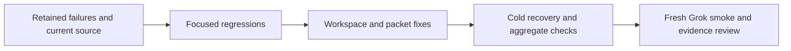

# ShipLoop fixes from the live E2E audit — 2026-09-17

Implementation completed; see [validation report](shiploop-e2e-fixes-validation-2026-09-17.md)
for pinned revisions, live findings, and the final focused checks.

## Outcome and boundaries

Fix the reproducible empty-index startup defect, strengthen how existing SDLC
packets preserve the original request and reconcile acceptance evidence, and
clarify fresh requests whose text happens to match an old active run. Preserve
the current protocol-3 producer/actual-Improve ownership, protocol-2 recovery,
Markdown authority, small-context recovery, and incremental repository work.
No new stage, scheduler, callback field, mandatory tool, deployment, or permission
is introduced. Existing unrelated dirty work is preserved.

The implementation baseline is the current package
`9a983ab4c32e5841f1cfe13b39908fd687ab56a520faac1808867d708f82080b`.
A complete source copy and selected test files are retained outside the checkout
at an external/private retained artifact (not included in this repository).
The prior live campaign tested an older package and one drift-invalidated
feature attempt; its results remain unchanged.

## Audit decisions

**Q1 — Does the runtime need more state? Info gain 0.9.** No. Discovery/spec
already own consumer/runtime requirements, and project knowledge already owns
durable context. The gap is an explicit, compact connection between the requested
runtime, actual entrypoint, material dependencies, and the local verification
route. A local-only request can defer hosting while retaining runtime
compatibility. Agent assumptions cannot become user-authorized scope changes.

**Q2 — Is a browser policy missing? Info gain 0.9.** No. The testing reference
already requires rendered observations for rendered requirements. Current
packets need to reconcile selected cases against evidence at completion.
Required failed, blocked, or not-run cases remain incomplete; an N/A needs a
scope-based reason. Script parsing of free-text evidence would not prove its truth.

**Q3 — Should Improve be redesigned? Info gain 0.8.** No. Actual Improve owns its
iterations and review records. Its handoff needs compact candidate/scope,
reviewer availability, reused-evidence applicability, findings, checks, limits,
and recovery locators in ordinary notes. Importing a terminal receipt still does
not prove semantic review quality. Preserve the existing importer contract.

## Implementation and acceptance

| Slice | Change | Regression / acceptance |
| --- | --- | --- |
| Empty-index workspace | Remove unnecessary `-- .` from copied-index `git add -u`. | New empty initial commit starts on first attempt without README; source index unchanged; staged/dirty/selected-untracked behavior preserved. |
| Runtime fidelity | Compact requirement/provenance and entrypoint/dependency guidance in existing v2/v3 duties and project knowledge. | Current and cold rendered packets retain the guidance; target requirement cannot be replaced by a convenient local preview. Semantic behavior remains a live-test claim. |
| Acceptance reconciliation | Surface existing test-evidence obligations at the relevant verification/acceptance/handoff stages. | Rendered packets require current-candidate observations and retain required missing cases; source-only proof cannot close selected interaction checks. No new result fields. |
| Improve records | Strengthen actual-child handoff plus compatible v2 reminders. | Pending-child cold recovery retains candidate/review/reuse/decision obligations and selected reference locators; actual importer contract remains compatible. |
| Improve receipt locations | State the existing execution-workspace containment rule in child receipt instructions and examples. | Current and cold child packets name the allowed root; no importer, schema, or path-guard relaxation. Added after a live callback rejection and successful autonomous correction. |
| New request vs recovery | Explicit identical-text rule in entry instructions and project knowledge. | Two active runs with identical prompt text have distinct identities through both direct `init` and public `workspace start`; explicit old-run `next` leaves both runs and workspace metadata byte-for-byte unchanged, for protocols 2 and 3. |
| Packaging and consumer selection | Regenerate ShipLoop plugin view from source, inspect installed Grok selection and current package digest before launch. | Package parity, aggregate hermetic checks, fresh process/empty CWD, changed skill selected, stable source throughout smoke. |
| Observer context exposure | Keep default product workspaces outside campaign controls; detect model tool inputs referencing observer controls. | Durable opaque product location preserves feature lineage; exposed trials cannot pass partial, full, or later grading. Detection is not a filesystem sandbox. |

The empty-index test is expected to fail before the fix. Structural prompt
obligations use failing actual-render/cold-recovery tests before changes; purely
editorial wording is reviewed rather than represented as model-behavior proof.
The same-prompt regression exercises an already supported CLI capability; the
new clarification targets the host's entry decision without breaking explicit
recovery. Preserve short locators and decision summaries instead of growing a
second transcript or an exhaustive inventory for trivial applications.

## Verification sequence

1. Narrow workspace, cross-run, navigator-v2/v3, and actual-Improve tests.
2. Independent review of the scoped changes and any unexpected test failures.
3. Regenerate/check the ShipLoop plugin view; run Ruff, the mock DAG suite,
   the E2E apparatus, and the required `bash test/run-all.sh` aggregate with the
   working Command Line Tools Git selected in PATH.
4. Freeze the final package and observer identities. Launch a fresh Grok
   `launch-smoke` request with the unchanged catalog prompt, requested `xhigh`,
   7200-second cap, and actual initially empty product CWD. Review stdout/stderr,
   first-attempt workspace startup, selected source, and accepted prefix.
   After focused checks, independent review, and package parity pass, this
   observation may overlap the remaining read-only aggregate checks on the same
   frozen candidate. Any source drift still invalidates the live trial.
5. Record exact results and limitations. A partial smoke cannot establish full
   game behavior, platform fidelity, complete feature chains, or hosted delivery.

Full Checkers platform and browser-fidelity comparisons require a stable-package
full run with independent artifact/UI verification. Repeated fresh-feature
and holdout runs are follow-on efficacy experiments, not prerequisites for claiming
these code/prompt changes are implemented. The present smoke establishes only
the observed prefix and whether Grok received the candidate skill.

## Additional experiment finding: observer context exposure

The first candidate smoke selected the frozen production package
`b6cec732ec4941b6b10783da1f983ce9b7f1678d13cbfefcefb4a2141fb702dd`
and successfully started a protocol-3 workspace. It cannot support a faithful
one-shot claim: Grok read the campaign's `suite-manifest.json` and the trial's
`manifest.json`, exposing the intake stopping boundary. Structured native events
205/211 and 247/254 retain the calls and successful reads. The runner's default
`output/products/...` layout put these controls above the product CWD.

Retain that attempt at
external/private retained artifact (not included in this repository) with its explicit
operator-stop receipt. Do not repair or relabel it as a pass. Separate new default
products into a durable opaque temporary parent, record their physical locations
for later feature runs, and reject caller-supplied campaign/product nesting.
Detect structured model tool input references to observer control paths and
prevent all pass routes from clearing that finding. Test the actual `read_file`
event shape, shell-path references, path-prefix false positives, and late grading.
This reduces accidental exposure and detects observed references; it does not
establish an OS sandbox or visibility into unreported/encoded file access.

After that observer change is frozen and reviewed, run a new smoke with the same
one-shot prompt, model, effort, and time cap. The observer
identity changes and must be reported separately. Concurrent source edits after
the aggregate check changed the shared checkout. The full aggregate result
applies to the retained `b6cec732…` candidate, not those later edits. To keep the
new smoke stable, materialize the exact tested bytes in a disposable Grok
profile, verify discovery from an empty product CWD, and pass the snapshot as
the expected skill root. Retain the profile-selection receipt. Its configuration
is a private copy and authentication references the existing account; the normal
skill installation is not changed. Other skills remain selected from their
existing roots. Do not revert concurrent work to restore the experiment.
The first run created a
README before Git bootstrap, so only the retained before/after empty-commit
regression establishes that particular production fix.

The isolated smoke subsequently passed the accepted intake boundary, including
an actual Improve child, with no observed control references or source drift.
It also exposed a narrower packet mismatch: “absolute local file references”
did not state that review/check files must be inside the execution workspace.
The importer correctly rejected a check file under the sibling `run/notes`;
Grok moved it under the worktree and retried successfully. Clarify the prompt
and examples with a rendered/cold-recovery regression after retaining that run.
The live run remains evidence for the pre-clarification frozen package; the
additional wording gets focused tests and is not retroactively claimed live-tested.

## Performance decision

Retain current stage/review structure. The previous audit found material review
corrections and no proven redundant rereads. Use existing captures to attribute
future stage latency, child reviews, host failures, and justified recovery reads
before proposing a separate optimization. This fix does not claim time/token
savings or change the requested effort.

## Evidence inputs

- [Live audit — platform, verification, and empty-tree findings](shiploop-e2e-audit-2026-09-17.md).
- `Feature audit — incremental product, run reuse, and review limitations` (external/private retained artifact; not included in this repository).
- [Mock validation — current routing and observer coverage](shiploop-e2e-mock-validation-2026-09-17.md).
