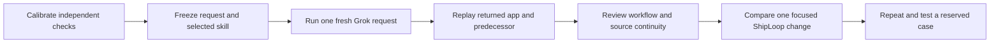

# ShipLoop full local E2E suite and improvement experiments

## Decision and scope

Implement the full **local** nine-request suite now. Use the existing literal
create/feature/refinement requests for tic-tac-toe, Checkers, and Battleship.
Keep `grok-4.6`, requested `xhigh`, 7200 seconds per request, and 1000 turns as
the future campaign settings. Historical 80-minute runs retain their recorded
budgets and are a different comparison condition. Do not confuse the deadline with expected
duration. Each request gets a fresh process, fresh ShipLoop run, and inspected,
hashed skill selection. A create starts in a physically empty new folder: both the operating-system process CWD and Grok `--cwd` point there, and ShipLoop owns Git bootstrap. Features use the returned original repository as CWD.

The existing apparatus captured useful full creates, but its executable oracle
only covered current-step tic-tac-toe behavior. The declared nine-case catalog
therefore exceeded its independent verification coverage. This plan closes that
gap and keeps explicit unknowns for adapters or review evidence that are missing.
It supersedes the initial implementation-status claims in the
[initial plan](shiploop-live-e2e-plan-2026-09-17.md), while preserving the
[baseline audit](shiploop-e2e-audit-2026-09-17.md) and every prior attempt.

The changes belong to the external test apparatus. Production ShipLoop fixes
are separate candidates, applied one at a time after their regression checks
exist. The active baseline run must never read a changing skill or observer.
The current feature campaign uses an external frozen observer copy so suite
implementation can proceed without changing the running observer.

Implementation of this plan means the full **apparatus** exists: nine-step
oracles, a composite verifier, source closure, workflow-review/2 validation,
campaign comparison, recovery isolation, and no-model groups. It does not mean
nine live Grok requests have passed, a universal browser mapping exists, or a
Google Apps Script app has been hosted. Those remain separate evidence claims
with their missing denominator retained.

## Definition of ready and done

Ready: each proposed check has a concrete assertion, a valid fixture, an invalid
fixture, and an explicit unavailable-observation outcome. Model requests stay
unmodified; no hidden plan, selector, API, test recipe, callback, or repair is
sent to Grok. Public state hooks may establish controlled game fixtures in an
independent verifier; ordinary clicks must establish the consumer behavior being
claimed. An adapter unable to arrange or observe a fixture returns unverified.

Done for implementation:

1. All nine catalog steps have executable independent behavior oracles and
   calibrated driver protocols, including preceding behavior for feature/refinement
   steps. A particular returned app still requires an independently established
   external adapter; no Battleship product or universal browser mapping is claimed.
2. A common verifier routes explicit external adapters and emits the existing
   hash-bound receipt schema. Before/after traces establish feature eligibility,
   regression status, and causal improvement separately.
3. GAS entrypoint/resource closure is checked independently from a static preview
   and required on every create, feature, and refinement receipt. Prompts remain
   unchanged; historical trials retain their frozen original check catalogs.
4. Incremental integration requires source/consumer review, not a churn threshold.
5. Workflow review and campaign comparison preserve gaps, unknowns, failures,
   interrupted attempts, observer versions, selected denominators, and
   planned-but-not-run cases.
6. Fast offline suites pass valid controls and reject the specified mutants.
   Real application experiments are reported separately from apparatus checks.

Done for a live full-chain claim: every predecessor is independently graded,
each new request returns to the same product, all old behavior passes before and
after, the requested capability is absent before and passes after, the source
review supports integration, and the workflow review has no unexplained material
gap. An already-present feature is non-causal; it cannot establish an added feature.

## Architecture and boundaries

Keep the current `run.py` process/capture/identity contract and `grading.py`
receipt validation. Add a single composite verifier callable through the existing
JSON `--verifier` argv; route by `result.json` step ID using an explicit driver
configuration. No second live-model scheduler is needed.

The layers are:

- Pure game oracles: actions and independent expected behavior for each family.
- External semantic UI adapters: map those actions to the returned application;
  report observations from the real page and record adapter/configuration identity.
- Composite verifier: replay current/prior cases on immutable predecessor and
  final source, check source closure, and combine independent review evidence.
- Campaign reader: compare retained results and validated workflow reviews;
  never launch models, repair products, or replace original records.

`verify_suite.py --drivers <registry> --review <record-or-registry>` is the
composite verifier entrypoint. The registry uses
`shiploop-e2e-drivers/1`: step or family IDs map to structured argv and bounded
configuration. Relative adapter paths resolve at the registry location. The
review input is one `shiploop-e2e-independent-review/1` record or a registry
keyed by step ID. The live runner invokes the verifier through its existing
structured `--verifier` argv boundary, retaining process capture, candidate-drift
checks, and receipt binding.

There is no universal GAS emulator or DOM layout. The post-run adapter is outside
the product and outside Grok's context. Unknown dynamic server behavior remains
unverified; a reviewer must supply a supported route rather than patch the app
to fit the test. Adapter correctness is calibrated with mutation controls and
audited against actual UI traces. A signed-looking or hash-bound receipt only
binds evidence; it does not authenticate a reviewer's semantic claim.

The browser adapter is a trusted external observation boundary, not a sandbox or
an autonomous mapping generator. It serves only an explicitly assembled
entrypoint and rejects non-origin requests. The supplied
`tictactoe_20260917.cjs` mapping is source-pinned to the inspected September 17
TTT baseline and intentionally rejects changed output. It is a known-baseline
calibration artifact, not a portable TTT adapter or a mapping for feature output.
Checkers and Battleship still require a reviewed per-product adapter after a
returned candidate exists.

## Coverage matrix

| Family | Create | Feature | Refinement | Critical negative controls |
| --- | --- | --- | --- | --- |
| Tic-tac-toe | turns, occupied cells, win/draw, terminal lock, reset | visible player and legal-cell highlights | one legal suggestion; immediate win/block | occupied-cell overwrite, false draw, stale highlights, missed block |
| Checkers | movement/capture, declared capture policy, chain, promotion, winner, reset | visible player and selected-piece legal destinations | hints toggle; required chain remains with same piece | illegal quiet move, other-piece chain, hints mutate state, missing destinations |
| Battleship | valid fleets, privacy, alternating shots, hit/miss/sunk/win, reset | status and per-player shot history | all/hit/miss history filters preserve state/privacy | repeat-shot turn advance, fleet leak, wrong history, filter mutates game |
| Incrementality | source/return baseline | old behavior before/after; absent-to-present | all earlier capabilities retained | preexisting feature, replacement app, dead original entrypoint, baseline regression |
| Platform | actual `doGet` source closure | compatibility retained | compatibility retained | sibling JS supplied only by local static server, missing/cyclic include, unused benign page |
| Workflow | request-to-plan-to-evidence review | prior knowledge/decisions retained | selected tests and review scope reconciled | HTTP/DOM substituted for interaction, unrun case called done, missing reviewer availability |
| Apparatus | fresh skill/process, capture/timeout | same-repo predecessor binding | receipt/observer integrity | stale selection, wrong digest, overshoot, truncated event, masked shell exit |

Rule choices explicitly left to the application (for example the capture policy
or small fleet dimensions) must be declared and held consistent by the adapter.
The oracle must not invent a product requirement. Missing policy or observation
is unverified, not evidence that the game violates an assumed rule.

## Additional experiments and decision gates

| ID | Experiment | Execute | Falsifiable result / decision |
| --- | --- | --- | --- |
| E01 | Valid/mutant oracle corpus across nine steps | Now, no model | Correct observations pass; each behavioral mutant fails its relevant assertion; malformed/missing observations stay unverified. |
| E02 | GAS source-closure pairs | Now, no model | Template inclusion/self-contained output is supported; raw relative JS is rejected even if a permissive local server works; dynamic unknowns do not pass. Recheck retained TTT/Checkers. |
| E03 | Incremental-source and eligibility controls | Now, no model | Additive and reviewed material refactors can pass; replacement, old-flow regression, stale review, and already-satisfied feature cannot claim causal incremental delivery. |
| E04 | Workflow review calibration | Now, no model | Required interactive case with only HTTP/DOM evidence is a gap; actual interaction supports it. Reviewer unavailable with scoped fallback differs from missing availability evidence. |
| E05 | Retained shell shapes and observer/provenance controls | Now, no model | Heredoc/dynamic shell cases retain explicit attribution limits; failed callback followed by successful shell command cannot pass; source edits invalidate affected observations. |
| E06 | Complete TTT feature chain on verified baseline | Now, live | Guidance then best-move each use a fresh process; prior checks replay; feature absence/presence and integration independently assessed. A failed predecessor blocks dependent work. |
| E07 | Empty-tree and staged/dirty snapshot diagnostics | Existing repro now; regress candidate before live rerun | The known empty-tree failure is measured, not hidden by seeding README. Candidate must preserve staged additions/deletions, dirty tracked files, and explicit untracked input policy. |
| E08 | Single-change platform-preservation pilot | After focused ShipLoop candidate | Repeat Checkers create unchanged; both local gameplay and target source closure must pass, with no invented binding weakening the user's platform. |
| E09 | Selected-test and Improve evidence pilots | Separate candidates | Same prompts, current-candidate interaction evidence and complete reviewer scope/fallback records; no extra DAG nodes or review scheduler. |
| E10 | Replication and untouched holdout | After a promising candidate | At least two comparable attempts per arm plus reserved Connect Four create. Count every attempt; no retry-until-pass selection. This is a pilot, not statistical proof. |
| E11 | Cold recovery / small-context ablation | Only if recovery guidance changes | Deliberate accepted-boundary stop plus separately labeled recovery prompt; compare retained decisions and completion. Never count two invocations as one-shot. |
| E12 | Hosted GAS delivery | After local gates | Authorized disposable target, candidate-bound activation receipt, deployed browser journey. Local source closure cannot prove hosting or authorization. |
| E13 | Stale active same-prompt recovery isolation | Now, no-model fixture; retain current live observation | With an active prior run whose prompt equals a fresh feature request, a fresh session must start a new workspace/run and leave the prior state unchanged. Successful `next` or callback on the old run is a crossed-request-boundary failure; explicit recovery is a separately labeled positive control. |
| E14 | Attribute preparation/review overhead | Retained transcript first; prompt pilot only after a supported gap | Reconcile identical reads with intervening writes, agent/stage boundaries and host errors. Use terminal usage only. If repeated work lacks a new evidence need, pilot compact durable decision locators within existing stages; require unchanged product/workflow quality before interpreting time savings. |

E01–E05 calibrate the suite itself before interpreting candidate quality. E06
addresses the core untested claim: adding a feature incrementally. E07 is already
reproduced by an isolated copied-index experiment and is the first production
script-fix candidate; that fix is outside this suite implementation. E08–E10
are implemented as repeatable campaign selections/reporting and remain opt-in
live experiments. E11/E12 have explicit protocols and prerequisites; they are
deferred rather than represented as passing tests. E13 records the current
validation-chain observation honestly: its new `ttt-guidance` process recovered
the retained active `tic-tac-toe-indicator` run with `next` rather than starting
a new workspace. That is a failed recovery-isolation experiment, not a clean
execution of E06. The process has since returned a locally verified incremental
feature after 79m 19s, but selected-skill drift independently invalidated the
benchmark. Product success does not repair the fresh-request failure, and the
dependent best-move run was not launched.

## Comparison design

Preregister arm, case, repetition, prompt, initial repository/baseline identity,
model/effort, time/turn limits, permission mode, skill digest, observer digest,
and verifier identity. A pair with differing settings or feature baselines is
descriptive only. Sequential feature steps are not independent replications.
The campaign report includes planned-but-not-run entries and missing reviews.
It never drops an unsuccessful attempt to improve a rate. The current attempt
was launched as `ttt-guidance`, so it remains in that selected-feature and
all-attempt accounting; its recovery-isolation failure excludes it only from a
claim of clean feature implementation or causal feature comparison.

Quality precedes cost: product behavior, platform, incremental continuity,
workflow gaps, then duration and host-reported terminal usage. Do not sum streamed
usage chunks, count child reviews twice, or attribute cached tokens entirely to
ShipLoop. Parent `xhigh` does not prove hidden child effort. A later grade or parser
replay is a new interpretation with retained original evidence.

Use both outcome and trajectory evidence. Primary evaluation guidance supports
separating returned environment state from transcript claims and repeating
non-deterministic trials. It also warns that rigid graders can reject valid
alternative solutions; explicit adapter/rule declarations address that risk.
[Anthropic — agent evaluation guidance](https://www.anthropic.com/engineering/demystifying-evals-for-ai-agents).
SWE-bench's evaluation approach separately checks changed behavior and retained
behavior; this informs our before/after and predecessor regressions without
adopting its container infrastructure.
[SWE-bench — evaluation harness](https://www.swebench.com/SWE-bench/api/harness/).
Google's HtmlService guidance establishes why a working sibling-file static
preview is insufficient target-source evidence.
[Google — HTML Service best practices](https://developers.google.com/apps-script/guides/html/best-practices).

## Implementation order and verification

1. Freeze the current observer for the live feature pilot; keep production
   ShipLoop unchanged during the campaign.
2. Implement game oracles, GAS closure checks, and composite before/after verifier
   in independent file slices; exercise adversarial controls.
3. Add workflow-review validation, explicit campaign comparisons, per-family full
   suites, and a standalone no-model suite command. Preserve existing CLI paths.
4. Run the complete apparatus suite, lint, and source-hygiene checks; independently
   review outcome/receipt boundaries and resolve substantive findings.
5. Use the new checks on retained products and the newly returned feature candidate.
   A later live refinement runs only after its predecessor is independently graded.
6. Update the experiment results with exact executed/unexecuted scope, run paths,
   measured outcomes, limitations, and the next supported ShipLoop candidate.

No new service, credential, MCP server, browser profile, or persistent dependency
is required. Use existing Python, Node, Chrome, and browser tooling for actual
adapters; offline apparatus tests need Python/Git and fixture executables only.

Run the apparatus with `check_suite.py --suite all`, or use its `harness`,
`games`, `workflow`, `regressions`, and `mock` groups while working on a slice. Each
receipt records `model_calls: 0`. A later local live campaign holds
`grok-4.6`, requested `xhigh`, 7200 seconds, 1000 turns, fixed permission mode,
selected-skill identity, and observer/verifier input identity constant. Hosted
delivery remains deferred until local gates and its separate authorization and
deployment plan are complete.

## Executed validation checkpoint

The implemented apparatus passed 156 no-model tests in 78.455 seconds, Ruff,
JavaScript syntax checks, and tracked-diff whitespace checks. The real browser
calibration passed the retained TTT base game and independently detected the
absence of the two requested enhancements. Source closure passes retained TTT
and rejects the retained Checkers sibling-resource route. A real-CLI positive
control started two distinct workspaces with identical prompt text and preserved
the prior state; explicit recovery of the old run also preserved it.

The completed live feature attempt remains in the original feature denominator
as invalid: it reused an old run and its selected package changed mid-execution.
Independent Chrome before/after checks, final source binding, 26 product tests,
and source review establish that its returned feature works and was integrated
into the existing application. They do not make the run a valid one-shot result.
See
[the validation record](shiploop-e2e-suite-validation-2026-09-17.md) for exact
artifacts and the separation of apparatus, real-browser, live-model, and hosted
evidence. This implementation did not edit production ShipLoop; separate changes
in the shared tree caused the detected drift and were preserved. The 156-test
checkpoint predates those changes. Further live comparisons require a stable,
newly fingerprinted selected package for the duration of each request.

## Fast behavior replay follow-up

The subsequent mock harness adds a separate no-model iteration loop:
capture a compact sanitized behavior record, review fixed expected transitions,
return scripted Grok responses, and apply them through the real navigator.
Protocol-2 observations remain legacy fixtures. Independently authored
protocol-3 cases exercise its producer/Improve handoff and correction routes.
Fixtures retain original invalid/product-failed qualifications; a routing pass
does not change those outcomes.

Use `check_suite.py --suite mock` for focused assertions and `dag_replay.py` for
an inspectable transition report. Future live runs derive `behavior.json` from
their retained outputs, including incomplete attempts. The recorder never feeds
a response back to a live model. The mock and recorder are external apparatus;
production ShipLoop code remains the system under test.

The additional experiment is falsifiable: a wrong expected edge, stale action,
conflicting callback, missing child handoff, changed source, or malformed fixture
must fail its relevant check. A clean case must keep work-item order, preserve
recovery state, and reach only its explicitly declared final status. This checks
protocol mechanics quickly; source-closure, game behavior, model quality,
one-shot isolation in real Grok, and hosted delivery retain their own experiments.
See [MOCK-REPLAY.md — command and evidence contracts](../test/experiments/shiploop_e2e/MOCK-REPLAY.md).

The compatibility experiment also exposed two observer assumptions tied to
protocol 2. The planning smoke must select a reviewed plan using the observed
protocol, and protocol-3 lifecycle evidence must match `improve-complete`, not
the producer callback that starts Improve. Regression fixtures preserve v2
behavior and require the v3 completion callback, exact run/action binding, and a
successful host result. These are harness changes, not changes to the SDLC.
The completed follow-up passed 32 fast checks, 187 total apparatus tests, and
10 replay cases; see
[the mock validation record](shiploop-e2e-mock-validation-2026-09-17.md) for
timings, retained evidence, discovered observer fixes, and remaining boundaries.
