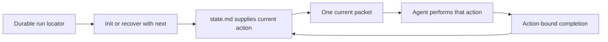

# ShipLoop task entry and recovery

The candidate makes entry and recovery explicit using the existing Navigator.
Every packet now prints the executing CLI, repository, run directory and an
executable recovery command. A host preserves those locators in durable handoff
material, recovers the matching run, performs one current action and consumes
the packet returned by its callback. The host never needs to reconstruct the
DAG cursor from conversation.

Only packet rendering changed in the runtime. Existing Markdown state, graph
order, action validation, callback fields, status transitions and transactional
writes remain intact. Improve still performs its internal reviews within one
current action and reports one completion after convergence. The canonical
skill, Navigator guide and thin agent card now carry the same entry contract;
the card's obsolete default `verify`/`repair` flow was removed.

`next` reads saved state. Paused/blocked work follows its printed resume route
once the condition is resolved; halted/done work stays stopped. Missing or moved
locators require access to the same run and task identity, never a replacement
`init`. State declarations still do not prove the underlying work happened.

## Validation record

Candidate base: `9fa833476d43e9f56d65315ad4d4afab89ce3f14`, branch
`codex/shiploop-driver-entry`, ShipLoop 0.9.3. The new recovery regression failed
on the old renderer and passed after the change. It executes the printed
command through a real shell using a relocated package, quoted paths and a
literal command-substitution string, from an unrelated current directory. It
checks unchanged saved action/state, the returned completion's successor and
rejection of a changed old callback. The Navigator suite passed 16/16 tests.

Package parity, frontmatter, skill-interop hygiene, scoped Ruff, four graph
traversal tests and link/diff checks passed. The full ShipLoop regression group
passed **632 cases across 63 suites** with `bash test/run-all.sh --group shiploop`
(using the existing CLT via per-command `DEVELOPER_DIR`). The [full source check log](../test/experiments/shiploop_entry_recovery/evidence/grades/source-shiploop-suite.txt)
is preserved separately from fixture grading.

The [preregistered trial](../test/experiments/shiploop_entry_recovery/preregistration.md)
used four fresh agent contexts with only the durable locator and one-action stop
instructions. Agents chose their own commands and recovered their assigned work
from the real CLI. The initial eleven setup transitions were synthetic; the
three subsequent accepted actions were real fixture work.

| Owner | Observed action | Result |
| --- | --- | --- |
| A | Recover `implement`, edit, stop before callback | Source and four tests saved; the same action remained pending. |
| B | Recover the same `implement` action | Reconciled and reused existing source, four tests passed; one callback returned `test-refine`. |
| C | Recover `test-refine` | Added U+2028 and bytes boundary cases; four tests passed; one callback returned `test-author`. |
| D | Recover `test-author` | Retained adequate tests and recorded a rejected isolated mutation; one callback returned `document`, then stopped. |

The [parent assessment](../test/experiments/shiploop_entry_recovery/evidence/grades/assessment.json)
confirms exactly three real transitions and unchanged source across recovery.
Independent fixed checks scored the seed **1/12**, the calibration reference
**12/12**, and the final fixture **12/12**. The four final unit tests passed and
rejected the preserved original seed in a separate scratch directory. The
[archive](../test/experiments/shiploop_entry_recovery/evidence/README.md) retains
initial/interrupted/intermediate/final state, callbacks, source/tests, worker
responses and check evidence. It contains the initial full packet and later
worker-recorded packet facts, not raw stdout for every packet.

One preregistered detail differed: D did not make a new test edit. A had already
written tests and C refined them; D followed the actual stage instruction to
retain adequate tests and checked their ability to reject a defect. That is an
observed authoring-timing deviation, not a perfect match to every planned step.
Future trial criteria should permit the stage's existing no-change outcome
instead of requiring redundant edits. The original criteria remain preserved.
B also recorded an optional `git status` failure caused by an Xcode license
prompt; it used fixture/check evidence without accepting a license or receiving
parent repair instructions. Source verification separately used the already
installed command-line tools via a per-command environment setting.

## Actual use and limits

This implementation itself entered the existing CLI at intake and is following
its saved actions and real callbacks. Its runtime locator is
`/Users/dadleet/src/skill-craft-driver-entry/.shiploop/entry-handoff.md`; state and
final report remain in that run directory, which Git intentionally ignores.
This implementation run is distinct from the fixture's explicitly synthetic
prelude and bounded live action segment.

The host must preserve accessible handoff material and run files. These changes
do not launch models, clear their contexts, install host integrations, enforce
host tool calls or prove cross-host reliability. Source publication is the
release scope; installation and deployment are outside this delivery.
