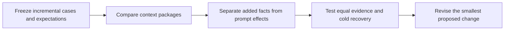

# Feature authority: incremental dry-run findings and revised plan

Date: 2026-09-17. Decision: **pilot selective retention and a short reconciliation
cue; do not add mandatory feature-spec files or new ShipLoop machinery.**

## Outcome

Ten fresh-context planning trials and five independent pairwise evaluations
were actually completed, plus a preregistration review. These are synthetic
planning interpretations, not actual ShipLoop graph runs, Improve executions,
application implementations, browser tests, or deployments.

The strongest observation was **information availability**: when an approved
privacy promise existed outside code/comments/tests, including it changed the
safe plan. Once both conditions received that promise, both recognized the
implementation defect. This does not establish that the promise needs its own
file, or that a new reconciliation instruction is necessary in every prompt.

The ordinary drag change worked without another specification file. Both
refresh trials accepted the explicitly requested behavior change instead of
freezing old requirements. Both held-out recovery trials rejected a draft that
would leak private notes and retained the existing access contract.

No material failure was identified by the five judges, conditional on each
trial's available evidence. Two criteria were UNKNOWN for the code-only retry
answer because it lacked the privacy contract. UNKNOWN is not a pass. These
small observations are not proof of reliability or equivalence.

## Preregistered design and review changes

The [study plan](../test/experiments/shiploop_feature_contracts/README.md) and
[packet generator](../test/experiments/shiploop_feature_contracts/study.py)
define the first three cases and mandatory criteria. A read-only reviewer caught
the information/instruction confound before trials. The plan explicitly limited
round 1 to descriptive context-package evidence and required an equal-information
follow-up before adoption. Review also added oracle/source digests, a recorded
judge-position shuffle and bounded evidence-file validation.

Trials used fresh Codex collaboration sessions with `fork_turns=none`, the host
default model/reasoning, and no model override. Exact backend build, temperature,
billed tokens and model-only latency were not exposed. Each trial was instructed
to read one packet and write one response only. This was an instruction boundary,
not a tool-disabled sandbox; no complete independent tool-transcript audit was
performed. Product names, policies and code were synthetic and self-contained.

Judges were separate fresh sessions, shown anonymously positioned contexts and
outputs. Positions were shuffled using seeds 9172026 and 9182026 and remapped
before aggregation. Condition contents remain visible, so this is position-bias
mitigation, not strong blinding to the treatment's nature. The recovery judge
received a follow-up asking it to distinguish answer-field ambiguity from an
actual wrong-phase action; this is a disclosed grader clarification, not a new
trial or a pre-registered wording-effect finding.

## Round 1: practical context packages

A = reasonable code-first guidance, code/comments/tests and ordinary README
context. B = the same context plus compact approved intent and a reconciliation
cue. B therefore changes both evidence and instructions.

| Incremental case | Pairwise preference | Material observation |
| --- | --- | --- |
| Visual drag for existing checkers | A | Both preserve rules and use existing docs/tests. A explicitly covers follow-on click suppression and lost pointer capture. |
| Two retries for transient notification failures | B | B detects a no-payload-logging policy violation; A cannot establish a policy it never received. Both raise duplicate-delivery uncertainty. |
| Preserve a local game across refresh | B | Both replace the obsolete refresh assertion. B is more precise about tab scope and updating the existing lifetime promise. |

Concrete evidence:

- `retry-A.json`: "deliver continues to record the full event_id, recipient, and
  body once at entry" describes observed behavior; it does not establish approval.
- `retry-B.json`: "The existing full-payload log is an implementation conflict,
  not behavior to preserve, because the maintained policy already forbids it."
- Both drag answers choose existing README/tests/comments, not a new spec system.
- Both refresh answers leave the unapproved historical multiplayer idea out.

### Seven-criterion pairwise tallies

| Criterion | A | B | Equivalent |
| --- | ---: | ---: | ---: |
| Task adherence | 0 | 2 | 1 |
| Factual accuracy | 0 | 1 | 2 |
| Completeness | 1 | 2 | 0 |
| Instruction following | 0 | 0 | 3 |
| Structural clarity | 0 | 0 | 3 |
| Precision | 1 | 2 | 0 |
| Conciseness | 0 | 2 | 1 |

Case preference: A 1/3, B 2/3, tie 0/3. The compare-prompts heuristic favors B,
but this is **not a causal prompt-quality result** and does not justify mandatory
new documentation. The information gap is intentional, not a baseline error.

## Replanning and round 2: same evidence, shorter cue

The [follow-up plan](../test/experiments/shiploop_feature_contracts/round2-plan.md)
was frozen after reading all six initial answers, before inspecting the initial
judge verdicts. It asked whether the evidence, rather than extra wording, was
doing the important work. Both follow-up conditions received identical product
evidence. A retained the original cue; C used a shorter reconciliation cue.

| Case | Pairwise preference | Observation |
| --- | --- | --- |
| Notification retries, contract supplied to both | C, modest | Both detect the same logging violation. C more clearly separates independent logging remediation from unresolved retry-enablement safety. |
| Cold recovery of an interrupted note-search plan | Tie | Both reject global-note search, reuse authorization filtering, replace the leaky test, and refuse to turn the draft or archived admin idea into authority. |

`equal-retry-A.json` now says the "approved policy supersedes preserving the
current payload logging behavior." This is the critical control: the baseline
also reconciles correctly when it has the relevant fact.

`recovery-A.json` explicitly completes only planning, leaving implementation and
tests for later. C's `completion` field describes the eventual feature gate.
Neither claims it advanced a script or performed implementation. The response
schema's generic completion field is ambiguous, so a future packet test should
ask separately about current-action completion and whole-feature acceptance.
This is **not evidence of a production navigation bug**.

| Criterion | A | C | Equivalent |
| --- | ---: | ---: | ---: |
| Task adherence | 0 | 0 | 2 |
| Factual accuracy | 0 | 0 | 2 |
| Completeness | 0 | 0 | 2 |
| Instruction following | 0 | 0 | 2 |
| Structural clarity | 0 | 1 | 1 |
| Precision | 0 | 1 | 1 |
| Conciseness | 0 | 1 | 1 |

Case preference: A 0/2, C 1/2, tie 1/2. The heuristic favors C, entirely on a
modest organization/precision preference in one sample. There is no demonstrated
material correctness gain, and two cases have very low statistical confidence.

## Cost and timing

Character-count/4 estimates cover packet plus answer text only, not hidden
instructions, bootstrap reads, tool envelopes, reasoning or billing.

| Round/condition | Mean input estimate | Mean output estimate | Mean total estimate |
| --- | ---: | ---: | ---: |
| 1 / A | 427 | 837 | 1,265 |
| 1 / B | 585 | 774 | 1,359 |
| 2 / A | 564 | 756 | 1,320 |
| 2 / C | 603 | 719 | 1,322 |

Using the compare-prompts larger-total denominator, B costs about 6.9% more in
round 1; C about 0.1% more in round 2. Output variability overwhelms any claim of
token savings. Input overhead is more interpretable: about 158 estimated tokens
for B's added context/cue, or 39 for C's equal-information cue difference.

The response batches took approximately 107 and 78 seconds from recorded batch
start to last response-file write. These include launch/scheduling delay and
exclude design, review and judging. Per-trial launch times were not recorded,
so no speed winner is claimed. The priority remains quality, then tokens, then
time; tiny-sample heuristic preferences do not establish adoption benefits.

## Revised plan: fewer changes, clearer ownership

No ShipLoop runtime or production prompt was edited by this study. Recommended
implementation, if approved, is limited to existing guidance and references:

1. **Discovery:** Find the affected product promises and their existing homes.
   Record whether each relevant statement is approved intent, observed behavior,
   or a proposal. Missing material intent is a knowledge gap, not permission to
   infer approval from code. Use links and relevant sections, not a full-history
   load. Do not document every untouched feature.
2. **Specification/planning:** Describe only the requested delta and unaffected
   promises that constrain it. The explicit new request can change the affected
   old behavior. Preserve current request identity and accepted revisions; do not
   label current protocol-3 specs immutable or import legacy freeze semantics.
3. **Document/Improve:** Reconcile affected code, tests, comments and approved
   promises. Fix an implementation mistake or obtain a real requirement decision;
   do not silently edit the promise to justify a bug. Review only related homes.
   Gate dependent actions without unnecessarily stopping independent work.
4. **Carry-forward/handoff:** Preserve otherwise-lost intent in the existing
   README, API, policy, architecture or decision home. Local implementation
   contracts can stay in clear code/comments/tests. Use the existing short
   SHIPLOOP index for references. Run plans/receipts remain historical provenance
   outside product return; durable promises cannot depend solely on old runs.

Candidate concise cue, tested as C rather than yet integrated into ShipLoop:

> For affected behavior, distinguish approved intent, observed implementation,
> and proposals. The current explicit request may revise prior behavior; preserve
> unaffected promises. Reconcile discrepancies without inventing approvals or
> silently redefining requirements. Reuse the existing natural home for each rule.
> Historical run plans are not current instructions. Gate only actions dependent
> on an unresolved decision; no mandatory new feature document.

Do **not** add a new feature registry, state field, counter, stage, mandatory
`FEATURES.md`, full-repository spec backfill, or second Improve implementation.
Do not claim a framework adoption is supported by this pilot.

### Next bounded validation before production adoption

Use actual current discovery/step-plan/document packets with a small existing
repository and real relative reference paths. Hold the data constant, including
one missing/stale reference and an intentional requirement change. Test whether
fresh readers actually locate and use the relevant source, not merely recognize
an inline excerpt. Separate current-action completion from feature acceptance.
Repeat the risky case in fresh sessions. Only then decide whether current prompt
wording already suffices or needs the concise cue. No need to build/deploy a full
application to answer that narrower retrieval question.

## Evidence and verification

Retained external evidence directory, relative to the checkout root:
`../.shiploop-experiments/feature-contracts-2026-09-17-nUHcQ3/`.
This historical local archive is outside the committed repository and is not
expected to exist in a fresh clone.

- `round1-v2/`: six exact packets/answers, three judge inputs/answers, manifest.
- `round2/`: four exact packets/answers, two judge inputs/answers, manifest.
- `round1/`: superseded preflight export; no model trial ran against it.
- Policy files retain the original A/B instruction texts. Trial wrappers were
  one bootstrap packet read and one response write; no prior conversation was
  intentionally passed. Agents retain ambient host instructions.
- All 10 answer records and five judge records passed structural checks.
- Every executed packet and preregistered source digest matched its manifest.
- Final independent report review found no material issue in counts, packet
  hashes, winner remapping, UNKNOWN handling or the limits on the conclusions.
- The mechanical helper's **six tests passed**: export separation, overwrite
  refusal, missing response, structural-vs-semantic distinction, packet drift,
  malformed response and path rejection (some assertions share one test).
- Ruff and Git diff whitespace checks passed for the experiment changes.

Reproduce packet exports with the commands in the study README and
`python3 prepare_round2.py --output <new external directory>` from the experiment
folder. Give each packet to a fresh session; `prepare_judges.py --output <round>`
creates judge inputs after answers exist. The tools never call a model or execute
an answer. Raw semantic outputs will vary; do not expect byte-identical reruns.
The generator's fixed `source_revision` is this study's design baseline, not a
fresh Git probe. Record the actual checkout/model settings separately for a new
study rather than treating that fixed field as live provenance.

The experiment harness is not added to CI or shipped as a dependency. Existing
unrelated dirty worktree changes were preserved. No commits or pushes performed.

Skill influence: evidence-first review prevented adopting the confounded result;
compare-prompts supplied fresh trials, randomized presentation and quality-first
scoring; agentic-execution supplied bounded independent preregistration and result
reviews. ShipLoop was inspected as the subject, not launched as a real delivery.
