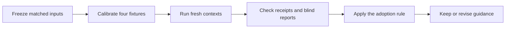

# Generalized discovery: historical results and portable apparatus

Status: historical summary. The source study retained its existing discovery
guide and added a reusable no-model experiment apparatus. This import contains
only that portable apparatus and synthetic fixtures; it contains no historical
trial reports, coordinator receipts, frozen guide copies, private mappings,
machine-local paths, or raw empirical evidence.



## Historical decision boundary

The excluded source-study record reports that the baseline was retained: one
fixture family favored the baseline, one favored the candidate, one tied, and
one semantic comparison was inconclusive. No candidate wording was promoted.
That is a historical statement only in this checkout; without the excluded
evidence, it is not independently auditable or reproducible here.

The portable fixture regressions preserve only deterministic, synthetic
contracts:

- F1 shows that preview success does not prove a committed write with an
  `id`-dependent row contract.
- F2 keeps producer acknowledgement distinct from the local retry/effect model.
- F3 keeps successful metadata distinct from task-data access.
- F4 checks an actual generated JavaScript sequence guard against the matching
  local model.

These regressions do not retroactively prove prompt quality, model behavior, a
hosted integration, installation, authentication, deployment, browser
behavior, persistence, or portability across agent hosts.

## What is reusable

The imported apparatus provides:

1. fresh study initialization with frozen inputs and calibration;
2. manifest and symlink validation before preparation, running, grading, or
   collection;
3. opaque paired arm preparation, bounded launch records, and explicit
   completed/failed/incomplete classification;
4. coordinator-owned receipt preservation, blind-bundle collection, and
   deterministic evidence readiness checks; and
5. hermetic tests that exercise these controls without launching a model or
   contacting a service.

Run the standalone no-model suite from the repository root:

```sh
python3 test/shiploop-generalized-discovery.test.py
```

Any new comparison must create its own study directory, freeze and calibrate its
actual inputs before contexts start, and retain receipts outside worker
workspaces. A missing receipt, calibration, report, or execution result is an
evidence gap, not a successful comparison.
