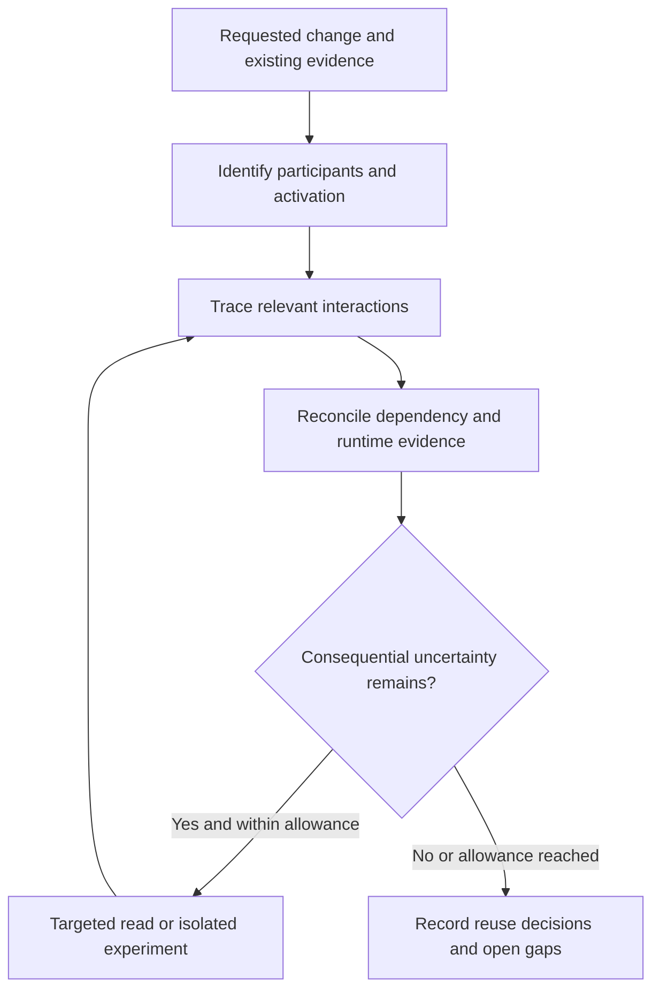

# Generalized stack discovery: improvement plan

Status: historical pilot plan. This document records the proposed comparison
shape; it does not implement candidate guidance or report new experiment
results.

The portable apparatus in
`test/experiments/shiploop_generalized_discovery/` lets a future study test a
small extension to existing discovery guidance without assuming a preferred
technology stack. It does not add a production runner, persistent research
database, vendor adapter catalog, acquisition policy, or mandatory checkpoint.

## Candidate to evaluate

The historical candidate was deliberately small. It asked discovery work to:

- distinguish the inspection path from the application's runtime path;
- identify an affected flow's trigger, participants, execution location,
  contract, state owner, and completion signal when those details matter;
- distinguish declared dependencies from resolved artifacts and active runtime
  evidence, preserving meaningful discrepancies;
- retain a representative source/example, its contract, applicable runtime or
  version evidence, and material mismatch before recommending reuse.

These are candidate instructions, not a claim that existing guidance fails to
infer them. Discovery remains conditional: an MCP reader is not part of the
application path unless evidence establishes that role, and missing runtime
access remains unresolved rather than triggering installation or execution.

## Bounded comparison design

Freeze a baseline, candidate, task text, fixture bytes, public contracts,
evaluation rubric, capability route, and allowances before trials. Use fresh
paired workspaces and contexts. Keep the same frozen candidate throughout; do
not tune wording after seeing results.

| Family | Consequential boundary |
| --- | --- |
| F1 local batch | Declaration versus launcher-selected dependency; preview versus committed write |
| F2 event worker | Producer acknowledgement versus selected consumer and modeled durable effect |
| F3 managed target | Metadata access versus denied task data; unrelated connector |
| F4 interactive control | Request ordering, supplied component, and separate store/cache roles |

Calibrate every reference fixture and one controlled altered state before worker
runs. Retain operation/result receipts and source hashes. A deterministic oracle
checks factual observations; blinded semantic review judges evidence fidelity,
justified applicability, actionable reuse, and bounded stopping. Do not score
keyword counts or treat a normal exit as report correctness.

Promote a candidate only when it has no critical evidence/safety regression,
does not lose a previously correct consequential finding, improves factual and
blind assessment in at least two distinct families, and repeats at least one
improvement in a fresh pair. Otherwise retain the baseline or report only the
narrower supported finding.

## Limits

The fixture languages and local probes are test implementations, not production
requirements. The managed target is simulated; no account, identity, permission,
or hosted behavior is established. The event model does not establish durable
storage. The interactive model does not establish browser rendering, network
timing, deployed behavior, cache expiry, or user access.

This plan calls for a fresh, separately retained study. Historical raw evidence
and any machine-local paths are intentionally excluded from this import.
