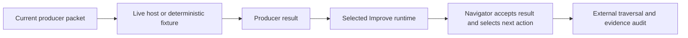

# ShipLoop graph validation: findings and next experiments

The priority is to prove which activities were offered, performed, and accepted,
with enough evidence to distinguish a missing activity from an observation gap.
ShipLoop already enforces routing. Its navigator uses a fixed lifecycle and a
serial work-item queue; it does not schedule an arbitrary dependency graph from
`depends_on` declarations. A callback cannot choose its successor. V3 keeps the
same producer action pending until its matching Improve child completes.
[shiploop_navigator.py — current_action and _next_stage: script-owned order](../skills/shiploop/scripts/shiploop_navigator.py),
[shiploop_navigator.py — apply and finish_improve: producer/child handoff](../skills/shiploop/scripts/shiploop_navigator.py).

For example, a v3 discovery producer result leaves discovery waiting for Improve.
The accepted child result releases research. A missing child must leave discovery
incomplete. Conversely, accepting the research transition does not establish that
the host researched the right question or retained sufficient evidence.

## Evidence gathered in this follow-up

The shared checkout was at `60da85a54e407211ecdabff0ccf4758d67028cb8` with concurrent
uncommitted work. Calibration used an external copy of the current ShipLoop
package, verified against source hashes before and after copying. No live model
was invoked and no production ShipLoop file was edited by this follow-up.

The ten existing DAG replay cases satisfied their assertions: nine positive
cases and one expected-failure control. Across the cases, 383 callback/control
events were recorded, including all 34 v3 producer stages. The full one-item v3
case exercised 68 producer/Improve callback boundaries. These counts are an
observed inventory, not a claim of exhaustive edge or branch coverage.

Two additional controls were confined to copied packages:

- Skipping research in the successor function failed at event 4:
  `expected edge discovery -> research/active, got spec/active`.
- Replacing the copied `SKILL.md` with deliberately incorrect instructions still
  passed the full v3 replay. This is the expected mock boundary: it does not
  interpret natural-language instructions.

`calibration.json — copied-source experiments: commands, identities and outcomes` (external/private retained artifact; not included in this repository),
`coverage-observation.json — observed inventory: per-case event counts and limits` (external/private retained artifact; not included in this repository).

The earlier live Checkers run reached completion while selected interaction
tests were unrun and its target-runtime artifact was incompatible. That is a
failure of activity evidence/requirements retention, not evidence that the
navigator failed to select a stage. Some callbacks also remain unattributed
because their shell shapes exceed the observer's supported grammar; report those
as unobserved, not automatically skipped.
[SAMPLES-2026-09-17.md — full creates and observer replay: live qualifications](../test/experiments/shiploop_e2e/SAMPLES-2026-09-17.md).

## Adopt now: repair v3 Improve inventory auditing

The external workflow auditor extracted Improve action IDs only from history
stage names containing `improve`. V3 records ordinary producer stages and stores
completed child records separately in `improve_results`. Consequently, a
wrong declared inventory could receive `supported-pass`.

The bounded correction derives v3 completed IDs from paired history/child
records, checks exact inventory membership even when the observed set is empty,
excludes other runs, and preserves the legacy stage-name path. Missing child
records remain unverified; extra or malformed child records are invalid. An
active child cannot count as a completed child. Divergent current-run snapshots
remain unverified instead of being combined into a fabricated completed history;
malformed navigation containers produce an assessment rather than an exception.
This validates recorded evidence
structure, not the semantic quality or authenticity of a review.

Implementation and regression tests are in `workflow_review.py` and
`test_workflow_review.py`. Red/green evidence is retained outside the checkout at
external/private retained artifact (not included in this repository).
Final targeted validation passed 14 workflow-review tests and 7 campaign tests.
Independent review and root review also checked divergent snapshots, mixed
protocol records, and malformed containers. These changes are uncommitted and
do not alter ShipLoop's production graph or rewrite earlier trial results.

## Minimal implementation plan — YAGNI/KISS revision

This section replaces the broader follow-up proposals from the initial audit.
The approved plan below is now implemented and verified offline. The execution
record at the end distinguishes those results from the separate live campaign.

### Scope and decisions

| Candidate | Decision | Reason |
| --- | --- | --- |
| Existing v3 Improve-inventory correction | Finish and retain | Reproduced false-pass; bounded fix already has 21 passing targeted tests |
| One short CLI-to-host-observer integration test | Implement | Closes an actual boundary between separately tested components |
| New full fake-host runner or LLM emulator | Do not build | Existing CLI composition and DAG replay already provide the needed execution machinery |
| Unified event schema, new trace store or dashboard | Defer | Existing result, raw logs, replay events and runtime test diagnostics already provide the observations |
| Automatic v3 live-trace conversion | Defer | No clean complete v3 live trace currently requires conversion; child pairing and provenance add substantial scope |
| General graph-coverage or mutation framework | Defer | Fixed independent route assertions plus existing branch/recovery cases meet the present need |
| ShipLoop graph, scheduler, or new completion gates | No change in this increment | Routing control passed calibration; demonstrate a remaining live failure first |

This follows YAGNI's distinction between useful current tests and speculative
extensibility. Tests that protect present behavior are justified; infrastructure
for hypothetical future cases is not. Hypothesis likewise advises ordinary
tests when a state-machine framework is unnecessary.
[Martin Fowler — YAGNI and evolutionary design](https://martinfowler.com/bliki/Yagni.html),
[Hypothesis — when stateful tests are unnecessary](https://hypothesis.readthedocs.io/en/latest/stateful.html).

### 0. Freeze the implementation inputs

Record HEAD, task-owned file hashes, selected source/generated packages and
selected Improve runtime. Preserve concurrent edits and earlier failed evidence.
The full-runtime test was untracked when inspected and its suite entry was
already present: coordinate with its existing owner and use that implementation,
not a replacement. Its source asserts the full graph; this planning turn does
not establish a fresh execution result for it.

**Ready when:** the two auditor files and existing full-runtime test are stable,
ownership is clear, and the selected packages can be tested from an isolated
copy. If another task changes a relevant file, refresh only affected evidence.

### 1. Finish the existing audit correction

**Files:** `test/experiments/shiploop_e2e/workflow_review.py` and
`test/experiments/shiploop_e2e/test_workflow_review.py`.

Retain the implemented current-run v3 parent/child pairing checks, explicit empty
inventory comparison, legacy behavior, malformed-container handling, and
ambiguous-snapshot/protocol handling. Review the final scoped diff against the
retained red/green receipts. No additional abstraction or graph validator is
needed. Existing tests already cover the confirmed failures.

**Done when:** the 14 workflow-review and 7 campaign regressions pass on the
selected bytes, unrelated-run records do not count, and missing or conflicting
evidence cannot receive `supported-pass`. Do not modify historical trial reports
in place merely because the auditor improved.

### 2. Add one short observer integration test

**Primary file:** `test/shiploop-full-runtime.test.py`.
**Documentation:** update the short-command guidance in
`test/experiments/shiploop_e2e/MOCK-REPLAY.md` or its existing README section.
No new runner, test framework, suite registry, protocol, or persistent store.

Add a method named `test_v3_intake_host_observer_bridge` to
`FullRuntimeCompositionTests`. Reuse `_start_direct` and `_accept_stage` for only
`init -> intake producer -> actual Improve import -> discovery`. Keep the current
34-stage test responsible for the complete route, worktree return, recovery, and
source/generated package boundary.

Use a test-local recorder around `_run` to retain this short path's actual argv,
return code, stdout and stderr. Convert those recorded results into explicitly
synthetic Grok-shaped `tool_call`, `tool_call_update`, and `end` events. Use a
small data-only emitter through `capture.capture_process`, then the existing
`grok_adapter.summarize_events` and `run.lifecycle_observation`. Read the real
produced state instead of constructing a fake accepted history. Retain the real
prompt value and selected copied script identity for matching; this is fixture
composition, not real Grok skill discovery or instruction comprehension.
Capture the pending-state checkpoint immediately after the producer result for
the producer-only assertion; do not fabricate it by editing completed history.

Keep setup local to the test method. Run the real prefix once, freeze its records,
and make each negative event stream a separate copy with a separate capture
output. Stream mutations do not rerun or modify the accepted product/state.
Do not retain every full-route CLI output globally or extract a shared helper
library solely for this one caller.

**Acceptance checks:**

| Case | Required observation |
| --- | --- |
| Valid prefix | Exactly one accepted intake action and one attributable v3 `improve-complete`; discovery remains active; selected copied script and run/action IDs match |
| Producer result only | Intake remains pending Improve; producer `done` cannot count as accepted v3 activity |
| Missing completion update | Durable acceptance remains visible, but the matching callback is unobserved; the observer must not support complete attribution |
| Duplicate tool event | Cannot inflate the accepted-action count; ambiguous attribution stays explicit |
| Missing terminal `end` | Existing terminal observation is false; do not erase otherwise observed accepted actions or interpret the prefix as a complete host stream |

The assertions must keep stream integrity, accepted graph position, and lifecycle
correlation separate. In particular, `lifecycle.complete` describes correlation
of the observed history, not terminal application delivery. A synthetic stream
with missing `end` can retain valid callback evidence while lacking whole-stream
evidence. Do not introduce a new production gate to collapse those dimensions.

If this test exposes a real parser/correlation defect, repair only the failing
existing function and add its focused regression. Preserve the reproduced failure
and confirm the test detects it. Do not broaden the test into shell emulation.

Existing extension points:
[shiploop-full-runtime.test.py — _run: actual subprocess outputs](../test/shiploop-full-runtime.test.py),
[shiploop-full-runtime.test.py — _accept_stage: existing real child lifecycle](../test/shiploop-full-runtime.test.py),
[grok_adapter.py — summarize_events: host event attribution](../test/experiments/shiploop_e2e/grok_adapter.py),
[run.py — lifecycle_observation: accepted-action correlation](../test/experiments/shiploop_e2e/run.py).

### 3. Validate using existing suites and outputs

| Purpose | Command from repository root |
| --- | --- |
| Audit correction | `python3 -B test/experiments/shiploop_e2e/check_suite.py --suite workflow` |
| Short integration test, after implementation | `python3 -B test/shiploop-full-runtime.test.py FullRuntimeCompositionTests.test_v3_intake_host_observer_bridge` |
| Fast full routing and fixture controls | `python3 -B test/experiments/shiploop_e2e/check_suite.py --suite mock` |
| Actual CLI composition and recovery | `python3 -B test/shiploop-full-runtime.test.py` |

Retain outputs, exit codes and selected source hashes outside the checkout.
Use existing lint/whitespace checks for edited files. Run the full apparatus
suite once for final integration; rerun it only after relevant changes or a new
failure. Record measured duration of the new short test rather than promising an
unmeasured time target. Keep the current short per-process CLI timeout; the
live two-hour budget is not a timeout for deterministic fixture calls.

Document where the existing observations live instead of building another report:
`result.json` contains lifecycle counts and missing callback IDs; `audit.json`
contains stage counts; DAG replay `report.json` contains ordered from/to events,
work-item owners, action IDs, state hashes and packets. Preserve the existing
runtime test's failure diagnostics in the outer command log. Its internal trace
is currently temporary and is removed by test cleanup; include relevant recorded
CLI results in a failing assertion rather than add a new retention subsystem.
A short table of test names and the
contracts they cover is sufficient; do not claim exhaustive edge coverage from
34 visited stages.

### 4. Run the smallest live validation that answers the remaining question

After the package and observer are frozen, use existing catalog selections:

1. One tic-tac-toe launch smoke through accepted intake, using the unchanged
   one-shot create prompt. Label it partial. It tests actual Grok discovery,
   prompt delivery and first accepted activity.
2. One full tic-tac-toe create and its guidance feature against the same returned
   repository. Select those two existing `ttt-full` cases and omit refinement for
   this initial validation. Preserve predecessor receipts and source lineage.
   Independently test base gameplay, added highlighting and possible-move
   behavior, target-runtime compatibility, and incremental source preservation.

Use Grok `xhigh`, a fresh process per request, an actually empty CWD for the new
application, refreshed/pinned skill selection, the two-hour cap per live request,
the existing 1,000-turn secondary cap, and isolated observer controls. These are unchanged one-shot prompts: do not
inject callbacks, verifier hints, or repairs. Keep local verification first;
hosted delivery remains a separate later experiment. Stop dependent live cases
if creation or predecessor evidence is invalid. Do not expand to Battleship,
Checkers, repeated campaigns, or refinement until this pair provides a valid
answer or an observed defect requires a focused reproduction. One successful pair
establishes a sample result, not a general reliability claim.

Review accepted activity order and Improve imports, then the substantive evidence
for each selected activity. Existing requirement-retention and selected-test
reconciliation guidance is the production candidate under evaluation. If a stage
is accepted without performing its selected interaction check or preserving its
runtime requirement, record the exact failing packet and current evidence before
proposing a targeted ShipLoop change. Fix the demonstrated boundary; do not
preemptively add a generic gate or rewrite the graph.

### Exit and deferred-work triggers

The implementation increment is complete when the audit correction and short
integration test pass, existing graph/CLI suites remain green, negative streams
cannot masquerade as complete observation, and unrelated work is preserved.
Report this separately from live campaign completion.

The live validation is complete only with current source-bound evidence for the
partial prefix and full create/feature pair, or an explicitly reported blocker or
invalid attempt. A mock pass cannot satisfy that criterion.

Reconsider automatic v3 trace conversion only when a clean retained v3 trace
needs repeatable conversion to reproduce a concrete bug. Reconsider broader
sequence generation only when a real transition defect escaped the fixed cases.
Reconsider a new report only when the existing retained outputs demonstrably
prevent diagnosing a run. These triggers keep the present implementation small
without weakening the original graph-walking and one-shot evaluation goals.

## Implementation and verification record

Implementation used an isolated snapshot of the working content at
`004447fd395d1820332cf454c9f966c4c85f63fe`, including the concurrent uncommitted
ShipLoop/Improve candidate. This is a frozen working-content result, not a claim
that HEAD alone contains or passed these changes. No production ShipLoop script,
skill card, graph, or generated package was changed by this increment.

The new `test_v3_intake_host_observer_bridge` executes the real copied CLI and
selected Improve child, captures the pending and accepted states, and exercises
six synthetic host streams: valid, producer-only, missing completion update,
duplicate tool event, missing terminal end, and unknown completion exit. Its
focused run took 1.33 seconds (1.40 seconds wall time). It uses the existing test
class and observer functions; it adds no runner or event schema.

Two additional observer defects were reproduced and fixed during review:

- A completed tool event without an exit code could count as a successful start,
  callback, or return. The observer now requires explicit exit evidence; six
  failing v2/v3 boundary controls turned green after the one-line correction.
- Navigation with no matching current-run state could support an asserted
  Improve inventory. Empty, foreign-only, and non-mapping state lists now leave
  that inventory unverified. The three failing controls turned green after the
  correction. Analyst-only legacy records without either navigation container
  preserve their existing behavior.

| Verification on the frozen candidate | Result |
| --- | --- |
| Final full E2E apparatus | 225 passed, zero failures/errors/skips, 163.88 seconds |
| Full real CLI composition | 3 passed, including the 34-stage path and recovery, 75.85 seconds |
| Short observer bridge | 1 passed, 1.33 seconds |
| Workflow and campaign regressions | 22 passed |
| Protocol compatibility regressions | 5 passed |
| Ruff F/E9 on edited Python files | Passed |
| Independent review | Confirmed the two fixes and bridge; no remaining actionable findings |

The final full-suite run verified unchanged source hashes across both commands.
Red/green logs, command receipts, source manifests, and the isolated worktree are
retained in an external/private validation workspace (not included in this repository).
The short test commands and observation locations are documented in
`test/experiments/shiploop_e2e/MOCK-REPLAY.md`.

Live validation remains separate and is still in preflight at this handoff. The
normal Grok CLI has no skill-directory flag, and disposable parent/project skill
folders did not override global discovery. A frozen `--skill-root` assertion
correctly rejected that mismatch before model launch. The remaining experiment
is Grok's supported process-local `GROK_HOME` configuration directory, preserving
the normal authentication reference and global installation. No new live model
has been called by this increment yet; none of the offline results above proves
one-shot instruction comprehension, generated gameplay, or hosted delivery.
