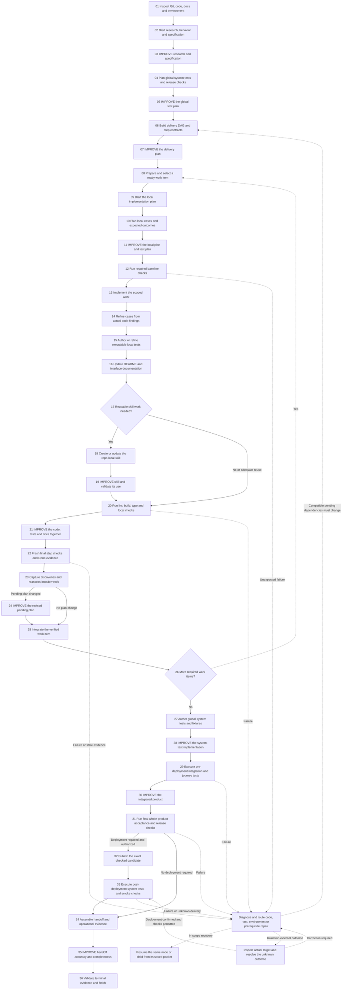

# Proposed SDLC with Improve owning convergence

September 14, 2026. Planning proposal; no runtime implementation or installation. Inspected source HEAD: `d8b8432beb6d3cef26e4402a80f8e778f64f129d`. Other worktree changes are present and were not part of this proposal.

**Decision: adopt the architecture “produce the candidate, then invoke Improve until it is complete.”** ShipLoop should schedule explicit SDLC outputs and enforce dependencies. Improve should own the repeated review/plan/apply/check/record/assess work for each assigned target. The parent should receive one terminal result instead of recreating Improve's internal progression at every call site.

This revises the earlier recommendation to retain all existing parent-managed loops. That recommendation gave too much weight to preserving the present implementation and too little to making Improve the reusable owner of convergence. The earlier audit remains a current-behavior reference; this document is the preferred future design.

The flat diagram is a **proposed lifecycle flow**, not a claim about today's exact stage names. Each uppercase IMPROVE node is a complete managed Improve invocation, including its internal repetitions. Solid arrows show the normal successful ordering and conditional dependencies. Dashed arrows are scheduler repetition/repair, not edges to insert into an acyclic product DAG. Failure paths never also take the success edge. Every Improve node can stop incomplete for a blocker, changed prerequisite or requested stop. Recovery resumes the stored current node/child packet; it does not pick an unrelated ready item or rerun all preceding nodes. Node 06 preserves completed/running definitions when revising pending work; an incompatible contract change stays blocked for direction. Node 32 has no automatic replay edge. Unresolved external uncertainty remains blocked, and lack of deployment authority is not the no-deployment-required branch.

Global system-test work at 27–29 is expanded here to make it visible. In an implementation it is scheduled as owned test work with explicit prerequisites; it can run earlier when its needed producers are available. This diagram does not add a second untracked outer test executor.

## 1. What Improve really supplies today

Improve already contains the desired reusable sequence: review against current evidence and Git history; plan warranted improvements; apply; refine/run checks; record; assess; repeat until two distinct consecutive completed trivial/no-change reviews with current evidence and no unresolved material findings. It explicitly permits a no-change plan and does not require recursive plan convergence inside every iteration. [review-policy.md - Review-cycle obligations: the shared Improve loop](/Users/dadleet/src/skill-craft/skills/improve/references/review-policy.md:34), [Improve SKILL.md - Execution handoff: no automatic nested plan-convergence loop](/Users/dadleet/src/skill-craft/skills/improve/SKILL.md:127).

“Auto-loop” means the host continues following the skill's packets without another user invocation. The bundled runtime records transitions and can run a configured verifier; it does not itself perform the engineering judgment or launch a background model worker. [ADAPTER.md - runtime role: agent performs work and runtime records increments](/Users/dadleet/src/skill-craft/skills/improve/runtime/until-loop/ADAPTER.md:23), [ADAPTER.md - Host loop: automatic continuation by the executing agent](/Users/dadleet/src/skill-craft/skills/improve/runtime/until-loop/ADAPTER.md:195).

Two current limitations matter to the integration:

1. Standalone Improve explicitly says its generic runtime does not independently count the semantic review streak or verify commit/review claims. It keeps those review records in `working.md`; the generic runtime's accepted-submission count is not an Improve pass count. [Improve SKILL.md - evidence binding: review records are not an enforced streak counter](/Users/dadleet/src/skill-craft/skills/improve/SKILL.md:73), [Improve SKILL.md - Execution handoff: enforcement limits](/Users/dadleet/src/skill-craft/skills/improve/SKILL.md:127).
2. The standalone v2 runtime uses authoritative JSON state. ShipLoop uses authoritative Markdown and stronger per-pass checks. A direct nested invocation would introduce a deliberate state-model change and needs an evidence bridge; it is not a drop-in equivalent. [runtime-v2.md - Binding, loading and authority: current standalone JSON state](/Users/dadleet/src/skill-craft/skills/improve/runtime/until-loop/references/runtime-v2.md:11).

ShipLoop currently imports a pinned **policy**, not the standalone loop. Its adapter explicitly tells the host to execute only the current ShipLoop stage and retain nested plan gates. That is why the existing interaction still feels like many separate loops. [shiploop_improve_policy.py - module contract: policy binding without a runtime](/Users/dadleet/src/skill-craft/skills/shiploop/scripts/shiploop_improve_policy.py:1), [shiploop_improve_policy.py - cycle: current parent-owned stage instructions](/Users/dadleet/src/skill-craft/skills/shiploop/scripts/shiploop_improve_policy.py:100).

## 2. Recommended ownership change

| Owner | Responsibility |
| --- | --- |
| ShipLoop | Select the next SDLC node, supply its immutable requirements and current inputs, authorize its scope, wait for its output, validate the returned certificate and schedule consumers or corrective work. |
| Managed Improve invocation | Own review, history-informed planning, application, test refinement/execution, findings, materiality, repeated passes, learning records and convergence for the assigned target. |
| Host/agents/tools | Execute the current child packet and supply actual observations; optional independent reviewers challenge the candidate without changing scope or advancing the parent. |

**One convergence owner per target.** While Improve runs, ShipLoop records its child identity and waits. ShipLoop must not simultaneously maintain a second streak, issue a parallel `improve-plan` sequence for the same candidate, or count child callbacks as parent passes. The parent validates the child's proof; it does not conduct another identical two-pass campaign after the child finishes.

The managed entrypoint is a **proposed addition to Improve**, distinct from its existing “owner-managed consumer” entrypoint. The existing entrypoint intentionally leaves phases with the caller. The new route transfers phases to Improve. This distinction must be explicit in the skill and adapter; simply changing a prompt to say “run the full loop” would contradict the present binding. [Improve SKILL.md - Owner-managed consumer entrypoint: current caller owns phases](/Users/dadleet/src/skill-craft/skills/improve/SKILL.md:43).

### Integration choices

| Option | Assessment |
| --- | --- |
| Keep today's policy-only embedding | Valid current behavior, but insufficient for the requested stronger adoption. |
| Invoke standalone Improve and trust its final sentence or generic `done` | Insufficient replacement for current ShipLoop evidence standards. |
| Standalone Improve plus a strict bridge validating its review/check/commit evidence | A possible isolated pilot. Must explicitly accept its JSON child state and differing defaults; a bridge is still required. |
| **Managed Improve subrun with typed receipts and a Markdown storage binding** | **Recommended target.** Transfers actual repetition to Improve while preserving ShipLoop's established durable-state and verification contract. |

Implement the recommended target by moving/reusing the existing proven convergence and evidence machinery behind an Improve-managed interface, with target-specific validators supplied by the consumer. Do not rebuild all validators or make a universal workflow framework. The first adapter can cover only ShipLoop; generalize further when another real consumer needs it.

This is real implementation work, not a configuration switch. Adopt the direction now; pilot the bridge and migrate one loop family at a time. Retain old-run recovery until migration is explicitly supported.

### Managed invocation contract

Proposed inputs, kept in the existing durable run hierarchy:

- Parent action and unique child identity; exact target kind and output bundle.
- Candidate paths, baseline revision/artifact hashes, read-only requirements and permitted edits.
- Selected case IDs, expected outcomes, executable check requirements and environment identity.
- Review rubric, history window, independent-review requirement when selected, commit policy and no-change handling.
- Required documentation, skill and carry-forward outputs; interruption and external-effect constraints.
- Policy/executor version and relevant input digests, so a recovered run uses the same contract.

Proposed results: `converged`, `blocked`, `needs-prerequisite`, `needs-replan`, or `stopped`, with corresponding evidence. These are proposed statuses, not existing CLI values.

Only `converged` may release consumers. Its certificate references the exact final artifacts, distinct completed review records, required commit receipts, no open material findings and fresh passing checks. Improve derives the streak from those records. The parent checks the certificate and current identity. Neither counts generic tool calls, verifier retries or budget exhaustion as success.

For planning/evidence targets outside the product tree, the certificate binds the actual Markdown artifacts and their input digests as well as any policy-required audit commits. A Git SHA alone cannot identify run-directory plan text.

Recovery must reattach to the same child. If a child completed just before the parent crashed, the parent imports the same certificate idempotently; it must not rerun the child, recommit, or repeat a deployment. Unknown external effects stay unknown until inspected.

The parent creates one immutable active-child binding keyed by parent action, target and input identity. Improve alone owns its namespaced child records; ShipLoop alone owns the top-level state, DAG, active-item cursor, consumer release and merge. Use the existing transaction/locking approach for creation and certificate import. Import verifies the active binding, policy version, input/output identity, allowed-change inventory and replay key atomically. Scope validation is an evidence check, not a claim of operating-system isolation.

| Incomplete child result | Parent treatment |
| --- | --- |
| `needs-prerequisite`, needed now | Keep the active consumer blocked. An in-scope prerequisite repair resumes the same owner; a required new global producer or running-contract change needs an explicit allowed replan/new-run disposition. Do not select unrelated work to bypass Ready. |
| Compatible future obligation | Map it to changed/new pending steps through validated replan; preserve active/completed definitions. |
| `needs-replan` | Preserve the child and its evidence; parent validates scope and maps obligations before resuming any affected work. |
| `blocked` or `stopped` | Retain the binding and unfinished status. Resume requires the recorded condition or instruction; abandoning it marks it incomplete, never converged. |

If independent review is mandatory in the binding, unavailability blocks convergence unless that binding explicitly permits a recorded self-review fallback. “Use independent review when available” is a different, optional policy and must be labeled accordingly.

## 3. Make the SDLC nodes explicit

The product delivery DAG expresses which outputs depend on which other outputs. The lifecycle expands a ready item into visible SDLC nodes. The flat execution view should show those instantiated nodes and each Improve invocation's status. Internal Improve repeats remain inside that node.

**Promote an activity to a distinct node when it has a separately reviewable output, a prerequisite somebody consumes, a different write/authority boundary, or evidence that must exist before the next activity.** Do not turn every read, lint command, commit or reviewer comment into a DAG item.

| Explicit node/output | Dependency it makes unmissable | Improve target |
| --- | --- | --- |
| Research and behavior/specification | Accepted expectations before implementation/test design | Research/spec bundle; preserve distinct rubrics and input bindings even if one invocation owns the bundle |
| Global system-test requirements | Cross-component, release and real-boundary cases before delivery sequencing | Global test plan |
| Delivery DAG and step contracts | Suppliers, test owners, skill prerequisites, environment preparation and release ordering | Delivery plan |
| Local implementation plan | Chosen work and affected boundaries before application | Local plan bundle |
| **Local test plan** | Cases, fixtures, expected outcomes and selected checks before coding | Improve jointly with implementation plan |
| Required baseline verification | Observed prerequisites before dependent changes | Evidence gate; diagnose unexpected failures rather than polish the result |
| Product implementation | Scoped candidate before post-code test refinement | Product bundle |
| **Case refinement after implementation** | Newly learned boundary/failure cases become explicit | Cases must retain independent expected outcomes |
| **Executable test authoring/refinement** | Actual tests exist and cover the accepted case map | Product bundle, or a distinct test-suite target when separately owned |
| **Execute local checks** | Actual results before product convergence/finalization | Run again inside Improve after changes; this is execution, not test-plan review |
| Documentation and reusable-skill decision | Explicit reuse/create/update/no-work disposition | Included in product bundle; new reusable procedure may have its own skill target |
| **Build and validate a needed skill** | Usable indexed procedure and verified helpers before its consumers rely on it | Skill package and examples |
| Whole-step Improve | Code, test cases, executable tests and docs agree on one candidate | Coupled product bundle |
| **System-test authoring** | Planned SYS cases have real executable implementations and fixtures | System-test suite |
| **Execute pre-deployment system tests** | Cross-step behavior and selected journeys proven before release | Real integration evidence; failures need repair |
| Whole-product Improve | Cross-component omissions get corrected through a scoped integration work item | Integrated product candidate |
| Final release checks | Current whole-product evidence before publication | Gate; no automatic second convergence campaign |
| Publish/deploy | Exact authorized target/build before post-release observation | Side-effecting operation, not a freely repeated Improve target |
| **Execute post-deployment tests** | Expected behavior on the actual deployed build | Live verification; failures route to inspection/corrective work |
| Improve handoff | Accurate claims, limitations, owner/recovery instructions and links | Handoff evidence; no product edits or deployment |

These are overt responsibilities, but not necessarily separate global files. Reuse existing contract IDs, plan bodies, manifests, system-test catalog and receipt locations. Do not create a duplicate case database to make the graph look flatter.

### Local tests versus outer tests

Local tests are planned at 10, improved at 11, refined from code at 14, authored at 15, executed at 20, reassessed/rerun by Improve at 21 and freshly checked at 22. A pre-code case matrix does not prove that tests were authored or run.

Global tests are planned at 04, improved at 05, assigned producers/dependencies at 06, authored at 27, improved at 28, and executed against the assembled product at 29 and the deployed product at 33. Improve can validate an authored post-deployment test's construction before release, but cannot claim that test passed against a build that has not been deployed.

The current SYS model already binds cases to owned test steps and requires post-deployment SYS cases to follow a DAG publication step. Reuse it for the explicit outer sequence. Supporting a distinct outer-publish path with the same proof would be separate work. [shiploop_system_tests.py - case ordering: prerequisite and deployment dependencies](/Users/dadleet/src/skill-craft/skills/shiploop/scripts/shiploop_system_tests.py:315).

### Skill development has two roles

**Prerequisite skill:** if a skill/helper is necessary to perform a later task, the delivery DAG must create and validate it as an earlier producer. A consumer cannot wait until its own end-of-step documentation stage to create a required prerequisite. At 06–08, schedule that skill as a ready work item before its consumers; it follows the same planning/test/Improve contract.

**Extracted reusable skill:** if implementation reveals a useful repeatable procedure, nodes 17–19 explicitly decide, author, improve and validate it before the final product bundle converges. No skill is created for a one-off change without reuse value. Its checks include declared inputs/defaults, expected outputs, real helper/example execution where appropriate, discoverability through a local index, failure/recovery behavior and host limitations. Global installation is a separate authorized deliverable.

### Supporting skills inside these nodes

| Skill or guidance | Proposed use |
| --- | --- |
| Improve | Default convergence owner at the marked nodes, with the target-specific completion profiles below. |
| Incorporated Backchain guidance | Draft/audit suppliers and prerequisites at 06 and 09; Improve then improves the resulting plan. |
| `plan-test` guidance | Select for complex local or global test design and missing-case review at 04, 10, 14 and 27; preserve the bound acceptance criteria and existing case IDs. |
| `skill-interop` | Apply to a reusable skill producer or nodes 18–19 for portable inputs, paths, host boundaries and actual-use validation. |
| `prompt-audit` and `prompt-align` | Use when developing ShipLoop/Improve itself, to check state wording and agreement with the test harness before promotion. They are not required for every unrelated product change. |
| Existing repository/domain skills | Select for the actual changed boundary: migrations, deployment, UI/API checks, security or other relevant work. |

These are scoped helpers within assigned work. Their guidance must not introduce another owner of the same convergence counter or silently alter the accepted requirements. Current source supports these distinct roles: [execution-planning.md - Local microplan and backchain: reverse prerequisite audit](/Users/dadleet/src/skill-craft/skills/shiploop/references/execution-planning.md:52), [plan-test SKILL.md - Detect Test Infrastructure: inspect actual test conventions](/Users/dadleet/src/skill-craft/skills/plan-test/SKILL.md:45), [skill-interop SKILL.md - review procedure: portable skill validation](/Users/dadleet/src/skill-craft/skills/skill-interop/SKILL.md:59), [prompt-audit SKILL.md - audit procedure: prompt consistency investigation](/Users/dadleet/src/skill-craft/skills/prompt-audit/SKILL.md:29), [prompt-align SKILL.md - comparison procedure: prompt and harness agreement](/Users/dadleet/src/skill-craft/skills/prompt-align/SKILL.md:33).

## 4. Improve plans, code and tests without recursive overhead

An initial implementation plan and local test plan should converge together once before product edits. Inside product Improve, every iteration still plans its proposed fixes before applying them. That internal plan normally does **not** start another entire Improve invocation. A newly discovered material upstream design/prerequisite issue suspends the child and returns to the parent for the appropriate explicit producer or replan.

This is the main simplification relative to today's “each product Improve iteration contains a separately converged plan loop.” It retains planning on every pass while removing automatic recursive convergence. Pilot this change with missing-prerequisite, scope-drift and oracle-integrity cases before retiring the old route.

Retain a validated per-iteration plan record inside Improve: originating findings/parent IDs, permitted edits, selected T-IDs, expected outcomes, prerequisite decisions, current candidate/context bindings, and the applicable coverage/evidence rubric. Apply cannot start with missing coverage or unresolved required prerequisites. Plan-related checks and resolutions still need evidence; their record is included in the product cycle. The deliberate removals are the separate nested two-trivial streak and its separate audit-commit campaign, not all current plan validators. Require an explicit parity matrix showing each retained invariant and each changed behavior before migration.

Code and tests should normally improve as one bundle. Independent code-only and test-only clean streaks can become stale when either changes. A test-suite-only invocation may fix tests and fixtures within scope; if it exposes a product defect outside its write scope, it returns `needs-replan`/corrective-work evidence instead of weakening expected behavior.

Similarly, skill/README changes made after code work must be included in the final whole-step candidate. A local skill certificate is useful, but does not substitute for integrated verification of the product that uses it.

Whole-product Improve at 30 should be an explicitly allocated integration/corrective work item with a worktree and accepted scope. Its changes receive ordinary product evidence and a new integration receipt. It must not directly patch the current outer `quality` checkout, overwrite prior completed receipts or rewrite the accepted specification. Existing outer guards require corrections to be routed through DAG work. [shiploop_protocol.py - require_outer_product_baseline: corrective work must be reviewed and integrated](/Users/dadleet/src/skill-craft/skills/shiploop/scripts/shiploop_protocol.py:647).

Material changes there invalidate affected earlier local/system evidence. The managed result must identify changed artifacts/contracts/produces and the affected local cases, SYS cases and documentation/skill evidence. The parent uses the declared dependency links and stored digests to reject stale certificates and schedule affected repeatable work; uncertain impact conservatively retains the wider required check set. Re-run/reopen the affected producers and checks before 31. The graph's forward edge assumes this obligation is discharged; it never preserves a pre-change green result merely because its node once completed. This invalidation map must be validated by the bridge, not left as an optional prose suggestion.

## 5. Profile-specific completion standards

| Improve target | Required evidence | Important limit |
| --- | --- | --- |
| Research/specification | Source/question/behavior coverage, resolved contradictions, explicit acceptance and uncertainty, artifact-bound checks | No claims that future product behavior passed |
| Implementation/test plan | Each required outcome has cases and suppliers; scopes, fixtures, expected effects and check paths are actionable | Plan lint does not execute the future tests |
| Code/tests/docs | Actual candidate review, preserved oracle, required checks, meaningful docs and learning/commit records | No acceptance narrowing for green; no external effects outside scope |
| System-test suite | Required SYS/T-ID mapping, meaningful assertions, fixture isolation, expected failure behavior and executable evidence at available layers | Tests/fixtures-only write scope unless a broader bundle was explicitly bound. Product defects return corrective-work evidence; they cannot be hidden by changed expectations. A simulator does not certify a selected real deployment. |
| Repo-local skill | Valid entrypoint/index, usable inputs, verified examples/helpers, portable boundaries and honest limits | Discovery is not successful use; no forced global installation |
| Handoff/release evidence | Claims match actual candidate/environment/receipts; open limitations are explicit | Improve the evidence, not replay the deployment |

Keep the shared two-trivial-cycle rule, material reset, current evidence, no manufactured edits, and incomplete-stop semantics. Independent review required by the binding must occur; unavailability leaves the invocation incomplete unless the binding explicitly permits a recorded fallback. Optional review when available is a separate policy. The target profile changes the rubric and checks, not the definition of a completed review cycle.

The commit policy must be passed explicitly. Standalone Improve defaults differ from ShipLoop: it ordinarily writes a note for a no-change review, whereas ShipLoop requires an audit commit per counted iteration. Preserve the ShipLoop policy in its managed binding unless a separate, evaluated change is requested. [Improve SKILL.md - Commit policy: defaults and explicit overrides](/Users/dadleet/src/skill-craft/skills/improve/SKILL.md:81).

## 6. Proposed packet and constitution change

Proposed parent packet for an improvement node:

> Improve the supplied candidate bundle against the bound requirements and selected checks. This is one managed Improve invocation. Follow its child packets until it returns a validated terminal result; the parent remains waiting. Improve owns repeated review, planning, application, test refinement, checks and convergence. Return the certificate and discoveries to this parent action. If scope or prerequisites must change, return the blocked/replan result instead of advancing or changing the contract.

Proposed managed Improve packet principle:

> Plan each iteration before applying it, refine meaningful tests from actual changes, and validate the resulting candidate. Do not recursively start another Improve instance to improve this iteration's own plan. Escalate a material upstream contract or prerequisite gap to the owning parent.

Proposed constitution amendment:

> Every required output has an owner, acceptance evidence and a consumer. A producer's draft is not ready merely because it exists. Selected candidates pass through Improve before release to their consumers. Evidence belongs to the checked candidate and environment; material changes reopen affected work. One Improve invocation owns convergence for each coupled candidate bundle.

These replace overlapping policy prose at integration points. They do not replace target-specific test expectations, semantic review, authorization boundaries or the current evidence validators.

## 7. Implementation sequence and acceptance experiments

1. **Freeze the handoff contract and representative fixtures.** Specify parent waiting state, child identity, profiles, incomplete statuses, storage, commit rules and certificate validation. Build plan, test, code, skill and handoff fixtures. No real publication needed.
2. **Implement the managed Improve entrypoint.** Proposed source additions: `skills/improve/references/managed-consumer.md` and a small managed-controller module under `skills/improve/scripts/`. Reuse/extract the proven receipt-derived convergence and evidence checks; do not fork another policy copy or silently change standalone behavior.
3. **Add the ShipLoop bridge.** Proposed `skills/shiploop/scripts/shiploop_improve_bridge.py`; make the parent stage supply a binding, wait, resume the child and accept only a current validated result. Existing `shiploop_improve_policy.py` continues to pin the shared policy but no longer suffices as the entire integration.
4. **Pilot one local plan/test-plan bundle.** Replace one new-run nested-plan route with a managed Improve node; compare equivalent output coverage, stale-evidence rejection, recovery and costs.
5. **Pilot product Improve.** Replace parent-owned repeated review/plan/apply sequencing with one managed child; preserve docs, carry-forward, contracts, learning commits and fresh final verification. Remove automatic nested plan convergence within this pilot and evaluate its consequences.
6. **Expand profiles and the flat execution view.** Add explicit local-test planning/refinement and global-test authoring/execution checkpoints; bind skill producers and whole-product corrective Improve. Share one controller with target-specific evidence adapters.
7. **Release only after protocol and semantic trials.** Keep existing runs on their bound execution version. Sync generated packages and verify relocated/host entrypoints. Do not run both old and new convergence owners for the same target.

Required experiments include: same candidate/material/trivial sequence; all-no-change reviews; material one-line bug; missing negative test; test-oracle weakening; expected-red bug baseline; missing prerequisite skill; a generated skill whose example fails; post-code case addition; simulated versus real-boundary test mismatch; code mutation after passing tests; parent crash before/after child completion; duplicate receipt import; stale parent input; changed policy pin; review disagreement; unresolved blocker; and deployment uncertainty without repeating the external operation.

Measure achieved behavior and skipped obligations, not only valid result shapes. Compare the current nested-plan route with managed Improve on equivalent tasks for defects found, false completion, scope errors, meaningful test coverage, recovery, tokens and elapsed time. A passing parser test alone cannot establish the architectural benefit.

## 8. External evidence and review status

The proposed reusable Improve node follows the evaluator/optimizer pattern: explicit criteria guide a repeated generate/evaluate/refine process. That pattern is appropriate when feedback materially improves the result, rather than just increasing repetition. [Anthropic - Building effective agents](https://www.anthropic.com/engineering/building-effective-agents)

Parent/child workflow composition is a separate architectural concern from flat visualization. LangGraph's documented subgraph interface and per-invocation persistence illustrate how a parent can invoke a reusable child without managing its internals, and why durable namespace/recovery design matters. This is supporting design evidence, not a recommendation to install LangGraph or replace the current scripts. [LangGraph - Subgraphs](https://docs.langchain.com/oss/python/langgraph/use-subgraphs)

This planning turn inspected the current Improve policy/card/runtime and ShipLoop integration. It did not execute an Improve run, change the live protocol, rerun the prior audit's tests, or validate the proposed managed entrypoint as implemented behavior.
