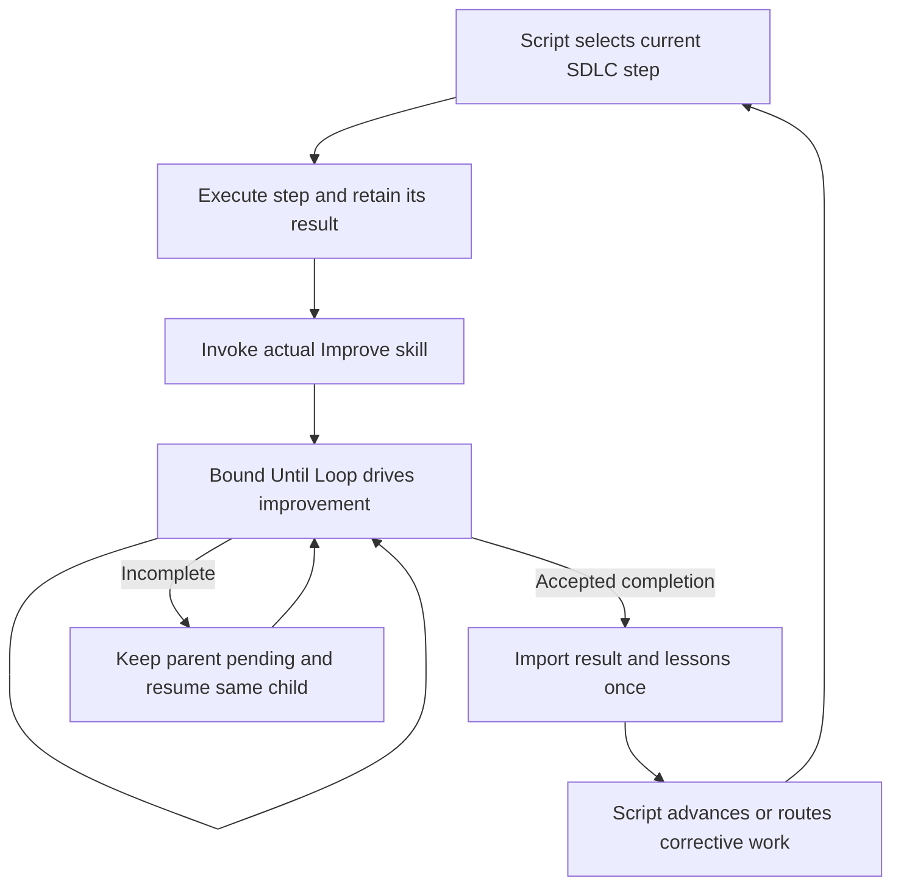
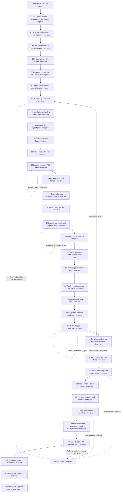

# SDLC with Improve owning convergence

Updated September 17, 2026. **Implemented as navigator protocol 3 in ShipLoop 0.12.0; final validation is recorded separately.** The historical filename is retained so existing references reach the corrected overall plan. This revision supersedes this document's earlier recommendation to build a separate managed Improve controller. See the [actual-skill implementation and validation record](shiploop-actual-improve-validation-2026-09-17.md) for executed checks and remaining experimental limits. Historical managed records describe their original execution modes.

**Default: invoke the actual Improve skill after every graph step, before releasing its output or advancing.** This applies before, inside and after the inner loop, including intake, research, planning, tests, code, documentation, integration, delivery and handoff. Loading a copied review policy or telling the model to conduct its own improvement campaign does not satisfy the requirement.

ShipLoop owns durable SDLC traversal. The selected Improve skill owns improvement through its bound Until Loop runtime. The host executes the current owner's instructions; neither script supplies engineering judgment or independently runs a model after the host stops. Improve is a child invocation, not another SDLC node to be wrapped in Improve recursively. Branch selection, result import and terminal bookkeeping are control operations, not extra work nodes.

## 1. Verified pre-implementation baseline and required change

| Evidence at planning time | Consequence for this plan |
| --- | --- |
| The navigator has explicit prelude, inner and outer stage lists, but only selected stages get its embedded Improve instructions. [shiploop_navigator_prompts.py — stage lists and Improve selection](/Users/dadleet/src/skill-craft/skills/shiploop/scripts/shiploop_navigator_prompts.py:7) | Replace the selective behavior with one universal post-step invocation path for new runs. |
| The current Improve prompt expressly prohibits starting standalone Improve or Until Loop. [shiploop_navigator_prompts.py — IMPROVE binding](/Users/dadleet/src/skill-craft/skills/shiploop/scripts/shiploop_navigator_prompts.py:174) | Remove that prohibition and the copied review-cycle instructions from the new protocol's prompts. |
| The installed Codex Improve card resolves to `/Users/dadleet/src/until-loop-v2/examples/improve/SKILL.md` and binds its parent Until Loop package. The monorepo Improve card instead bundles its standalone runtime. [Improve SKILL.md — package binding](/Users/dadleet/src/skill-craft/skills/improve/SKILL.md:30) | Persist the actually selected skill identity and follow its own runtime binding. Do not silently substitute the author checkout, an ambient runtime or the same-named managed entrypoint. |
| A managed controller and bridge already exist for another execution mode. Its contract explicitly has no dependency on standalone Until Loop. [managed-consumer.md — controller boundary](/Users/dadleet/src/skill-craft/skills/improve/references/managed-consumer.md:1) | Retain existing-run compatibility, but do not use this controller as the implementation of the requested standalone skill integration. |
| ShipLoop already saves its Markdown cursor and accepted result through a recoverable transaction. [shiploop_navigator.py — save](/Users/dadleet/src/skill-craft/skills/shiploop/scripts/shiploop_navigator.py:1410) | Extend existing parent persistence and replay handling; do not add a second parent scheduler. |

These baseline observations explain the change; the old prompt catalog is retained only for saved-run compatibility. No new external framework, MCP server or persistent integration is needed.

## 2. Universal post-step contract

Every instantiated SDLC work node follows the same sequence:

1. The script issues one execution prompt, with the stage, scope, inputs, relevant lessons, expected outputs and completion route.
2. The host performs that step and records the actual result, including failures or a justified non-applicable disposition.
3. The script persists that the same parent action is awaiting Improve and returns one instruction to invoke the selected actual skill on this step's result.
4. The host follows Improve and its bound Until Loop adapter until successful completion or a real incomplete outcome. Improve may make authorized scoped improvements; it retains its own iteration evidence.
5. The parent imports the bound outcome once. Successful completion releases the output; otherwise the parent remains pending or follows an allowed corrective route. The script supplies the next prompt.

A failed check can be input to Improve for diagnosis and scoped repair; the original failure remains recorded. It is not a successful step. If the skill itself cannot run, the parent remains incomplete rather than falling back to inline review prose.

The default is universal, not a list of selected stage names. A no-change output still receives Improve. A step that records “deployment not required” or “no reusable skill needed” has that disposition reviewed. A branch that is never instantiated has no executable node; its controlling decision is reviewed at the step that made it. Any exception must come from an explicit user instruction or binding repository policy and be recorded with its reason, never inferred for speed or because a step appears trivial.

Existing standalone `research-improve`, `spec-improve`, `plan-improve` and `step-plan-improve` successor stages become the originating step's post-step invocation in the new version. Existing product/outer review duties remain as candidate acceptance activities with the same wrapper. Do not both retain an old full campaign and add another full campaign around the same output.

The delivery dependency DAG may remain acyclic. **Execution is cyclic:** Improve repeats internally, the inner sequence repeats for each work item, and failures or discoveries can route back to affected work. The scripts own those parent routes. The model does not choose arbitrary successors or remember the graph between prompts.

## 3. Full flattened lifecycle

Every label ending in **+ Improve** means: perform the activity, then invoke the real skill to completion before taking the success edge. These are the implemented protocol-3 responsibilities. Improve's internals are intentionally omitted. The diagram is expanded because the point is to expose every SDLC obligation.

All nodes also have the same incomplete/resume path shown in the first diagram. A failure arrow never simultaneously takes a success arrow. No arrow authorizes replay of a release with an unknown result. Global test authoring at 26 can be scheduled earlier as an owned work item when its producers exist; it is shown here to make outer obligations visible, not to require delaying test development until the end.

| Region | Outputs and constraints that must remain explicit |
| --- | --- |
| Before inner, 01–07 | Original outcome and authority; Git/worktree facts; repository instructions and coding conventions; actual tools, MCP servers, skills and library precedents; reuse decisions; behavioral expectations and non-goals; risk-based tests and system-test owners; dependency and environment readiness. |
| Inner planning, 08–11 | Chosen ready item; relevant prior lessons; scoped implementation plan; precise cases, fixtures, independent expected outcomes and commands before code; baseline results and pre-existing failures. Revalidate conventions when the task or environment changes. |
| Inner TDD and coding, 12–17 | Executable tests before production edits where applicable; observed expected RED for the intended reason; implementation; observed GREEN; test refinement based on code; actual regression and negative test execution. Retain old/new expectations and independent justification for any test correction. |
| Inner completion, 18–25 | Concise LLM-readable code contracts and docs; debug-flag diagnostics before/after major actions where useful; safe, bounded error context; skill reuse/update and actual-use evidence; selected lint/types/format/build checks; acceptance; integration and post-integration checks; future-work and learning handoff. |
| Outer, 26–34 | Actual global test implementations and executions; real consumer boundaries; assembled-product acceptance; authorized release and rollback plan; exact candidate checks; delivery receipt; deployed behavior; cleanup, monitoring/recovery ownership where applicable; honest final handoff. |

Requirements such as security, accessibility, performance, migration recovery, compatibility, clean installation and packaging checks are selected explicitly in test strategy based on the affected product. Required checks have owners and criteria. Non-applicability needs a reason; a missing environment for a required check is blocked. Do not manufacture tests for documentation-only work. Its test and RED nodes record the relevant existing checks or justified non-applicability, then still invoke Improve on that disposition.

## 4. Scope supplied to the real skill

Each child receives concise natural-language intent plus artifact locators: parent run/action and step identity, candidate paths and baseline, accepted requirements, allowed edits, relevant conventions and lessons, expected check state, meaningful check commands, authority and commit constraints, and the result-return boundary. Full review policy and convergence instructions remain in the selected skill.

| Step output under Improve | Scope and completion meaning |
| --- | --- |
| Intake, discovery and reuse findings | Resolve contradictions and omissions in the findings; retain evidence and uncertainties. Do not turn a research result into permission to install tools or access new accounts. |
| Plans, specification and test strategy | Improve actionability, dependencies, expected outcomes and check coverage. Plan validity is not future product test success. Plan artifacts outside the product checkout must be named explicitly. |
| Baseline and expected-RED evidence | Check the test oracle and the observed failure reason. A relevant expected RED is success for this stage's predicate. Do not modify production code to make the test green before implementation. Syntax/setup failures do not establish RED. |
| Implementation and tests | Improve the coupled in-scope code and tests, preserve acceptance, run meaningful checks and investigate failures. Test corrections need an independent basis; deletion, weakening or skipping cannot manufacture GREEN. |
| Documentation and skill work | Verify documentation against behavior and perform applicable skill/helper examples. Discovery or installation is not successful use. A prerequisite skill must be produced before its consumer. |
| Checks and acceptance | Review coverage and freshness for the actual candidate; rerun affected checks after child edits. Material code changes outside this review's scope become corrective work. |
| Integration, release and operational evidence | Inspect the actual outcome and relevant target. Improve evidence and diagnosis within scope. Do not replay a merge, push, deployment or other uncertain external operation merely to complete the loop. Product defects return to corrective work. |
| Carry-forward and handoff | Reconcile claims, lessons, unresolved obligations and locators. Do not broaden product scope or silently rewrite earlier completion records. |

New runs explicitly delegate commits to the parent integration policy by passing **no-commit** to children unless the user or bound repository policy requires child commits. Improve supports that override. [Improve SKILL.md — commit policy: explicit no-commit preserves records](/Users/dadleet/src/until-loop-v2/examples/improve/SKILL.md:68) This removes the previous proposal's automatic audit-commit-per-review requirement; it does not remove durable per-iteration learning records. Existing runs keep their saved commit policy. Required commits, merges and pushes remain separate authorized delivery activities.

Improve retains its own convergence semantics. The generic Until Loop runtime persists its contract and accepted assessments; it does not independently establish the truth of review judgments or count a semantic Improve streak. Do not claim that a script proves exhaustive review. Preserve this honesty while keeping all SDLC traversal outside LLM memory.

## 5. Minimal durable parent and child integration

The parent stores only what it needs to route and recover: execution version, current SDLC action, whether that action is executing or awaiting Improve, and an `active_improve` binding. That binding identifies the selected skill/runtime, workspace, initial child action/contract identity, candidate scope, expected result and authority constraints, child state/evidence locators, and whether its result has been imported. Names are design concepts, not existing CLI arguments.

While the child is active, the parent action stays fixed. A parent `next` returns only the instruction to inspect and continue that bound child; future SDLC labels may appear as non-executable progress context. The agent then follows the skill's bound adapter, which supplies its one current child packet. A paused child resumes only when its recorded resumption condition is met. A completed child awaits import, not more execution. ShipLoop does not emit a concurrent implementation or review assignment, copy child phases, or maintain a review counter.

### Sequential storage using the existing runtime

The verified adapter binds the workspace and authoritative state, and permits a history-preserving restart only for a genuinely new task on a valid settled run. [runtime-v2.md — binding and authority: workspace-owned child state](/Users/dadleet/src/until-loop-v2/references/runtime-v2.md:11); [runtime-v2.md — restart contract: retain prior history](/Users/dadleet/src/until-loop-v2/references/runtime-v2.md:129).

Until Loop currently stores one active runtime under `<workspace>/.until-loop`. It does not expose a separate child namespace option. Start with **one active Improve child per workspace**, using the actual candidate checkout/worktree as the bound workspace. Use ShipLoop's existing isolated worktree when available; never choose a dummy workspace that changes Git history, check cwd or the candidate being reviewed.

Before launch, persist the parent invocation intent. After initialization, attach the actual runtime-issued identity before work proceeds. A crash between those writes is reconciled against the saved invocation identity embedded in the child contract: attach the matching child, or remain incomplete on conflict. Never blindly initialize a second run. The host invokes runtime operations by following the selected skill and adapter; the parent reads only the identity/outcome needed for recovery and routing.

Before a subsequent child begins, the earlier child must have completed successfully and its parent result must be imported. Preserve a parent-action-indexed snapshot of its terminal contract/state, accepted result and review notebook as evidence. Until Loop's supported new-task restart preserves runtime history; retaining the notebook snapshot is still necessary. A prior incomplete action is resumed, explicitly replanned or explicitly abandoned as incomplete, never force-restarted to bypass it. An unrelated active `.until-loop` run is a conflict, not permission to replace it.

The bound adapter alone performs its documented restart for a genuinely new task on settled compatible state. Do not delete state, move another run aside, switch runtime versions or bypass unsafe metadata to start a new child. Existing v1/v2 runtime version rules remain binding. The first pilot must prove this sequential lifecycle works; if it cannot preserve identity or evidence safely, stop rollout and scope a minimal runtime capability change rather than silently inventing a new controller.

`.shiploop` remains the authority for SDLC state; `.until-loop` remains the authority for the active child's execution state. Parent snapshots are evidence, not a second active child cursor. Every child binding explicitly excludes `.until-loop/` and parent runtime metadata from the product candidate, product edit inventory and commits, while allowing their adapter-controlled state and notebook writes. Named planning artifacts remain reviewable when explicitly bound. Run artifacts, notebooks and generated receipts must stay out of product commits and merges; verify worktree hygiene separately from tests, including an initially unignored runtime directory.

### Completion and recovery

The parent imports a real runtime completion and its matching skill evidence, not the model's final sentence. The minimum handoff identifies the bound skill/version, completed runtime contract and accepted result, two distinct final qualifying review records, and current relevant check evidence. Validate identity, presence, scope and freshness, then atomically accept the parent result and select the next legal action. The parent does not reclassify reviews or calculate a second convergence streak. Repeating that same import has no additional effect. A completed child discovered after a parent crash is imported, not rerun.

Retain existing identity/integrity checks where needed to reject stale or misbound results. Do not compare prompt bytes, infer materiality from textual differences, or build a second proof engine to reenact Improve. Freshness checks establish what was checked, not whether a semantic judgment is true. Missing or contradictory evidence leaves the action incomplete.

There is no cross-runtime transaction: each runtime retains its own lock/journal. Durable invocation intent, reconciliation and idempotent parent import handle the gap. Do not hold a parent lock throughout a long Improve run. Parent advancement is idempotent; that is not a guarantee of exactly-once external effects.

## 6. Corrections, learning and progress

The child fixes issues inside its allowed scope. A missing upstream prerequisite or changed acceptance requires a script-owned repair/replan route. Retain the current attempt and its evidence; do not manually rewind state files. Reopen only affected work, preserving completed records as history and recording replacement evidence for the new candidate. Changes to code, tests, documentation, interfaces or environment invalidate affected prior checks. The parent does not release consumers until necessary rechecks or corrective items are accounted for.

Each Improve iteration records what was learned, accepted/rejected findings, changes or no-change reason, actual checks, unresolved questions and applicable context in its own notebook. Record interrupted and blocked attempts too, without counting them as completed reviews. On return or block, the parent retains a compact summary and exact evidence locators. Verified lessons go to relevant conventions, plans or repository documentation; tentative ideas stay labeled as tentative. The next graph prompt receives only relevant lessons, and revalidates stale assumptions. Do not create another child just to improve an internal learning entry.

Progress should distinguish: completed SDLC steps; current step execution or Improve child; pending steps; blocked work; and observed child activity. Example: “Test authoring completed; Improve is checking the RED control; implementation is pending.” Parent state proves which step is current. Child progress or convergence claims need the child's actual records. Do not infer them from elapsed time or parent position.

## 7. Prompt and constitution changes to implement

The new protocol's universal handoff should be short:

> Invoke the selected Improve skill on the result of this graph step. Read its actual SKILL.md and follow the Until Loop runtime bound by that skill. Use the saved candidate scope, expected check state, authority constraints and relevant lessons. If a child is recorded, inspect its authoritative state first: continue active work, resume paused work only when its condition permits, import successful completion, and retain an incomplete stop as incomplete. Keep this ShipLoop action pending until the child has completed successfully and its bound result is imported through the supplied parent return route. Report a blocker or correction requirement without advancing. Do not substitute an inline improvement campaign.

Do not paste a review/plan/apply/check/record/assess algorithm into that prompt. Supply the step-specific objective and constraints, then let the skill govern its loop. Technical adapter commands come from the selected skill's bound runtime, not invented slash-command injection.

Proposed constitution rule:

> Every executed graph step invokes the actual Improve skill by default before its output is released. ShipLoop scripts persist and traverse the SDLC state; Improve and its bound Until Loop runtime own the child iteration. A step remains incomplete while its child is incomplete. Accepted evidence and useful learning follow the candidate into the next step. Exceptions require an explicit governing instruction and a recorded reason.

Update the navigator catalog, skill card, reference guide, constitution/README, progress guidance and dry-run documentation together. Keep plan text clearly separated from live instructions until the versioned runtime path exists. Earlier selective Improve lists and advice against standalone invocation remain valid only for their recorded old execution versions.

## 8. Implementation order and acceptance experiments

| Slice | Planned change | Required evidence before proceeding |
| --- | --- | --- |
| 1. Contract and failing fixtures | Specify universal wrapper, sequential child binding, completion import, expected RED, commit rules and old-run behavior. | Tests demonstrate current missing default coverage and prohibit policy-only substitution. |
| 2. Actual skill invocation pilot | Bind the selected Improve package and its Until Loop adapter in an isolated worktree. Exercise two sequential child tasks. | Actual runtime-created state; real review/check records; no inline fallback; preserved prior notebook/history and no product pollution. |
| 3. Parent persistence and recovery | Extend navigator state, current-prompt dispatch, invocation reconciliation and idempotent completion import. Reuse existing parent transaction code. | Crash before/after child init and completion; duplicate import; stale/wrong-child result; unrelated active run; recovery after cwd change. |
| 4. Universal default and SDLC ordering | Apply the same wrapper to every instantiated work node; introduce explicit TDD/test execution and integrated verification responsibilities. | Traversal fixture sees one child per node and zero recursive wrappers or bypass success edges, including no-change/non-applicable outputs. |
| 5. Prompt, learning and progress integration | Replace embedded review logic; carry relevant lessons and concise progress through durable locators. | Cold recovery follows the same child with one executable prompt; blocked-attempt lessons survive; state does not imply unobserved reviews. |
| 6. Compatibility and distribution | Version the new execution behavior; preserve navigator/managed saved runs; resolve packaged and installed skill bindings correctly. | Existing-run fixtures still pass; relocated package test; unavailable/mismatched skill fails visibly without selecting another implementation. |
| 7. Full adoption | Run representative live workflows and required repository checks; update generated packages through existing tooling. | Meaningful end-to-end evidence, costs and limitations reported separately from dry-run results; release only within user authorization. |

The graph dry-run must drive the real parent routing using clearly synthetic child outcomes, without editing product code or deploying anything. Cover the successful route for every node, repeated attempts, conditional dispositions, blocked child, correction edges, replay and final completion. This proves routing and prompt selection, not that Improve actually ran.

Separate live pilots must invoke the actual skill: a plan missing a prerequisite; a test-first bug with meaningful RED then GREEN; a code defect exposed by a negative test; a documentation-only change; and an interruption resumed from a different shell cwd. Include a changed test oracle, stale green result after child edits, skill example failure, and a simulated unknown deployment outcome that does not replay the operation. Never treat mocked child success as live skill execution.

Measure missed obligations, false completion, recovered state correctness, scope drift, test adequacy, tokens, wall time and no-change cost. Universal Improve remains the requested default even if it adds cost. Reduce duplication through scoped context, reusable evidence and removal of redundant campaigns; do not silently skip nodes, weaken the skill's convergence rule, or introduce arbitrary per-node budgets. An explicit budget stopping the child leaves the parent incomplete.

## 9. Review and status

This revision incorporates the user's actual-skill correction and subsequent requirement to run Improve after every graph step by default. It replaces the previous managed-controller recommendation, selective review placement, post-code-first test ordering and mandatory child audit-commit proposal with a coherent standalone-skill integration plan.

The planning update was checked against the navigator, both selected/packaged Improve entrypoints and Until Loop's runtime/storage contract. Independent review identified the prior ownership mismatch, missing universal coverage, unsupported namespaced-storage assumption, recovery gap, expected-RED boundary and incomplete-learning requirement. Protocol 3 implements the resulting boundary. Generic `repeat` repairs the current stage; outer `replan` appends new corrective work items and reruns outer checks afterward. It does not permit arbitrary graph jumps or rewind completed work. The linked validation record distinguishes synthetic traversal, actual skill pilots, local integration and publication.
