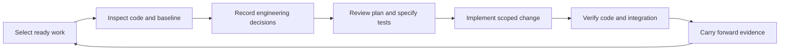

# ShipLoop inner-loop engineering due diligence

This is a responsibility view grouping existing stages, not a proposed replacement graph. Existing Improve handoffs remain between producers. The recommendation is to **pilot a compact engineering decision record for each work item**, strengthen its handoff into implementation, and assess the resulting plans and code with independent fixtures.

The current guidance already contains many sound coding practices. The opportunity is to make the relevant practices produce concrete, reviewable decisions for the selected change and preserve those decisions through execution. More prose alone is not evidence of better engineering.

## Scope and evidence status

- Inspected on September 18, 2026 in `/Users/dadleet/src/skill-craft`, branch `main`, HEAD `004447fd395d1820332cf454c9f966c4c85f63fe`.
- This checkout contains extensive pre-existing uncommitted changes. Findings describe the inspected working tree, especially navigator v3. They do not establish published or installed-package parity.
- Two independent read-only agents assessed planning and execution; a third researched primary-source practices. The parent reconciled their findings against the code and rejected overstatements about missing practices and runtime guarantees.
- Created this advisory document only. No workflow prompts, runtime behavior, installations, or release state were changed by this assessment.
- Current focused checks passed: `python3 -B test/shiploop-v3-guidance.test.py` (10), `python3 -B test/shiploop-navigator-v3.test.py` (22), and `python3 -B test/shiploop-backchain-guidance.test.py` (4), all from the repository root. These 36 checks establish scoped routing/recovery/protocol behavior. This was not a full repository suite, real-model comparison, or generated-application trial.

## What is already strong

The active step-plan duty calls for target files/interfaces, behavior/failure cases, tests, conventions, diagnostics, documentation, integration impact and checks. It also reopens baseline and test strategy evidence. [shiploop_navigator_v3_prompts.py - step-plan: current planning duties](/Users/dadleet/src/skill-craft/skills/shiploop/scripts/shiploop_navigator_v3_prompts.py:503)

The routed implementation constitution already requires the smallest sufficient change, cohesive functions, useful abstractions, boundary validation, clear errors, concise documentation and independent test expectations. These should be reused, not reintroduced as supposedly missing policies. [testing-and-documentation.md - Implementation constitution: existing coding practices](/Users/dadleet/src/skill-craft/skills/shiploop/references/testing-and-documentation.md:685)

The test path already separates test specification, baseline, authoring, meaningful RED, implementation, GREEN, refinement and regression. It explicitly prevents changing expectations merely to fit the implementation. [shiploop_navigator_v3_prompts.py - test-spec through regression: independent expectations and executable checks](/Users/dadleet/src/skill-craft/skills/shiploop/scripts/shiploop_navigator_v3_prompts.py:549)

Non-functional requirements are already covered: performance, reliability, security, accessibility, compatibility, operability and maintainability require relevant criteria and verification methods. Arbitrary targets must not be invented to fill a template. [requirements-definition.md - Define non-functional requirements: quality criteria and decision basis](/Users/dadleet/src/skill-craft/skills/shiploop/references/requirements-definition.md:56)

The shared packet also routes interaction/state/UI concerns, accepted requirements and durable references. Therefore this assessment does not claim that the current loop lacks security, state ownership, concurrency or quality guidance. [shiploop_navigator_v3_prompts.py - COMMON: requirements and interaction obligations](/Users/dadleet/src/skill-craft/skills/shiploop/scripts/shiploop_navigator_v3_prompts.py:244)

## The important gaps

| Observation | Consequence | Smallest useful improvement |
| --- | --- | --- |
| The active step-plan duty names topics but does not define a compact engineering decision record. | A plan can mention files, tests and errors without resolving the design or linking each decision to an observable check. | Require a short decision record in existing plan notes, with applicable decisions, rationale, evidence and checks. |
| Detailed older microplan/review material is mixed with managed/legacy fields and callbacks. | A v3 author must infer which substantive questions apply while avoiding incompatible mechanics. | Provide a clearly v3-compatible explanation of the reusable questions and a short example. Reuse existing notes and references. |
| The latest test-decision projection can replace the visible step-plan reference. | Cold execution can require historical recovery to find the design rationale. | Explicitly retain the accepted engineering-plan locator through later test decisions and implementation. |
| General NFR and integration obligations do not consistently demand per-item decisions at changed interfaces. | Compatibility, migration order, resource limits or recovery may remain abstract until late testing. | Add a conditional pass over changed callers, data, state, trust and resource boundaries. Link each applicable criterion to a check or named later verification boundary. |
| Security/fuzz guidance exists in a section with legacy result fields and is not directly selected by the v3 stage-reference catalog. | Important conditional questions are less discoverable than testing mechanics; copying the whole section risks importing the wrong protocol. | Extract or clearly separate the protocol-neutral questions, then route them when exposed inputs, permissions or dependencies change. |
| Structural tests establish delivery of guidance, not the quality of resulting engineering. | Adding a phrase can make a prompt test green without improving plans or code. | Keep routing checks and add bounded interpretation and execution trials with independent expected outcomes. |

Evidence for the older/current distinction: [execution-planning.md - Local microplan and backchain: detailed reasoning and older carriers](/Users/dadleet/src/skill-craft/skills/shiploop/references/execution-planning.md:200), [execution-planning.md - Review rubric: concrete review questions](/Users/dadleet/src/skill-craft/skills/shiploop/references/execution-planning.md:444), [backchain-planning.md - Step plans: explicit v3 versus retained-mode boundary](/Users/dadleet/src/skill-craft/skills/shiploop/references/backchain-planning.md:164).

Evidence for the handoff risk: [shiploop_navigator.py - _latest_done_current_test_decision: selects only the latest accepted test decision](/Users/dadleet/src/skill-craft/skills/shiploop/scripts/shiploop_navigator.py:941), [shiploop_navigator.py - _test_context_lines: projects that selected source](/Users/dadleet/src/skill-craft/skills/shiploop/scripts/shiploop_navigator.py:976). Older results remain available, so this is a recovery/visibility risk, not demonstrated data loss.

Evidence for conditional risk routing: [testing-and-documentation.md - Security, fuzzing, and ongoing maintenance: substantive guidance plus older schema](/Users/dadleet/src/skill-craft/skills/shiploop/references/testing-and-documentation.md:355), [shiploop_navigator_v3_prompts.py - STAGE_REFERENCES: test-strategy and step-plan selected sections](/Users/dadleet/src/skill-craft/skills/shiploop/scripts/shiploop_navigator_v3_prompts.py:79).

The generic result envelope is an intentional boundary, not itself a defect. The navigator validates declared result shape and separately constrains legal transitions; it does not judge whether a design is good or a test is meaningful. Improve and the owning agent must make those judgments from evidence. Adding more JSON fields would not by itself establish semantic quality. [shiploop_navigator.py - _canonical_result: generic declarations and validation](/Users/dadleet/src/skill-craft/skills/shiploop/scripts/shiploop_navigator.py:157), [shiploop_navigator.py - apply: active-owner checks and v3 Improve handoff](/Users/dadleet/src/skill-craft/skills/shiploop/scripts/shiploop_navigator.py:793)

## Where the guidance should live

Use three levels of detail, each with one authoritative home:

1. **Project engineering guidance:** established during discovery and maintained in an appropriate existing project document. Capture supported runtime/dependency versions, module and state ownership, canonical code/test examples, approved commands, relevant quality targets and environment restrictions. Revalidate changed facts. A new policy file is optional, not a requirement.
2. **Per-item engineering decisions:** the selected step's concrete application of those rules. Keep this in the existing step-plan note; place its locator and a short decision summary in existing context/evidence carriers.
3. **Conditional reference material:** deeper questions for persistence, distributed work, UI, security, performance or migrations. Read only what the changed behavior triggers.

The project guidance says which conventions are supported. The item plan says what this change will do and why. Execution compares the implementation and observed checks with that plan. Neither a copied manual nor a stale summary should become authority over current requirements.

## What a coding plan should decide

For an ordinary feature or bug fix, the following questions should have concrete answers. Their depth scales with uncertainty and consequences; they are not eight mandatory essays.

| Decision | Sufficient answer | Weak answer |
| --- | --- | --- |
| Outcome and preserved behavior | Requirement locator; one observable change; relevant invariants and scope boundaries. | “Implement the feature correctly.” |
| Current implementation | Trace the affected entry point through relevant modules/state to its consumer; cite actual code, runtime and baseline observations. | A list of filenames inferred from names. |
| Design and reuse | Identify responsibility ownership, existing extension points and the smallest sufficient change. Explain consequential tradeoffs or why an apparent alternative fails. | “Use clean architecture,” or an invented framework. |
| Contracts and state effects | Specify changed inputs, outputs, errors, validation, state transitions and effects; identify affected callers/readers/writers. | “Add proper error handling.” |
| Applicable risks | Resolve triggered security, compatibility, migration, concurrency, performance, accessibility and recovery questions; retain unresolved material gaps. | A checklist where every topic says “considered.” |
| Implementation sequence | Order edits by their actual prerequisites; identify bounded responsibilities and merge/integration points if delegating. | Order files alphabetically or parallelize tasks sharing mutable state. |
| Verification | Map outcomes and invariants to independent assertions, exact selectors/commands, fixtures, cleanup, execution location and scope limits. | “Run tests,” or expectations calculated by the production function under test. |
| Readiness, completion and revision | State what must be true before edits, what evidence will close the item and which discoveries invalidate the plan. | “Done when implemented.” |

Require an alternatives discussion only for a consequential choice. An obvious local fix does not need three candidate architectures. A plan should resolve expensive decisions before coding while leaving ordinary function names and harmless local details to implementation.

### Ready to implement

The relevant requirement and existing behavior are understood; the design is compatible with the current system; necessary suppliers and safe test routes exist; baseline failures have an honest disposition; and no unresolved question can materially invalidate the authorized implementation. A deliberately scoped repair can begin with expected RED. Release-only prerequisites should be assigned to their real boundary rather than blocking unrelated local implementation.

### Done with the item

The scoped change and preserved behavior have current evidence; applicable engineering decisions were followed or explicitly revised; required checks and integration verification passed against the final relevant candidate; material review findings were addressed; affected documentation is accurate; and the next context can recover the plan, decisions and evidence. Failed, blocked, stale or unrun required checks keep the item incomplete. Justified inapplicability requires evidence, and later-boundary obligations retain their named owner and gate. A step's completion does not establish deployment or whole-product acceptance.

## Conditional questions worth making concrete

Screen the changed surfaces briefly. Expand only triggered rows and any already-required project obligations; avoid a page of automatic N/A entries.

| Trigger | Planning decisions | Execution/review evidence |
| --- | --- | --- |
| Persisted data, configuration or schema | Who reads/writes it? Can old and new versions coexist? What happens halfway through a write/migration? Is recovery rollback or forward repair? | Representative old/new data, interruption/restart, atomicity and migration-order checks where applicable. Do not promise rollback when irreversible effects require forward recovery. |
| Network, events or concurrency | Who owns retries, timeouts, cancellation and deduplication? Which operation is idempotent? What is acknowledged versus committed? | Controlled duplicate/out-of-order/failure cases; bounded work and cleanup; traces showing the relevant interleaving. |
| Authentication, untrusted input or secrets | What crosses a trust boundary? Where is authorization enforced? What must not be logged? | Denied and malformed requests, unchanged protected state, redacted diagnostic output, relevant dependency/advisory checks. |
| Public API or shared module | Which consumers depend on the current contract? Are defaults/error types/serialization compatible? | Tests of affected callers and supported versions, including error behavior; update examples/contracts where needed. |
| UI or other consumer interaction | What are loading, empty, error, stale and recovery states? What existing component/design/accessibility rules apply? | Real interaction evidence at the required surface, keyboard/focus or other applicable accessibility checks, and recovery observations. |
| Performance-sensitive path | Which workload and resource bound actually matter? What baseline and measurement environment are valid? | Representative measurements and relevant resource/limit checks; optimize based on evidence. |
| Dependency, build or deployment change | Is the dependency needed? Which pinned/runtime contracts and packaging/promotion routes change? What are transitive effects? | Build/package/runtime checks and actual required target compatibility; avoid unrelated upgrades. |

Some of these questions already appear in current references. The proposed change is a reliable per-item selection and evidence obligation, not an assertion that each category is new.

## Execution practices to make observable

The implementation prompt should explicitly recover the accepted engineering plan and relevant canonical examples before editing, then require the following behavior within the current stage's scope:

1. Make one coherent, bounded change. Keep unrelated cleanup and dependency upgrades separate. Inspect the actual diff during work.
2. Use readable names and cohesive responsibilities. Introduce abstraction only for a present benefit; preserve established boundaries and avoid hidden shared mutable state.
3. Honor input/output/error contracts. Validate changed trust boundaries before effects, enforce authorization where required, and preserve meaningful error causes.
4. Apply the selected state/recovery decisions. Keep mutation, retry, transaction and cleanup ownership explicit. Preserve required atomicity, idempotency, timeout and resource limits.
5. Keep diagnostics useful and bounded. Protect secrets and sensitive data, retain safe failure context, and avoid expensive disabled logging or error handlers that mask the original failure.
6. Preserve independent test expectations. Diagnose whether a failure comes from product, fixture, environment or expectation before changing it. Change an oracle only for an independently supported reason.
7. Compare implementation discoveries with the plan. Record a scoped, justified revision and refresh affected checks. A newly required producer, changed authority or incompatible contract must use the current blocked/correction route; do not invent an inner `replan` callback or complete the item to get past the problem.
8. Review both local code and affected consumers. Verify final integrated behavior at the required boundary; passing isolated checks cannot settle a combined-interface question.
9. Retain the resulting decisions, commands, observations and limitations at their existing durable locations. Keep runtime receipts and raw logs out of product artifacts.

These are applications of the existing constitution. The execution addition should be a short direction to demonstrate the applicable obligations, rather than repeating this entire list in every packet.

## Review the plan and the code differently

**Plan review:** trace one ordinary input to its promised output, trace a relevant failure/recovery case, inspect an adjacent consumer, and challenge the assumption most likely to invalidate the approach. Check that each required result has a real supplier and an independent verification route. The output is a disposition of concrete risks and gaps, not a restatement of the plan.

**Code review:** inspect the final diff and execution evidence. Check that behavior and invariants match the accepted decisions, that abstractions serve a present need, that error/state/resource behavior is sound, and that tests would reject plausible wrong implementations. Inspect the changed boundary and at least its relevant immediate consumers; use independent review when the risk justifies it.

Keep the current Improve ownership and handoff contract. Changing review frequency could affect latency and quality, but this assessment contains no measured comparison that would justify a cadence change.

## A concrete current trace, and what is still unproven

The passing cold-context test creates work item `W1`, titled `Use existing client`, with this decision: reuse the client described by `docs/client.md#requests`, because it owns retries; revalidate if the client version changes. It accepts the synthetic plan, advances to `step-plan`, saves `state.md`, reloads it and renders the packet. Assertions confirm the context, accepted plan evidence and selected reference locators remain present, without changing saved state. [shiploop-v3-guidance.test.py - test_cold_step_plan_keeps_compact_context_and_evidence_locators: executed synthetic recovery trace](/Users/dadleet/src/skill-craft/test/shiploop-v3-guidance.test.py:291)

Thus the current mechanism can carry a useful engineering decision through a restart. That test does not open a real client, execute retries, or prove that an implementation will avoid a second retry layer.

An illustrative extension of that fixture would ask for retry handling around an operation that can commit before the response is lost. A usable plan would first inspect the existing client's retry behavior and the operation's idempotency contract. If the client already retries, the implementation should use its supported controls rather than add another loop. If a non-idempotent operation can be replayed without a deduplication guarantee, the assumption is unresolved. Tests would distinguish retryable transient failure, permanent failure, retry exhaustion and an ambiguous response after commit. The expected number of attempts and side effects would come from the chosen contract, not from the implementation under test. This is a proposed scenario, not an executed product result.

## Evidence from outside this repository

- **Reviewable coding changes:** Google recommends self-contained changes with related tests, readable design and names, useful documentation, and scrutiny of unnecessary complexity. Its review guidance asks whether tests would actually fail for broken behavior. This supports coherent work items and separate plan/code review questions. [Google small changes](https://google.github.io/eng-practices/review/developer/small-cls.html), [Google code review guidance](https://google.github.io/eng-practices/review/reviewer/looking-for.html)
- **Proportionate planning:** AWS's AI-DLC walkthrough varies the depth of requirements, design and testing with the request and codebase, and loads detailed stage guidance when needed. This supports scaling the content of ShipLoop's existing stages; it is not a recommendation to change its graph based on another product's sequence. [AWS AI-DLC walkthrough](https://aws.amazon.com/blogs/devops/building-with-ai-dlc-using-amazon-q-developer/)
- **System-specific security:** OWASP describes modeling the actual system, identifying applicable threats, selecting mitigations and reviewing the result. This supports concrete trust-boundary questions when a change warrants them, rather than treating a generic checklist as a security result. [OWASP threat modeling guidance](https://cheatsheetseries.owasp.org/cheatsheets/Threat_Modeling_Cheat_Sheet.html)
- **Concrete planning artifacts:** GitHub Spec Kit's plan template records technical context, actual structure, constraints and a justification when complexity violates the project's constitution. This supports explicit decisions and exceptions; it does not prove ShipLoop should adopt Spec Kit or its complete document structure. [Spec Kit plan template](https://github.com/github/spec-kit/blob/main/templates/plan-template.md)
- **Context selection:** Anthropic recommends sufficiently specific instructions, canonical examples, lightweight references and loading relevant content when needed. It also notes the retrieval overhead and danger of both vague directions and brittle hardcoded detail. This supports a compact core with conditional guidance. [Anthropic context engineering](https://www.anthropic.com/engineering/effective-context-engineering-for-ai-agents)
- **Contrary empirical evidence:** The June 23, 2026 revision of *Evaluating AGENTS.md* reports no general task-success improvement from repository context files and over 20% higher inference cost on average in its evaluated settings. It identifies nonstandard coding practices as a useful role for context files. This motivates local evaluation; it is not a measured result about ShipLoop, stage-specific packets or the user's host/model. [Evaluating AGENTS.md, v2](https://arxiv.org/abs/2602.11988v2)

These sources support the direction, not a claim that the proposed wording improves local outcomes. Mature engineering guidance and runnable local trials should supply the remaining evidence.

## Concrete candidate edits for a pilot

Keep runtime state, result schema, stage order and Improve ownership unchanged. Work in an isolated checkout when implementation is authorized, because this checkout contains concurrent edits. First reconcile with whatever guidance has landed since this assessment.

1. In the existing execution-planning reference, add a clearly scoped **Navigator v3 engineering decisions** section containing the compact record and one example. Explicitly distinguish semantic questions from retained legacy commands/fields.
2. In v3 `STAGE_REFERENCES`, route `step-plan` to that section. Keep `implement` linked to the accepted item-plan evidence and the existing implementation constitution. Separate protocol-neutral security/migration questions from older schemas before routing them.
3. Extend the `step-plan` duty with concise output/readiness requirements. Extend `implement` and relevant Improve scope guidance with a plan-to-diff obligation. Preserve original requirements and stage edit bounds.
4. Extend `TEST_DECISION_HANDOFF` to retain the applicable engineering-plan locator through later test notes. Initially use existing evidence carriers; add another renderer projection only if a cold-recovery trial demonstrates a persistent failure.
5. Add targeted routing/recovery assertions and bounded behavioral fixtures. Use the existing package-generation/parity process only when promoting an approved candidate.

Candidate step-plan wording for discussion:

> In the existing item-plan note, record the outcome and preserved invariants, inspected change path, chosen responsibilities and reuse, changed contracts/state effects, applicable quality and recovery decisions, ordered edits, independent checks, and readiness/completion conditions. Cite the concrete sources and explain consequential tradeoffs. Expand only risks triggered by this change or required by the project. Resolve assumptions that could invalidate implementation; retain other open obligations at their actual verification boundary. Link this plan in the existing evidence references.

Candidate execution/handoff wording for discussion:

> Recover the applicable accepted item-plan locator and engineering decisions before edits and carry that locator through subsequent test/evidence notes. Compare the actual diff and changed boundaries with those decisions. Record justified scoped revisions and refresh affected checks. If new prerequisites, authority or incompatible contracts prevent safe continuation, use the packet's current blocked/correction route. Completion must cite observed evidence for the applicable outcomes and preserve unresolved gaps.

These are candidate prose changes, not applied instructions or a complete final patch. Reconcile repeated guidance before adoption so the net effect is clarity rather than accumulation.

## How to decide whether the candidate is better

Freeze the current and proposed prompt/reference snapshots, fixtures, grading rubric, host/model settings and equal execution/review budgets before comparing them. Keep hidden expected outcomes and observer instructions outside worker-readable paths. Do not use an already contaminated smoke result as evidence.

Use a small, diverse pilot:

| Fixture | What it should discriminate |
| --- | --- |
| Simple pure-function fix | Correct minimal change and independent regression test without unnecessary architecture or documentation. |
| Existing client with retry behavior | Correct ownership/reuse; no multiplied attempts or unsafe replay. |
| Persisted-format evolution | Old/new reader compatibility, partial failure and justified recovery. |
| Protected mutation endpoint | Authorization versus validation, no sensitive logs, unchanged state on denial. |
| Async UI stale response | Correct state ownership, visible recovery and actual relevant interaction evidence. |
| Broken baseline or changed dependency | Honest prerequisite classification, current API inspection and proportionate correction. |

Run three levels separately: deterministic packet/recovery checks; cold-context interpretation using only the supplied locators; and scoped real implementation with independent tests. Include a deliberate context break between planning and implementation and one changed assumption requiring revalidation. Repeated trials or additional hosts are necessary before broad cross-model claims.

Judge quality first: requirement and invariant preservation, feasible design, missed risks, independent test strength, observed correctness, appropriate reuse/minimality and fresh-context recovery. Track tokens, time, repeated reads, irrelevant obligations and scope creep as costs. A completed callback or self-reported review pass is not the oracle.

Predeclare unacceptable outcomes: unsafe unauthorized effects, changed acceptance solely to obtain GREEN, loss of required behavior, falsely closed evidence gaps, or stage/ownership violations. Prefer the candidate only when it improves targeted decisions and outcomes without introducing such regressions; treat ties, incomplete runs and excessive overhead honestly. A tiny pilot establishes bounded capability, not a general success rate.

## Recommendation and tradeoffs

| Decision | Disposition | Benefit and cost |
| --- | --- | --- |
| Compact per-item engineering decision record | **Pilot** | Makes planning reviewable and connects it to execution; adds some planning effort, which should scale with risk. |
| Existing constitution and project conventions | **Retain and clarify application** | Already supplies the core coding practices; avoid parallel policy copies. |
| Explicit plan-locator carry-forward | **Pilot first** | Small change with a concrete cold-recovery risk to test; avoid a new ledger. |
| Conditional risk guidance with clear v3 scope | **Pilot** | Makes important questions easier to find; prevent indiscriminate checklists and legacy-field leakage. |
| New mandatory graph nodes, schemas or scoring engine | **Defer** | No evidence yet that additional mechanics solve the semantic gap. |
| Changing Improve frequency | **Defer** | Existing cadence is deliberate; measure quality and overhead before reconsidering it. |
| New tools, services or integrations | **No demonstrated need** | Current files, tools and evaluation patterns are sufficient for the proposed pilot. |

The desired outcome is specific: after planning, a fresh implementer can explain what changes, why this design fits, which behavior must remain true, how it will be tested, and what discovery would require revision. After execution, an independent reviewer can trace those decisions to the code and observed evidence.
