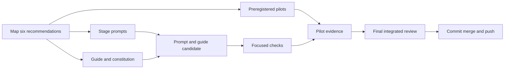

# ShipLoop inner-SDLC recommendation implementation plan

**Historical prompt-guidance implementation plan.** Its unchanged-graph and
embedded-policy constraints describe the earlier work below. For subsequent
development, the [revised overall SDLC plan](shiploop-improve-owned-sdlc-plan-2026-09-14.md)
requires the actual Improve skill backed by Until Loop after every graph step
by default. That runtime integration is now implemented separately in protocol 3;
see the [actual-skill validation record](shiploop-actual-improve-validation-2026-09-17.md).



This execution plan was written while the source candidate was under
implementation, after its current diff and owner-reported navigator checks were
available. It is Backchain **native, enriched, unvalidated**; its
companion [native plan JSON](shiploop-inner-sdlc-plan-2026-09-14.json)
deliberately keeps `parallel_groups` empty and makes no harness-validation,
pilot, review, commit, merge, push, or live-behavior claim.

## Decision and boundary

Implement the six accepted recommendations as concise, stage-specific navigator
guidance plus a clearer guide responsibility table and implementation
constitution. Keep the current navigator graph, result envelope, runtime
navigation implementation, and shared Improve policy intact. The prompt catalog
is a script file that changes; its navigation behavior does not. Improve
campaigns remain agent-owned within their existing nodes.

The current catalog deliberately separates the script-owned graph from host
judgment and assigns the whole Improve campaign to the agent
([shiploop_navigator_prompts.py - Improve ownership: current boundary](/Users/dadleet/src/skill-craft-inner-sdlc/skills/shiploop/scripts/shiploop_navigator_prompts.py:96)).
The guide already states that the script neither interprets evidence nor counts
reviews ([navigator.md - agent-owned Improve cycles: current limitation](/Users/dadleet/src/skill-craft-inner-sdlc/skills/shiploop/references/navigator.md:129)).
The experiment record supports narrow prompt changes and explicitly defers new
graph nodes, nested controllers, and artifact-byte gates
([shiploop-navigator-experiments-2026-09-14.md - decisions and limits: supported boundary](/Users/dadleet/src/skill-craft-inner-sdlc/docs/shiploop-navigator-experiments-2026-09-14.md:73)).

The source-owner candidate has four canonical source files:

- `skills/shiploop/scripts/shiploop_navigator_prompts.py`
- `skills/shiploop/references/navigator.md`
- `skills/shiploop/README.md`
- `skills/shiploop/SKILL.md` for the patch-level metadata version

Do not change `PRELUDE`, `INNER`, `OUTER`, runtime navigation implementation,
state schema, result fields, `references/improve-review-policy.md`, or pins.
Do not hand-edit generated plugin material. Do not add a mandatory node, another controller, a
prompt-phrase test, or a new harness validator. Generated plugin synchronization
belongs to the parent delivery work after source edits.

## Source map and implementation slices

The existing stage locations provide enough surface for the recommendations:
`step-plan` owns early boundary and delegation selection
([shiploop_navigator_prompts.py - step-plan: early risk and delegation duties](/Users/dadleet/src/skill-craft-inner-sdlc/skills/shiploop/scripts/shiploop_navigator_prompts.py:228));
the inner path separates test refinement, test authoring, and failure diagnosis
([shiploop_navigator_prompts.py - test-refine: independent oracle challenge](/Users/dadleet/src/skill-craft-inner-sdlc/skills/shiploop/scripts/shiploop_navigator_prompts.py:268));
and product Improve/integration cover assembled-candidate risk and affected-review
work ([shiploop_navigator_prompts.py - product Improve and integrate: final-candidate locations](/Users/dadleet/src/skill-craft-inner-sdlc/skills/shiploop/scripts/shiploop_navigator_prompts.py:331)).

| Accepted recommendation | Minimal prompt guidance | Guide and constitution clarification | Observable acceptance condition |
| --- | --- | --- | --- |
| Independent acceptance/test-oracle challenge and proportionate negative controls | `step-plan`/`step-plan-improve` resolve ambiguous acceptance examples with nearby positive/negative examples; `test-refine` and `test-author` independently challenge expected results, including a known-bad baseline only when practical. | Say that independence can be a separate observation, reference behavior, consumer boundary, or deliberately failing control, selected in proportion to risk. It is not a universal hidden-oracle requirement. | A test plan distinguishes ordinary success checks from the selected oracle challenge and gives a concrete relevance reason for each selected negative control. |
| Bounded delegation ownership and owner integration validation | `step-plan` records a bounded delegated objective, inputs, expected interface/output, allowed scope, and returned evidence when delegation is useful. `implement` and `integrate` require the owner to inspect the result, reconcile interface conflicts, and rerun affected checks. | Clarify in the existing responsibility material that the host agent owns the composite outcome and cannot transfer integration acceptance or scope authority to a delegate; no new mandatory owner row is needed. | A delegation conflict produces an owner-reviewed reconcile-or-block decision and current integration evidence, rather than a delegate completion claim. |
| Hypothesis-driven persistent-failure diagnosis | `verify` and all Improve campaigns require a testable diagnosis, a discriminating observation/control, and evidence for the selected explanation when a failure repeats or contradicts its first diagnosis. | State that a repeated failure is diagnostic work until an observation distinguishes causes; changing code or weakening an oracle requires evidence. | A repeated or misleading failure has a recorded hypothesis, discriminating check, result, and retained limitation; a green but unexplained result is not completion. |
| Conditional early operational/security checks | `step-plan` selects checks for changed authorization/data boundaries, dependency provenance/compatibility, migration recovery, and diagnostics when relevant; `product-improve` reconsiders that selected set on the assembled candidate. | Make clear this is a relevance decision before coding, not a compulsory security checklist or new release gate. | Where a relevant boundary exists, the plan identifies the earliest appropriate check, environment/authority need, and evidence boundary; it does not require a record for every irrelevant category. |
| Final-candidate independent review and reconsideration after material integration | The common Improve instruction schedules available independent review against the final candidate; `integrate` identifies material integration changes and affected prior checks or conclusions. | Preserve the existing self-review limitation when no independent reviewer is available, while requiring the timing and impact record for a final-review conclusion. | The review packet identifies the candidate and current checks it assessed; material integration after a review either triggers a focused re-review or records why no conclusion was affected. |
| Deliberate learning retention/promotion with regression validation | `document` and `carry-forward` retain a useful learning in the current durable record. `skill-validate` permits shared skill/prompt promotion only after repeated or reusable value is established and a relevant regression validates the promoted behavior. | State that local retention, carry-forward, and shared adoption serve different consumers; no new notebook or automatic promotion is introduced. | A proposed shared learning names the recurring use, selected regression, and validation result; otherwise it stays in the current record or future work. |

The guide work belongs in its existing responsibility material and constitution
([navigator.md - agentic responsibilities and constitution: target sections](/Users/dadleet/src/skill-craft-inner-sdlc/skills/shiploop/references/navigator.md:172)).
The README already directs navigator users to that guide
([README.md - navigator entry and inner-loop duties: discoverability](/Users/dadleet/src/skill-craft-inner-sdlc/skills/shiploop/README.md:16)), and the metadata candidate is versioned 0.9.2
([SKILL.md - frontmatter version: source-candidate metadata](/Users/dadleet/src/skill-craft-inner-sdlc/skills/shiploop/SKILL.md:8)).

## Pilot contract

The fixture owner writes criteria before any worker sees a task. Each pilot is
isolated, opt-in, and run by a fresh agent with only its named packet/fixture
scope. Preserve the candidate, control or oracle evidence, result, and review
record. Do not show a hidden oracle to the worker. This follows the existing
experiment protocol's separation between fresh task scope and later grading
([navigator experiment README - live-agent isolation and grading: existing method](/Users/dadleet/src/skill-craft-inner-sdlc/test/experiments/shiploop_navigator/README.md:35)).

| Pilot | Pre-registered pass criteria | Counterevidence and limit |
| --- | --- | --- |
| Misleading green tests | Given a fixture whose ordinary checks are green despite a seeded behavior gap, the worker states the independent acceptance outcome, selects a proportionate challenge or negative control, and does not declare the ordinary green checks sufficient. | A pass shows this response on the fixture; it does not prove that every future test oracle will be adequate. |
| Delegation interface conflict | Given a bounded delegate output that conflicts with the declared interface, the owner inspects the interface and resulting candidate, reconciles or blocks the conflict, and validates the affected integration. | A pass does not establish that delegation is required or safe for unrelated work. |
| Repeated failure or misleading diagnostic | Given a repeated symptom with at least two plausible causes, the worker records competing hypotheses, selects a discriminating observation/control, and bases a repair or block on that result without weakening acceptance to match a green result. | A pass does not establish universal debugging accuracy or a general convergence rate. |

The prior preregistration demonstrates why paired positive and negative boundary
examples and independent post-run grading matter
([preregistration.md - oracle boundaries and independent review: precedent](/Users/dadleet/src/skill-craft-inner-sdlc/test/experiments/shiploop_navigator/preregistration.md:43)).
Pilot evidence can support a narrow prompt decision; it cannot prove delivery,
cross-model behavior, or a reason to introduce runtime enforcement.

## Focused acceptance and validation

The source candidate is ready for final review only when all of the following
are true:

1. The six rows above are covered by stage-specific prose and the guide, with
   conditional rather than universal operational/security language.
2. `PRELUDE`, `INNER`, `OUTER`, runtime navigation implementation, result
   envelope, and shared Improve policy/pins are unchanged by the scoped diff.
3. The guide makes the host owner responsible for delegated integration, and
   describes independent review timing and learning promotion without claiming
   script enforcement.
4. Each pilot has fixed criteria before its worker begins; its result is
   evaluated from preserved fixture evidence and reports limits.
5. The final independent review sees the fully integrated candidate and current
   evidence. Any material integration change after a review has an explicit
   affected-review/check reconsideration.

The source owner has already run the applicable navigator baseline/current
checks. Bind their actual results to the final candidate, and rerun only checks
invalidated by later edits or generated-plugin synchronization:

```sh
python3 -B test/shiploop-navigator.test.py
python3 -B test/shiploop-navigator-dry-run.test.py
python3 -B test/shiploop-improve-policy.test.py
bash scripts/sync-plugin-views.sh --check shiploop
git diff --check
```

Inspect the actual scoped diff and the rendered README/guide links in addition to
the commands. The navigator suite deliberately checks catalog membership and
nonempty prompts instead of byte-matching prompt prose
([shiploop-navigator.test.py - static prompt contract: intended regression boundary](/Users/dadleet/src/skill-craft-inner-sdlc/test/shiploop-navigator.test.py:239));
the dry-run covers routes and packets without project execution
([shiploop-navigator-dry-run.test.py - simulation boundary: intended CLI check](/Users/dadleet/src/skill-craft-inner-sdlc/test/shiploop-navigator-dry-run.test.py:22)).
The README identifies source-to-plugin synchronization and `git diff --check`
as the scoped packaging checks
([README.md - source and generated-plugin verification: package check](/Users/dadleet/src/skill-craft-inner-sdlc/skills/shiploop/README.md:2543)).

Do not require the broad `test/shiploop.test.sh` inventory for this prompt-only
change unless a focused check fails or an actual diff expands the impact. No
new phrase-matching test is necessary; the independent pilots exercise the
meaningful behavioral claims.

## Final review and delivery order

1. Apply the prompt and guide changes, with the README decision recorded.
2. Regenerate the derived `shiploop` plugin view in the parent delivery stream
   and run the focused structural, CLI, policy, package, and source-diff checks.
3. Run and grade the three preregistered pilots; preserve their bounded results.
4. After all material integration is complete, give the assembled candidate and
   current evidence to a fresh independent reviewer. If no such reviewer is
   available, record that limitation and do not describe the review as
   independent.
5. If the review or integration changes material code, prompts, documentation,
   tests, or candidate identity, refresh affected checks and reconsider the
   affected review conclusion before delivery.
6. Under standing authorization, commit, merge, and push only after inspecting
   the actual resulting commit, merge target, remote result, and remaining
   limitations. Record facts rather than inferring success from a planned or
   attempted command.

The final order preserves the guide's current distinction between graph
simulation and evidence of actual behavior
([navigator.md - compatibility and limits: non-delivery boundary](/Users/dadleet/src/skill-craft-inner-sdlc/skills/shiploop/references/navigator.md:226)).
