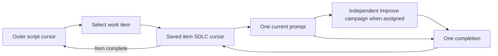

# Saved inner SDLC execution instances

The script already owns SDLC traversal. This change makes each work item's
execution instance explicit in the same authoritative Markdown state. It reuses
one INNER graph instead of defining a different graph for each item. Improve
continues to own its complete campaign; its phases and review counters are
outside the ShipLoop graph.

New Navigator protocol2 runs store `inner_loops` by work-item ID. While an item
is active, the root is at `inner-loop` with no action and that item alone owns
the current stage/action. Completed item records remain `done` with no action.
Carry-forward records the completed item and selects the next one in a single
transaction. Root still controls pause/block/halt status and work ordering.

The implementation consists of a versioned cursor/validation change, matching
public-CLI and dry-run tests, and portable documentation/package views. Existing
protocol1 runs retain their schema and behavior; explicit `navigator-v1` init
is available for compatibility fixtures. The generic result envelope and opaque
Improve actions stay unchanged.

Acceptance covers independently specified two-item paths, sole action ownership,
repeat/block/pause isolation, cross-item replay, future queue changes, optional
skill routing, cold recovery and both actual transaction interruption seams
(receipt before state, then after state). The full ShipLoop suite checks older
protocols. A [bounded fresh-context trial](../test/experiments/shiploop_inner_state/README.md)
separates synthetic graph setup from one real Improve campaign.

Source release is authorized: scoped commit, merge main and push after checks,
then verify remote revision and completed CI. This does not install host skills,
launch models, add a separate scheduler or prove the host performed declared work.
