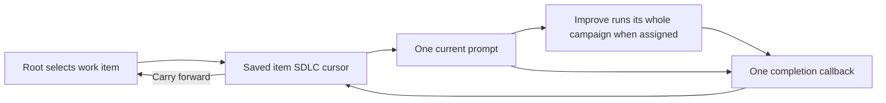

# Script-owned inner SDLC state

Navigator protocol 2 stores each entered work item's SDLC execution record in
the same authoritative `state.md`. One shared graph serves all items. During
inner work the root is parked at `inner-loop` with no action; the selected item
alone owns its stage and action. Completed instances stay `done` with no action.
The script creates the next instance on entry, so the user does not set it up.

Improve remains a whole campaign with one call and one return. ShipLoop neither
schedules its internal phases nor stores review counters. The existing reusable
policy binding is preserved; this change does not start a standalone Until runtime.

For example, W1's accepted `carry-forward` saves W1 as done and creates W2 at
`step-plan` in one transaction. A fresh `next` reads W2's current prompt without
advancing it. Replaying W1's identical accepted result leaves W2 unchanged; a
conflicting result fails. Root status still controls pause, block, resume and halt.

New runs default to protocol 2. Recorded protocol-1 runs keep their existing
cursor and schema; `init --execution-mode=navigator-v1` supports compatibility
fixtures. This implementation's own existing ShipLoop run remains protocol 1
and has continued through the updated CLI without migration.

## Verification record

Candidate base: `2aa9628787eed3638aed3d00c4039b5461617b91`, branch
`codex/shiploop-inner-state`, ShipLoop 0.10.0. The initial default-protocol2
assertion rejected the unchanged base's protocol1. Focused checks pass 23
Navigator tests (16 retained v1 cases and seven v2 cases) plus four dry-run tests.
The eight dry-run scenarios still use independently specified stage paths.

The v2 checks cover serialized sole ownership, entered/completed instances,
cold packets, root controls with retained completed items, cross-item replay,
malformed authority, optional skill/future queue routes and both actual
carry-forward write-interruption seams. Result receipts precede the state file;
the journal recovers consistently after either target write and replay does not
duplicate history or item selection. Prompt prose is not compared byte for byte.

The complete ShipLoop group passed 639 cases across 63 unittest suites,
plus its shell checks. The complete core package group, generated package parity,
portable skill hygiene, frontmatter and scoped Ruff/diff checks passed. The
generated package CLI also passed all eight dry-run scenarios; their task
results are explicitly synthetic. Source-release revision and CI receipts must be
recorded in the delivery run after publication.

A consumer search found three older opt-in scripts that assumed the v1 root
cursor. Their historical setups now explicitly select protocol 1; saved past
evidence was preserved. The worker reproduced the pre-fix root-action failure
and reported passing corrected setup runs plus ten generated walks and two
callback races. Those temporary detailed outputs were cleaned up by their
TemporaryDirectory contexts, so only the worker observations are retained;
they are separate from the fully archived v2 trial below.
The [bounded fresh-context trial](../test/experiments/shiploop_inner_state/README.md)
used 26 synthetic setup transitions, then one fresh agent recovered W2 and ran
a real Improve campaign. It performed two clean reviews with an independent
review and one callback to `integrate`, leaving W1 unchanged. Initial and cold
recovered state matched; the returned stage was not executed. The [recorded
assessment](../test/experiments/shiploop_inner_state/evidence/assessment.json)
passed all 14 checks, including the fixed 12-case oracle and four unit tests.
The already-correct fixture required no source edit. [Campaign evidence](../test/experiments/shiploop_inner_state/evidence/notes/nav-b12dfd26997149f6b774734fe38bfb49.md)
is separate from mechanical grading; setup is not delivered work.

## Scope and limits

The driver records the agent's declared completion, not independent proof of
review quality or external effects. The host must retain an accessible locator
and execute the returned packet. The graph driver does not launch models,
reset contexts, install host skills or choose how the agent performs a task.

The extra per-item records improve visible ownership and recovery inspection;
the prior protocol already owned the current SDLC cursor. This change is not
evidence of a previously observed LLM-owned traversal defect. Small fixture
results do not establish general reliability or Improve's incremental benefit.
