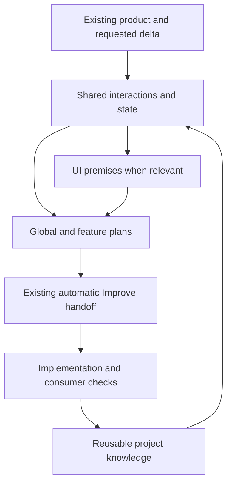

# ShipLoop interaction and UI planning implementation

Date: 2026-09-17. Scope: strengthen planning prompts and shared guidance for
incremental UI work and other event-driven interactions. This implements the
[research proposal](shiploop-ui-planning-research-2026-09-17.md); it does not build
or deploy either experiment application.

This shows decision and evidence flow. ShipLoop retains its existing execution
stages and automatic v3 producer-to-Improve boundary.

## Accepted implementation plan

1. Expand the existing `behavioral-requirements.md#actors-channels-and-state-ownership`
   reference with conditional incoming-event/connection/state guidance, the three
   UI views (components, interaction, skin), and review/evidence/reuse guidance.
   Preserve the existing anchor, state schema, stage graph and Improve ownership.
2. Route discovery, research, specification, global planning and feature planning
   to those sections through the shared navigator prompt. Require early reading
   and application of suitable available design guidance, with source identity
   and fallback. Carry exact relevant source and check locators in each affected
   work item's existing context and result evidence references.
3. Add a compact design-basis reminder directly to v3 global and feature planning
   duties: recheck applicable guide sections, retain decisions and check locators,
   and name the normal next review owner. Extend the existing v3 Improve handoff's
   conditional review scope. Planning
   reviews decisions and proposed checks; implementation reviews actual consumer
   evidence. Reuse normal handoffs without a second campaign or review counter.
4. Add short cross-references in retained survey, project knowledge and testing
   guidance. Keep existing survey design-producing requirements intact. Generate
   the shared plugin view through the repository generator.
5. Verify reference/prompt routing and serialized cold recovery with focused
   regression tests. Separately exercise model planning quality in temporary
   fixtures against expectations declared before execution; do not confuse a
   mechanical test pass with model or application behavior.

## Experiment design and evidence boundaries

Temporary study root:
`<temporary>/shiploop-interaction-study-4p33o457`.
`predeclared-manifest.json` binds the first candidate, packets and oracles.
`cold-predeclared-manifest.json` binds the refined candidate and cold packets.
`final-predeclared-manifest.json` binds the stage-local refinement and final packets.
Raw experiment artifacts remain temporary; this document retains findings.

Two deliberately different fixtures use accepted requirements and stub source:

| Case | Inputs | Independently expected planning output |
| --- | --- | --- |
| Existing embedded web UI | Native DOM, bundled Bootstrap 5.3 CSS, navy/amber tokens, strict CSP, RPC and visible-page polling, no persistent socket or browser storage; supplied copy of the existing frontend-design card, advertised within the fixture | Preserve existing design and host limits; component/interaction/skin premises; drafts versus confirmed state, scoped retry identity, conflict and late-response handling; truthful accessible async feedback with reduced motion; preview distinguished from deployed-tenant evidence. |
| Headless partner connection | Existing Python/SQLite inbox and TLS websocket; signed identity and tenant grants; schema v2; duplicate/reordered completions; snapshot/cursor recovery; 8 active and 100 pending limit | Keep headless scope; reported fact versus command; durable acceptance before acknowledgment; restart of accepted obligations; independent event identity/revision/cursor; reconnect and stale-session guards; bounded capacity and observable recovery; no UI framework or new broker. |

Fresh delegated model contexts read the actual candidate `plan` prompt body and
write a plan plus JSON result. They may read fixture and shared-guidance sources,
but not the predeclared oracles. A separate reviewer assesses outputs against
those oracles. These are real model planning probes, not full CLI ShipLoop runs,
product tests, deployments or executed Improve campaigns.

Initial results substantially met the semantic expectations. Partial outcomes:
- The web plan used the supplied real frontend-design guidance and preserved the
  existing product, but omitted its version/digest and direct source locators in
  the selected UI work item.
- Both plans omitted an explicit reference to the normal Improve handoff.
- The headless plan covered redelivery after commit, but did not explicitly check
  a crash after acknowledgment and before processing the accepted obligation.
- Both returned `outcome: planned`, which is outside v3's result vocabulary. The
  experiment wrapper had omitted that vocabulary. These outputs are retained
  unchanged as a wrapper-coverage gap, not submitted as valid ShipLoop receipts.

The refined candidate explicitly calls for the missing recovery case, per-item
locators, design guidance identity, normal Improve routing, research-stage use,
and establishing premises for new products as well as preserving existing ones.
Second-pass probes use full navigator-rendered `step-plan` packets in fresh
contexts, retaining the initial plans and their imperfect work-item context.
Prior navigation transitions are explicitly synthetic; no previous Improve run
is implied. The owner checks the actual result schema separately from semantics.

## Regression strategy and current status

Before production edits, the existing discovery suite (23 tests), v3 suite
(14 tests) and generated ShipLoop parity check passed. Three new focused tests
were then run against unchanged production guidance: the section/cue checks
failed as expected; existing serialized routing already preserved UI and
headless context. The RED log is `checks/interaction-guidance-red.log` in the
study root. This is evidence for needing instruction changes, not new state.

Implementation and scoped review are complete; experiment assessments and
observed verification follow. No fixture application, browser or deployed-target
check was run. No installation, framework migration or product release occurred.
A separate task owns publication of the combined repository changes.

## Refinement from full-packet experiments

Both cold feature results used valid v3 result shapes. Applying each to the real
navigator in memory parked the parent for Improve, as expected; neither callback
or actual Improve child was executed for these fixture products. The source
references were materially better. However, the web plan again omitted skill
version/digest and a positive normal Improve route, and its motion guidance
remained generic. The headless plan again omitted an explicit crash after ack
before processing. These partial results warranted a third candidate.

A short reminder now appears directly in the two v3 planning duties. It asks
for a compact ordinary Design basis paragraph or exact section links, with
applicable baseline/delta, state/event/connection decisions, recovery checks, UI
views, design-guidance identity/fallback, meaningful async cue or static choice,
planned-check locators and the normal Improve handoff. It introduces no result
field. A fourth regression test verifies its stage scope; before this change,
both planning-stage assertions failed while the unrelated implementation-stage
exclusion held. Final fresh-context probes reuse the original imperfect plans
and source fixtures, without reading earlier cold outputs or oracles.

The headless third-candidate output made restart recovery and precise capacity
rejection explicit, but incorrectly called the next review `step-plan-improve`
/ managed Improve and placed it after implementation in its sequence. That is
a retained-protocol label, not the v3 handoff. This was recorded as a partial
result, not accepted as correct navigation. The v3 controller still parked the
producer for its actual Improve child when the result was applied in memory.
The final wording explicitly places the automatic Improve handoff immediately
after this producer result, before implementation, and forbids scheduling a
review stage. It also names the distinct crash-after-ack, before-processing
boundary. `verified-predeclared-manifest.json` binds the resulting bounded
headless re-probe. These revisions assess output quality, not statistical
reliability; the final global-plan wording is covered mechanically, while the
refined live probes exercise feature planning.

## Implemented locations

| Concern | Canonical implementation |
| --- | --- |
| Incoming events, connections, state authority and recovery | [behavioral-requirements.md — Incoming events: conditional shared contract](../skills/shiploop/references/behavioral-requirements.md) |
| Existing design, three UI views, available design guidance, motion and toolkit/runtime fit | [behavioral-requirements.md — UI-specific planning: reusable premises and feature deltas](../skills/shiploop/references/behavioral-requirements.md) |
| Early discovery/research/specification routing | [shiploop_navigator_v3_prompts.py — COMMON: retained decisions and source identity](../skills/shiploop/scripts/shiploop_navigator_v3_prompts.py) |
| Explicit global and per-feature design basis | [shiploop_navigator_v3_prompts.py — plan: global decisions and review boundary](../skills/shiploop/scripts/shiploop_navigator_v3_prompts.py), [shiploop_navigator_v3_prompts.py — step-plan: revalidate the feature plan](../skills/shiploop/scripts/shiploop_navigator_v3_prompts.py) |
| Actual Improve review scope | [shiploop_navigator_v3_prompts.py — improve_prompt: planning decisions versus later consumer evidence](../skills/shiploop/scripts/shiploop_navigator_v3_prompts.py) |
| Mechanical routing and recovery regression | [shiploop-discovery.test.py — InteractionGuidanceTests: sections and stage cues](../test/shiploop-discovery.test.py), [shiploop-discovery.test.py — cold v3 recovery: producer and Improve context](../test/shiploop-discovery.test.py) |

The retained navigator's COMMON paragraph uses the same conditional guidance.
Survey, project-knowledge and testing references point to the canonical sections.
The generated ShipLoop plugin view was rebuilt using
`bash scripts/sync-plugin-views.sh shiploop`; no generated skill body was edited
independently. No stage, schema, controller, installation or framework was added.
For this UI change alone, the v3 shared producer guidance grows by 55
whitespace-delimited words; the two planning duties each grow by 118 words.
Adjacent changes from other tasks are excluded from that measurement. This is a text-size measurement, not a
model-token measurement. Detailed guidance remains in selected reference sections.

## Remaining model-output limitations

The final headless v4 probe correctly identifies the normal automatic Improve
handoff and preserves the headless architecture. Independent review classifies
12 of the 14 original qualitative criteria as met, with two partial outcomes:

- Its C2 still names commit-before-ack interruption, without an explicit test
  that delivers acknowledgment and then crashes before processing. The required
  correction is: restart from the durable inbox without relying on redelivery,
  then observe the one local job/processed-marker effect.
- Its capacity prose correctly rejects at the limit, but the C5 stimulus says
  “more than 8” / “more than 100.” The required correction is: hold exactly eight
  active handlers or 100 pending records, offer the next event, and assert
  retry-after with no retention or acknowledgment of that excess event.

These raw outputs remain unchanged. Both requirements are explicit in the final
prompt/reference. This is a demonstrated limit of one-shot model compliance,
not a claimed pass or a reason to add a semantic state machine. The normal
Improve review must assess the produced plan against its actual contract and
expected cases. Prompt delivery and preserved locators alone cannot certify
that a plan is complete.

The final web v4 probe retains all three UI views, the observed design-card
SHA-256, explicit static async cues, existing native-DOM/Bootstrap/CSP limits,
local drafts versus confirmed state, account/draft guards, conflict resolution,
and separate preview/tenant evidence. Its plan places the existing automatic
Improve handoff before implementation. The result links that plan; no additional
successor field is required or introduced.

Two raw details still need plan review: a hypothetical sentence reverses
commit/ack order (“service commits after acknowledging”), despite the accepted
atomic operation contract; and some plan-local guide paths omit their relative
base. Correct the trace to a committed operation whose response is lost, then
reconcile by the same operation ID. Use absolute or correctly based guide paths.
The corresponding result references are absolute and resolve, so the result
retains a usable recovery route. These observations remain recorded rather than
editing the raw probe to manufacture a clean pass.

Across the two scenarios, eight fresh model invocations were used: initial
global plans, full-packet cold feature plans, a stage-local refinement, and the
final precise handoff wording. Oracles preceded the first runs; later runs
reused them. Both final JSON objects passed the actual navigator's in-memory
result validation and parked the same producer for Improve. Every final result
file locator resolves, and the selected web design-card digest was recomputed
and matched. `checks/verified-result-schema.json` records these mechanical
observations separately from the qualitative partial results. No experiment
callback, actual fixture Improve campaign, application test or deployment ran.

## Verification results

The reviewed UI candidate passed 56 focused tests. A final read-only check of
the combined root source, including adjacent changes from the coordinating task,
passed the following 60 focused tests:

| Check | Observed result |
| --- | --- |
| `python3 test/shiploop-discovery.test.py` | 27 tests passed, including four new tests and the strengthened design-identity recovery fixture. |
| `python3 test/shiploop-navigator-v3.test.py` | 15 tests passed. |
| `python3 test/shiploop-prompt-integrity.test.py` | 10 tests passed. |
| `python3 test/shiploop-reference-routing.test.py` | 8 tests passed. |
| `bash scripts/sync-plugin-views.sh --check shiploop` | Passed. |
| Scoped `git diff --check` | Passed. |

Tests used `PYTHONDONTWRITEBYTECODE=1` and the working CommandLineTools Git route
(`DEVELOPER_DIR=/Library/Developer/CommandLineTools`, with a fallback Git PATH for
one worker). An initial worker invocation through the unconfigured system Git
hit the Xcode-license error; its log and the successful rerun are both retained.
Reviewed-candidate logs are `checks/*reviewed-candidate.log` and
`checks/generated-parity.log`; final combined-source logs are
`checks/*final-combined.log`, including `parity-final-combined.log`.

All three broad regression commands completed with exit 0 and an explicit
`shiploop.test.sh: PASS`:

| Command | Observed scope |
| --- | --- |
| `bash test/shiploop.test.sh --shard 1/3` | 28 suite invocations; 293 test results reported. |
| `bash test/shiploop.test.sh --shard 2/3` | 27 suite invocations; 262 test results reported. |
| `bash test/shiploop.test.sh --shard 3/3` | 27 suite invocations; 278 test results reported. |

The logs are `checks/shiploop-shard-{1,2,3}.log`. These long-running shards
executed while other tasks made adjacent changes, so they are broad regression
evidence, not an immutable final-publication-SHA certification. The focused
combined-source checks above ran afterward. Existing packet-size advisories were
reported without test failures. Final file digests and log digests are retained
in `checks/final-verification-manifest.json`.

## Actual Improve review of this change

The installed Improve skill and its bound Until Loop adapter ran in the isolated
`improve-review` clone under the study directory, with an explicit no-commit
scope. This reviewed the ShipLoop guidance/tests, not either fixture application.
One material review strengthened the cold-recovery test to preserve the selected
UI guidance locator/version/digest and verify the actual pending/bound Improve
route. That fix is applied in the root checkout.

Two distinct subsequent reviews reread the seven full reachable Git messages,
reviewed the unchanged scoped candidate, and ran current focused checks. The
adapter accepted completion: `.until-loop/state.json` records `phase: done`,
`cycle: 3`, `max_cycles: 8`. The review notebook is `.until-loop/working.md`;
final capture is
`.until-loop/evidence/improve-evidence-20260918T005301Z-31c7075ff684.json`.
The two qualification transcripts are `.until-loop/check-cycle2-qualifying.txt`
and `.until-loop/check-cycle3-qualifying.txt`. Optional `python3 -m ruff` was
unavailable in that interpreter and was not counted as a passing check.

The shared root checkout received separate reference-handoff/Backchain changes
while this isolated review ran. They were preserved, not folded into this
review's claims. `checks/scoped-review-equivalence.json` verifies that all nine
owned prompt/reference slices and the full discovery test file match the
reviewed clone. No root `.until-loop` state or temporary study artifacts were
added to the skill/package. Another task is coordinating the user-requested
combined commit; this review did not create a commit or perform a push.

## Subsequent consumer-pilot implementation

The accepted follow-up is now implemented. See [shiploop-ui-consumer-results-2026-09-17.md - completed planning handoff and browser evidence](shiploop-ui-consumer-results-2026-09-17.md) for the actual Improve/import trace, final nine-case browser result, retained runnable example and scoped testing-guidance correction. Earlier study results and their limitations above remain historical evidence.
