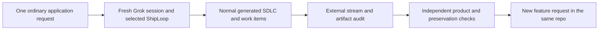

# ShipLoop one-shot application campaign

**Status update:** the initial implementation snapshot below is historical.
The [full-suite plan](shiploop-e2e-full-suite-plan-2026-09-17.md) supersedes its
coverage/status claims; the [baseline audit](shiploop-e2e-audit-2026-09-17.md)
records the subsequent real runs and their qualifications.

Prepared September 17, 2026. **Decision: pilot**, beginning with local behavior
and testing hosted delivery separately, as requested. The opt-in apparatus is
implemented under `test/experiments/shiploop_e2e/`; production ShipLoop prompts
and scripts are unchanged by this work. No live application/model trial has
been performed as part of the initial harness implementation.

Initial implementation validation: **54 offline tests passed**, including a
create/feature fake-host chain using real synthetic navigator records, changed
skill contents in the next fresh process, missing/batched callback rejection,
stale/forged receipt checks, capture limits, and tic-tac-toe oracle mutants.
Ruff and whitespace checks passed. Installed Grok selection was checked without
a model call. These results validate the apparatus, not generated applications.

The question is whether ordinary one-shot requests produce useful applications
through ShipLoop's normal SDLC, then extend the existing application faithfully.
The observer must reveal missed discovery, ineffective planning, callback or
workspace failures, unnecessary repetitions, unsupported completion claims,
regressions and replacements. It must not become another agent that supplies
the plan or rescues the developer between stages.

## Findings that determine the design

- ShipLoop already requires a new incoming prompt and external run for a later
  feature in the same product repository. Recovery is a different operation.
  [SKILL.md - Start or resume: same product and fresh feature run](../skills/shiploop/SKILL.md).
- Normal Git work happens in an isolated execution worktree and reaches the
  original repository through the guarded return. Inspecting only the worktree
  can therefore miss a delivery failure.
  [SKILL.md - workspace entry: execution and return boundary](../skills/shiploop/SKILL.md).
- Existing cross-run and workspace tests cover identities and guarded Git
  operations; their documentation explicitly does not claim that a real model
  reused prior knowledge or executed a whole application build.
  [test/README.md - cross-run and workspace tests: existing evidence limits](../test/README.md).
- Grok's installed headless guide documents prompt-file invocation and tool
  execution in a single fresh request. The observer can capture its native
  events without writing ShipLoop callbacks.
  `14-headless-mode.md - headless invocation: a prompt can run tools before exit` (external/private retained artifact; not included in this repository).
- Read-only preflight verified Grok `1.0.34 (3736acbc8658)` selected
  the machine-local configured ShipLoop skill directory, resolving to the current source checkout.
  The initial package digest was
  `91ca0d6c6e5651558a2140b8756d5d362987370f927558d210acb06a049ec294`
  across 90 observed files. This is a dated selection snapshot, not live model
  execution evidence. Each actual trial repeats the inspection and hashes.
- A routing hypothesis deserves observation: the selected skill card describes
  0.11.1, while the command file still says 0.9 and illustrates `init`.
  [commands/shiploop.md - entry example: older protocol wording](../skills/shiploop/commands/shiploop.md).
  Do not preemptively fix that baseline or assume Grok loads that command file;
  collect the selected route and actual script invocations first.

## Preregistered scenario families

| Family | New repository | Incremental feature | Feature refinement |
| --- | --- | --- | --- |
| Tic-tac-toe | GAS-compatible local two-player game | Active player and legal-move highlights | One move suggestion, including immediate win/block |
| Checkers | Local two-player game with explicit capture rules | Active player and selected-piece destinations | Hint toggle and required capture-chain guidance |
| Battleship | Hidden fleets, alternating shots, outcomes | Turn/status panel and shot history | All/hit/miss filters with state and privacy preserved |

The exact nine natural-language requests and independent checks are in
[scenarios.json - prompts and checks: executable scenario catalog](../test/experiments/shiploop_e2e/scenarios.json).
Each includes ordinary local-only product scope, not a test recipe, framework,
selector, forced graph, or tool sequence. Variants such as multiplayer/network
persistence or an AI opponent are not silently added to the oracle.

## Execution sequence and readiness

1. **Apparatus readiness:** pass fast fake-host and adversarial checker tests;
   verify installed Grok selection, usable Git, model identity, permission
   posture, fixed caps, and external artifact locations. Retain the literal
   prompt, source inputs, source snapshots, and capability limitations.
2. **Pilot:** run `ttt-create` once. Audit its protocol/tool trace and establish
   a real local consumer route. Create an external UI mapping for independent
   observation without patching the app or sending advice back to Grok.
3. **Feature:** once the predecessor is verified, run `ttt-guidance` in a fresh
   Grok process against the returned original repository. Replay prior behavior
   on the frozen before copy and final app; check requested behavior absent
   before/present after, with already-satisfied cases explicitly non-causal.
4. **Refinement:** repeat the same boundary for `ttt-best-move`. Validate both
   the original game and the earlier indicator/highlights. Review source and
   behavior lineage; path churn is a diagnostic, not a rewrite threshold.
5. **Breadth:** execute the checkers and Battleship chains only after the pilot
   establishes usable capture and grading. Different game families add coverage;
   sequential requests do not count as independent reliability replications.
6. **Improvement experiment:** preserve the baseline failure, change one scoped
   ShipLoop cause, and start fresh processes with the newly inspected package.
   Compare equivalent initial products, models, capabilities and budgets, then
   repeat a promising fix on an unused Connect Four case. Keep all outcomes.

The live launcher requires an explicit model, defaults to `xhigh` effort, and
uses the user-requested 7200-second (two-hour) timeout for future runs, with a secondary
1000-turn cap. Named partial suites stop at their observed SDLC boundary;
full suites retain that generous time ceiling. These caps are not duration estimates.
There is no automatic repeat-until-pass loop. Explicit diagnostic continuation
with an unverified predecessor is labeled and cannot yield a full campaign pass.

## Acceptance and evidence boundaries

Report process termination, selected skill stability, declared DAG completion,
workspace return, independently observed product behavior, and incremental
preservation separately. Completion prose, a report HTML, or generated tests
alone do not establish user-visible behavior. Errors, missing checks, budgets,
auth/permission needs, and insufficient observability retain their own evidence.

The implemented tic-tac-toe oracle checks independent rules against an external
UI driver's observations. It does not pretend to be an Apps Script emulator or
an automatic adapter for every generated UI. Checkers/Battleship procedures are
specified; concrete browser adapters remain implementation-dependent. Receipt
hashes prevent stale/mismatched evidence, not false statements by a checker.

For the concrete pilot trace: the first prompt produces product A and its
independent receipt; a fresh process receives only the second prompt and A;
ShipLoop generates a new run and performs its own delta work; the observer
retains A-before and A-after plus the returned-repo receipt; external checks
show old behavior preserved and the new indicator/highlights working. A new
unrelated game in a sibling directory fails that lineage check even if playable.

This approach follows the distinction between outcomes and explanatory traces
in [Anthropic's agent evaluation guidance](https://www.anthropic.com/engineering/demystifying-evals-for-ai-agents),
and fixed task budgets in [Terminal-Bench's timeout guidance](https://www.tbench.ai/news/leaderboard-integrity-and-timeouts).
The contrary evidence is practical: infrastructure and verifier differences can
change apparent agent performance, so a failed run should not automatically
produce a ShipLoop patch.
[Anthropic's infrastructure-noise study](https://www.anthropic.com/engineering/infrastructure-noise).

Hosted delivery follows as a separate campaign against disposable GAS targets,
with scoped authorization, candidate/deployment identity, activation evidence,
and real browser interaction. A locally passing game never implies that the
deployed application changed.

Operational commands and the exact implemented evidence contract are in
[README.md - operation and verification: harness usage](../test/experiments/shiploop_e2e/README.md).
