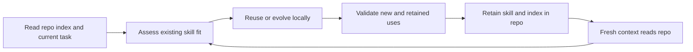

# Repository-local skill reuse and evolution

Status: investigation and ten bounded live capability trials completed, 2026-09-18.

## Question and decision

Can an inner-loop activity retain learned procedures as repository-local skills,
then use or evolve them after conversation context is lost?

The current design supports this. New runs already visit `document`,
`skill-assess`, `skill-validate`, and `carry-forward`; existing guidance requires
local skill discovery, inputs/defaults, an index, and meaningful validation.
The identified gap is guidance precision and routing, not missing scheduler
state. A skill is a reusable procedure; task results and volatile observations
remain evidence, and product requirements remain in their authoritative home.

Adopt the small guidance correction; pilot broader autonomous skill evolution.
Do not add a skill database, host-global installation, or another graph node.

## Current code and the correction

- `skills/shiploop/scripts/shiploop_navigator_v3_prompts.py`: the v3 graph
  already visits the skill stages unconditionally, including an evidence-backed
  N/A result. Previously, `skill-assess` selected only general reuse guidance;
  it now also selects `testing-and-documentation.md#reusable-product-skills`.
  Skill validation selects that same focused section.
- `skills/shiploop/references/testing-and-documentation.md`: the existing local
  skill contract already covered package shape, defaulted inputs, indexing and
  verification. The correction distinguishes unchanged reuse, a compatible
  update, a separate skill when contracts conflict, and no skill work. It
  requires retaining supported older behavior and separates stable defaults
  from changing identities and authorization.
- `skills/shiploop/scripts/shiploop_navigator.py`: existing `summary` and
  `evidence_refs` carry the decision/evidence, and the packet locates the repo's
  `SHIPLOOP.md`. No result-schema or traversal change is needed. These records
  locate host-authored evidence; they do not certify its semantic truth.
- `skills/shiploop/references/project-knowledge.md`: the maintained repository
  index remains the cross-run entrypoint. A skill needed by later work must not
  depend on deleted run directories or a prior conversation.

The local package layout remains the project's existing convention, falling
back to `skills/<name>/SKILL.md`. A host can explicitly open the indexed file;
this does not assume native autodiscovery of arbitrary local directories.
Already installed shared skills may be reused as inputs. A product-specific
specialization stays in the product repository and records its source; the
product run does not edit the installed shared source.

## Choosing a disposition

| Observation | Smallest useful action |
| --- | --- |
| Same procedure; only task values differ | Reuse unchanged with inputs/defaults |
| New evidence exposes a compatible omission | Extend the existing local skill and check old examples |
| Different semantics or consumers would make one contract misleading | Preserve the old skill and create/index a distinct one, or justify an explicit compatible mode |
| No skill covers a demonstrated repeated procedure | Create a small local skill |
| Ordinary code, tests or docs already capture the lesson | Record no skill work |

Defaults should remove repeated setup, not hide changing assumptions. For
example, a repo's usual check set can come from its current contract, while a
candidate identity stays an explicit input. A supported explicit override
takes precedence. The useful lesson is the decision rule and why it matters,
not the concrete IDs or the previous task's final answer.

## Evidence from other implementations

The [Agent Skills specification](https://agentskills.io/specification) supports a
small `SKILL.md` entrypoint with optional scripts/references and selective
loading. This fits a repo-owned procedure without a new service.

[Anthropic's long-running harness work](https://www.anthropic.com/engineering/effective-harnesses-for-long-running-agents)
uses durable artifacts so later sessions can orient themselves. It also reports
that compaction alone does not reliably preserve progress; this supports testing
actual cold readers rather than assuming conversation summaries suffice.

The concrete [SkillEvolver prompt](https://github.com/THU-AICosmos/skillevolver/blob/main/skill-evolver/SKILL.md)
preserves working lessons and favors conditional updates grounded in failures.
Its multi-variant experimentation apparatus is broader than this repository's
current need; it is prior art, not a dependency or adopted workflow.

Contrary evidence: a [2026 study of public skill files](https://arxiv.org/abs/2608.08453)
reports common routing and packaging defects. This is a reason to inspect
discovery and task outcomes; a frontmatter pass alone does not establish reuse.

## Experiment method

The opt-in apparatus is under `test/experiments/shiploop_local_skills/`.
Source snapshots, exact prompts, before hashes and resulting repos are preserved
outside the product checkout. Trial agents receive no parent conversation.
Only durable product files cross the selected context boundaries; transient
outputs and prior trial explanations are removed before the next task.

The domain is release-evidence triage: bind receipts to a candidate and target,
select the latest attempt for each required check, and decide from that evidence.
Earlier passing receipts and unrelated identities are adversarial distractors.
Later tasks change inputs, add a freshness condition, and introduce a separate
incident workflow while retaining release consumers. No trial deploys anything.

These are bounded capability trials with actual agents and independent output
checks. Earlier navigator transitions are synthetic setup; the study does not
execute a full ShipLoop/Improve lifecycle. It does not measure token savings,
host-native clear behavior, global discovery, multi-host portability, or
statistical reliability. The baseline/candidate observations are descriptive,
not a causal benchmark.

## Verification and results

Ten separate agents ran with no inherited conversation. Nine met the exact
task-output/artifact checks; one exposed an ambiguous fixture contract, retained
unchanged in the evidence and rerun successfully with a clarified contract.
Actual created/changed files, whole-package hashes and index/contract links were
inspected separately before making the lifecycle conclusions below.

| Trial | Observed result |
| --- | --- |
| Original guidance: create, then fresh reuse | Created a local release skill; next agent reused the entire package unchanged for different inputs |
| Revised guidance: create, then fresh reuse | Same successful behavior; explicit target override honored |
| Add freshness rule while retaining v1 | Existing contract-driven skill handled it unchanged; stale evidence blocked, older v1 still clear |
| Add a distinct incident workflow | Created a separate incident skill; old release skill remained byte-identical and v1 behavior passed |
| Routine README typo | Corrected typo; no skill change |
| Relocate the authoritative contract | Updated the existing skill's stale locator and input routing; retained one skill |
| Fresh reuse after that edit | Used the updated skill unchanged and produced the correct result |

The original incident trial selected the right receipts and decision but retained
identity fields the hidden oracle did not expect. Its public contract had never
specified that projection. Independent review classified this as a fixture
ambiguity. The new fixture made the row shape explicit; a different fresh agent
passed without changing the oracle's expected output. This is not a claim of ten
clean first-attempt passes or a measured failure rate.

Concrete trace: the first bundle omitted a target, so the current contract supplied
`staging`. The skill selected matching receipts, then the highest numeric attempt
for each required check. Integration attempt 1 passed, but attempt 2 failed, so the
result was `blocked`. A later fresh context selected `production` from its explicit
input and returned `clear` from current passing attempts without editing the skill.
The saved procedure carried the matching/ordering lesson; changing IDs and results
stayed in task data. After the contract moved, the skill's locator changed once;
the following fresh agent reused that repaired version unchanged.

The useful conclusion is that a skill need not absorb every changed rule. Stable
procedure plus explicit inputs and current contract references can cover multiple
iterations. Evolve it when its own instructions/resources are stale or incomplete;
split it when one trigger or contract would confuse distinct supported consumers.

[Preserved evidence and method limits](../test/experiments/shiploop_local_skills/evidence/2026-09-18/README.md)
include the original and edited skills, raw task outputs, exact launch packets,
before/after digests, failed grade, clarified rerun, package hashes and focused
source diff. The generated skills are fixture-local under the experiment tree;
they are not top-level distributable skills and were not globally installed.

Final mechanical verification: 21 navigator-v3, 8 reference-routing, 8 v3-guidance,
7 legacy iteration-docs and 1 new cold-packet routing test passed (45 total).
Eight final oracle calibration cases matched their expected pass/fail outcomes.
The generated ShipLoop package view was synchronized and its parity check passed.
No result schema, state machine, scheduler, dependency or host installation changed.
No commit, push or publication was performed. Full repository CI, a full actual
Improve lifecycle, host `/clear`, and token savings were not tested.

## Implementation follow-through

The subsequent [ShipLoop integration plan](shiploop-local-skills-implementation-plan-2026-09-18.md)
brings the guide into early discovery and each item's planning, clarifies the
host-authored Improve handoff and repository-index recovery, and separates the
legacy receipt rules from v3 generic results. That plan records its own regression
and runtime-composition evidence. The capability-trial snapshots and results above
remain frozen; later integration checks do not turn those trials into a full
autonomous ShipLoop run.
