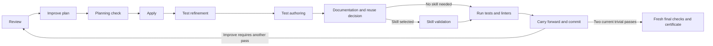

# Managed Improve implementation and validation

**Historical execution-mode record.** The September 17 revision of the
[overall SDLC plan](shiploop-improve-owned-sdlc-plan-2026-09-14.md)
now requires the actual standalone Improve skill, backed by Until Loop, after
every graph step by default. The managed-controller results below establish
the earlier mode's behavior; they do not validate that revised integration.

**Status: implementation and local validation complete.**
Implemented in the isolated `codex/managed-improve-sdlc` worktree from
`d8b8432beb6d3cef26e4402a80f8e778f64f129d`, then brought forward to
`1ef3292` after verifying that the concurrent distribution/CI changes had no
overlapping paths. The final evidence table below
distinguishes executed tests from the original acceptance criteria.

This implementation followed the earlier 36-node SDLC proposal. That proposal
has since been revised at the same linked plan location. This document retains
the original managed child boundary and its evidence; it is a compatibility
record, not the target design for the new standalone-skill integration.

## Implemented contract

ShipLoop owns the global delivery DAG, selected parent action, authorization
boundary, Markdown transaction/lock, external-effect handling and release of
downstream consumers. A parent that starts a managed child remains at
`managed-improve`; it does not mirror the child phase in `state.md`, run child
callbacks as parent stages or maintain a second clean-pass counter.

Improve's managed controller owns the bound child profile's phase progression,
current child packet, findings/pass records, material reset and convergence
assessment. Its records live under the ShipLoop run's namespaced Markdown
storage, not an ambient standalone Improve or `.until-loop` state directory.
The bridge projects verified child facts into the existing ShipLoop validators
and imports one terminal result atomically.

Paused children retain their profile's existing SDLC responsibility in packets
and `context --section sdlc`. The reported state remains paused/blocked; this
orientation does not add a catalog node or advance the child. The pure
controller rejects normal completion while paused, including during receipt
replay; explicit resume or an authorized repair is required.

A recovery handoff remains pending while its designated successor is blocked.
The exact successor's successful import consumes that active handoff after
checking its frozen recovery inputs. The abandoned source and successor proof
remain durable; the next ordinary objective starts without inheriting an
already fulfilled obligation.

A converged import verifies the child's accepted action result digests, then
promotes those evidence records into the parent's ordinary completion index.
The import also writes an ordinary parent result record pointing at the bound
certificate and receipt. Its result digest drives `last_completion`; the
certificate digest remains separate import proof. Neither result indexing nor
report generation adds a second convergence counter. The terminal report is
generated from durable parent state in the same transaction as child evidence.

The immutable binding identifies the parent action, profile, candidate and
context inputs, scope/inventory, policy and controller pins, check/commit
requirements, `independent_review` `{required, fallback_allowed}` rule and
allowed return stage. The child
statuses are `active`, `converged`, `blocked`, `needs-prerequisite`,
`needs-replan`, and `stopped`. Only `converged` with a current validated
certificate releases a consumer.

The managed consumer is a distinct Improve entrypoint described by
[managed-consumer.md](../skills/improve/references/managed-consumer.md). It
does not alter standalone Improve or the legacy ShipLoop owner-managed route.

## Prompt and constitution changes

The implementation resolves these differences between the earlier contract and
the managed entrypoint. The test results below record validation separately.

| Conflict | Previous contract | Required managed resolution | Validation evidence |
| --- | --- | --- | --- |
| Phase owner | The shared owner-managed policy says the caller assigns a single phase and later callbacks. | The managed consumer explicitly overrides phase ownership for its child: Improve selects child phases; ShipLoop waits/imports only. Preserve the original rule for the legacy owner-managed entrypoint. | A managed packet exposes one child continuation; a legacy packet still exposes its assigned callback. |
| State authority | Standalone Improve binds to a bundled Until Loop and `.until-loop` records. ShipLoop is Markdown-authoritative. | Store child binding, receipt, results, certificate and import under the ShipLoop run and existing transaction/lock. Never discover or resume ambient standalone state. | Relocation and recovery tests reject an ambient `.until-loop` substitution. |
| Convergence count | Legacy ShipLoop derives product convergence from parent iteration records; nested plan loops have their own two-pass route. | The Improve child owns the canonical pass ledger and authoritative convergence decision. Typed adapter receipts retain check/commit history for validation; the parked parent has no separate pass counter. | A two-clean child releases the parent once; child callbacks leave the parent action and revision fixed. |
| Product planning recursion | Legacy `improve-plan` enters a converged nested plan campaign. | Each managed product iteration still has a validated plan and a single planning check before Apply, but no nested two-trivial campaign or plan-audit streak. | Phase walk proves `improve-plan` then `improve-plan-verify` proceeds to Apply only when valid. |
| Test lifecycle | A pre-code case matrix and later generic verification could obscure authoring/refinement timing. | Require explicit structured test plan, post-code `test-refine`, `test-author`, `iteration-document`, conditional `skill-validate`, then actual `verify`. | Schema and walk tests reject missing cases, stale authoring, weakened oracle, or absent selected skill validation. |
| Reviewer availability | The reusable policy recommends independent review when available but has no default mandatory fallback decision. | A binding that makes independent review mandatory sets `independent_review.required`; it must also explicitly set `fallback_allowed` for a recorded self-review fallback. Otherwise unavailable review blocks. Optional independent review remains a different rule. | Fixtures cover available review, required/unavailable block, and explicitly authorized fallback. |
| Legacy compatibility | Existing run records contain phase/streak data with no managed binding. | Only newly initialized marked runs enter the managed route. No backfill from legacy planning archives or `improve_cycles`. | Migration tests retain legacy packets/transitions and fail closed on partial/mixed state. |
| Packet instructions | Existing product policy tells the host to complete one ShipLoop-owned stage. | A managed packet tells the host to continue the child; the script imports its certificate atomically; it must not project old per-stage policy wording. | Packet tests assert one parent waiting action and child recovery/import details. |
| Reference mode clarity | The earlier ShipLoop README describes nested plan campaigns as universal. | The ShipLoop operator guide identifies managed mode as the new-run default and scopes retained nested-campaign details to legacy execution. The current card and packet remain action authority. | Stable anchors and managed/legacy reference routing are checked. |

## Retained-versus-removed invariant parity matrix

| Invariant | Treatment | Managed proof needed |
| --- | --- | --- |
| Markdown is authoritative and parent lock/transaction protects run state | Retained | Start, child progress and import recover transactionally with no conflicting state source. |
| Parent action, frozen inputs, candidate/context identity, scope and policy are bound | Retained and extended | Binding digest is checked at every child result and certificate import; stale inputs/pins fail. |
| Shared Improve review policy bytes/pin stay unchanged for legacy runs | Retained | The managed binding changes phase ownership without editing or replacing the saved shared policy. |
| Review → history-informed plan → apply → checks → record → assess obligations | Retained | Child receipt records each completed cycle and current evidence for the profile. |
| Material changes reset the clean streak; two distinct current trivial passes are required | Retained | Child pass ledger and certificate reject duplicate, stale, failed, blocked or material passes. |
| Fresh checks are required for the final accepted candidate | Retained | Certificate/import bind current check evidence and final candidate identity. |
| Independent expected outcomes cannot be weakened to obtain green tests | Retained | Test-plan/refinement validation requires an explicit oracle correction basis and preserved coverage. |
| Post-code test refinement and documentation/reuse assessment occur before final verification | Retained and made explicit | Product phase walk requires refinement, authoring, iteration documentation and selected skill validation before verify. |
| Parent selects and releases DAG work; child may report scope/prerequisite changes | Retained | `needs-prerequisite`/`needs-replan` preserve the active parent and generate obligations rather than advancing unrelated work. |
| Uncertain external operations are inspected before retry | Retained | Recovery path does not replay a deployment, commit, test mutation or other side effect merely because the parent restarted. |
| Legacy current runs retain their callbacks, receipts and convergence semantics | Retained | Marker-absent fixtures produce unchanged legacy route behavior. |
| Parent duplicates child review phase routing or convergence count | Removed | Managed parent remains `managed-improve`; typed `improve_cycles` rows remain adapter evidence while the child pass ledger owns readiness. |
| Product iteration launches a recursively converged Improve-plan loop | Removed | One validated `improve-plan` + `improve-plan-verify` record gates each Apply. |
| Standalone Improve/Until Loop provides ambient state or a second lock | Removed | Managed packets and relocation tests fail if they rely on `.until-loop` or an installed external card. |
| A mandatory reviewer silently falls back to self-review | Removed | Binding fixture must explicitly authorize fallback; otherwise the child stays blocked. |

## Implementation map

| Component | Responsibility |
| --- | --- |
| `skills/improve/scripts/managed_controller.py` | Pure profile reducer, replay validation, repair epochs, completed-pass ledger, two-trivial convergence and terminal certificate. |
| `skills/shiploop/scripts/shiploop_improve_bridge.py` | Frozen parent/child binding, package pins, verified typed evidence, immutable phase snapshots, atomic progress/import and incomplete recovery. |
| `skills/shiploop/scripts/shiploop_protocol.py` | Existing SDLC validators plus explicit test-plan/refinement/authoring/skill gates, real Git/check evidence, outer test closure and authorized recovery commands. |
| `skills/shiploop/scripts/shiploop_delivery.py` | Atomic report generation from durable parent state and an imported-certificate check before reporting managed completion. |
| `skills/shiploop/scripts/shiploop_packets.py` | Mode-specific next-action prompts, child binding and recovery orientation, structured result shapes and SDLC context. |
| `skills/shiploop/scripts/shiploop_sdlc.py` | Thirty-six-node flat catalog and strict local test, command-binding, test-refinement and skill-validation records. |
| `skills/shiploop/scripts/shiploop_invalidation.py` | Current-product identities, original SYS proof snapshots, conservative invalidation and equivalent fresh replacement proof. |
| `scripts/sync-improve-managed.py` | Check or explicitly regenerate the local controller/contract copies and reviewed byte pins. |

The managed product path is explicit:

This diagram expands one managed product invocation. It does not create cycles
in the product dependency DAG. The initial local plan receives its own managed
convergence; each product iteration has one bound plan check before Apply.
Research, behavior, specification and substantive objectives also use the
same managed controller with their own typed evidence profiles.

## Evidence and limits

Tests run in the isolated worktree. Local CLI walks use real temporary Git
repositories, branches, worktrees, Markdown transactions, commands, test files
and commits. The delivery walk selects no external deployment. Passing these local checks
does not establish live multi-host interpretation, deployment-adapter behavior,
or a real deployment. External execution and inspection remain host duties;
the managed controller does not execute or automatically retry external effects.
The host remains responsible for semantic review, test adequacy and truthful
observations. Schema, hashes and exact argv bindings prevent documented classes
of missing/stale evidence; they cannot prove that every conceivable defect was
found. No new integration, host installation or external release is performed.

The controller owns the canonical convergence ledger. Existing typed planning
and `improve_cycles` receipts remain validator evidence; they are not another
parked-parent convergence counter. The compatibility facade delegates to the
canonical controller's decision implementation.

Outer verification conservatively reruns all retained completed local test
bindings and selected skill examples. Skill obligations are derived from all
completed iteration receipts plus the current iteration, so later trivial
passes cannot erase an earlier selected example. Release context exposes this
retained history, and missing example commands fail the release gate. Later product changes invalidate prior
SYS evidence even if their original owner is completed. Fresh equivalent SYS
cases retain the requirement, expected outcome, phase, environment and deployment
association; the original receipt is never rewritten. Author changed suites
before the last rerun, then reuse them unchanged so the revalidation can finish.
A separately validated `REVIEW_CONVERGE.md` audit ledger does not itself stale
product tests. Uncertain external operations still require inspecting the actual
target before an authorized retry.

## Executed checks

All 59 suites in the ShipLoop runner passed: 593 tests across independently
executed suite invocations, including both complete delivery walks. This is an
aggregate of executed results, not a claim that one monolithic runner was used.
The stable rerun entrypoint is
`bash test/shiploop.test.sh`; suites may be executed independently in a bounded
parallel pool because each uses isolated fixtures.

| Check | Executed result |
| --- | --- |
| `python3 -B test/improve-managed.test.py` | 22 tests passed after the final recovery repair. |
| `python3 -B test/shiploop-sdlc.test.py` | 14 tests passed, including all six paused profile roles and the unchanged 36-node catalog. |
| `python3 -B test/shiploop-managed-contracts.test.py` | 10 tests passed, including real changed/deleted Git blob identities, exact command bindings and retention of earlier selected skill examples at release. |
| `python3 -B test/shiploop-invalidation.test.py` | 11 tests passed. |
| `python3 -B test/shiploop-managed-invalidation.test.py` | 5 tests passed, including finite two-owner SYS revalidation. |
| `python3 -B test/shiploop-improve-bridge.test.py` | 16 tests passed for recovery, binding drift, final check digests, historical snapshots, released-scope transitions, result indexing and parent report binding. |
| `python3 -B test/shiploop-managed-package.test.py` | Relocated package smoke passed; changed controller, pin and contract rejected. |
| `python3 -B test/shiploop-managed-walk.test.py` | Full CLI walk passed in 205.578 seconds: both work items, scope disposition, repair/pause/resume, recovery handoff discharge, actual failing tests and skill example, historical skill execution at outer quality, terminal report, and certificate tamper rejection/restoration. |
| Legacy ShipLoop suites | 50 suites / 500 tests passed as independent invocations, including 11 delivery/report transaction tests. Fixtures explicitly select legacy only where they assert the legacy phase route. |
| `python3 -B test/shiploop-action-walk.test.py` | All 13 full legacy CLI tests passed in 1417.993 seconds. |
| `bash test/improve.test.sh` | Standalone Improve relocation, read-only preview, bundled collector and bad-state rejection passed. |
| `bash test/skill-interop-hygiene.test.sh` | Passed. |
| `ruff check --select E9,F63,F7,F82` on changed runtime modules | Passed. |
| Controller/contract pin | Verified canonical and bundled bytes: `68a5445e2fb16972b722cc468a49128dc5f606dff84df39a117ec94a8b43e781`. |
| Generated plugin views | Regenerated from final source; full `bash scripts/sync-plugin-views.sh --check` passed. |
| `python3 -B test/test-groups.test.py` | 8 tests passed against the integrated CI grouping changes. |
| `bash test/native-marketplace-adapters.test.sh` | Passed against the integrated distribution changes after regenerating the managed package views. |

## Acceptance traces and enforcement boundaries

The following traces guided the focused negative cases and CLI walks. Test
results above are executable evidence; host judgments below are behavioral
requirements, not claims of a mechanical semantic oracle:

1. Two substantive no-change reviews with current checks converge; a repeated
   result digest does not count as a second review.
2. A one-line material bug fix resets the child clean streak and requires two
   later distinct trivial reviews.
3. A planned negative case appears after code inspection; `test-refine` retains
   its independent expected outcome and `test-author` maps it before `verify`.
4. A proposed assertion/oracle weakening fails without an independent contract
   basis and preserved coverage.
5. Scope or behavior findings require an explicit disposition; test-refinement
   guards preserve independent expected outcomes, and authorized corrective work
   uses the ordinary DAG replan. A separately owned test suite uses a scoped
   product work item. Deciding that a failure is an out-of-scope product defect
   remains a host judgment; the suite tests the disposition and oracle gates.
6. A selected repo-local skill has a failing example/helper check, preventing
   verification and convergence.
7. A changed candidate, context, policy/controller pin, scope inventory or
   check record invalidates a pending child result/certificate.
8. A parent crash before terminal import resumes the exact child; a crash after
   import does not rerun a converged child, recommit or repeat an external
   operation.
9. A mandatory independent reviewer is unavailable. The child blocks unless the
   binding explicitly grants a recorded self-review fallback.
10. If a deployment outcome is unknown, the host must inspect the actual target
    before an authorized retry and must not claim success without observation.
    The controller can preserve an incomplete/paused result and does not itself
    execute deployment. This migration does not claim a live or hermetic
    deployment-adapter retry test; that belongs to the selected project’s
    required pre/post-deployment checks.

## Final review

Independent reviews found no outstanding actionable issue in the final
controller, bridge, paused-context, historical skill-retention and recovery
discharge changes. The real CLI walk then completed against those source bytes.
Cards/references, controller pins and generated packages passed their checks;
both staged and unstaged whitespace checks passed. The deployment and host
interpretation limits above remain explicit. The worktree is ready for the
user-authorized local merge; installation, push and external deployment are
outside this validation record.
