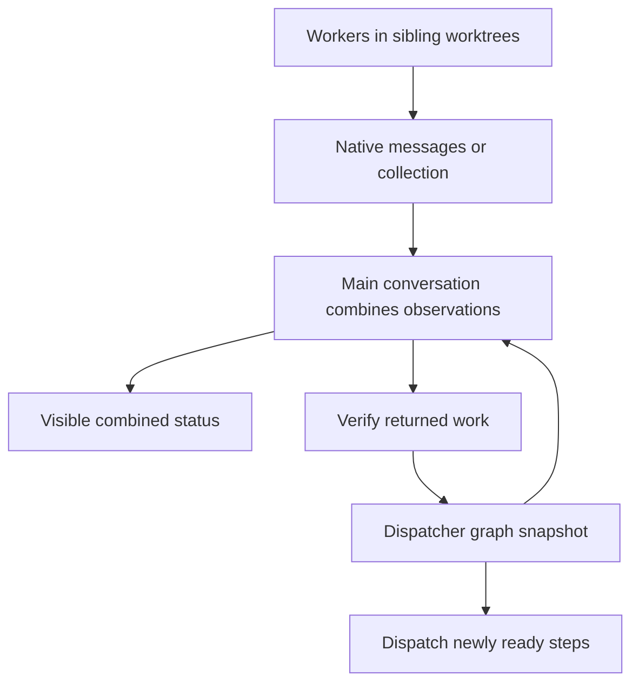

# Native agent status in the initiating conversation

Status: research and candidate implementation record, 2026-09-18. Native status
qualification remains a proposed pilot. The candidate now includes derived
done/not-done responses and serial main-context execution; these are distinct
from cross-host progress delivery. This supersedes the earlier proposal to
expand asynchronous messaging in the chain integration plan.

## Decision and scope

**Adopt native launch, notification, collection and status facilities. Pilot a
small parent-owned status view using those facilities and the existing dispatcher
responses.** The main conversation is the observable dispatcher: it receives
native observations, attributes them to the exact attempt, and tells the user
what is running, what was last reported, what is blocked and what happens next.

The user has explicitly deferred custom message passing. Do not add a broker,
progress inbox, file watcher, polling loop, timer script, model subprocess,
new MCP server or Git-merged shared message file. Keep existing completion
receipts and append-only execution history for verification and recovery. Do not
turn terminal report envelopes into progress reports. Keep progress annotations
in the host's existing pending-job/handoff record; they are disposable observations,
not a new durable scheduler.

The practical baseline is truthful lifecycle visibility on every supported host.
Detailed intermediate work progress is conditional on an exposed native route.
Native completion support alone cannot establish that route. A child transcript
visible in a UI also does not establish that the parent model received its contents.

| Candidate | Benefit and fit | Cost / risk | Decision |
| --- | --- | --- | --- |
| Existing native events plus compact parent notices | Matches the requested main-context view; existing Ask Agent convention | Small prompt/context cost; model adherence must be tested | Adopt contract; pilot consumer wiring |
| Native worker milestone messages where supported | Explains progress and blockers before completion | Extra tokens; host differences and delivery at tool boundaries | Pilot per exposed capability |
| Native timed collection while parent only waits | Makes pending work visible even without semantic progress | Bounded observation cost; approximate timing | Reuse supported route |
| New transport, heartbeat ledger or custom scheduler | No demonstrated gap requiring one for this request | More state, races, recovery and ownership | Defer |

## Research: available mechanisms and observed limits

Evidence was checked on 2026-09-18. Current public documentation, installed
interfaces and retained local runs are different evidence classes. None implies
uniform behavior across versions or client modes.

| Host | Native path to the parent | What the main conversation can truthfully show | Remaining qualification |
| --- | --- | --- | --- |
| Codex | In this research session, exposed `collaboration.send_message`, `list_agents`, and bounded `wait_agent`; worker messages and final results reach the parent context. U17 M2b independently observed timed-wait notices. | Native lifecycle; concise worker milestones sent through the exposed parent channel; final reports. | The current tool names are session-specific. Do not substitute separate app task APIs for subagent APIs or promise identical CLI schemas. Test milestone attribution and late-message behavior. |
| Claude Code | Current official docs expose `SendMessage` to eligible subagents and name `main` in their roster; background results notify the parent. The local U17 run used native timed `TaskOutput`. | Completion and supported pending observations; worker milestones only after the launched worker's actual parent-message capability is confirmed. | Newer public docs are not installed-version proof. Qualify intermediate messages separately from already observed completion/timed-wait behavior. |
| Grok Build | Native background IDs and `get_command_or_subagent_output` snapshots/waits. Running snapshots can expose execution counters and tools used. | Running/returned, observed activity summaries, final output. Counters do not prove semantic phases or task success. | Do not promise worker-to-root milestone messages: the investigated active-agent message route is disabled by default and disallows child messaging to a root parent. No configuration change proposed. |
| OpenCode | Tested 1.18.31 interface launched background tasks and delivered terminal notifications. | Confirmed launch and return, plus the last actual observation. | No model-facing periodic collection/wakeup route was exposed in the U17 trial. Disclose this before idle. Current V2 docs do not qualify the tested version. |

Official sources and concrete proof points:

- [OpenAI subagents documentation](https://learn.chatgpt.com/docs/agent-configuration/subagents)
  describes native orchestration and inspectable child activity/results. Its
  recommendation to return summaries supports a compact view rather than child
  tool-stream duplication. The specific `collaboration` APIs above come from the
  live tool contract of this research session, not a claim about every Codex client.
- [Claude Code subagents documentation](https://code.claude.com/docs/en/sub-agents#run-subagents-in-foreground-or-background)
  documents background completion notifications and main-session permission
  prompts. Its tool-access and resume sections document `SendMessage` and its
  version/tool-availability constraints. Do not require agent teams merely to
  obtain ordinary subagent messaging.
- [Grok Build subagent guide](https://github.com/xai-org/grok-build/blob/main/crates/codegen/xai-grok-pager/docs/user-guide/16-subagents.md)
  documents native collection and optional active-agent messaging. Pin the
  installed tool schema for a future run; a current source guide is not a local
  execution receipt.
- [OpenCode v1.18.31 task tool](https://github.com/anomalyco/opencode/blob/v1.18.31/packages/opencode/src/tool/task.ts)
  provides the version-specific background completion route; `task_id` resumes
  work and should not be used as a made-up status poll.
  [OpenCode V2 agents documentation](https://opencode.ai/v2/docs/agents/)
  describes background completion, but is a separate version boundary.

The strongest local counterexample to “native means visible progress is solved”
is the retained U17 evidence: Claude emitted a pending update after 143.701 seconds;
Grok had a 303-second visible gap while work remained pending; OpenCode correctly
disclosed periodic status was unavailable, then misclassified the observed gap
in its final report. Codex M2b showed timed-wait updates, with separate final-report
defects. Those failures remain failures; successful work did not erase them.
See [INTEGRATION-RESULTS.md - U17 native observations: per-host visibility evidence](/Users/dadleet/src/skill-craft/test/experiments/portable_delegation/usability/INTEGRATION-RESULTS.md:122).

An upstream [Claude Code report about missing resumed-agent UI rows](https://github.com/anthropics/claude-code/issues/73095)
is additional regression-test inspiration, not proof of a current installed bug.
It reinforces the need to observe parent delivery and user-visible status separately.

## Three facts, three authorities

| Fact | Authority | Examples |
| --- | --- | --- |
| Graph execution state | Plan Dispatcher | Claimed, launching, running, receipt present, accepted; direct dependencies and readiness |
| Native execution observation | Native harness | Handle confirmed, worker running, returned, interrupted, error; observation timeout |
| Work progress | Worker report or actual native activity observation | “Implementing authentication”; “test command running”; “blocked on permission” |

Keep these separate in the pending record. A native worker can be running while
its work is blocked. A worker can return with a negative review and still have
successfully completed the review assignment. A `SUCCEEDED` report is not an
accepted graph step. A published receipt can exist before the worker stops.

Existing data is sufficient: `chain next`/`recover` return dispatcher readiness,
active attempt identities/handles, accepted steps and a bridge summary.
`start` supplies the assignment; `launched` records the actual handle; `observe`
records a collected receipt. These operations already support a derived view.
See [shiploop_chain.py - _next_response: existing dispatcher snapshot](/Users/dadleet/src/.work-trees/skill-craft/shiploop-dispatcher-20260918/skills/shiploop/scripts/shiploop_chain.py:1010),
[state.js - snapshotFromState: ready, active and accepted state](/Users/dadleet/src/.work-trees/backchain/serial-dispatcher-20260918/skills/plan-dispatcher/scripts/state.js:1055),
and [shiploop_chain.py - _observe: receipt observation is not stoppage proof](/Users/dadleet/src/.work-trees/skill-craft/shiploop-dispatcher-20260918/skills/shiploop/scripts/shiploop_chain.py:1297).

The compact record should retain run/action and step/attempt identity, native
handle, assignment, current dispatcher revision/state, last native observation,
last reported work update, observation time/source, report locator and next
action/owner. The display can omit internal IDs and show one short row per active
step plus ready/accepted counts. Use “last reported” for worker assertions and
“unknown since recovery” when native liveness has not been re-observed.

This is an extension of the existing Ask Agent convention, not a second status
machine. See [SKILL.md - Pending jobs and waiting status: existing parent record](/Users/dadleet/src/skill-craft/skills/ask-agent/SKILL.md:139).
Do not add a progress field to navigator `state.md`, make the navigator renderer
read child files, or replay the ledger into the model on every update.
See [shiploop_navigator.py - render: file-read-free navigation packet](/Users/dadleet/src/.work-trees/skill-craft/shiploop-dispatcher-20260918/skills/shiploop/scripts/shiploop_navigator.py:1104).

## Proposed operating behavior

1. **At launch:** discover the actual native status/collection route. Record the
   exact step/attempt-to-handle mapping after confirmed launch. Tell the user
   which assignments started and any intermediate-visibility limitation. Continue
   independent parent work. No extra agent is needed just to monitor other agents.
2. **During work:** consume native updates at supported delivery boundaries.
   Associate each with its sender handle and current attempt. Update the compact
   record and emit meaningful changes in the main conversation. Coalesce bursts;
   retain urgent blockers and decisions. Never forward raw reasoning or entire
   tool transcripts merely to show activity.
3. **While only waiting:** use the selected Ask Agent's native bounded wait or
   supported current-session status facility. Its present default is about two
   minutes, subject to host limits and stricter caller instructions. On a native
   timeout, emit one combined visible status even if the truthful update is “no
   new detail.” An internal record update alone does not satisfy observability.
   When no periodic native route exists, disclose that before idle and retain
   launch/return notices. Do not pretend completion-only delivery is periodic.
4. **On a blocker:** show the reported blocker, affected step and needed action
   or owner. A permission prompt must follow the native permission system.
   Native-running plus work-blocked is legitimate; do not release its worktree
   or resource reservation merely because progress stopped.
5. **On return:** collect the actual result and delegates, then display “returned;
   verification pending.” Read the report, verify evidence and stopped state,
   and call `settle`. Refresh `next` immediately after settlement. Dispatch all
   newly eligible work allowed by capacity/resource constraints; do not wait for
   unrelated agents or an entire wave.
6. **On recovery or a late update:** rehydrate authoritative attempts with
   `recover`, then reconcile native handles. Old-attempt messages cannot overwrite
   a retry's row, regress terminal state or unlock work. Within one attempt,
   retain source ordering when exposed; otherwise say “last received,” without
   assuming delivery time proves current phase. A native timeout is an observation
   boundary, not a crash, cancellation or retry authorization.

Proposed worker brief, used only where the native worker can message its parent:

> Send the parent a short native update when a meaningful milestone changes or
> you encounter a blocker: step/attempt, current phase, concrete result or blocker,
> and next action. Report observable facts, not percentages or reasoning traces.
> Keep working after a progress update. Use the existing final report/return
> contract when finished. If no native parent-message route is exposed, do not
> build one or publish progress through the terminal completion envelope.

Progress is advisory. A phase may legitimately return from testing to implementation.
Message arrival does not preempt every long parent tool call; the visible update
is emitted when the parent regains control. Record this latency in tests and use
native yielding operations where available. No fixed end-to-end delivery deadline
or post-session-exit notification guarantee is claimed.

## Example trace

Hypothetical plan: A builds authentication; B builds a service; C tests
authentication and depends only on A; J integrates B and C. A and B run in
separate sibling worktrees under an external `.work-trees/<repo-key>/` container.

| Step | Dispatcher state | Last observation shown in the main conversation | Next action |
| --- | --- | --- | --- |
| A | running | Worker reports: authentication implemented; tests running | Collect return |
| B | running | Worker reports: waiting on an MCP permission prompt | Resolve through native permission UI |
| C | pending | Waiting for accepted A | Dispatch after A is verified |

A's native milestone changes only its visible description. Its later native
return and durable receipt change the display to “verification pending.” The
parent checks the result, settles A, and `next` exposes C while B remains active.
Capacity and resource readiness permitting, C starts from A's accepted commit.
J still waits for both B and C. Combined integration eventually returns to the
recorded initiating checkout, which may itself be a worktree.

The observable result is a useful main-thread summary without allowing progress
messages to become completion authority. Existing fan-out tests already exercise
receipt-before-acceptance and early successor readiness; they do not yet prove
native milestone delivery or user-visible wording.
See [shiploop-chain.test.py - test_fanout_eager_successor_join_verified_return_and_parent_guard: existing release boundary](/Users/dadleet/src/.work-trees/skill-craft/shiploop-dispatcher-20260918/test/shiploop-chain.test.py:220)
and [parallel-chain.md - Join and return: exact supplier commits and initiating target](/Users/dadleet/src/.work-trees/skill-craft/shiploop-dispatcher-20260918/skills/shiploop/references/parallel-chain.md:98).

## Bounded implementation sequence

These are proposed increments, not completed tasks. Dependencies list only direct
predecessors. P and T can proceed independently after C; no new scheduler is needed.

| ID | Depends on | Owner / concrete change | Definition of ready | Definition of done |
| --- | --- | --- | --- | --- |
| C | — | Ask Agent owner: reconcile native status capabilities and a short worker milestone convention in its prompt/reference | Current U17 behavior and this evidence reviewed | Completion, periodic lifecycle observation and semantic progress are distinguished; unsupported behavior explicit; selected package digest recorded |
| P | C | Backchain/ShipLoop owner: update `parallel-chain.md` and its existing main-dispatcher guidance to maintain/render the combined pending view | Selected Ask Agent contract and dispatcher outputs available | A parent can follow launch, progress, blocker, return, verification and recovery without a new state store or transport |
| T | C | Ask Agent owner: extend existing native-interaction fixtures with observable milestone and waiting cases; Backchain owns graph assertion fixtures | Expected capability and parent-visible assertions registered before runs | Exact lifecycle/identity checks and semantic wording rubric cover the cases below |
| V | P, T | Backchain owner: one bounded chain-consumer run per capability under test, coordinating reuse of Ask Agent host evidence | Frozen package hashes, captured tool schema, clean disposable repo and sibling worktree root | Parent-visible output and graph transitions verified; unsupported routes recorded; exact target and isolation checked |
| D | V | Backchain owner: publish scoped README/guide examples and qualification limits | Evidence reviewed and failures classified | Claims match the tested host/version/package; no generic cross-host progress guarantee |

Start with prompt/reference changes and existing command responses. Add a pure
formatter only if the first pilot shows repeated ambiguity that guidance does
not resolve. Such a helper would accept snapshots and observations as input,
return a bounded display, and perform no file reads, state writes, native launch
or scheduling. Do not add it speculatively.

Generic Ask Agent changes and independent host qualification remain with the
Ask Agent task. Backchain owns attempt attribution, graph acceptance, concrete
worktrees and the ShipLoop consumer run. See
[ask-agent-backchain-coordination-2026-09-18.md - Shared boundary: explicit reconciliation and single conversation](/Users/dadleet/src/skill-craft/docs/ask-agent-backchain-coordination-2026-09-18.md:59).
Do not change or silently rebind the completed U16 ShipLoop pilot to U17.

## Test plan and evaluation

Extend the existing native qualification and chain suites; do not create a second
launcher harness. Capture parent-visible messages separately from child output,
native tool results and dispatcher snapshots. Preserve monotonic elapsed times
for latency and UTC timestamps for audit; child clock order is not causal order.

| Case | Required evidence / assertion |
| --- | --- |
| Two active workers, different milestones | Both launches confirmed before collection; parent continues useful work; at least one intermediate child update reaches the parent model and main-thread notice before that child's return on a message-capable host |
| Lifecycle-only / completion-only host | Native snapshots are labeled lifecycle observations, not semantic progress; an unavailable periodic route is disclosed before idle, never counted as a passed progress test |
| Waiting-only parent | A real native observation timeout occurs and a combined user-visible notice follows; workers continue unaffected; measure requested versus observed cadence |
| Parent inside a long tool call | Native update is consumed at the next supported boundary; quantify delay without claiming hard real-time delivery or adding a timer workaround |
| Blocker and permission/MCP contention | Explicit blocker reaches the supported parent surface; work remains claimed while worker is active; no fabricated permission or resource release; unavailable blocker visibility is reported |
| Return before acceptance and eager fan-out | Receipt/report alone does not unlock successors; accepting A releases C while B remains active, subject to resources and capacity |
| Late, duplicate or reordered progress / retry | Old attempt cannot replace current row or regress acceptance; duplicates do not dispatch twice; receive time is not treated as a phase-order guarantee |
| Negative review and native failure | Completed review with findings differs from agent error, failed assigned work, and dispatcher rejection; final status preserves these distinctions |
| Context recovery and uncertain liveness | `recover` restores graph facts; missing native observation is labeled unknown; no automatic relaunch, lease stealing or state mutation from a progress summary |
| Bursts, nested workers and user question | Combine multiple updates without losing blockers; delegates remain attributed to the top-level assignment; a status question is answered from actual observations without waiting for unrelated completion |
| Child UI-only activity | A visible child pane or transcript does not count as parent-model delivery or main-thread notice unless that distinct surface is actually captured |

Use exact checks for identities, ordering constraints, launch counts, hashes,
graph transitions, separate worktrees and target integration. Use semantic/fuzzy
checks for phase wording and summaries: the user can identify the assignment,
latest known fact, blocker and next owner without invented progress. Wording
similarity cannot excuse an incorrect lifecycle or acceptance claim.

Report selected = passed + failed + skipped; represent unsupported capability
explicitly and never turn it into a progress pass. First establish correctness,
then compare parent-context tokens, repeated unchanged notices and visibility
latency. Compare within the same host/model/package conditions; changed models
are confounds. One run is a capability smoke, not a reliability guarantee. Expand
repetitions only for unresolved failures or a proposed cadence/reliability claim.

The acceptance gate is demonstrated observability in the initiating conversation,
plus unchanged dependency/verification boundaries. A worker's successful exit,
UI animation, stored report or green offline suite alone cannot satisfy it.

## Current delivery boundary

The candidate includes `chain bind --mode serial`, main-context execution identity,
`done` as the exact `settle` alias, derived completion lists and inert terminal
replay after downstream activity. The guide now describes visible lifecycle
notices and capability-dependent native progress. This does not establish that
models follow that guidance across hosts: the qualification matrix above remains
an explicit future experiment. No transport, timer or worker milestone protocol
has been added.

The separate Backchain [ledger-derived state design](/Users/dadleet/src/.work-trees/backchain/serial-dispatcher-20260918/docs/ledger-derived-orchestration-2026-09-18.md)
and runnable experiment address command/replay semantics. Existing runs retain
`state.json` as dispatcher authority; bridge events remain an audit history.

Ask Agent's later U18 worktree handoff is a pending consumer qualification. The
existing native chain pilot retains its frozen U16 package. The current bridge
requires a clean initiating target and does not yet establish U18's direct dirty
caller baseline capture, output-index or cleanup-receipt contract. See the
[U18 handoff record](/Users/dadleet/src/skill-craft/docs/ask-agent-worktree-handoff-2026-09-18.md).
Do not replace a frozen package or reinterpret the old pilot as new-package proof.

The counterpart subsequently reported partial U18 W1 qualification across four
host lanes. Core dirty-checkout copying, overlap, result archiving, integration
and worktree removal were exercised, but conformance was not uniformly green:
Claude had an unexpected SessionEnd-hook artifact and omitted receipt reminders;
OpenCode invented resume IDs and misstated a rejection; several hosts inherited
caller startup cwd while their actual task commands targeted assigned worktrees.
See [WORKTREE-RESULTS.md - Native W1: observed behavior and retained limits](/Users/dadleet/src/skill-craft/test/experiments/portable_delegation/usability/WORKTREE-RESULTS.md:39).
These findings reinforce explicit per-command workspace selection and source
hygiene checks in a future consumer trial. They do not qualify this bridge against
U18 or remove its clean-target/dirty-caller gap. The counterpart's added operator
guards are test-only and do not require a dispatcher runtime change here.

All candidate changes remain separate from committed, merged, installed and
published state. New offline validation is recorded with the integration plan;
the earlier parallel native pilot is a separate, unchanged observation.
