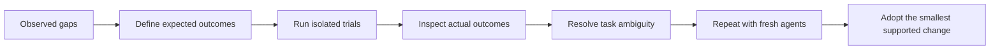

# Navigator learnings and experiments — September 14, 2026

Base: `1e81cdafb4d8bb316f2d9e258419921e889e0949`. The existing navigator
remains the production design. This work adds reproducible experiments and
records what their evidence can and cannot establish.

## What the previous delivery taught us

The 624-test inventory combined different kinds of evidence. API tests prove
transition behavior; the added 36-transition CLI walk proves command dispatch,
canonical callbacks and durable recovery; neither establishes whether a fresh
agent interprets a prompt correctly or performs Improve to completion.
The lengthy compatibility suite also should not be mistaken for broad live-model
coverage. New model-behavior questions need focused trials, not another run of
unchanged legacy tests.

The experiment design combines deterministic outcomes with review records and
fresh-context interpretation. This follows the distinction between transcripts
and actual outcomes in [Anthropic's agent-evaluation guidance](https://www.anthropic.com/engineering/demystifying-evals-for-ai-agents).
Its warning that an evaluator can reject a valid alternative proved directly
relevant here.

## Completed experiments

| Experiment | Observation | What it establishes |
| --- | --- | --- |
| Generated transitions and CLI recovery | 100/100 walks, 5/5 duplicate callback races and 5/5 conflicting callback races passed. Each race retained exactly one accepted transition and recovered at the expected stage. | Sampled graph, identity, queue, replay and locking behavior. |
| Cold interpretation | Six real CLI packets met all 30 preregistered semantic criteria in parent review. Two proposed completion objects also produced the expected pure navigator transitions. | The six assessed responses satisfied the scope, convergence, stale-evidence, queue, no-release and blocked-state criteria. |
| Initial Improve versus one-pass control | Both matched 188/210 oracle cases and chose integer adjacency. An independent contract reader confirmed the specification was ambiguous. | Repeated reviews can agree on a reasonable interpretation different from the evaluator's assumption. These 22 mismatches are not established agent defects. |
| Clarified comparison | Improve and single-pass control both passed 210/210 checks. | Explicit positive and negative boundary examples resolved the disagreement for both workflows. This pilot found no incremental correctness advantage from the extra Improve reviews. |

The initial fixture's two ordinary tests passed despite five seeded defect
families. The independent oracle matched only 57/210 cases before work. A known
reference implementation passed all 210 checks, but that calibration alone did
not prove the specification had only one valid interpretation.

The original request said to merge "touching" ranges. Both workers treated
`[[1,2],[3,4]]` as adjacent integer ranges and returned `[[1,4]]`. The oracle
treated them as intervals separated by a continuous gap. We preserved the
original results, then explicitly defined shared endpoints and supplied both
`[[1,2],[2,4]] -> [[1,4]]` and `[[1,2],[3,4]] -> [[1,2],[3,4]]` before repeating.

Both Improve campaigns recorded one material repair cycle followed by two
distinct clean review cycles. Their durable state contains exactly one accepted
`product-improve` completion apiece and a current `integrate` action. Neither
executed that next action or created a child Until loop. All four workflows
changed code, tests and plan, preserved their specification and committed locally.
The parent independently checked those candidates and their fixed-oracle results;
review reasoning itself is evidenced by worker records, not direct observation.

The mechanical run included 615 blocked/resume controls, 642 pause/resumes,
592 repeated actions, 581 illegal-request rejections, 4,513 semantic replays
and corresponding conflict rejections, and 200 terminal rejections. These
counts describe sampled checks, not distinct real-world defects or deliveries.

An independent review of the experiment found that the oracle omitted tuple
inputs and floating-point endpoints. Six supplementary tuple/float/boolean
endpoint checks passed on all four unchanged candidates. These were added after
the trials and are reported separately in
[supplemental evidence](../test/experiments/shiploop_navigator/evidence/supplemental.json);
they do not change the original 210-case scores or establish exhaustive coverage.

## Changes and decisions

- **Adopt:** export experiment packets through the public CLI. The first
  exploratory export used `render(None)` and produced a relative executable
  locator. That was a preparation defect; primary interpretation trials were
  repeated with actual `next` output.
- **Adopt:** pair a positive boundary example with a nearby negative example
  when defining experimental test oracles. The clarified fixture records this
  decision explicitly instead of silently changing the grader.
- **Retain:** one complete Improve campaign per graph action. Both live
  campaigns recorded a material reset and two distinct clean reviews, then made
  one successful callback and stopped at `integrate`. The script did not count
  reviews or inspect the product's test results.
- **Keep opt-in:** generated mechanical coverage and live-agent pilots. These
  answer questions absent from ordinary graph examples without becoming new
  production state-transition rules.
- **Adopt:** review the evaluator's coverage as well as the agent's output, and
  label later checks separately from the original comparison.
- **Defer:** new graph nodes, nested loop controllers, or artifact-byte gates.
  No reproduced runtime defect or missing lifecycle stage justified them.

This fixture began at product Improve after synthetic setup, so it does not
measure the quality of the preceding planning stages. The existing specification
and test-strategy prompts already call for independent expected outcomes and
boundary cases. This experiment supports sharpening supplied requirements; it
does not establish that another mandatory planning node is necessary.

## Limits and reproduction

These are small pilots with one configured model family. Each cold panel handled
three cases, so only the panel began with fresh context. The paired implementation
trials use one small Python problem; they cannot establish a general accuracy,
token-cost, latency or cross-host advantage. No real service was deployed.
Independent review timing also limits the Improve evidence: the initial reviewer
saw the first repaired candidate before a final test addition; the clarified
reviewer saw only the baseline. Both final clean review pairs were self-reviews.
The workflows also differed in reviewer availability, so this is not an isolated
test of the effect of repeating a review prompt.

The next useful pilot is a task with several interacting modules and unambiguous
acceptance examples, comparing the same reviewer budget with review placed on
the final candidate. That would test a gap exposed here. It is deferred until a
representative task is available; this toy result does not justify adding another
mandatory graph stage or asserting general Improve superiority.

Use the [opt-in experiment guide](../test/experiments/shiploop_navigator/README.md),
[criteria fixed before execution](../test/experiments/shiploop_navigator/preregistration.md),
and [recorded candidates, packets and observations](../test/experiments/shiploop_navigator/evidence/README.md).
All production navigator code is unchanged by this experiment work.

## Integration verification

Main acquired a separate discovery-policy update during these experiments.
The experiment branch incorporated `8ed4bee062c008f346b6e79249afd0f39a9ca40a`
before publication. On that revision, all 100 mechanical walks and ten callback
races passed again with the same counts; 15 navigator tests and four navigator
dry-run tests also passed. The ten test-group checks and Ruff checks passed.
See [integration rerun evidence](../test/experiments/shiploop_navigator/evidence/mechanical-integration.json).
The live-agent observations above remain tied to the original `1e81cda` baseline;
this mechanical rerun is not a new interpretation trial for the changed prompts.
